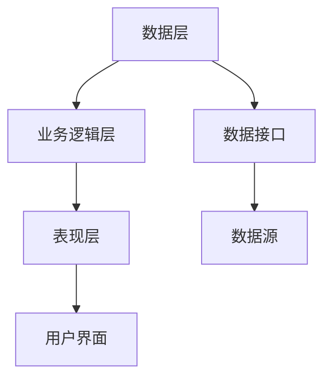
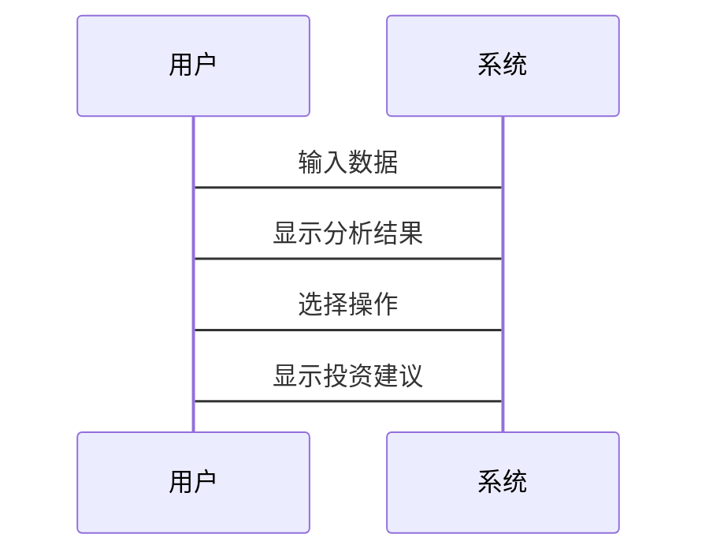

                 


# 基本面分析在彼得·林奇投资中的地位

## 关键词：基本面分析、彼得·林奇、投资策略、财务指标、选股标准

## 摘要：本文深入探讨了基本面分析在彼得·林奇投资策略中的核心地位，分析了基本面分析的核心概念、关键指标及其在彼得·林奇选股中的应用，结合数学模型和系统架构设计方案，详细解读了基本面分析在投资决策中的重要作用，并通过实际案例分析了其在彼得·林奇投资成功中的具体体现。

---

# 第一部分：基本面分析的理论基础

## 第1章：基本面分析的核心概念

### 1.1 什么是基本面分析

基本面分析是一种通过对公司财务报表、行业地位、市场环境等基本面因素进行深入研究，以评估公司内在价值的投资分析方法。它关注的是企业的财务状况、盈利能力、成长潜力、竞争优势等因素，而非市场的短期波动。

#### 1.1.1 基本面分析的起源与发展

基本面分析起源于20世纪初，其核心思想是通过研究企业的内在价值来指导投资决策。这种方法强调长期投资，关注企业的基本面因素，而非市场的短期波动。

#### 1.1.2 基本面分析的核心要素

- **财务报表分析**：包括利润表、资产负债表和现金流量表。
- **行业分析**：研究行业的市场地位、竞争结构和未来发展前景。
- **财务指标分析**：如市盈率、市净率、股息率等。
- **竞争优势分析**：分析企业的核心竞争力和护城河。

#### 1.1.3 基本面分析与技术分析的区别

- **基本面分析**：关注企业的内在价值，强调长期投资。
- **技术分析**：关注市场的价格走势和交易量，强调短期投资。

### 1.2 彼得·林奇的投资理念

彼得·林奇是美国著名投资家，以其独特的选股方法和长期投资策略闻名。他的投资理念强调基本面分析，注重企业的内在价值和长期增长潜力。

#### 1.2.1 彼得·林奇的投资风格

彼得·林奇的投资风格以选股为核心，他善于通过基本面分析发现那些具有长期增长潜力的公司，并长期持有这些股票，等待其价值的实现。

#### 1.2.2 彼得·林奇对基本面分析的重视

彼得·林奇认为，基本面分析是选股的核心方法，通过分析企业的财务报表和行业地位，可以找到那些具有竞争优势、财务健康且管理透明的企业。

#### 1.2.3 彼得·林奇的经典投资案例

彼得·林奇在其职业生涯中成功投资了许多公司，如可口可乐、星巴克等。这些投资的成功很大程度上得益于他对基本面分析的深入研究和准确判断。

### 1.3 基本面分析与彼得·林奇投资策略的关系

基本面分析是彼得·林奇投资策略的核心，他通过基本面分析筛选出具有长期增长潜力的公司，并进行长期投资。然而，基本面分析并非完美，存在一定的局限性，如无法预测市场波动和突发事件。

---

## 第2章：基本面分析的关键指标

### 2.1 财务报表分析

#### 2.1.1 利润表

利润表反映了企业在一定会计期间内的收入和利润情况，包括营业收入、营业成本、净利润等关键指标。

- **营业收入**：企业的主要收入来源，反映了企业的销售能力。
- **营业成本**：与营业收入相对应的成本，反映了企业的成本控制能力。
- **净利润**：企业最终的利润，反映了企业的盈利能力。

#### 2.1.2 资产负债表

资产负债表反映了企业在某一特定时点的资产、负债和所有者权益的情况，包括流动资产、非流动资产、流动负债、非流动负债等。

- **流动资产**：易于变现的资产，如现金、应收账款等。
- **流动负债**：短期内需要偿还的债务，如应付账款、短期借款等。
- **所有者权益**：企业净资产的价值，反映了企业的财务健康状况。

#### 2.1.3 现金流量表

现金流量表反映了企业在一定会计期间内的现金流入和流出情况，包括经营活动、投资活动和筹资活动的现金流量。

- **经营活动现金流**：企业日常经营活动的现金流入和流出。
- **投资活动现金流**：企业投资活动的现金流入和流出。
- **筹资活动现金流**：企业筹资活动的现金流入和流出。

### 2.2 行业分析与竞争优势分析

#### 2.2.1 行业分析

行业分析是基本面分析的重要组成部分，通过分析行业的市场容量、竞争结构、发展前景等，可以判断企业的行业地位和竞争优势。

- **行业生命周期**：行业的不同阶段（幼稚期、成长期、成熟期、衰退期）会影响企业的投资价值。
- **行业竞争结构**：行业的竞争程度、主要竞争对手、市场集中度等。

#### 2.2.2 企业竞争优势分析

竞争优势分析是基本面分析的核心，通过分析企业的核心竞争力、护城河、市场地位等，可以判断企业的长期发展潜力。

- **核心竞争力**：企业的独特优势，如技术优势、品牌优势、成本优势等。
- **护城河**：企业抵御竞争对手的能力，如专利、规模经济、网络效应等。

### 2.3 财务健康状况分析

#### 2.3.1 财务风险的识别与评估

财务健康状况分析是基本面分析的重要内容，通过分析企业的财务报表，可以识别企业的财务风险，评估其财务健康状况。

- **资产负债率**：反映了企业的负债水平，资产负债率过高意味着企业财务风险较大。
- **流动比率**：反映了企业的短期偿债能力，流动比率过低意味着企业可能存在流动性风险。
- **速动比率**：进一步反映企业的短期偿债能力，速动比率过低意味着企业可能存在流动性风险。

#### 2.3.2 盈利能力分析

盈利能力分析是基本面分析的重要内容，通过分析企业的盈利能力，可以判断企业的经营效率和赚钱能力。

- **净利润率**：反映了企业的净利润与营业收入的比率，净利润率越高，企业的盈利能力越强。
- **毛利率**：反映了企业的销售毛利与营业收入的比率，毛利率越高，企业的盈利能力越强。
- **净资产收益率（ROE）**：反映了企业每股市盈率与每股收益的比率，ROE越高，企业的盈利能力越强。

#### 2.3.3 现金流分析

现金流分析是基本面分析的重要内容，通过分析企业的现金流，可以判断企业的财务健康状况和流动性。

- **经营活动现金流**：反映了企业的日常经营活动产生的现金流，经营活动现金流为正，说明企业具备良好的流动性。
- **投资活动现金流**：反映了企业投资活动产生的现金流，投资活动现金流为负，说明企业正在扩大投资。
- **筹资活动现金流**：反映了企业筹资活动产生的现金流，筹资活动现金流为正，说明企业正在增加资金投入。

---

## 第3章：彼得·林奇选股标准与基本面分析

### 3.1 彼得·林奇选股的五个标准

#### 3.1.1 市盈率低于行业平均水平

彼得·林奇认为，市盈率低于行业平均水平的股票具有较大的投资价值，因为它们可能被市场低估。

- **市盈率（P/E）**：股价与每股收益的比率，P/E < 行业平均水平，说明股票可能被低估。

#### 3.1.2 股价低于净资产价值

彼得·林奇认为，股价低于净资产价值的股票具有较大的投资价值，因为它们可能被市场低估。

- **市净率（P/B）**：股价与每股净资产的比率，P/B < 1，说明股票可能被低估。

#### 3.1.3 盈利能力稳定且持续增长

彼得·林奇认为，盈利能力稳定且持续增长的公司具有较大的投资价值，因为它们具有较强的市场竞争力和成长潜力。

- **净利润增长率**：净利润与上一报告期的净利润的比率，净利润增长率 > 行业平均水平，说明公司盈利能力稳定且持续增长。

#### 3.1.4 企业具有竞争优势和护城河

彼得·林奇认为，具有竞争优势和护城河的公司具有较大的投资价值，因为它们能够在行业中占据领先地位，抵御竞争对手的冲击。

- **核心竞争力**：企业的独特优势，如技术优势、品牌优势、成本优势等。
- **护城河**：企业抵御竞争对手的能力，如专利、规模经济、网络效应等。

#### 3.1.5 管理层的诚信与能力

彼得·林奇认为，管理层的诚信与能力是影响企业投资价值的重要因素，因为诚信的管理层能够为企业创造长期价值。

- **管理层的诚信**：管理层的诚信是企业投资价值的重要因素，诚信的管理层能够为企业创造长期价值。
- **管理层的能力**：管理层的能力是企业投资价值的重要因素，有能力的管理层能够为企业创造长期价值。

### 3.2 彼得·林奇对行业选择的考量

#### 3.2.1 行业前景的判断

彼得·林奇认为，选择具有良好行业前景的行业是成功投资的关键，因为行业前景良好的行业具有较大的增长潜力。

- **行业生命周期**：行业的不同阶段（幼稚期、成长期、成熟期、衰退期）会影响企业的投资价值。
- **行业竞争结构**：行业的竞争程度、主要竞争对手、市场集中度等。

#### 3.2.2 行业周期的分析

彼得·林奇认为，选择具有良好行业周期的行业是成功投资的关键，因为行业周期良好的行业具有较大的增长潜力。

- **行业周期**：行业的周期性波动会影响企业的投资价值，选择行业周期向上的行业是成功投资的关键。

#### 3.2.3 行业竞争结构的评估

彼得·林奇认为，选择具有良好行业竞争结构的行业是成功投资的关键，因为行业竞争结构良好的行业具有较大的增长潜力。

- **市场集中度**：行业的市场集中度越高，企业的竞争优势越明显。
- **竞争对手分析**：分析主要竞争对手的优劣势，选择具有竞争优势的公司。

### 3.3 彼得·林奇对财务数据的特别关注点

#### 3.3.1 净利润与营业收入的匹配性

彼得·林奇认为，净利润与营业收入的匹配性是判断企业盈利能力的重要指标，净利润与营业收入的匹配性越高，企业的盈利能力越强。

- **净利润增长率**：净利润与上一报告期的净利润的比率，净利润增长率 > 行业平均水平，说明公司盈利能力稳定且持续增长。

#### 3.3.2 负债结构的合理性

彼得·林奇认为，负债结构的合理性是判断企业财务健康状况的重要指标，负债结构合理的企业具有较强的偿债能力。

- **资产负债率**：资产负债率 < 50%，说明企业财务健康状况良好。
- **流动比率**：流动比率 > 2，说明企业短期偿债能力较强。

#### 3.3.3 现金流的稳定性

彼得·林奇认为，现金流的稳定性是判断企业财务健康状况的重要指标，现金流稳定的公司具有较强的流动性。

- **经营活动现金流**：经营活动现金流 > 0，说明企业日常经营活动产生的现金流为正，企业具备良好的流动性。
- **自由现金流**：自由现金流 > 0，说明企业能够产生足够的现金流用于再投资或回报股东。

---

## 第4章：基本面分析的数学模型与算法

### 4.1 市盈率模型

市盈率模型是基本面分析中常用的数学模型之一，通过计算市盈率，可以判断股票的估值是否合理。

#### 4.1.1 市盈率的定义与计算公式

市盈率（P/E） = 股价 / 每股收益（EPS）

#### 4.1.2 市盈率与股票价值的关系

- 市盈率 < 行业平均水平，说明股票可能被低估。
- 市盈率 > 行业平均水平，说明股票可能被高估。

#### 4.1.3 市盈率在彼得·林奇选股中的应用

彼得·林奇认为，市盈率低于行业平均水平的股票具有较大的投资价值，因为它们可能被市场低估。

### 4.2 市净率模型

市净率模型是基本面分析中常用的数学模型之一，通过计算市净率，可以判断股票的估值是否合理。

#### 4.2.1 市净率的定义与计算公式

市净率（P/B） = 股价 / 每股净资产（BVPS）

#### 4.2.2 市净率与股票价值的关系

- 市净率 < 1，说明股票可能被低估。
- 市净率 > 1，说明股票可能被高估。

#### 4.2.3 市净率在彼得·林奇选股中的应用

彼得·林奇认为，市净率低于1的股票具有较大的投资价值，因为它们可能被市场低估。

### 4.3 股息率模型

股息率模型是基本面分析中常用的数学模型之一，通过计算股息率，可以判断股票的收益能力。

#### 4.3.1 股息率的定义与计算公式

股息率 = 每股股息（DIV） / 股价（P）

#### 4.3.2 股息率与股票收益的关系

- 股息率高，说明股票的收益能力较强。
- 股息率低，说明股票的收益能力较弱。

#### 4.3.3 股息率在彼得·林奇选股中的应用

彼得·林奇认为，股息率较高的股票具有较大的投资价值，因为它们能够为投资者提供稳定的股息收益。

### 4.4 盈利能力分析模型

盈利能力分析模型是基本面分析中常用的数学模型之一，通过分析企业的盈利能力，可以判断企业的经营效率和赚钱能力。

#### 4.4.1 净利润增长率

净利润增长率 = （净利润 - 上一报告期净利润）/ 上一报告期净利润

#### 4.4.2 毛利率

毛利率 = （营业收入 - 营业成本） / 营业收入

#### 4.4.3 净资产收益率（ROE）

净资产收益率（ROE） = 净利润 / 净资产

---

## 第5章：系统分析与架构设计方案

### 5.1 系统功能设计

#### 5.1.1 数据采集模块

数据采集模块负责采集企业的财务数据、行业数据等，为后续分析提供数据支持。

- **数据源**：包括财务报表、行业报告、市场数据等。
- **数据清洗**：对采集到的数据进行清洗，去除无效数据，确保数据的准确性和完整性。

#### 5.1.2 数据分析模块

数据分析模块负责对采集到的数据进行分析，计算各种财务指标，评估企业的内在价值。

- **财务指标计算**：包括市盈率、市净率、股息率、净利润增长率等。
- **行业分析**：包括行业生命周期、市场集中度、竞争对手分析等。

#### 5.1.3 数据可视化模块

数据可视化模块负责将分析结果以图表形式展示，帮助投资者直观地理解数据。

- **图表类型**：包括柱状图、折线图、饼图等。
- **数据可视化工具**：包括Matplotlib、Tableau等。

#### 5.1.4 投资决策支持模块

投资决策支持模块负责根据分析结果，提供投资建议，帮助投资者做出决策。

- **投资策略建议**：包括买入建议、卖出建议、持有建议等。
- **风险提示**：包括市场风险、财务风险、行业风险等。

### 5.2 系统架构设计

#### 5.2.1 分层架构设计

分层架构设计将系统划分为数据层、业务逻辑层和表现层，每一层负责不同的功能。

- **数据层**：负责数据的存储和管理，包括数据库设计、数据接口设计等。
- **业务逻辑层**：负责业务逻辑的实现，包括数据采集、数据分析、投资决策支持等。
- **表现层**：负责用户界面的实现，包括数据可视化、投资决策支持等。

#### 5.2.2 系统架构图



### 5.3 系统接口设计

#### 5.3.1 数据接口设计

数据接口设计负责与外部数据源进行交互，获取企业的财务数据、行业数据等。

- **API接口**：包括RESTful API、SOAP等。
- **数据格式**：包括JSON、XML等。

#### 5.3.2 数据可视化接口

数据可视化接口负责将分析结果以图表形式展示，帮助投资者直观地理解数据。

- **图表生成接口**：包括柱状图、折线图、饼图等。
- **数据可视化工具接口**：包括Matplotlib、Tableau等。

### 5.4 系统交互设计

#### 5.4.1 用户界面设计

用户界面设计负责与用户进行交互，提供友好的用户界面，帮助用户完成数据输入、分析结果查看等操作。

- **用户界面布局**：包括标题、菜单、内容区域等。
- **用户操作流程**：包括数据输入、分析启动、结果查看等。

#### 5.4.2 系统交互流程图



---

## 第六部分：项目实战

### 6.1 环境安装

#### 6.1.1 安装Python

安装Python环境，包括Python解释器、pip包管理器等。

```bash
# 安装Python
# 根据系统选择合适的安装包
# 安装pip
python -m ensurepath
```

#### 6.1.2 安装数据分析库

安装数据分析库，包括pandas、numpy、matplotlib等。

```bash
pip install pandas numpy matplotlib
```

### 6.2 系统核心实现源代码

#### 6.2.1 数据采集模块

```python
import pandas as pd
import requests

def get_stock_data(ticker):
    # 获取股票数据
    url = f"https://api.example.com/stock/{ticker}"
    response = requests.get(url)
    data = response.json()
    return pd.DataFrame(data)
```

#### 6.2.2 数据分析模块

```python
import pandas as pd

def calculate_financial_ratios(df):
    # 计算财务比率
    df['市盈率'] = df['股价'] / df['每股收益']
    df['市净率'] = df['股价'] / df['每股净资产']
    df['股息率'] = df['每股股息'] / df['股价']
    return df
```

#### 6.2.3 数据可视化模块

```python
import matplotlib.pyplot as plt

def visualize_data(df):
    # 绘制图表
    plt.figure(figsize=(10, 6))
    plt.plot(df['日期'], df['股价'], label='股价')
    plt.plot(df['日期'], df['每股收益'], label='每股收益')
    plt.xlabel('日期')
    plt.ylabel('数值')
    plt.title('股价与每股收益对比图')
    plt.legend()
    plt.show()
```

#### 6.2.4 投资决策支持模块

```python
import pandas as pd

def generate_recommendation(df):
    # 生成投资建议
    recommendation = []
    for index, row in df.iterrows():
        if row['市盈率'] < 行业平均市盈率:
            recommendation.append('买入')
        elif row['市净率'] < 1:
            recommendation.append('买入')
        else:
            recommendation.append('观望')
    return recommendation
```

### 6.3 代码应用解读与分析

通过上述代码，我们可以实现基本面分析的核心功能，包括数据采集、数据分析、数据可视化和投资决策支持。这些代码可以帮助投资者快速获取企业的财务数据，计算各种财务指标，绘制图表，生成投资建议。

### 6.4 实际案例分析

以彼得·林奇的经典投资案例——可口可乐为例，我们可以通过上述代码分析其财务数据，计算其市盈率、市净率等指标，评估其投资价值。

#### 6.4.1 数据采集

```python
df = get_stock_data('KO')  # 可口可乐的股票代码
```

#### 6.4.2 数据分析

```python
df = calculate_financial_ratios(df)
```

#### 6.4.3 数据可视化

```python
visualize_data(df)
```

#### 6.4.4 投资决策支持

```python
recommendation = generate_recommendation(df)
print(recommendation)
```

### 6.5 项目小结

通过上述案例分析，我们可以看到，基本面分析在彼得·林奇投资中的地位至关重要。通过基本面分析，我们可以找到那些具有长期增长潜力的公司，进行长期投资，实现财富增值。

---

## 第七部分：总结与展望

### 7.1 总结

基本面分析是彼得·林奇投资策略的核心，通过分析企业的财务报表、行业地位、竞争优势等基本面因素，可以找到那些具有长期增长潜力的公司，进行长期投资。然而，基本面分析并非完美，存在一定的局限性，如无法预测市场波动和突发事件。

### 7.2 未来展望

随着大数据、人工智能等技术的发展，基本面分析将更加精准和高效。未来，投资者可以通过更加智能化的工具和算法，进行更加深入和全面的分析，发现那些具有长期增长潜力的公司，实现财富增值。

---

## 第八部分：最佳实践 Tips、小结、注意事项、拓展阅读

### 8.1 最佳实践 Tips

- **持续学习**：投资市场变化莫测，投资者需要不断学习新的知识和技能，保持与时俱进。
- **分散投资**：不要将所有资金投入到一只股票中，分散投资可以降低风险。
- **长期持有**：长期持有优质股票，避免频繁交易，减少交易成本。

### 8.2 小结

基本面分析是彼得·林奇投资策略的核心，通过分析企业的财务报表、行业地位、竞争优势等基本面因素，可以找到那些具有长期增长潜力的公司，进行长期投资。然而，基本面分析并非完美，存在一定的局限性，如无法预测市场波动和突发事件。

### 8.3 注意事项

- **数据准确性**：数据是基本面分析的基础，投资者需要确保数据的准确性和完整性。
- **模型合理性**：模型是基本面分析的工具，投资者需要确保模型的合理性和有效性。
- **市场风险**：市场波动是不可避免的，投资者需要做好风险管理和心理准备。

### 8.4 拓展阅读

- **《彼得·林奇选股术》**：深入探讨彼得·林奇的投资理念和选股方法。
- **《价值投资：基本面分析指南》**：详细介绍基本面分析的核心概念和方法。
- **《投资学》**：全面介绍投资学的基本理论和实践方法。

---

通过以上分析，我们可以看到，基本面分析在彼得·林奇投资中的地位至关重要。通过基本面分析，投资者可以找到那些具有长期增长潜力的公司，进行长期投资，实现财富增值。然而，基本面分析并非完美，存在一定的局限性，如无法预测市场波动和突发事件。未来，随着大数据、人工智能等技术的发展，基本面分析将更加精准和高效，投资者可以通过更加智能化的工具和算法，进行更加深入和全面的分析，发现那些具有长期增长潜力的公司，实现财富增值。

