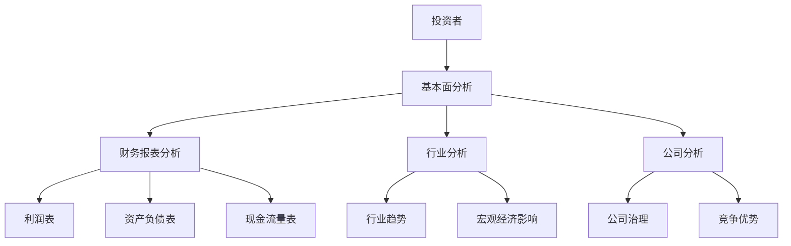

                 

# 基本面分析：识别长期优质投资标的的关键

## 关键词：基本面分析，投资标的，财务报表，估值模型，风险管理，行业分析，公司分析

## 摘要：基本面分析是识别长期优质投资标的的关键方法，通过分析公司的财务状况、行业地位、竞争优势和管理团队等多方面因素，评估其内在价值和长期发展潜力。本文将系统地介绍基本面分析的核心概念、分析方法、数学模型和实际应用，帮助读者掌握如何通过基本面分析做出明智的投资决策。

---

# 第一部分: 基本面分析基础

## 第1章: 基本面分析概述

### 1.1 什么是基本面分析
#### 1.1.1 基本面分析的定义
基本面分析是一种通过研究公司财务状况、行业地位、竞争优势和宏观经济环境等因素，评估公司内在价值的方法。其核心在于通过分析公司的真实业绩和未来潜力，而非市场情绪或短期波动，来判断投资标的的长期价值。

#### 1.1.2 基本面分析的核心要素
基本面分析的核心要素包括：
- **财务报表分析**：通过利润表、资产负债表和现金流量表评估公司的财务健康状况。
- **行业分析**：研究公司所在行业的市场规模、增长潜力和竞争格局。
- **公司分析**：分析公司的商业模式、竞争优势和管理团队。
- **宏观经济分析**：考虑宏观经济因素（如GDP增速、利率、通胀）对行业和公司的影响。

#### 1.1.3 基本面分析与投资决策的关系
基本面分析为投资者提供了科学的决策依据，帮助投资者识别那些具有长期增长潜力和稳定收益的优质投资标的。

---

## 第2章: 基本面分析的核心概念与联系

### 2.1 基本面分析的核心概念
#### 2.1.1 财务报表分析
财务报表分析是基本面分析的基础，主要通过以下三张报表进行：
- **利润表（Income Statement）**：展示公司在一定期间内的收入、成本和利润情况。
- **资产负债表（Balance Sheet）**：反映公司在某一特定时点的资产、负债和所有者权益情况。
- **现金流量表（Cash Flow Statement）**：记录公司在一定期间内的现金流入和流出情况。

#### 2.1.2 行业分析
行业分析旨在评估公司所处行业的市场规模、增长潜力和竞争格局。一个朝阳行业能够为公司提供更大的发展空间，而夕阳行业则可能限制公司的成长。

#### 2.1.3 公司分析
公司分析关注公司的商业模式、竞争优势、管理团队和治理结构。一个具有强大竞争优势和优秀管理团队的公司更有可能实现长期增长。

### 2.2 核心概念的联系与对比
#### 2.2.1 财务报表分析与行业分析的关联
财务报表分析提供了公司财务状况的具体数据，而行业分析则为这些数据提供了宏观背景。例如，一个行业整体增长放缓的情况下，公司的财务数据可能无法单独解读。

#### 2.2.2 行业分析与公司分析的结合
行业分析帮助确定公司所处的竞争环境，而公司分析则进一步评估公司在行业中的地位和潜力。两者的结合能够更全面地评估公司的投资价值。

#### 2.2.3 基本面分析的ER实体关系图

---

## 第3章: 基本面分析的数学模型与公式

### 3.1 财务比率分析
#### 3.1.1 常用财务比率
财务比率是通过财务报表中的数据计算得出的指标，用于评估公司的财务健康状况和经营效率。常用的财务比率包括：
- **市盈率（P/E Ratio）**：市盈率=股价/每股收益。
- **市净率（P/B Ratio）**：市净率=股价/每股净资产。
- **ROE（净资产收益率）**：ROE=净利润/平均净资产。

#### 3.1.2 财务比率的计算公式
以市盈率为例：
$$市盈率 = \frac{股价}{每股收益}$$

如果某公司股价为$50，每股收益为$5，则市盈率为$50/$5=10。

---

# 第二部分: 财务报表分析

## 第4章: 利润表分析

### 4.1 利润表的核心内容
利润表展示了公司在一定期间内的收入、成本和利润情况，主要包括以下几部分：
- **营业收入**：公司主营业务收入。
- **营业成本**：主营业务成本。
- **毛利润**：营业收入减去营业成本。
- **净利润**：最终的净利润，扣除所有费用和税金后的利润。

### 4.2 利润表分析的步骤
1. **分析收入来源**：确认公司收入的主要来源和增长趋势。
2. **分析成本结构**：评估成本是否合理，是否具有竞争力。
3. **计算利润率**：通过毛利润率、净利润率等指标评估公司的盈利能力。

---

## 第5章: 资产负债表分析

### 5.1 资产负债表的核心内容
资产负债表反映了公司在某一特定时点的资产、负债和所有者权益情况，主要包括以下几部分：
- **资产**：包括流动资产（如现金、应收账款）和非流动资产（如固定资产）。
- **负债**：包括流动负债（如应付账款）和非流动负债（如长期借款）。
- **所有者权益**：公司净资产的价值。

### 5.2 资产负债表分析的步骤
1. **评估资产结构**：分析公司资产的构成，判断其是否合理。
2. **评估负债情况**：分析公司的债务水平和偿债能力。
3. **计算偿债能力指标**：如流动比率、速动比率等。

---

## 第6章: 现金流量表分析

### 6.1 现金流量表的核心内容
现金流量表记录了公司在一定期间内的现金流入和流出情况，分为以下三部分：
- **经营活动现金流**：公司日常经营活动中产生的现金流。
- **投资活动现金流**：公司投资活动（如购买固定资产）产生的现金流。
- **筹资活动现金流**：公司筹资活动（如借款、发行股票）产生的现金流。

### 6.2 现金流量表分析的步骤
1. **分析现金流来源**：判断现金流的主要来源是否稳定。
2. **分析现金流用途**：评估公司是否将现金流用于合理的用途。
3. **计算现金流健康指标**：如自由现金流（FCF）= 净利润 - 非现金支出。

---

# 第三部分: 行业和宏观经济分析

## 第7章: 行业分析

### 7.1 行业分析的核心内容
行业分析旨在评估公司所处行业的市场规模、增长潜力和竞争格局。主要包括以下方面：
- **市场规模**：行业的总销售额和增长趋势。
- **竞争格局**：行业内主要竞争对手的市场份额和竞争策略。
- **行业周期**：行业所处的发展阶段（如导入期、成长期、成熟期、衰退期）。

### 7.2 行业分析的步骤
1. **确定行业规模**：通过行业报告或公开数据获取市场规模。
2. **分析行业周期**：判断行业所处的发展阶段。
3. **评估竞争格局**：分析行业内主要竞争对手的市场份额和竞争优势。

---

## 第8章: 宏观经济分析

### 8.1 宏观经济分析的核心内容
宏观经济分析关注宏观经济因素对行业和公司的影响，主要包括以下方面：
- **GDP增速**：整体经济的增长情况。
- **利率水平**：利率的变化对企业和个人投资的影响。
- **通胀水平**：通胀对行业成本和价格的影响。

### 8.2 宏观经济分析的步骤
1. **分析宏观经济指标**：如GDP增速、利率、通胀水平。
2. **评估宏观经济对行业的影响**：例如，低利率环境可能刺激投资和消费。
3. **预测宏观经济趋势**：判断宏观经济因素对行业和公司的未来影响。

---

# 第四部分: 公司分析

## 第9章: 公司治理与管理团队

### 9.1 公司治理的核心内容
公司治理涉及公司董事会、管理层和股东之间的关系，良好的公司治理是公司长期稳定发展的基础。

### 9.2 管理团队分析
管理团队的素质和经验对公司的经营至关重要。分析管理团队时，应关注其过往业绩、管理风格和战略规划。

---

## 第10章: 竞争优势分析

### 10.1 竞争优势的核心内容
竞争优势是公司能够在行业中脱颖而出的关键因素，主要包括：
- **成本优势**：公司在生产或运营上的成本优势。
- **技术优势**：公司拥有的核心技术或专利。
- **品牌优势**：公司品牌在市场上的影响力。

### 10.2 竞争优势的分析步骤
1. **识别竞争优势来源**：分析公司在技术、成本、品牌等方面的竞争优势。
2. **评估竞争优势的可持续性**：判断竞争优势是否能够在未来持续存在。

---

# 第五部分: 估值方法

## 第11章: 常用估值模型

### 11.1 市盈率模型
市盈率模型通过比较公司的市盈率与行业平均水平，评估公司的估值。

### 11.2 市净率模型
市净率模型通过比较公司的市净率与行业平均水平，评估公司的估值。

### 11.3 现金流折现模型
现金流折现模型（DCF）通过将公司未来现金流折现，评估公司的内在价值。

---

## 第12章: 估值模型的应用

### 12.1 市盈率模型的应用
以某公司为例，计算其市盈率并与行业平均水平进行比较。

### 12.2 现金流折现模型的应用
通过预测公司未来现金流，计算其内在价值。

---

# 第六部分: 投资策略与风险管理

## 第13章: 投资策略

### 13.1 投资策略的核心内容
投资策略是投资者根据市场环境和个人风险偏好制定的长期投资计划。

### 13.2 投资策略的制定步骤
1. **明确投资目标**：确定投资目的和风险承受能力。
2. **选择投资标的**：根据基本面分析结果选择优质投资标的。
3. **制定投资计划**：合理分配资产，分散投资风险。

---

## 第14章: 风险管理

### 14.1 风险管理的核心内容
风险管理是投资者在投资过程中控制和降低风险的过程。

### 14.2 风险管理的步骤
1. **识别风险来源**：分析投资标的可能面临的风险。
2. **评估风险影响**：判断风险对投资目标的影响程度。
3. **制定风险管理措施**：如设置止损点、分散投资等。

---

# 第七部分: 案例分析

## 第15章: 案例分析

### 15.1 案例背景介绍
以某公司为例，介绍其基本面分析的过程。

### 15.2 案例分析步骤
1. **财务报表分析**：分析公司的利润表、资产负债表和现金流量表。
2. **行业分析**：评估公司所处行业的市场规模和竞争格局。
3. **公司分析**：分析公司的竞争优势和管理团队。
4. **估值分析**：使用市盈率模型和现金流折现模型评估公司的内在价值。

---

# 第八部分: 总结与展望

## 第16章: 总结与展望

### 16.1 总结
通过基本面分析，投资者可以更科学地识别优质投资标的，制定合理的投资策略。

### 16.2 展望
随着市场的不断发展，基本面分析需要结合更多因素（如ESG因素）进行综合评估。

---

通过以上内容，您可以系统地掌握基本面分析的方法和应用，帮助您在投资决策中做出更明智的选择。

