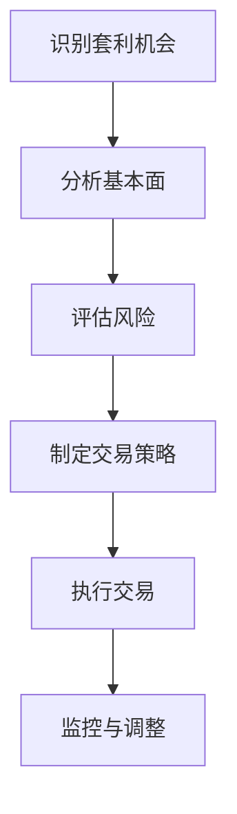
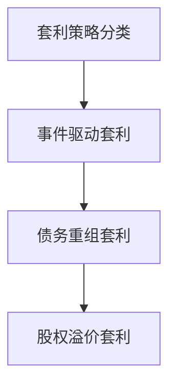

                 

# 塞思·克拉曼的风险套利：特殊情况下的价值发现

## 关键词：塞思·克拉曼、风险套利、价值发现、投资策略、风险管理、特殊情况、市场分析

## 摘要

塞思·克拉曼是全球著名的价值投资与风险套利专家，尤其擅长在特殊情况下发现企业价值。本文深入解析克拉曼的风险套利策略，探讨其核心理念、策略实施步骤、风险管理方法，结合经典案例分析，帮助读者理解如何在特殊情况下捕捉投资机会。文章结构清晰，内容涵盖风险套利的定义、策略分类、数学模型、系统架构、案例分析和未来展望。

---

# 正文

## 第1章：风险套利的定义与背景

### 1.1 风险套利的定义

风险套利是一种通过识别市场中的价格异常或暂时性机会，利用价格差进行投资以获取超额收益的策略。它依赖于对市场结构、公司基本面和潜在事件的深入分析。

#### 核心概念与联系

- **风险套利的定义**：涉及识别市场中的价格偏差，利用短期价格波动进行投资。
- **与其他投资策略的对比**：不同于长期价值投资，风险套利更注重短期机会和市场流动性。

**mermaid流程图：风险套利的实施流程**

### 1.2 塞思·克拉曼的投资理念

克拉曼强调在市场波动和特殊情况下，通过深入分析企业基本面，识别其内在价值，捕捉市场低估的机会。

#### 核心概念与联系

- **克拉曼的投资哲学**：专注于特殊情况下的投资机会，如并购、债务重组等，寻找市场低估的企业。
- **与其他策略的对比**：相比趋势投资，风险套利更依赖于对公司和市场的深入理解。

## 第2章：风险套利的核心策略

### 2.1 风险套利的分类

风险套利主要包括以下几种类型：

#### 2.1.1 事件驱动套利

- **定义**：基于公司特定事件（如并购、重组）进行套利。
- **实施步骤**：识别事件→评估影响→制定策略。

#### 2.1.2 股权溢价套利

- **定义**：利用股票与相关资产之间的价格差异进行套利。
- **实施步骤**：识别价差→评估风险→执行交易。

#### 2.1.3 债务重组套利

- **定义**：利用公司债务重组带来的价格波动进行套利。
- **实施步骤**：识别债务问题→评估重组影响→制定策略。

#### 核心概念与联系

- **套利策略的分类**：基于事件、资产类型和市场条件的不同，套利策略有所差异。
- **数学模型的应用**：套利定价模型（APT）用于评估套利机会。

**mermaid流程图：套利策略分类**

### 2.2 套利机会的识别

#### 2.2.1 市场信号分析

- **指标分析**：通过市盈率、市净率等指标识别低估企业。
- **趋势分析**：观察市场趋势和价格波动。

#### 2.2.2 数据分析方法

- **数据挖掘**：利用大数据技术识别潜在套利机会。
- **统计套利**：基于统计模型寻找市场中的套利机会。

#### 2.2.3 数学模型的应用

- **套利定价模型（APT）**：用于评估套利机会的数学模型。

**数学公式：套利定价模型**

$$ E(r_i) = r_f + \beta_i (E(r_m) - r_f) $$

### 2.3 套利策略的实施步骤

#### 2.3.1 识别套利机会

- **市场扫描**：定期扫描市场，寻找价格异常。
- **事件驱动分析**：关注并购、重组等事件。

#### 2.3.2 评估风险

- **风险来源分析**：市场流动性、价格波动、公司基本面变化。
- **对冲策略**：使用衍生工具对冲风险。

#### 2.3.3 制定交易策略

- **交易计划**：明确买卖时机和价格。
- **风险控制**：设定止损点和止盈点。

## 第3章：风险管理与控制

### 3.1 风险来源分析

- **市场风险**：市场波动影响套利收益。
- **流动性风险**：市场流动性不足导致无法及时交易。

### 3.2 对冲策略

- **使用衍生工具**：如期货、期权对冲价格波动风险。
- **分散投资**：通过投资不同资产或事件分散风险。

### 3.3 风险评估模型

- **VaR模型**：评估潜在损失。
- **压力测试**：模拟极端市场情况下的风险。

**数学公式：VaR计算公式**

$$ VaR = \alpha \times \sigma $$

其中，$\alpha$是置信水平对应的分位数，$\sigma$是资产收益的标准差。

## 第4章：套利机会的识别

### 4.1 市场结构分析

- **市场流动性**：流动性高的市场提供更多套利机会。
- **市场深度**：深度足够的市场支持大规模交易。

### 4.2 套利信号识别

- **价差分析**：寻找资产之间的价格差异。
- **趋势分析**：识别短期价格趋势。

### 4.3 数据分析方法

- **大数据分析**：利用大数据技术识别潜在套利机会。
- **机器学习**：使用算法预测市场波动。

## 第5章：经典案例分析

### 5.1 克拉曼的经典投资案例

- **案例1：并购套利**：通过分析并购事件中的价格差异获利。
- **案例2：债务重组套利**：利用债务重组带来的价格波动。

### 5.2 案例分析步骤

- **识别事件**：发现并购或重组事件。
- **分析影响**：评估事件对股价的影响。
- **制定策略**：根据分析结果制定交易策略。

## 第6章：市场与流动性因素

### 6.1 市场结构对套利的影响

- **流动性影响**：流动性越高，套利机会越多。
- **市场深度影响**：深度足够的市场支持套利交易。

### 6.2 流动性分析

- **流动性指标**：如换手率、买卖价差等。
- **流动性风险控制**：确保在市场流动性不足时及时退出。

### 6.3 市场周期对套利的影响

- **牛市套利**：牛市中套利机会较多，风险较低。
- **熊市套利**：熊市中套利机会较少，风险较高。

## 第7章：总结与展望

### 7.1 克拉曼方法论总结

- **核心思想**：在特殊情况下识别低估企业，通过套利策略获利。
- **风险管理**：重视风险控制和对冲策略。

### 7.2 未来趋势

- **技术进步**：大数据和人工智能将提升套利机会识别能力。
- **市场变化**：全球化和市场结构变化带来新的套利机会。

### 7.3 注意事项与最佳实践

- **分散投资**：避免过度集中在单一事件或资产。
- **持续学习**：保持对市场变化的敏感性，及时调整策略。

---

## 结语

塞思·克拉曼的风险套利策略为投资者提供了在特殊情况下发现价值的机会。通过深入分析市场结构、公司基本面和潜在事件，结合有效的风险管理策略，投资者可以在风险可控的前提下，捕捉市场中的套利机会，实现超额收益。

