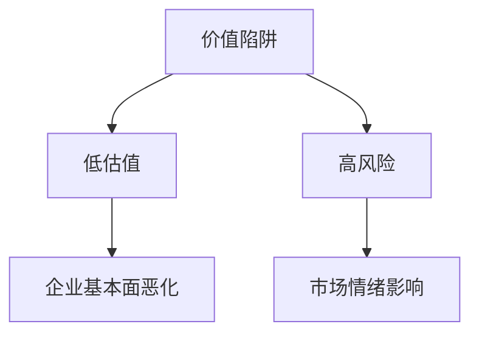
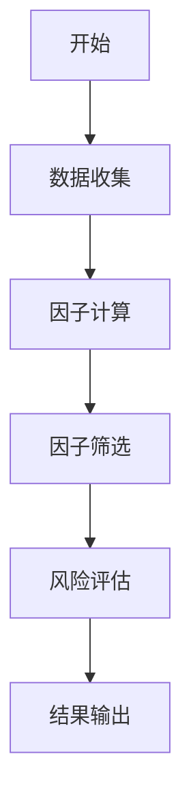
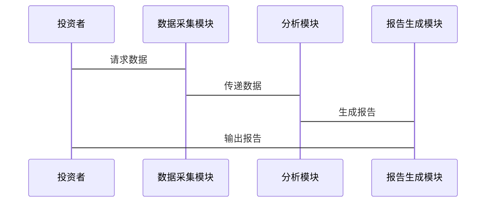

                 


# 塞思·卡拉曼的价值陷阱避免策略

## 关键词：价值陷阱，价值投资，投资策略，多因子模型，财务指标分析，系统设计

## 摘要：塞思·卡拉曼的价值陷阱理论旨在帮助投资者识别看似便宜实则存在问题的企业。本文系统地分析了价值陷阱的核心概念，结合多因子模型和财务指标，详细讲解了识别策略，并通过实际案例和系统设计提供了实用的解决方案。通过本文，读者将掌握如何避免价值陷阱，提升投资决策的准确性。

---

### 目录

# 塞思·卡拉曼的价值陷阱避免策略

---

## 第一部分: 价值陷阱的背景与核心概念

### 第1章: 价值投资与价值陷阱概述

#### 1.1 价值投资的基本概念
- 1.1.1 价值投资的定义与核心理念
- 1.1.2 价值投资与成长投资的区别
- 1.1.3 价值投资在投资组合中的地位

#### 1.2 价值陷阱的定义与分类
- 1.2.1 价值陷阱的定义
- 1.2.2 价值陷阱的常见类型
- 1.2.3 价值陷阱与价值投资的区分

#### 1.3 价值陷阱的形成原因
- 1.3.1 市场情绪与非理性定价
- 1.3.2 企业基本面恶化
- 1.3.3 行业周期性与结构性问题

#### 1.4 价值陷阱的特征与影响
- 1.4.1 低估值的表象
- 1.4.2 高风险的内在因素
- 1.4.3 对投资者决策的影响

---

## 第二部分: 价值陷阱的核心概念与联系

### 第2章: 价值陷阱的核心原理

#### 2.1 价值陷阱的核心原理
- 2.1.1 价值评估模型
- 2.1.2 陷阱识别指标
- 2.1.3 多因子分析框架

#### 2.2 核心概念对比表格
```markdown
| 概念         | 描述                                                                 | 示例                 |
|--------------|----------------------------------------------------------------------|----------------------|
| 价值陷阱     | 低估值但基本面恶化的企业                                             | XYZ公司             |
| 价值投资     | 高质量且低估的企业                                                   | ABC公司             |
```

#### 2.3 ER实体关系图


---

## 第三部分: 算法原理与数学模型

### 第3章: 价值陷阱识别的算法原理

#### 3.1 多因子模型
- 3.1.1 多因子模型的定义与作用
- 3.1.2 常见因子的分类与选择
- 3.1.3 因子权重的确定方法

#### 3.2 算法流程图


#### 3.3 Python代码实现
```python
import pandas as pd

def calculate_value_traps(data):
    # 计算市盈率、市净率等因子
    data['PE'] = data['市盈率']
    data['PB'] = data['市净率']
    # 筛选低估值但高风险的企业
    traps = data[(data['PE'] < data['PE'].quantile(0.2)) & 
                 (data['PB'] < data['PB'].quantile(0.2)) &
                 (data['ROE'] < 0.05)]
    return traps

# 示例数据
data = pd.DataFrame({
    'PE': [10, 15, 20, 5, 8],
    'PB': [1.5, 2, 3, 1, 1.2],
    'ROE': [0.08, 0.06, 0.04, 0.02, 0.05]
})

result = calculate_value_traps(data)
print(result)
```

#### 3.4 数学模型与公式
- 价值陷阱识别公式：
  $$ \text{价值陷阱评分} = \alpha \times \text{市盈率} + \beta \times \text{市净率} + \gamma \times \text{ROE} $$
  其中，$\alpha + \beta + \gamma = 1$，且 $\alpha > \beta > \gamma$

---

## 第四部分: 系统分析与架构设计

### 第4章: 价值陷阱识别系统设计

#### 4.1 问题场景介绍
- 投资者如何快速识别价值陷阱？
- 系统如何高效处理大量数据？

#### 4.2 系统功能设计
- 数据采集模块：从数据库获取企业财务数据
- 分析模块：计算多因子并识别价值陷阱
- 报告生成模块：输出结果报告

#### 4.3 系统架构设计


#### 4.4 系统接口设计
- 数据接口：API调用财务数据
- 报告接口：生成PDF或Excel报告

#### 4.5 系统交互流程图


---

## 第五部分: 项目实战与案例分析

### 第5章: 价值陷阱识别系统实战

#### 5.1 环境安装
- 安装Python、Pandas、Mermaid等工具

#### 5.2 核心代码实现
```python
def analyze_value_traps(data):
    # 计算各因子并进行分析
    data['PE'] = data['市盈率']
    data['PB'] = data['市净率']
    data['ROE'] = data['ROE']
    # 识别价值陷阱
    traps = data[(data['PE'] < data['PE'].quantile(0.2)) & 
                 (data['PB'] < data['PB'].quantile(0.2)) &
                 (data['ROE'] < data['ROE'].quantile(0.2))]
    return traps

# 示例分析
data = pd.DataFrame({
    '市盈率': [10, 15, 20, 5, 8],
    '市净率': [1.5, 2, 3, 1, 1.2],
    'ROE': [0.08, 0.06, 0.04, 0.02, 0.05]
})

result = analyze_value_traps(data)
print("价值陷阱识别结果:", result)
```

#### 5.3 案例分析
- 案例1：XYZ公司的分析与识别
- 案例2：ABC公司的分析与识别

#### 5.4 项目小结
- 实战项目的总结与经验分享

---

## 第六部分: 最佳实践与总结

### 第6章: 小结与注意事项

#### 6.1 小结
- 价值陷阱的识别方法总结
- 系统设计的优化建议

#### 6.2 注意事项
- 数据质量的重要性
- 模型的局限性与改进方向

#### 6.3 拓展阅读
- 推荐相关书籍和资源

---

## 参考文献与致谢

---

以上是《塞思·卡拉曼的价值陷阱避免策略》的完整目录大纲，涵盖了从理论到实践的各个方面，确保读者能够全面理解并掌握如何避免价值陷阱的策略。

