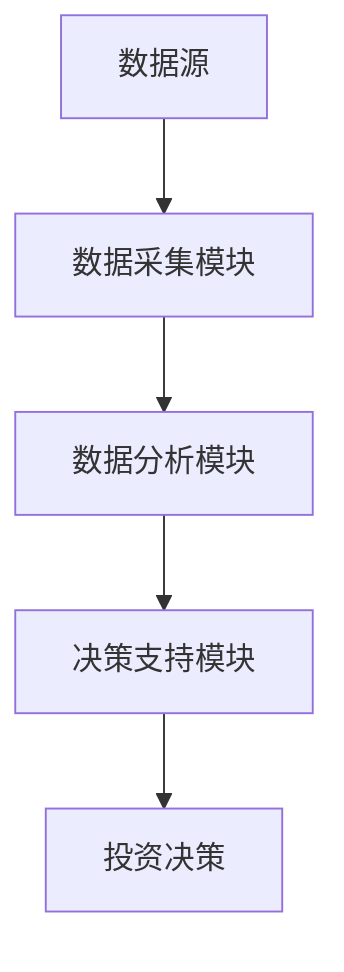

                 


# 塞思·卡拉曼的特殊情况价值投资：从公司事件中获利

## 关键词：  
- 特殊情况价值投资  
- 塞思·卡拉曼  
- 公司事件  
- 投资策略  
- 低估值机会  

## 摘要：  
本文深入探讨了塞思·卡拉曼的特殊情况价值投资方法，从公司事件中识别低估值机会，分析其投资理念、分析框架、算法原理及实战案例。文章结构清晰，内容详实，旨在帮助投资者掌握特殊价值投资的精髓。

---

# 目录

## 第一部分：特殊情况价值投资概述

### 第1章：特殊情况价值投资的背景与定义

#### 1.1 特殊情况价值投资的定义
- 1.1.1 什么是特殊情况价值投资
- 1.1.2 与传统价值投资的区别
- 1.1.3 当前市场环境下的特殊价值投资机会

#### 1.2 塞思·卡拉曼的投资理念
- 1.2.1 卡拉曼的投资哲学
- 1.2.2 卡拉曼的特殊价值投资方法
- 1.2.3 卡拉曼的成功案例分析

### 第2章：特殊情况的类型与特征

#### 2.1 常见的特殊情况类型
- 2.1.1 破产重整
- 2.1.2 并购重组
- 2.1.3 股权激励
- 2.1.4 管理层变动
- 2.1.5 业绩反转

#### 2.2 特殊情况的特征分析
- 2.2.1 低估值特征
- 2.2.2 高风险特征
- 2.2.3 高回报潜力

## 第二部分：特殊情况价值投资的核心概念

### 第3章：特殊价值投资的分析框架

#### 3.1 特殊情况分析的步骤
- 3.1.1 识别特殊情况
- 3.1.2 分析公司基本面
- 3.1.3 评估管理层质量
- 3.1.4 判断市场反应

#### 3.2 特殊情况下的财务分析
- 3.2.1 财务报表分析的关键点
- 3.2.2 现金流分析的重要性
- 3.2.3 行业地位与竞争优势

### 第4章：特殊价值投资的理论基础

#### 4.1 价值投资的基本原理
- 4.1.1 股票的内在价值
- 4.1.2 市场先生的波动性
- 4.1.3 安全边际的概念

#### 4.2 价值投资与特殊情况的结合
- 4.2.1 为什么特殊情况适合价值投资
- 4.2.2 特殊情况下的安全边际
- 4.2.3 价值陷阱的识别与避免

## 第三部分：特殊情况价值投资的算法原理

### 第5章：特殊情况价值投资的算法分析

#### 5.1 算法分析的步骤
- 5.1.1 数据收集与处理
- 5.1.2 特征提取与选择
- 5.1.3 模型训练与评估
- 5.1.4 投资决策与优化

#### 5.2 算法实现的代码示例
```python
def calculate_intrinsic_value(free_cash_flow, discount_rate):
    # 计算未来现金流的现值
    present_value = 0
    for t in range(1, 10):
        cash_flow = free_cash_flow * (1 + 0.05)**t  # 假设5%的永续增长率
        present_value += cash_flow / (1 + discount_rate)**t
    return present_value

# 示例计算
free_cash_flow = 100
discount_rate = 0.10
intrinsic_value = calculate_intrinsic_value(free_cash_flow, discount_rate)
print(f"股票的内在价值为：{intrinsic_value}")
```

## 第四部分：特殊情况价值投资的数学模型

### 第6章：数学模型与公式

#### 6.1 内在价值的计算公式
$$
V = \sum_{t=1}^{\infty} \frac{CF_t}{(1 + r)^t}
$$
其中：
- \( V \) 是股票的内在价值
- \( CF_t \) 是第 \( t \) 年的自由现金流
- \( r \) 是折现率

#### 6.2 贴现现金流模型的应用
$$
\text{股权价值} = \text{企业价值} - \text{债务价值}
$$

## 第五部分：特殊情况价值投资的系统架构

### 第7章：系统分析与架构设计

#### 7.1 系统功能设计
- 数据采集模块：收集公司事件数据、财务报表等
- 数据分析模块：应用算法进行内在价值评估
- 决策支持模块：生成投资建议和风险管理策略

#### 7.2 系统架构图


## 第六部分：特殊情况价值投资的项目实战

### 第8章：项目实战与案例分析

#### 8.1 案例分析：某公司并购事件
- 数据收集：分析并购前后的财务状况
- 模型应用：计算内在价值，评估并购影响
- 投资决策：基于分析结果制定投资策略

#### 8.2 代码实现与分析
```python
import pandas as pd
import numpy as np

def analyze_company_event(finance_data, event_type):
    # 简化分析模型
    if event_type == '并购':
        # 计算并购后的协同效应
        synergy = finance_data['协同效应'].mean()
        return synergy > 0.1 * finance_data['收入'].sum()
    else:
        return None

# 示例数据
finance_data = {
    '收入': [100, 120, 90],
    '协同效应': [20, 30, 15]
}
result = analyze_company_event(finance_data, '并购')
print(f"并购分析结果：{result}")
```

## 第七部分：特殊情况价值投资的最佳实践

### 第9章：最佳实践与总结

#### 9.1 投资策略总结
- 识别公司事件：破产重整、并购重组等
- 分析基本面：财务报表、现金流、行业地位
- 评估管理层：稳定性、战略眼光

#### 9.2 风险管理
- 设置止损点
- 分散投资
- 定期复盘

#### 9.3 持续学习
- 关注市场动态
- 更新分析模型
- 学习成功案例

---

### 附录：拓展阅读与工具推荐
- 推荐书籍：《安全边际》、《投资中最简单的事》
- 推荐工具：Excel、Python、数据分析框架

---

通过以上目录，文章将系统地介绍塞思·卡拉曼的特殊情况价值投资方法，从理论到实践，帮助投资者掌握如何从公司事件中识别投资机会。

