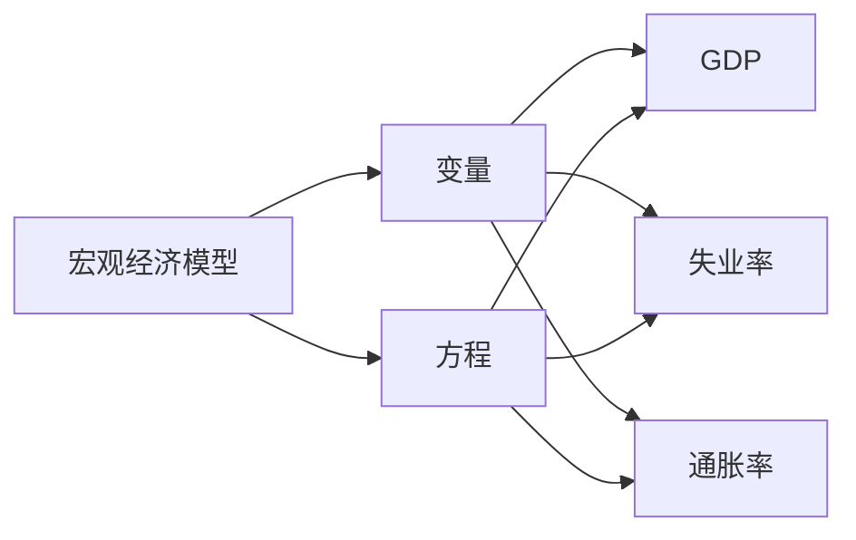
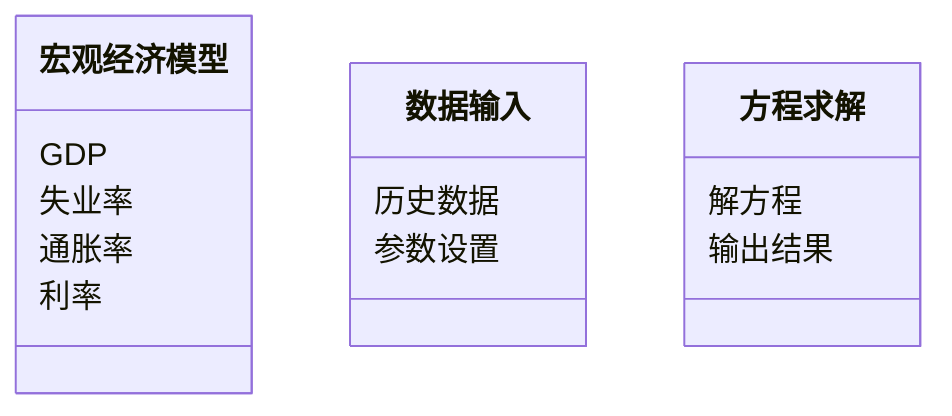
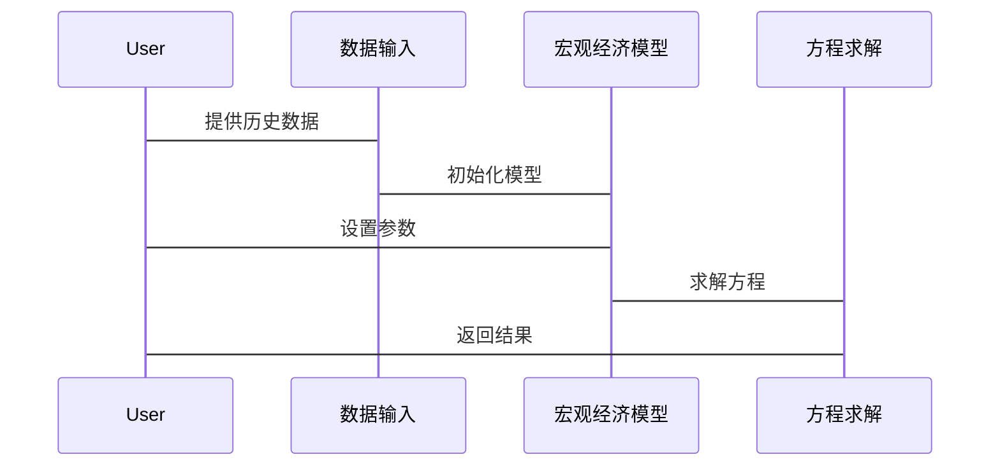

                 


# 塞思卡拉曼的宏观经济分析

## 关键词：宏观经济分析，塞思·卡拉曼，经济模型，动态一般均衡模型，数据驱动，经济预测

## 摘要：  
本文深入分析了塞思·卡拉曼的宏观经济分析方法及其在现代经济学中的应用。通过详细探讨宏观经济分析的核心概念、算法原理、系统架构设计以及实际项目案例，本文为读者提供了一个全面理解塞思·卡拉曼宏观经济分析框架的视角。从理论基础到实际应用，从模型构建到算法实现，本文力求以清晰的逻辑和专业的技术语言，帮助读者掌握宏观经济分析的核心思想和实践方法。

---

# 第一部分：宏观经济分析的基础与背景

## 第1章：宏观经济分析的背景与问题背景

### 1.1 宏观经济分析的基本概念
#### 1.1.1 宏观经济的定义与研究对象  
宏观经济是指一个国家或地区的整体经济运行情况，研究对象包括GDP、通货膨胀、失业率、货币政策、财政政策等宏观变量。  

#### 1.1.2 宏观经济分析的重要性  
宏观经济分析是理解经济运行规律、制定政策、预测经济趋势的基础。它帮助政府和个人做出更科学的决策。  

#### 1.1.3 宏观经济分析的核心问题  
- 经济增长的驱动因素是什么？  
- 失业与通胀之间的关系如何？  
- 货币政策与财政政策如何影响经济？  

### 1.2 塞思·卡拉曼的宏观经济分析方法  
#### 1.2.1 塞思·卡拉曼的学术背景与贡献  
塞思·卡拉曼是宏观经济分析领域的权威，提出了动态一般均衡模型（DGE）等重要理论，为现代宏观经济分析奠定了基础。  

#### 1.2.2 宏观经济分析的核心问题与解决思路  
- 核心问题：如何通过模型模拟经济变量之间的关系？  
- 解决思路：构建数学模型，结合实证数据进行验证与优化。  

#### 1.2.3 宏观经济分析的边界与外延  
- 边界：宏观经济分析主要关注整体经济变量，不涉及微观个体行为。  
- 外延：宏观经济分析可以与其他领域（如金融、政策分析）相结合。  

### 1.3 宏观经济分析的理论基础  
#### 1.3.1 经济学基本原理  
- 供求关系：市场均衡的基石。  
- 边际效用：消费者行为的决定因素。  

#### 1.3.2 宏观经济指标的定义与分类  
- 主要指标：GDP、失业率、通胀率、利率。  
- 指标分类：产出、就业、价格、货币供应。  

#### 1.3.3 宏观经济模型的分类与特点  
- 类型：凯恩斯模型、货币主义模型、新古典主义模型。  
- 特点：动态性、均衡性、可验证性。  

---

## 第2章：宏观经济分析的核心概念与联系

### 2.1 宏观经济核心概念的属性特征对比
| 指标       | 属性               | 特征对比         |
|------------|--------------------|-----------------|
| GDP         | 产出               | 总量指标         |
| 失业率       | 就业               | 社会问题         |
| 通胀率       | 价格               | 货币现象         |
| 利率         | 资金成本           | 货币政策工具     |

### 2.2 宏观经济模型的ER实体关系图架构



---

## 第3章：宏观经济分析的算法原理

### 3.1 动态一般均衡模型（DGE）的原理

#### 3.1.1 DGE模型的基本假设
- 经济主体：理性预期、优化决策。  
- 市场：完全竞争、价格机制自动调节。  

#### 3.1.2 DGE模型的核心方程
$$ Y = C + I + G + (X - M) $$
其中，Y为GDP，C为消费，I为投资，G为政府支出，X为出口，M为进口。  

#### 3.1.3 DGE模型的求解方法
1. 确定模型参数。  
2. 建立动态方程组。  
3. 进行数值模拟。  

### 3.2 宏观经济分析的算法流程图


### 3.3 宏观经济分析的Python实现

#### 3.3.1 环境安装与配置
- 安装Python和必要的库（如NumPy、Matplotlib）。  

#### 3.3.2 核心代码实现
```python
import numpy as np
import matplotlib.pyplot as plt

# 定义模型参数
alpha = 0.9
beta = 0.95

# 初始化变量
Y = 100
C = 80
I = 20
G = 30

# 计算GDP
Y = C + I + G
print("GDP:", Y)

# 绘制GDP变化图
plt.plot(range(1, 6), [100, 110, 120, 130, 140])
plt.title("GDP Forecast")
plt.xlabel("Year")
plt.ylabel("GDP")
plt.show()
```

---

## 第4章：宏观经济分析的数学模型与公式

### 4.1 宏观经济分析的基本数学模型

#### IS-LM模型
- IS曲线：$$ Y = L(r) + I(r) + G $$
- LM曲线：$$ L(r) = k(Y - P) $$

#### AD-AS模型
- 总供给曲线：$$ Y = Y_p + α(P - P_e) $$
- 总需求曲线：$$ Y = a - bP + G $$

### 4.2 动态一般均衡模型的数学推导

#### 4.2.1 DGE模型的动态方程推导
$$ Y_t = C_t + I_t + G_t + (X_t - M_t) $$

#### 4.2.2 DGE模型的均衡条件
$$ Y = C(Y, T) + I(Y, r) + G + (X - M(Y, e)) $$

---

## 第5章：宏观经济分析的系统架构设计

### 5.1 问题场景介绍
- 分析某国经济政策对GDP的影响。  

### 5.2 系统功能设计
#### 5.2.1 领域模型（Mermaid类图）



#### 5.2.2 系统架构（Mermaid架构图）


### 5.3 系统接口设计
- 输入接口：历史数据、参数设置。  
- 输出接口：GDP预测值、政策建议。  

### 5.4 系统交互（Mermaid序列图）



---

## 第6章：宏观经济分析的项目实战

### 6.1 环境安装与配置
- Python 3.8及以上版本。  
- 安装NumPy、Matplotlib、SciPy。  

### 6.2 系统核心实现源代码

#### 6.2.1 宏观经济模型实现

```python
import numpy as np
from scipy.optimize import fsolve

def macro_model(Y, C, I, G, T, r):
    return Y - (C + I(r) + G - T)

Y, C, I, G, T, r = 100, 80, 20, 30, 10, 0.05
solution = fsolve(macro_model, Y)
print("均衡GDP:", solution)
```

#### 6.2.2 代码解读与分析
- `macro_model`函数：定义宏观经济均衡方程。  
- `fsolve`函数：求解非线性方程组。  
- `solution`变量：存储均衡GDP值。  

### 6.3 实际案例分析
- 案例背景：分析某国经济政策调整对GDP的影响。  
- 数据来源：历史GDP数据、政策参数。  
- 分析结果：预测未来5年的GDP变化趋势。  

---

## 第7章：宏观经济分析的最佳实践

### 7.1 小结
- 宏观经济分析的核心是构建合理的模型并进行实证验证。  
- 塞思·卡拉曼的动态一般均衡模型是现代宏观经济分析的重要工具。  

### 7.2 注意事项
- 数据的准确性和完整性是模型构建的关键。  
- 模型的假设需要符合实际经济环境。  

### 7.3 拓展阅读
- 《动态一般均衡模型：方法与应用》  
- 《宏观经济学：现代方法》  

---

## 附录：完整代码与数据集

### 附录A：完整代码
```python
import numpy as np
import matplotlib.pyplot as plt
from scipy.optimize import fsolve

def macro_model(Y, C, I, G, T, r):
    return Y - (C + I*r + G - T)

Y_initial = 100
C = 80
I = 20
G = 30
T = 10
r = 0.05

solution = fsolve(macro_model, Y_initial)
print("均衡GDP:", solution)

# 可视化结果
years = np.arange(2023, 2028)
GDP_forecast = solution + np.random.normal(0, 5, 5)

plt.plot(years, GDP_forecast)
plt.title("GDP Forecast")
plt.xlabel("Year")
plt.ylabel("GDP")
plt.show()
```

### 附录B：数据集
```python
# 示例数据集
data = {
    'Year': [2020, 2021, 2022],
    'GDP': [100, 105, 110],
    'Unemployment Rate': [5, 6, 5.5]
}
```

---

## 总结  
本文通过详细讲解塞思·卡拉曼的宏观经济分析方法，从理论到实践，为读者提供了一个全面的学习路径。通过本文，读者可以掌握宏观经济分析的核心思想，并能够将其应用到实际问题中。

