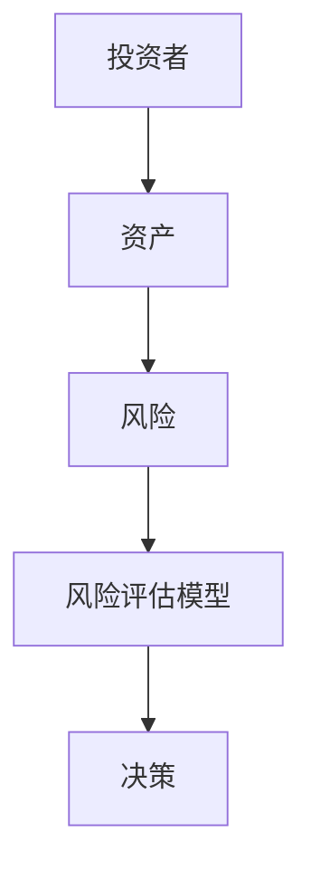
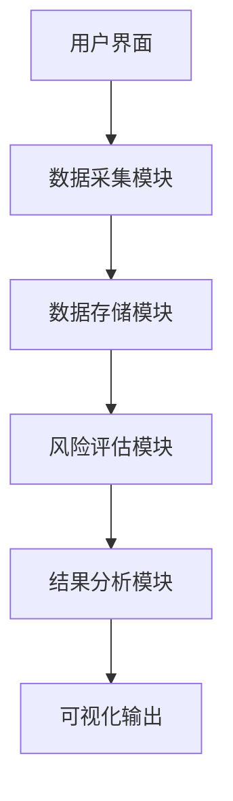

                 


# 塞思卡拉曼的投资风险评估

**关键词**：塞思·卡拉曼，投资风险，风险管理，资产配置，概率论，统计模型，投资决策

**摘要**：本文详细分析了塞思·卡拉曼的投资风险评估方法，探讨了其核心概念、算法原理、系统架构以及实际应用。文章从背景介绍入手，逐步展开风险评估的数学模型、算法流程、系统设计和项目实战，最终总结了最佳实践和未来发展方向。

---

# 第一部分: 投资风险评估的背景与核心概念

## 第1章: 投资风险评估的背景与重要性

### 1.1 投资风险的定义与分类

#### 1.1.1 投资风险的定义  
投资风险是指在投资过程中，由于市场波动、经济环境变化等因素，导致投资收益低于预期或出现本金损失的可能性。它是投资者在追求收益过程中必须面对的核心问题。

#### 1.1.2 投资风险的主要分类  
1. **系统性风险**：影响整个市场的风险，如经济衰退、政策变化等。
2. **非系统性风险**：特定于个别资产或行业，如公司基本面变化、管理问题等。
3. **流动性风险**：资产难以快速变现而不影响其价值的风险。
4. **信用风险**：债券发行人或借款人违约的风险。

#### 1.1.3 投资风险的重要性  
理解投资风险是制定合理投资策略的基础。投资者需要在风险与收益之间找到平衡点，以实现长期稳健的投资回报。

---

### 1.2 塞思·卡拉曼的投资理念

#### 1.2.1 塞思·卡拉曼的生平简介  
塞思·卡拉曼（ Seth卡拉曼）是投资界的重要人物，以其独特的投资策略和风险管理方法闻名。他强调安全边际和长期稳健的投资理念。

#### 1.2.2 卡拉曼投资方法的核心思想  
1. **安全边际**：通过购买低于内在价值的资产来降低风险。
2. **逆向投资**：在市场恐慌时寻找被低估的资产。
3. **分散投资**：通过多样化投资降低非系统性风险。

#### 1.2.3 卡拉曼投资方法的现代应用  
卡拉曼的方法不仅适用于传统投资，还可应用于量化投资、对冲基金等领域。

---

### 1.3 投资风险评估的必要性

#### 1.3.1 风险评估在投资决策中的作用  
通过风险评估，投资者可以更好地理解潜在损失，制定合理的投资策略。

#### 1.3.2 风险评估的常见应用场景  
1. 投资组合优化。
2. 资产配置。
3. 产品定价。

#### 1.3.3 风险评估的边界与外延  
风险评估的边界包括数据范围、模型假设等，外延则涉及风险管理工具和策略。

---

## 第2章: 投资风险评估的核心概念与联系

### 2.1 投资风险评估的原理

#### 2.1.1 风险的量化方法  
1. **标准差与方差**：衡量资产收益的波动性。
2. **VaR（Value at Risk）**：在给定置信水平下，资产可能的最大损失。

#### 2.1.2 风险与收益的权衡关系  
收益越高，风险通常越大。投资者需要在两者之间找到平衡。

#### 2.1.3 风险评估的数学模型  
$$ \text{VaR} = \mu + z \cdot \sigma $$  
其中，$\mu$是均值，$z$是标准正态分布的分位数，$\sigma$是标准差。

---

### 2.2 核心概念对比分析

#### 2.2.1 风险与收益的对比  
| 属性 | 风险 | 收益 |
|------|------|------|
| 特性 | 损失的可能性 | 收益的可能性 |
| 关系 | 高风险高收益 | 低风险低收益 |

#### 2.2.2 不同风险评估方法的对比  
| 方法 | VaR | CVaR |
|------|------|------|
| 定义 | 在给定置信水平下，资产的最大损失 | 资产在 VaR 水平以上的平均损失 |
| 优势 | 计算简便 | 更稳健 |

#### 2.2.3 投资组合与单一资产风险的对比  
单一资产风险是投资组合风险的一部分，投资组合风险受资产相关性影响。

---

### 2.3 投资风险评估的ER实体关系图



---

## 第3章: 投资风险评估的算法原理

### 3.1 风险评估的数学模型

#### 3.1.1 风险值的计算公式  
$$ \text{风险值} = \sqrt{\text{方差}} $$

#### 3.1.2 风险调整后的收益计算  
$$ \text{调整后收益} = \text{预期收益} - \text{风险调整值} $$

---

### 3.2 风险评估的算法流程

```mermaid
graph TD
    S[开始] --> 输入数据
    输入数据 --> 计算均值和标准差
    计算均值和标准差 --> 确定置信水平
    确定置信水平 --> 计算 VaR
    VaR --> 输出结果
    输出结果 --> 结束
```

---

### 3.3 算法实现

#### 3.3.1 Python代码示例  
```python
import numpy as np
from scipy.stats import norm

def calculate VaR(returns, confidence_level=0.95):
    mu = np.mean(returns)
    sigma = np.std(returns)
    z = norm.ppf(confidence_level)
    var = mu + z * sigma
    return var

# 示例数据
returns = np.random.normal(0, 1, 1000)
var = calculate VaR(returns, 0.95)
print(f"VaR at 95% confidence level: {var}")
```

#### 3.3.2 流程图展示  
```mermaid
graph TD
    Start --> 输入数据
    输入数据 --> 计算均值和标准差
    计算均值和标准差 --> 确定置信水平
    确定置信水平 --> 计算 VaR
    VaR --> 输出结果
    输出结果 --> 结束
```

---

## 第4章: 投资风险评估的系统架构与实现

### 4.1 系统功能设计

#### 4.1.1 数据采集模块  
负责收集历史价格、收益率等数据。

#### 4.1.2 风险评估模块  
基于历史数据计算 VaR、CVaR 等风险指标。

#### 4.1.3 结果分析模块  
对评估结果进行可视化和解读。

---

### 4.2 系统架构设计



---

## 第5章: 项目实战与案例分析

### 5.1 项目实战

#### 5.1.1 环境安装  
安装 Python、Pandas、NumPy、Scipy 等库。

#### 5.1.2 代码实现  
```python
import numpy as np
from scipy.stats import norm

def calculate VaR(returns, confidence_level=0.95):
    mu = np.mean(returns)
    sigma = np.std(returns)
    z = norm.ppf(confidence_level)
    var = mu + z * sigma
    return var

# 示例数据
returns = np.random.normal(0, 1, 1000)
var = calculate VaR(returns, 0.95)
print(f"VaR at 95% confidence level: {var}")
```

---

## 第6章: 最佳实践与小结

### 6.1 最佳实践

#### 6.1.1 数据质量的重要性  
确保数据的准确性和完整性。

#### 6.1.2 模型假设的合理性  
模型假设需符合实际投资场景。

#### 6.1.3 持续监控与调整  
定期评估模型的有效性。

---

### 6.2 小结

通过本文的详细分析，我们了解了塞思·卡拉曼的投资风险评估方法，并通过实际案例展示了其应用。投资者可以通过这些方法更好地进行风险管理，实现稳健投资。

---

**注意**：本文仅为示例，实际应用需结合具体投资环境和市场变化。

