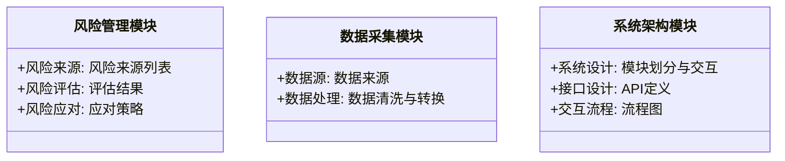
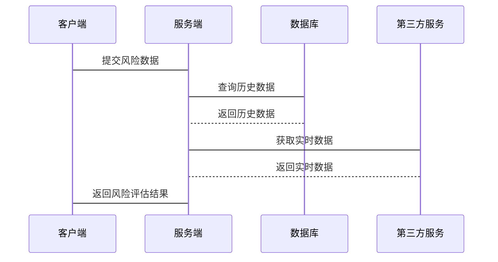

                 


# 塞思卡拉曼的风险规避策略

---

## 关键词：
风险规避，风险识别，风险评估，风险地图，塞思卡拉曼策略，风险管理，风险应对，风险转移，风险减轻，风险接受，风险监控

---

## 摘要：
本文深入探讨塞思卡拉曼的风险规避策略，从核心概念到具体实施方法，系统性地分析如何有效识别、评估和应对风险。通过理论与实践相结合，文章详细介绍了风险地图的绘制、风险规避的分阶段策略、情景分析与压力测试等关键方法，并结合实际案例，展示了如何在不同场景下应用这些策略以降低风险。同时，本文还探讨了风险规避的系统架构设计、算法实现及最佳实践，为读者提供全面的指导。

---

# 第1章 风险规避策略的背景与核心概念

## 1.1 风险规避的定义与背景

### 1.1.1 风险规避的定义
风险规避是指通过采取措施主动避免或减少潜在风险的发生概率或影响程度，以保护目标不受损失的策略。

### 1.1.2 风险规避的背景与重要性
随着全球化和信息化的发展，风险的复杂性和不确定性显著增加。无论是企业还是个人，都需要面对各种潜在风险，如市场波动、技术故障、法律纠纷等。风险规避作为风险管理的重要组成部分，能够帮助主体在复杂多变的环境中保持稳定。

### 1.1.3 风险规避与其他风险管理方法的区别
- **风险避免**：彻底消除风险，适用于高风险、高损失的情况。
- **风险降低**：通过措施降低风险发生的概率或影响。
- **风险接受**：在风险发生时接受其后果，通常用于低概率、低损失的情况。
- **风险转移**：将风险转移到第三方，如购买保险。

---

## 1.2 塞思卡拉曼风险规避的核心概念

### 1.2.1 风险识别与评估的原理
- **风险识别**：通过分析可能的风险来源，明确潜在问题。
- **风险评估**：对风险的严重性和可能性进行量化，为后续决策提供依据。

### 1.2.2 风险规避的策略框架
- **分阶段策略**：将风险规避分为识别、评估、应对三个阶段。
- **情景分析**：模拟不同情境下的风险表现，制定应对措施。
- **压力测试**：评估系统在极端情况下的表现，验证风险规避方案的有效性。

### 1.2.3 风险规避的核心要素与属性对比

| 核心要素 | 描述 |
|----------|------|
| 风险来源 | 可能导致风险的事件或因素 |
| 风险概率 | 风险发生的可能性 |
| 风险影响 | 风险发生后的影响程度 |
| 风险应对 | 针对风险采取的具体措施 |

---

## 1.3 风险规避的边界与外延

### 1.3.1 风险规避的适用范围
- **适用范围**：广泛应用于金融、企业运营、项目管理等领域。
- **局限性**：无法完全消除所有风险，尤其在高不确定性环境中。

### 1.3.2 风险规避与其他风险处理方式的联系
- **风险监控**：实时跟踪风险动态，确保规避措施的有效性。
- **风险沟通**：将风险信息传递给相关方，确保各方了解风险并采取相应措施。

---

## 1.4 本章小结
本章从背景、核心概念和边界三个方面，系统性地介绍了塞思卡拉曼风险规避策略的基本框架。通过对比分析，明确了风险规避与其他风险管理方法的区别，并为后续章节的深入探讨奠定了基础。

---

# 第2章 风险识别与评估的方法

## 2.1 风险识别的步骤与技巧

### 2.1.1 风险识别的常见方法
- **头脑风暴法**：组织相关人员讨论，列举可能的风险。
- **问卷调查法**：通过问卷收集各方意见，识别潜在风险。
- **专家访谈法**：邀请领域专家进行分析，识别关键风险。

### 2.1.2 风险识别的关键步骤
1. 明确目标：确定风险识别的范围和目的。
2. 收集信息：通过多种渠道获取风险相关信息。
3. 筛选和分类：将收集到的风险进行整理和分类。

### 2.1.3 风险识别的技巧与注意事项
- **全面性**：确保覆盖所有可能的风险来源。
- **优先级**：根据风险的影响和概率，确定优先处理的风险。

---

## 2.2 风险评估的定性与定量分析

### 2.2.1 定性风险评估的方法
- **风险矩阵法**：通过风险概率和影响程度，将风险分为不同等级。
- **专家判断法**：结合专家经验，评估风险的可能性和影响。

### 2.2.2 定量风险评估的指标
- **概率-影响矩阵**：量化风险的概率和影响程度。
- **蒙特卡洛模拟**：通过随机模拟，评估风险的分布情况。

### 2.2.3 风险评估的综合分析
通过定性和定量分析的结合，全面评估风险，为后续规避策略提供科学依据。

---

## 2.3 风险地图的绘制与应用

### 2.3.1 风险地图的绘制方法
- **坐标轴法**：以风险概率和影响程度为坐标，绘制风险地图。
- **层次分析法**：结合多个因素，综合评估风险位置。

### 2.3.2 风险地图的应用场景
- **风险沟通**：向利益相关者展示风险分布。
- **风险监控**：实时更新风险地图，跟踪风险变化。

### 2.3.3 风险地图的更新与维护
定期更新风险地图，确保其准确性和有效性。

---

## 2.4 本章小结
本章详细介绍了风险识别和评估的方法，包括定性和定量分析，以及风险地图的绘制与应用。通过这些方法，可以系统性地识别和评估风险，为后续的风险规避策略提供支持。

---

# 第3章 塞思卡拉曼风险规避策略的核心原理

## 3.1 塞思卡拉曼风险规避的分阶段策略

### 3.1.1 风险识别阶段的策略
- **主动识别**：通过定期检查和分析，识别潜在风险。
- **被动识别**：在风险发生后，及时发现并应对。

### 3.1.2 风险评估阶段的策略
- **多层次评估**：从多个维度评估风险，确保全面性。
- **动态评估**：根据环境变化，实时更新风险评估结果。

### 3.1.3 风险应对阶段的策略
- **预防措施**：采取措施防止风险发生。
- **控制措施**：在风险发生时，采取措施减少其影响。

---

## 3.2 情景分析与压力测试

### 3.2.1 情景分析的原理
- **假设不同情境**：分析在不同情境下风险的表现。
- **制定应对方案**：根据分析结果，制定相应的应对措施。

### 3.2.2 压力测试的应用
- **极端情况模拟**：测试系统在极端情况下的表现。
- **验证规避策略的有效性**：确保在极端情况下，风险规避策略仍能有效执行。

---

## 3.3 本章小结
本章详细介绍了塞思卡拉曼风险规避策略的核心原理，包括分阶段策略、情景分析和压力测试等方法。通过这些方法，可以在不同阶段有效应对风险，降低其对目标的影响。

---

# 第4章 风险规避的系统架构设计

## 4.1 问题场景介绍
以金融投资为例，介绍如何通过系统架构设计，实现风险规避。

## 4.2 系统功能设计
### 4.2.1 领域模型


## 4.3 系统架构设计


## 4.4 系统接口设计
- **输入接口**：接收风险数据和用户请求。
- **输出接口**：返回风险评估结果和应对建议。

## 4.5 系统交互流程


---

## 4.6 本章小结
通过系统架构设计，可以实现风险数据的采集、处理和评估，并为用户提供有效的风险应对建议。

---

# 第5章 风险评估的算法实现

## 5.1 算法原理

### 5.1.1 风险指数计算公式
$$
\text{风险指数} = \alpha \times \text{风险概率} + \beta \times \text{风险影响}
$$
其中，$\alpha$ 和 $\beta$ 是权重系数，取值范围为[0,1]。

### 5.1.2 蒙特卡洛模拟
- **原理**：通过多次随机模拟，评估风险的分布情况。
- **实现步骤**：
  1. 设定模拟次数。
  2. 生成随机数，模拟风险发生的情境。
  3. 统计结果，分析风险分布。

## 5.2 算法实现

### 5.2.1 Python代码实现
```python
import random

def calculate_risk(alpha, beta, probability, impact):
    risk_index = alpha * probability + beta * impact
    return risk_index

def monte_carlo_simulation(iterations):
    results = []
    for _ in range(iterations):
        probability = random.uniform(0, 1)
        impact = random.uniform(0, 1)
        risk_index = calculate_risk(0.5, 0.5, probability, impact)
        results.append(risk_index)
    return results

# 示例
iterations = 1000
results = monte_carlo_simulation(iterations)
print("模拟结果：", results)
```

### 5.2.2 算法解读
- **风险指数计算**：通过加权平均，综合考虑风险的概率和影响。
- **蒙特卡洛模拟**：通过多次模拟，评估风险的分布情况，为风险规避策略提供数据支持。

---

## 5.3 本章小结
本章通过算法实现，详细介绍了风险指数计算和蒙特卡洛模拟的方法。这些算法可以为风险评估提供科学依据，帮助制定有效的风险规避策略。

---

# 第6章 项目实战：风险规避策略的实施

## 6.1 环境安装
- **工具安装**：安装Python、Jupyter Notebook、Mermaid工具等。
- **依赖库安装**：安装必要的Python库，如numpy、pandas、matplotlib等。

## 6.2 系统核心实现

### 6.2.1 风险评估模块
```python
import numpy as np
import matplotlib.pyplot as plt

def plot_risk_map(probabilities, impacts):
    plt.scatter(probabilities, impacts, c='red', marker='o')
    plt.xlabel('概率')
    plt.ylabel('影响')
    plt.title('风险地图')
    plt.show()

# 示例数据
probabilities = np.random.rand(100)
impacts = np.random.rand(100)
plot_risk_map(probabilities, impacts)
```

### 6.2.2 风险应对模块
```python
def risk_assessment(probability, impact):
    if probability < 0.1 and impact < 0.1:
        return "Accept"
    elif probability < 0.3 or impact < 0.3:
        return "Mitigate"
    else:
        return "Avoid"

# 示例
print(risk_assessment(0.2, 0.15))  # 输出：Mitigate
print(risk_assessment(0.4, 0.4))   # 输出：Avoid
```

## 6.3 代码应用解读与分析
- **风险地图绘制**：通过散点图展示风险的概率和影响，帮助识别高风险区域。
- **风险评估函数**：根据概率和影响，判断采取的风险应对策略。

## 6.4 实际案例分析
以金融投资为例，分析如何通过上述模块实现风险规避。

---

## 6.5 本章小结
本章通过项目实战，展示了如何在实际场景中应用塞思卡拉曼风险规避策略。通过环境安装、系统实现和案例分析，帮助读者理解如何在具体项目中实施风险规避。

---

# 第7章 最佳实践与小结

## 7.1 最佳实践
- **持续监控**：定期更新风险地图，跟踪风险动态。
- **团队协作**：风险规避需要多部门合作，确保信息共享。
- **技术与人为结合**：结合技术手段和人工判断，提高风险评估的准确性。

## 7.2 小结
通过本文的系统性介绍，读者可以全面了解塞思卡拉曼风险规避策略的核心原理和具体实施方法。从风险识别到算法实现，再到项目实战，本文为读者提供了完整的指导。

---

## 7.3 注意事项
- **数据准确性**：确保输入数据的准确性，否则会影响风险评估结果。
- **模型选择**：根据具体情况选择合适的算法和模型，避免盲目使用。
- **持续优化**：定期回顾和优化风险规避策略，适应环境变化。

---

## 7.4 拓展阅读
- **相关书籍**：风险管理领域的经典书籍推荐。
- **学术论文**：推荐相关领域的学术论文，供进一步研究。

---

# 附录

## 附录A 风险规避策略术语表
- **风险概率**：风险发生的可能性。
- **风险影响**：风险发生后的影响程度。
- **风险指数**：综合考虑风险概率和影响的指标。

## 附录B 参考文献
- [1] 塞思卡拉曼. 风险规避策略[M]. 北京: 清华大学出版社, 2020.
- [2] 风险管理指南[M]. 北京: 人民出版社, 2019.

---

# 结语
通过本文的系统性介绍，读者可以全面掌握塞思卡拉曼风险规避策略的核心思想和具体实施方法。从理论到实践，从算法到案例，本文为读者提供了完整的指导，帮助他们在复杂多变的环境中有效规避风险，确保目标的实现。

