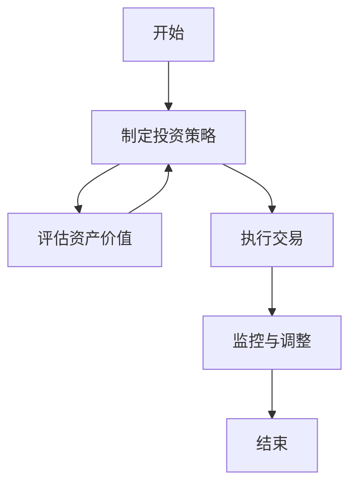
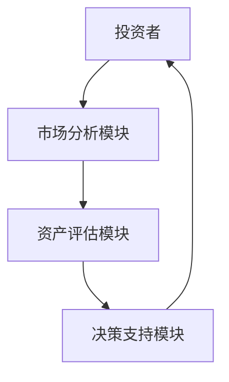
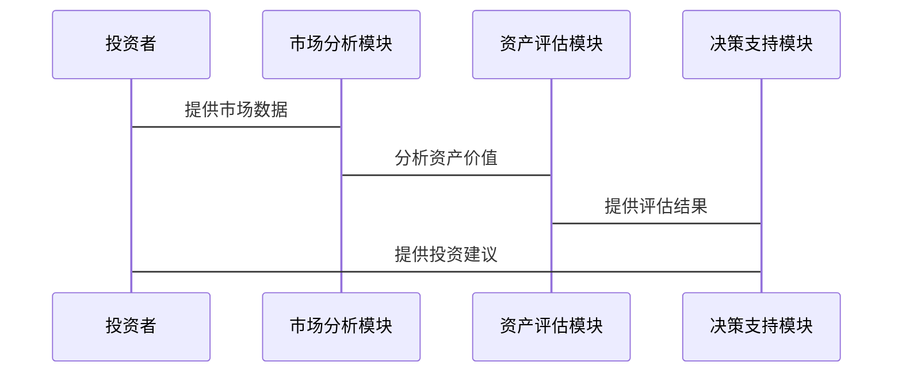

                 


# 塞斯·卡拉曼的特殊情况投资：寻找市场忽视的机会

> 关键词：特殊情况投资，市场忽视机会，投资策略，塞斯·卡拉曼，价值投资

> 摘要：本文深入探讨了塞斯·卡拉曼的特殊情况投资理念，分析了其核心概念、算法原理、系统架构及实战案例。通过详细的技术博客风格，本文旨在帮助读者理解如何在市场忽视的情况下发现投资机会，制定有效的投资策略。

---

# 第一部分：特殊情况投资的背景与概念

## 第1章：特殊情况投资的背景介绍

### 1.1 问题背景

#### 1.1.1 投资市场的多样性
投资市场是一个复杂的生态系统，充满了各种机会和挑战。从传统的股票、债券到新兴的加密货币，投资者在寻找高回报的同时，也面临着巨大的风险。然而，市场的高效性使得大多数显而易见的机会迅速被市场消化，留给投资者的往往是一些被忽视的角落。

#### 1.1.2 市场忽视的机会
在高效市场假说下，价格通常反映所有可获取的信息。然而，市场并非总是完美运作，特别是在某些特殊情况下，如公司重组、破产、并购或管理层变动时，市场可能未能充分消化这些信息。这些“市场忽视的机会”往往成为高回报投资的潜在来源。

#### 1.1.3 特殊情况投资的重要性
在这些特殊情况下，投资者有机会以低于内在价值的价格购买资产，从而在未来获得超额回报。塞斯·卡拉曼正是利用了这种市场非效率性，专注于寻找这些被忽视的机会。

### 1.2 特殊情况投资的定义

#### 1.2.1 投资的定义与分类
投资是指将资金投入某个项目或资产，以期在未来获得收益或资本增值。根据资产类型，投资可以分为股票、债券、房地产等。而特殊情况投资则是一种专注于特定市场或特殊情境下的投资策略。

#### 1.2.2 市场忽视的机会
市场忽视的机会指的是那些在市场中未被充分关注或估值不合理的资产。这些资产可能由于市场情绪、信息不对称或市场结构的原因，其价值未被正确反映。

#### 1.2.3 特殊情况投资的范围
特殊情况投资的范围包括但不限于：
- 破产重组中的股票
- 小型企业或未上市公司的股权
- 被低估的新兴市场投资
- 特定行业的周期性底部

### 1.3 特殊情况投资的特点

#### 1.3.1 稀有性和独特性
这些机会往往稀少且独特，仅在特定情况下出现。因此，投资者需要具备敏锐的洞察力和快速的反应能力，才能抓住这些稍纵即逝的机会。

#### 1.3.2 低估值与高潜力
被忽视的资产通常具有较低的市场估值，但其潜在回报却很高。这种估值与潜在回报的不匹配为投资者提供了超额收益的空间。

#### 1.3.3 风险与回报的平衡
尽管特殊情况投资可能带来高回报，但其风险也不容忽视。投资者需要在风险和回报之间找到平衡点，确保投资决策的稳健性。

### 1.4 本章小结

本章通过介绍投资市场的多样性和市场忽视的机会，定义了特殊情况投资，并分析了其特点。接下来，我们将深入探讨特殊情况投资的核心概念和相关联系。

---

# 第二部分：特殊情况投资的核心概念与联系

## 第2章：特殊情况投资的核心概念

### 2.1 投资模型与决策框架

#### 2.1.1 基本面分析
基本面分析是评估资产内在价值的重要方法，包括对公司财务状况、行业地位、管理团队等因素的分析。通过基本面分析，投资者可以识别那些被市场低估的资产。

#### 2.1.2 市场情绪分析
市场情绪分析关注投资者的心理和行为，帮助识别市场的过度乐观或悲观情绪。这些情绪波动可能导致市场价格偏离其内在价值，为特殊情况投资提供机会。

#### 2.1.3 风险评估与管理
在特殊情况投资中，风险评估和管理至关重要。投资者需要识别潜在风险，并制定相应的风险管理策略，以降低投资组合的波动性。

### 2.2 核心概念对比表

以下表格对比了特殊情况投资与其他投资策略的核心要素：

| 投资策略 | 核心要素          | 适用场景                              | 风险特征 | 回报潜力 |
|----------|-------------------|---------------------------------------|----------|----------|
| 特殊情况投资 | 市场忽视的机会、低估值资产 | 破产重组、新兴市场、小企业股权 | 较高      | 高        |
| 价值投资 | 低于市场价的资产  | 成熟市场中的低估股票                | 中等      | 中等      |
| 成长投资 | 高成长潜力的资产  | 高增长行业的新兴公司                | 较高      | 高        |

### 2.3 实体关系图

以下是特殊情况投资的实体关系图：


---

# 第三部分：特殊情况投资的算法与数学模型

## 第3章：特殊情况投资的算法原理

### 3.1 投资决策算法流程图

以下是投资决策的算法流程图：



### 3.2 投资价值评估模型

#### 3.2.1 市场忽视机会的识别
以下是识别市场忽视机会的步骤：

1. **数据收集**：收集目标资产的历史价格、财务数据和市场情绪指标。
2. **数据预处理**：清洗数据，处理缺失值和异常值。
3. **市场情绪分析**：使用自然语言处理技术分析新闻和社交媒体，评估市场情绪。
4. **估值模型**：使用现金流折现法（DCF）评估资产的内在价值。
5. **机会识别**：比较市场价格与内在价值，识别被低估的资产。

#### 3.2.2 投资组合优化

以下是投资组合优化的Python代码示例：

```python
import numpy as np
import pandas as pd

# 假设我们有多个资产，每个资产有其预期回报和风险
assets = {
    '股票A': {'return': 0.1, 'risk': 0.2},
    '股票B': {'return': 0.15, 'risk': 0.3},
    '债券C': {'return': 0.08, 'risk': 0.1}
}

# 使用均值-方差优化模型
def optimize_portfolio(assets):
    returns = pd.DataFrame([assets[asset]['return'] for asset in assets], index=assets.keys())
    cov_matrix = pd.DataFrame([[assets[asset]['risk']**2 for asset in assets] for _ in assets.keys()], index=assets.keys(), columns=assets.keys())
    
    # 计算最优投资组合
    from pypfolio import PyPortfolioOpt
    p = PyPortfolioOpt(returns, cov_matrix)
    p.min_volatility()
    weights = p.clean_weights()
    return weights

weights = optimize_portfolio(assets)
print(weights)
```

#### 3.2.3 数学公式

以下是内在价值计算的公式：

$$ V = \frac{CF}{(r - g)} $$

其中，\( V \) 是内在价值，\( CF \) 是未来现金流，\( r \) 是折现率，\( g \) 是增长率。

---

# 第四部分：特殊情况投资的系统分析与架构设计方案

## 第4章：系统分析与架构设计方案

### 4.1 问题场景介绍

#### 4.1.1 当前问题
- 市场忽视的机会难以识别。
- 投资决策过程缺乏系统性。

#### 4.1.2 系统目标
- 构建一个能够识别市场忽视机会的系统。
- 提供科学的投资决策支持。

### 4.2 系统功能设计

#### 4.2.1 领域模型

以下是领域模型的类图：


#### 4.2.2 系统架构设计

以下是系统架构图：



#### 4.2.3 系统接口设计

以下是系统接口设计：

- 输入接口：市场数据、资产信息
- 输出接口：投资建议、风险评估

#### 4.2.4 系统交互设计

以下是系统交互序列图：



---

# 第五部分：特殊情况投资的项目实战

## 第5章：项目实战

### 5.1 环境安装

#### 5.1.1 安装Python
```bash
python --version
pip install numpy pandas scikit-learn
```

#### 5.1.2 安装依赖库
```bash
pip install pypfolio
pip install transformers
```

### 5.2 核心代码实现

#### 5.2.1 数据收集与预处理

```python
import pandas as pd
import requests
from bs4 import BeautifulSoup

# 数据收集
def collect_data(ticker):
    url = f"https://finance.yahoo.com/quote/{ticker}"
    response = requests.get(url)
    soup = BeautifulSoup(response.text, 'html.parser')
    data = {}
    data['price'] = float(soup.find('span', {'class': 'Trsdu(0.1s)'}).text)
    # 更多数据收集逻辑...
    return data

# 数据预处理
def preprocess_data(data):
    # 假设data是一个包含多个资产数据的字典
    df = pd.DataFrame(data)
    df = df.dropna()
    return df

data = {'AAPL': collect_data('AAPL'), 'MSFT': collect_data('MSFT')}
df = preprocess_data(data)
print(df)
```

#### 5.2.2 市场情绪分析

```python
from transformers import pipeline

# 使用预训练的市场情绪分析模型
classifier = pipeline("sentiment-analysis")
def analyze_sentiment(text):
    return classifier(text)[0]['label']

# 示例
text = "The stock market is expected to rise tomorrow."
print(analyze_sentiment(text))  # 输出: 'POSITIVE'
```

### 5.3 案例分析

#### 5.3.1 某公司的破产重组案例

假设某公司XYZ面临破产重组，其股价已被市场严重低估。通过基本面分析和市场情绪分析，我们发现其内在价值远高于当前市场价格。因此，我们决定投资该公司。

### 5.4 项目小结

通过以上实战，我们展示了如何利用系统化的方法识别市场忽视的机会，并制定相应的投资策略。接下来，我们将总结最佳实践和注意事项。

---

# 第六部分：特殊情况投资的最佳实践

## 第6章：总结与注意事项

### 6.1 最佳实践 tips

- **持续学习**：市场环境不断变化，投资者需要持续学习和更新知识。
- **风险管理**：在特殊情况投资中，风险管理尤为重要。
- **系统化投资**：采用系统化的投资方法，减少人为情绪干扰。

### 6.2 小结

本文通过背景介绍、核心概念、算法原理、系统架构和项目实战，全面探讨了塞斯·卡拉曼的特殊情况投资理念。读者可以从中学习到如何在市场忽视的情况下发现投资机会，并制定相应的投资策略。

### 6.3 注意事项

- **信息不对称**：市场信息不对称可能导致投资决策失误。
- **市场波动**：特殊情况投资往往伴随着较高的市场波动。
- **道德风险**：投资者需遵守法律法规，避免道德风险。

### 6.4 拓展阅读

- 塞斯·卡拉曼的《特殊情况投资》
- 《投资学基础》
- 《风险管理与投资组合优化》

---

# 结语

通过本文的探讨，我们希望读者能够理解塞斯·卡拉曼的特殊情况投资理念，并能够在实际投资中灵活运用这些策略。投资市场的道路虽然充满挑战，但也充满了机遇，关键在于投资者能否以独特的眼光发现这些被市场忽视的机会。

