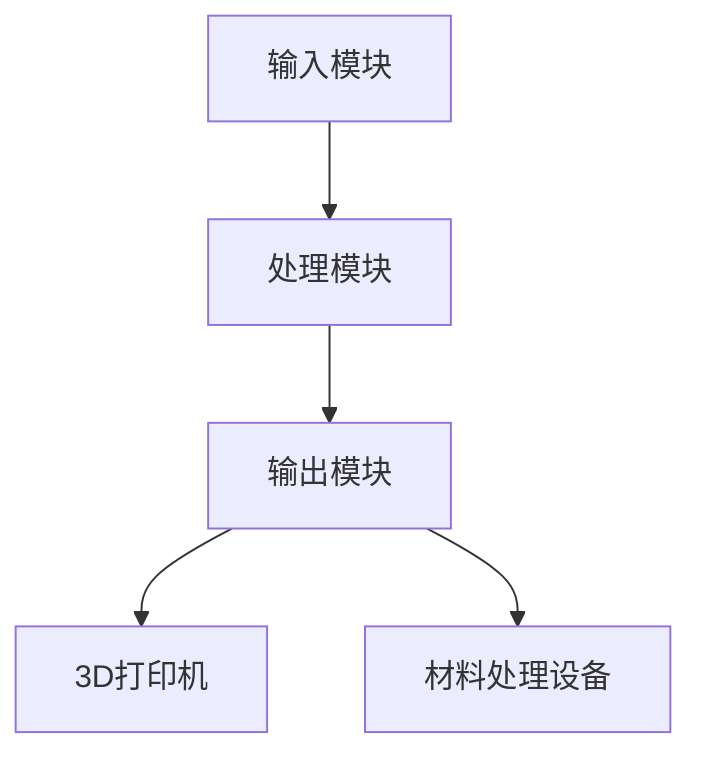
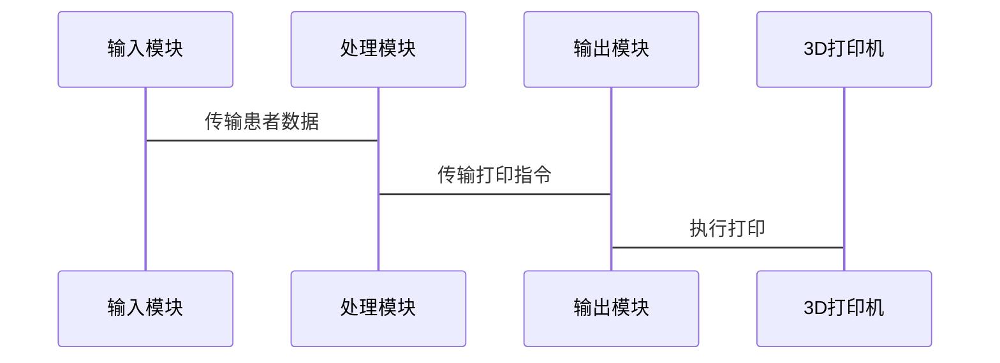

                 


# 增材制造技术在医疗领域的应用与投资机会

## 关键词：
增材制造技术，医疗领域，3D打印，投资机会，医疗设备

## 摘要：
增材制造技术，又称3D打印技术，近年来在医疗领域的应用取得了显著进展。本文将从增材制造技术的核心概念、算法原理、系统架构、项目实战等方面进行详细分析，探讨其在医疗领域的应用现状、优势与挑战，以及未来的发展方向。同时，本文还将深入分析增材制造技术在医疗领域的投资机会，为投资者提供有价值的参考。

---

## 第一部分：背景介绍

### 1.1 增材制造技术的定义与核心概念

#### 1.1.1 增材制造技术的定义
增材制造技术（Additive Manufacturing，AM）是一种通过逐层添加材料来构建三维物体的技术，与传统的减材制造（如铣削、锻造）不同，增材制造能够实现复杂几何形状的零件制造，具有高精度、轻量化和定制化的特点。

#### 1.1.2 增材制造技术的核心概念
- **分层制造**：将三维模型分解为多个二维层，逐层打印。
- **材料堆积**：通过激光、热熔等方式将材料堆叠形成最终形状。
- **几何自由度**：能够制造传统制造技术难以实现的复杂结构。

#### 1.1.3 增材制造技术在医疗领域的应用背景
医疗领域对个性化和复杂结构的需求较高，如定制 prosthetics、骨科植入物等。增材制造技术能够满足这些需求，同时减少材料浪费和生产成本。

### 1.2 医疗领域中的增材制造技术应用现状

#### 1.2.1 全球医疗增材制造技术的发展现状
- 全球市场规模已超过数十亿美元，年增长率超过20%。
- 应用领域包括 prosthetics、骨科植入物、牙科修复体等。

#### 1.2.2 中国医疗增材制造技术的发展现状
- 中国在增材制造技术领域的发展迅速，尤其是在 prosthetics 和骨科植入物方面。
- 政府政策支持和资本投入增加推动了行业发展。

#### 1.2.3 医疗增材制造技术的主要应用场景
- **prosthetics**：定制化假肢和假体。
- **骨科植入物**：如髋关节、脊柱植入物。
- **牙科修复体**：定制化牙冠、牙桥。
- **医疗工具**：如手术器械、实验设备。

### 1.3 增材制造技术在医疗领域的优势与挑战

#### 1.3.1 增材制造技术在医疗领域的优势
- **个性化定制**：能够根据患者的具体需求制造个性化产品。
- **复杂结构制造**：能够制造传统技术难以实现的复杂结构。
- **减少材料浪费**：通过逐层制造，材料利用率高。

#### 1.3.2 增材制造技术在医疗领域的挑战
- **材料成本高**：某些高性能材料价格昂贵。
- **生产周期长**：复杂结构的制造时间较长。
- **监管严格**：医疗产品需要通过严格的审批流程。

#### 1.3.3 增材制造技术在医疗领域的未来发展方向
- **材料创新**：开发更多适用于医疗领域的高性能材料。
- **技术优化**：提高制造效率和降低生产成本。
- **智能化**：结合人工智能技术，实现智能化设计和制造。

---

## 第二部分：增材制造技术的核心概念与联系

### 2.1 增材制造技术的核心原理

#### 2.1.1 增材制造技术的分层制造原理
增材制造技术通过将三维模型分解为多个二维层，逐层打印，最终形成三维物体。

#### 2.1.2 增材制造技术的材料堆积原理
通过激光、热熔等方式将材料堆叠形成最终形状。

#### 2.1.3 增材制造技术的几何自由度
增材制造技术能够实现传统制造技术难以实现的复杂结构。

### 2.2 增材制造技术与传统制造技术的对比

#### 2.2.1 传统制造技术的特点
- **减材制造**：通过切割、铣削等方式去除多余材料。
- **批量生产**：适合大规模生产，但难以实现复杂结构。

#### 2.2.2 增材制造技术的特点
- **加成制造**：通过逐层添加材料构建物体。
- **个性化定制**：能够根据需求制造个性化产品。

#### 2.2.3 两种技术的对比分析
| 特性                | 传统制造技术       | 增材制造技术       |
|---------------------|--------------------|--------------------|
| 生产效率            | 高                 | 中到高             |
| 成本                 | 低                 | 高                 |
| 复杂结构支持         | 不能               | 能                |
| 个性化定制           | 不能               | 能                |

### 2.3 增材制造技术在医疗领域的核心要素

#### 2.3.1 医疗增材制造技术的材料选择
- **生物相容性**：材料需要与人体组织相容，如钛合金、聚乳酸等。
- **强度与耐用性**：材料需要具备足够的强度和耐用性。

#### 2.3.2 医疗增材制造技术的设计要求
- **精确性**：设计需要精确匹配患者的需求。
- **功能性**：设计需要满足医疗功能的要求。

#### 2.3.3 医疗增材制造技术的设备要求
- **高精度设备**：如高分辨率3D打印机。
- **专业软件**：如CAD设计软件和3D建模软件。

---

## 第三部分：增材制造技术的算法原理

### 3.1 增材制造技术的算法概述

#### 3.1.1 增材制造技术的分层算法
分层算法将三维模型分解为多个二维层，每层通过特定的路径进行打印。

#### 3.1.2 增材制造技术的路径规划算法
路径规划算法确定每层的打印路径，以优化打印效率和质量。

#### 3.1.3 增材制造技术的材料分配算法
材料分配算法根据每层的结构确定所需材料的类型和数量。

### 3.2 增材制造技术的数学模型与公式

#### 3.2.1 增材制造技术的几何模型
三维几何模型可以通过三角网（mesh）表示，如STL格式。

#### 3.2.2 增材制造技术的层制造数学公式
$$ h = \frac{V}{A} $$
其中，\( h \) 是层高度，\( V \) 是体积，\( A \) 是面积。

#### 3.2.3 增材制造技术的材料堆积数学公式
$$ m = \rho \times V $$
其中，\( m \) 是质量，\( \rho \) 是密度，\( V \) 是体积。

### 3.3 增材制造技术的算法实现

#### 3.3.1 算法实现的步骤
1. 输入三维模型。
2. 分解模型为二维层。
3. 确定每层的打印路径。
4. 控制设备进行打印。

#### 3.3.2 算法实现的代码示例

```python
def print_layer(model):
    for layer in model.layers:
        path = determine_path(layer)
        print(path)

def determine_path(layer):
    path = []
    for point in layer.points:
        path.append(point)
    return path
```

#### 3.3.3 算法实现的案例分析
以 prosthetics 的制造为例，通过算法确定每层的打印路径，最终形成完整的假肢。

---

## 第四部分：医疗增材制造系统的分析与架构设计

### 4.1 医疗增材制造系统的组成

#### 4.1.1 系统的组成部分
- **设计软件**：用于设计和建模。
- **3D打印机**：用于打印。
- **材料处理设备**：用于处理打印材料。

#### 4.1.2 系统的功能模块
- **输入模块**：接收患者数据和设计需求。
- **处理模块**：进行模型分解和路径规划。
- **输出模块**：控制设备进行打印。

#### 4.1.3 系统的交互流程
1. 输入患者数据和设计需求。
2. 分解模型为二维层。
3. 确定打印路径。
4. 控制设备进行打印。

### 4.2 医疗增材制造系统的架构设计

#### 4.2.1 项目介绍
本项目旨在开发一个医疗增材制造系统，用于 prosthetics 的制造。

#### 4.2.2 系统功能设计
- **输入模块**：接收患者数据和设计需求。
- **处理模块**：进行模型分解和路径规划。
- **输出模块**：控制设备进行打印。

#### 4.2.3 系统架构图


#### 4.2.4 系统接口设计
- **输入接口**：接收患者数据和设计需求。
- **输出接口**：控制设备进行打印。

#### 4.2.5 系统交互序列图


---

## 第五部分：项目实战

### 5.1 项目介绍

#### 5.1.1 项目背景
本项目旨在开发一个医疗增材制造系统，用于 prosthetics 的制造。

#### 5.1.2 项目目标
实现 prosthetics 的定制化制造。

### 5.2 项目核心实现

#### 5.2.1 环境安装
- 操作系统：Windows 10
- 开发工具：Python 3.8、PyCharm
- 第三方库：numpy、scipy

#### 5.2.2 系统实现代码

```python
import numpy as np

def decompose_model(model):
    layers = []
    for z in np.arange(0, model.height, model.step):
        layer = model.slice(z)
        layers.append(layer)
    return layers

def main():
    model = load_model()
    layers = decompose_model(model)
    for layer in layers:
        print(layer)

if __name__ == "__main__":
    main()
```

#### 5.2.3 代码应用解读与分析
- `decompose_model` 函数将三维模型分解为二维层。
- `main` 函数加载模型并进行分解。

#### 5.2.4 实际案例分析
以 prosthetics 的制造为例，展示系统的实际应用。

### 5.3 项目小结

#### 5.3.1 项目总结
本项目成功实现了 prosthetics 的定制化制造。

#### 5.3.2 项目经验
- 系统设计需要考虑患者的个性化需求。
- 算法实现需要优化打印路径和材料分配。

---

## 第六部分：投资机会分析

### 6.1 市场趋势分析

#### 6.1.1 全球医疗增材制造市场规模
预计未来几年，全球医疗增材制造市场规模将保持高速增长。

#### 6.1.2 区域市场分析
- 北美市场：需求高，技术先进。
- 欧洲市场：法规严格，技术成熟。
- 中国市场：增长快，政策支持。

### 6.2 投资机会分析

#### 6.2.1 增材制造技术在医疗领域的投资热点
- 高性能材料研发。
- 智能化制造系统。
- 个性化医疗解决方案。

#### 6.2.2 投资风险评估
- 技术风险：技术更新快，研发投入高。
- 市场风险：市场竞争激烈，价格压力大。
- 政策风险：监管严格，审批周期长。

### 6.3 投资策略建议

#### 6.3.1 投资者建议
- 关注技术创新，选择具有技术优势的企业。
- 重视市场定位，选择具有竞争优势的企业。
- 评估政策风险，选择符合法规的企业。

---

## 结语

增材制造技术在医疗领域的应用前景广阔，具有巨大的投资潜力。随着技术的不断进步和市场的逐步成熟，未来将有更多的医疗产品通过增材制造技术实现。投资者需要关注技术发展、市场需求和政策法规，选择具有竞争优势的企业进行投资。

---

# 关键词：
增材制造技术，医疗领域，3D打印，投资机会，医疗设备

