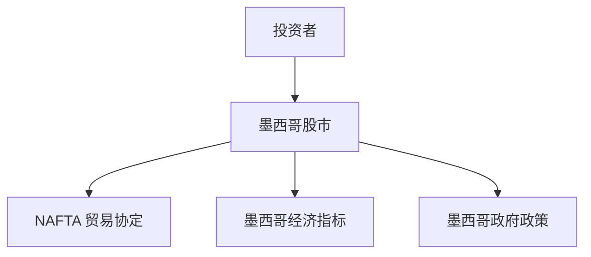
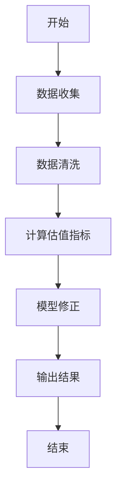
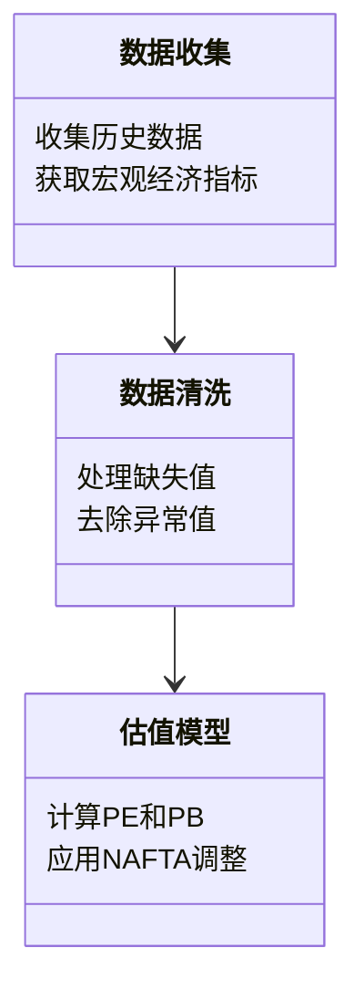

                 


# 墨西哥股市估值:北美自由贸易区的新兴市场

## 关键词：墨西哥股市, NAFTA, 股市估值, 北美自由贸易区, 新兴市场

## 摘要：本文系统分析了墨西哥股市在北美自由贸易区框架下的估值方法与影响因素，结合NAFTA的具体内容，探讨了墨西哥股市的行业分布、经济指标和政策变化对估值的影响，同时通过实际案例和系统设计，为投资者提供深度分析和实践指导。

---

# 第一部分: 墨西哥股市估值背景与 NAFTA 影响

## 第1章: 墨西哥股市概述

### 1.1 墨西哥股市的背景介绍

#### 1.1.1 墨西哥股市的起源与发展
墨西哥股市（BMV）是拉丁美洲重要的股票市场，成立于1982年，总部位于墨西哥城。它由墨西哥证券交易所（BMV）运营，是全球新兴市场的重要组成部分。

#### 1.1.2 墨西哥股市在 NAFTA 体系中的地位
NAFTA于1994年签署，促进了墨西哥与美国、加拿大之间的贸易和投资。墨西哥股市成为NAFTA框架下吸引外国投资的重要平台。

#### 1.1.3 墨西哥股市与北美经济的关联性
墨西哥股市的波动与NAFTA的政策变化密切相关，特别是汽车、制造业等行业受到直接影响。

### 1.2 NAFTA 对墨西哥股市的影响

#### 1.2.1 NAFTA 贸易协定的基本内容
NAFTA旨在消除贸易壁垒，促进商品、服务和资本的自由流动，加强三国的经济一体化。

#### 1.2.2 NAFTA 对墨西哥经济的影响
NAFTA促进了墨西哥出口的增长，吸引了大量外资，但同时也面临产业依赖和贸易不平衡的问题。

#### 1.2.3 NAFTA 对墨西哥股市的具体作用
NAFTA增加了墨西哥股市的外国投资者比例，提升了市场的流动性和估值水平，但同时也带来了波动性。

### 1.3 墨西哥股市的主要指数与行业分布

#### 1.3.1 墨西哥主要股市指数介绍
- IPC指数：墨西哥股市的主要指数，包含50家大中型企业。
- 指数波动性：反映了墨西哥经济的稳定性。

#### 1.3.2 墨西哥股市的主要行业分布
- 制造业：占比较大，尤其是汽车和电子产品。
- 金融服务业：银行、保险等行业的权重较高。
- 能源行业：石油相关企业对市场影响显著。

#### 1.3.3 墨西哥股市的历史表现与波动性
墨西哥股市在20世纪90年代经历了波动，但随着NAFTA的实施，整体呈现增长趋势。

---

## 第2章: 墨西哥股市估值的核心概念与联系

### 2.1 核心概念原理

#### 2.1.1 墨西哥股市估值的基本原理
- 使用市盈率（PE）、市净率（PB）等指标评估股票价值。
- 结合宏观经济指标如GDP增长率、通货膨胀率等进行调整。

#### 2.1.2 NAFTA 对墨西哥股市估值的影响机制
- NAFTA促进了贸易和投资自由化，影响企业的盈利能力和市场估值。

#### 2.1.3 墨西哥股市与国际资本流动的关系
- 国际资本流入增加推动股市上涨，反之则可能引发波动。

### 2.2 核心概念属性特征对比表格

| 指标         | 墨西哥股市 | 其他新兴市场 |
|--------------|------------|--------------|
| 市盈率（PE）  | 较高       | 较高         |
| 市净率（PB）  | 较低       | 中等         |
| 市值         | 中等       | 中等         |
| 波动性        | 较高       | 较高         |

### 2.3 ER 实体关系图



---

## 第3章: 墨西哥股市估值的算法原理

### 3.1 算法原理概述

#### 3.1.1 墨西哥股市估值的基本模型
- 使用历史数据计算PE和PB，结合宏观经济指标进行调整。

#### 3.1.2 基于 NAFTA 的修正模型
- 考虑NAFTA政策变化对估值的影响，调整PE系数。

#### 3.1.3 算法的输入与输出
- 输入：历史股价、盈利数据、宏观经济指标。
- 输出：调整后的估值指标。

### 3.2 算法流程图



### 3.3 算法实现代码

```python
def mex_stock_valuation(data):
    # 数据清洗
    cleaned_data = data.dropna()
    # 计算估值指标
    cleaned_data['PE'] = cleaned_data['Price'] / cleaned_data['Earnings']
    cleaned_data['PB'] = cleaned_data['Price'] / cleaned_data['Book']
    # 基于 NAFTA 的修正
    cleaned_data['NAFTA_Adjustment'] = cleaned_data['PE'] * 0.8
    return cleaned_data
```

---

## 第4章: 墨西哥股市估值的数学模型与公式

### 4.1 核心数学模型

#### 4.1.1 市盈率模型
$$ PE = \frac{Price}{Earnings} $$

#### 4.1.2 市净率模型
$$ PB = \frac{Price}{Book} $$

#### 4.1.3 调整后的市盈率
$$ PE_{adjusted} = PE \times 0.8 $$

---

## 第5章: 系统分析与架构设计方案

### 5.1 系统功能设计

#### 5.1.1 领域模型


#### 5.1.2 系统架构


---

## 第6章: 项目实战与案例分析

### 6.1 案例分析

#### 6.1.1 案例背景
分析NAFTA政策变化对汽车行业的估值影响。

#### 6.1.2 数据分析
使用历史数据计算PE和PB，观察变化趋势。

#### 6.1.3 结论
NAFTA的变化显著影响了汽车行业的估值，投资者需密切关注政策变化。

---

## 第7章: 总结与最佳实践

### 7.1 总结
墨西哥股市在NAFTA框架下具有重要地位，估值需综合考虑经济指标和政策变化。

### 7.2 最佳实践
- 定期更新估值模型，结合最新政策和经济数据。
- 注意行业特性和政策风险，合理分散投资。

### 7.3 小结
本文详细分析了墨西哥股市的估值方法和影响因素，为投资者提供了实用的指导。

---

## 第8章: 注意事项与拓展阅读

### 8.1 注意事项
- 数据的准确性和及时性至关重要。
- 需要关注宏观经济和政策变化。

### 8.2 拓展阅读
- 《NAFTA与墨西哥经济》
- 《新兴市场股市估值方法》

---

通过以上结构，文章将系统地介绍墨西哥股市估值的核心概念、算法原理、系统设计和实际案例，为投资者提供全面的分析和指导。

