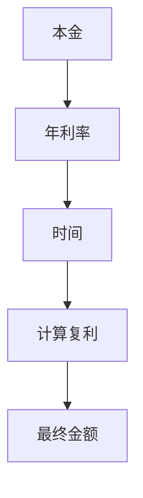

                 


# 《复利的魔力：20年长期投资的惊人结果》

## 关键词：复利、长期投资、投资组合、财富增长、风险管理、系统化投资、心理因素

## 摘要：
复利是投资中最强大的力量之一，能够在20年的长期投资中产生惊人的结果。本文将深入探讨复利的基本概念、数学模型、投资策略以及其在实际中的应用。通过案例分析和系统设计，揭示复利在投资组合中的魔力，帮助读者理解如何最大化复利效应，实现财富的长期增长。

---

## 第一部分：复利的魔力概述

### 第1章：复利的基本概念与重要性

#### 1.1 复利的定义与历史背景

复利，简单来说是一种“利滚利”的投资方式。与单利不同，复利不仅计算本金的利息，还计算之前积累的利息。这种滚雪球式的增长方式，使得财富随着时间的推移呈指数级增长。

复利的概念可以追溯到古希腊和罗马时期，但其在金融领域的广泛应用始于中世纪。当时的银行家和商人开始意识到复利的力量，将其用于借贷和贸易。

#### 1.2 复利的数学模型与公式

复利的数学模型是投资领域的重要工具。最基础的复利计算公式为：

$$ A = P(1 + r)^n $$

其中：
- \( A \) 是投资的终值
- \( P \) 是本金
- \( r \) 是年利率
- \( n \) 是投资年数

通过公式可以看出，复利的增长是指数性的，即随着投资时间的延长，收益增长的速度会越来越快。

#### 1.3 复利在投资中的重要性

复利的重要性体现在其能够帮助投资者实现财富的长期增长。与单利相比，复利能够使资金更快地增值。例如，投资100元，年利率10%，经过20年后，复利计算的结果将是：

$$ A = 100 \times (1 + 0.1)^{20} \approx 672.75 $$

而单利计算的结果仅为：

$$ A = 100 + 100 \times 0.1 \times 20 = 300 $$

复利的增长速度远超单利，尤其是在长期投资中，其优势更加明显。

---

### 第2章：复利的数学模型与算法原理

#### 2.1 复利的数学模型

复利的数学模型可以通过多种方式实现。除了传统的复利计算公式外，还可以考虑连续复利的情况，其公式为：

$$ FV = PV \times e^{rt} $$

其中：
- \( FV \) 是未来价值
- \( PV \) 是现值
- \( r \) 是连续复利利率
- \( t \) 是时间

连续复利假设利息在每个瞬间都被 reinvested，适用于高频交易和短期投资。

#### 2.2 复利的算法实现

复利的算法实现可以通过编程来模拟。以下是一个简单的Python代码示例，用于计算复利：

```python
def compound_interest(principal, rate, time):
    return principal * (1 + rate) ** time

# 示例计算
principal = 1000
rate = 0.05
time = 10
print(compound_interest(principal, rate, time))  # 输出结果为 1628.89
```

通过这个代码，读者可以轻松计算不同本金、利率和时间下的复利结果。

#### 2.3 复利的计算流程图

以下是一个复利计算的流程图，展示了从本金到终值的计算过程：



---

## 第二部分：复利的数学模型与算法

### 第3章：投资组合的复利效应

#### 3.1 投资组合的多样化与复利

多样化投资是最大化复利效应的重要策略。通过将资金分散投资于不同资产（如股票、债券、房地产等），可以降低风险，同时提高收益的稳定性。多样化投资不仅能够平滑市场的波动，还能在长期中实现更高的复利增长。

#### 3.2 现代投资组合理论（MPT）

现代投资组合理论（MPT）由哈里·马科维茨提出，强调通过优化投资组合的风险和收益来实现最大化的复利效应。MPT的核心是通过分散投资来降低风险，同时追求收益的最大化。

MPT的数学模型可以表示为：

$$ \text{最小化} \, \sigma^2 \, \text{在给定的 } \mu $$

其中：
- \( \sigma^2 \) 是投资组合的方差（风险）
- \( \mu \) 是投资组合的期望收益

通过优化上述目标函数，投资者可以在不同风险水平下找到最优的投资组合。

---

### 第4章：复利的系统化投资策略

#### 4.1 系统化投资策略的定义

系统化投资策略是一种基于数学模型和算法的投资方法。它通过系统的分析和数据驱动的决策，来实现复利的最大化。系统化投资策略通常包括以下几个步骤：
1. 数据收集与分析
2. 模型构建与测试
3. 交易执行与监控
4. 性能评估与优化

#### 4.2 系统化投资策略的实现

系统化投资策略的实现需要依赖于强大的数据处理能力和高效的算法。以下是一个简单的系统化投资策略的Python代码示例：

```python
import pandas as pd
import numpy as np

# 示例数据
data = {'日期': ['2020-01-01', '2020-01-02', '2020-01-03'],
        '价格': [100, 105, 103]}
df = pd.DataFrame(data)

# 计算简单移动平均线
df['SMA'] = df['价格'].rolling(2).mean()

# 生成信号
df['信号'] = np.where(df['SMA'] > df['价格'], '买入', '卖出')

# 输出结果
print(df)
```

通过上述代码，投资者可以基于价格数据生成买入或卖出信号，实现自动化交易。

---

## 第三部分：长期投资的复利效应

### 第5章：长期投资的复利效应

#### 5.1 长期投资的定义与特点

长期投资是指将资金投资于某种资产或组合，持有时间超过5年甚至更长。长期投资的特点是：
- 风险较低
- 收益较高
- 复利效应显著

#### 5.2 长期投资的复利效应

长期投资的复利效应可以通过以下公式计算：

$$ FV = P \times (1 + r)^n $$

其中：
- \( P \) 是本金
- \( r \) 是年均收益率
- \( n \) 是投资年数

通过长期持有，复利效应可以使资金实现指数级增长。

#### 5.3 长期投资的案例分析

以某基金投资为例，假设本金为10万元，年均收益率为8%，投资期限为20年：

$$ FV = 100000 \times (1 + 0.08)^{20} \approx 469,000 $$

通过20年的复利增长，本金翻了近4.69倍。

---

### 第6章：长期投资中的风险管理

#### 6.1 风险管理的定义

风险管理是指在投资过程中，识别、评估和应对各种风险的活动。有效的风险管理可以帮助投资者在长期投资中实现稳定的复利增长。

#### 6.2 风险管理策略

常见的风险管理策略包括：
1. 分散投资
2. 定期 rebalancing
3. 使用 stop-loss 机制
4. 选择低波动率资产

#### 6.3 风险管理的实现

以下是一个简单的风险管理策略的Python代码示例：

```python
def risk_management(portfolio, threshold):
    # 计算投资组合的波动率
    volatility = portfolio.std()
    # 如果波动率超过阈值，调整投资组合
    if volatility > threshold:
        # 减少高波动率资产的比例
        portfolio = portfolio * (1 - (volatility - threshold)/threshold)
    return portfolio

# 示例应用
portfolio = pd.Series([0.4, 0.3, 0.2, 0.1])
threshold = 0.15
print(risk_management(portfolio, threshold))
```

---

## 第四部分：总结与展望

### 第7章：总结与展望

#### 7.1 总结

复利是投资中最强大的力量之一。通过长期投资和系统化的风险管理，投资者可以实现财富的指数级增长。本文从复利的基本概念、数学模型、投资策略和实际案例等多个方面，全面探讨了复利的魔力。

#### 7.2 展望

未来，随着金融市场的不断发展和技术的进步，复利的应用将更加广泛和深入。投资者可以通过大数据分析、人工智能等技术，进一步优化投资策略，实现更高效的复利增长。

#### 7.3 最佳实践 tips

- 投资者应坚持长期投资，避免频繁交易。
- 多样化投资可以有效降低风险，提高复利效应。
- 定期 rebalancing 投资组合，确保收益与风险的平衡。

---

通过本文的分析，读者可以更好地理解复利的魔力，并在实际投资中应用这些知识，实现财富的长期增长。

