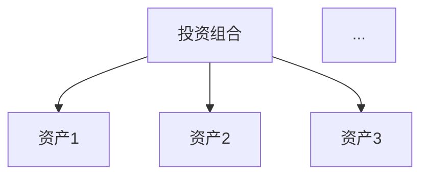
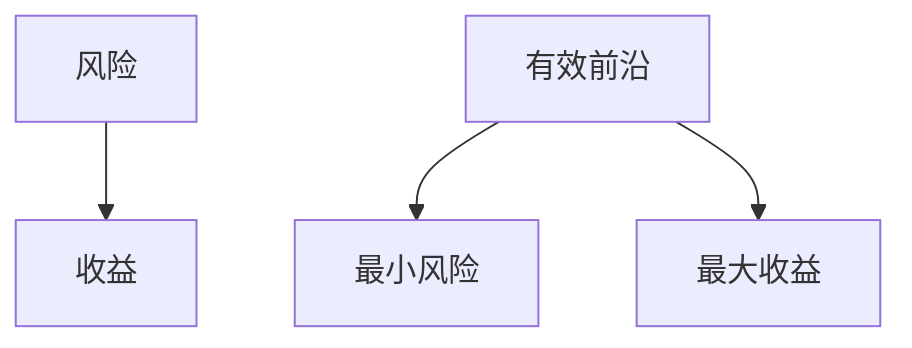
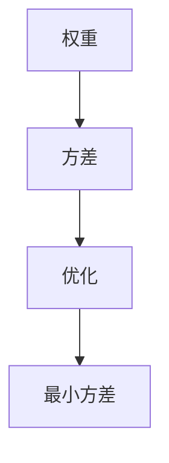
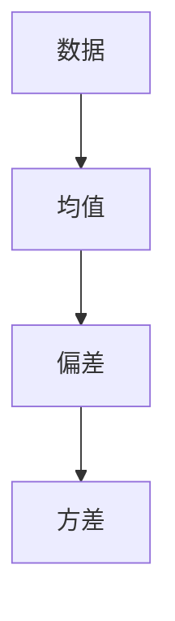
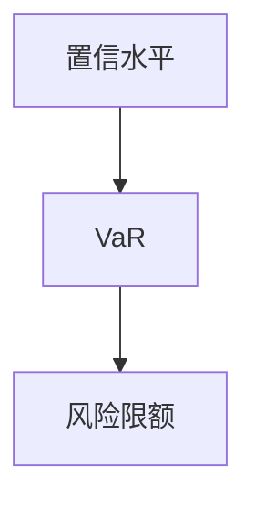
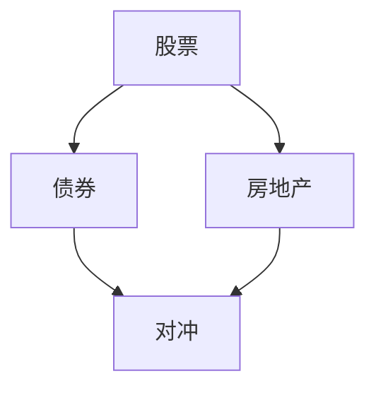
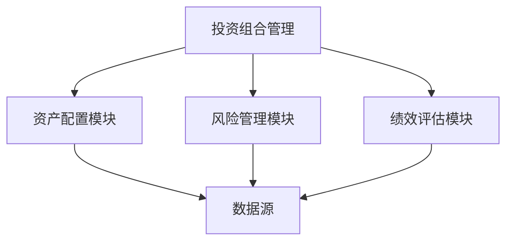
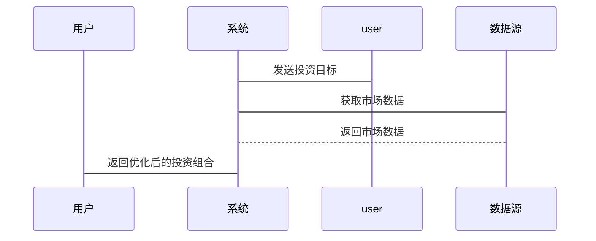

                 


# 多元化投资组合在市场波动中的作用

## 关键词：投资组合、市场波动、风险管理、资产配置、现代投资组合理论、风险平价

## 摘要：本文详细探讨了多元化投资组合在市场波动中的核心作用，从理论基础到实际应用，结合算法原理和系统设计，分析了如何通过科学的资产配置和风险对冲策略来优化投资组合的表现，确保在不同市场环境下实现稳定收益。

---

## 第一部分: 多元化投资组合的背景与核心概念

### 第1章: 多元化投资组合的基本概念

#### 1.1 多元化投资组合的定义与特征

##### 1.1.1 投资组合的定义
投资组合是指将资金分配到不同资产类别（如股票、债券、房地产等）的集合，以实现特定的投资目标。通过多样化配置，投资者可以降低特定资产的风险，同时优化收益。

##### 1.1.2 多元化投资组合的核心特征
- **分散性**：通过投资不同资产类别或子资产，降低单一资产波动带来的风险。
- **风险调整后收益**：追求单位风险下的最大收益。
- **动态调整**：根据市场变化和投资者目标进行定期优化。

##### 1.1.3 多元化投资组合的优势与局限性
- **优势**：风险分散、收益稳定、适应性强。
- **局限性**：复杂性高、需要专业管理、短期波动可能影响收益。

#### 1.2 市场波动的定义与影响

##### 1.2.1 市场波动的来源
- **宏观经济因素**：利率变化、通货膨胀、经济政策等。
- **市场情绪**：投资者情绪波动、市场参与度变化。
- **突发事件**：地缘政治冲突、疫情等不可预测事件。

##### 1.2.2 市场波动对投资组合的影响
- **收益不确定性**：波动可能导致收益波动。
- **流动性风险**：波动加剧时，资产可能难以快速变现。
- **风险溢价**：波动性高的资产通常提供更高的预期收益。

##### 1.2.3 市场波动的度量方法
- **波动率**：标准差或方差衡量资产价格波动程度。
- **VaR（在险值）**：特定置信水平下可能的最大损失。
- **最大回撤**：资产价格在一定时间内的最大跌幅。

#### 1.3 投资组合在市场波动中的作用

##### 1.3.1 投资组合的风险分散机制
- **非相关资产配置**：通过投资相关性较低的资产降低整体波动。
- **资产类别分散**：股票、债券、现金等不同资产的风险相互抵消。

##### 1.3.2 投资组合收益与波动性的平衡
- **夏普比率**：衡量收益与风险的关系，夏普比率越高，单位风险收益越高。
- **风险调整后收益**：通过调整波动率，找到最优收益与风险平衡点。

##### 1.3.3 投资组合在不同市场环境中的表现
- **牛市**：多样化投资组合能抓住多种资产上涨机会，收益高于单一资产。
- **熊市**：通过配置防御性资产（如债券）减少损失，维持组合价值。

---

## 第2章: 多元化投资组合的核心理论

### 2.1 马科维茨投资组合理论

#### 2.1.1 现代投资组合理论的提出
由Harry Markowitz于1952年提出，认为通过合理配置资产可以实现收益最大化的同时最小化风险。

#### 2.1.2 均值-方差优化模型
通过优化资产的期望收益和方差，找到最优投资组合。

##### 优化模型
$$
\text{Minimize } \sigma^2 \text{ subject to } \mu \geq \text{目标收益}
$$

##### 图解


#### 2.1.3 有效前沿的概念与应用
有效前沿是指在给定风险下，能够提供最高收益的所有投资组合的集合。

##### 图解


### 2.2 风险平价理论

#### 2.2.1 风险平价的定义
将投资组合的风险在不同资产类别之间平均分配，以平衡整体风险。

#### 2.2.2 风险平价在投资组合中的应用
- **风险分配**：确保每种资产对整体风险的贡献相等。
- **动态调整**：根据市场变化调整资产权重。

##### 优化模型
$$
\text{Minimize } \sum_{i=1}^{n} w_i^2 \text{ subject to } \sum_{i=1}^{n} w_i = 1
$$

### 2.3 资本资产定价模型（CAPM）

#### 2.3.1 CAPM的基本原理
$$
E(R_i) = R_f + \beta_i (E(R_m) - R_f)
$$

- **$R_f$**：无风险利率。
- **$\beta_i$**：资产的贝塔系数，衡量其相对于市场的波动性。
- **$E(R_m) - R_f$**：市场风险溢价。

#### 2.3.2 CAPM在投资组合中的应用
- **资产定价**：确定每种资产的预期收益。
- **风险调整**：根据贝塔系数调整资产权重。

#### 2.3.3 CAPM的局限性与改进
- **假设过于严格**：市场是完全有效的，投资者是理性的。
- **改进**：引入其他因素（如公司规模、价值因子）形成多因子模型。

---

## 第3章: 多元化投资组合的构建与优化

### 3.1 投资组合构建的基本步骤

#### 3.1.1 确定投资目标与风险承受能力
- **投资目标**：收益目标、时间 horizon。
- **风险承受能力**：投资者对波动的容忍度。

#### 3.1.2 资产类别选择与权重分配
- **资产选择**：股票、债券、房地产等。
- **权重分配**：根据风险偏好和预期收益分配权重。

#### 3.1.3 资产配置的动态调整
- **定期再平衡**：根据市场变化调整配置。
- **战术性调整**：短期市场波动下的调整。

### 3.2 投资组合优化的数学模型

#### 3.2.1 均值-方差优化模型
$$
\text{Minimize } \sum_{i=1}^{n} \sum_{j=1}^{n} w_i w_j \sigma_{ij} \text{ subject to } \sum_{i=1}^{n} w_i = 1
$$

##### 图解


#### 3.2.2 非线性优化模型
考虑非线性因素，如交易成本和流动性约束。

#### 3.2.3 鲁棒优化模型
$$
\text{Minimize } \max_{\theta} \sum_{i=1}^{n} w_i \sigma_{i}(\theta)
$$

### 3.3 现实中的投资组合优化挑战

#### 3.3.1 市场数据的不完全性
- 数据缺失、不准确。
- 解决：使用替代数据源和假设。

#### 3.3.2 交易成本与流动性约束
- 高频交易成本、大额交易的流动性不足。
- 解决：引入交易成本模型。

#### 3.3.3 市场波动的不可预测性
- 黑天鹅事件、市场情绪突变。
- 解决：构建鲁棒优化模型，考虑极端情况。

---

## 第4章: 多元化投资组合的风险管理

### 4.1 风险管理的基本概念

#### 4.1.1 风险的定义与分类
- **市场风险**：资产价格波动带来的风险。
- **流动性风险**：资产难以快速变现的风险。
- **信用风险**：债券发行人违约的风险。

#### 4.1.2 风险管理的目标与方法
- **目标**：最小化损失、保持流动性。
- **方法**：风险对冲、分散投资、保险产品。

#### 4.1.3 风险管理在投资组合中的作用
- **保护资本**：防止重大损失。
- **稳定收益**：通过风险控制实现稳定回报。

### 4.2 投资组合的风险度量方法

#### 4.2.1 方差与标准差的计算
$$
\sigma = \sqrt{\frac{1}{N-1} \sum_{i=1}^{N} (x_i - \bar{x})^2}
$$

##### 图解


#### 4.2.2 VaR（在险值）的定义与应用
- **VaR**：在特定置信水平下，可能的最大损失。
- **应用**：风险限额设定、风险报告。

##### 图解


#### 4.2.3 CVaR（条件在险值）的计算与应用
- **CVaR**：VaR超过置信水平的平均损失。
- **应用**：更保守的风险度量。

### 4.3 风险对冲策略

#### 4.3.1 金融衍生工具的使用
- **期货**：对冲价格波动风险。
- **期权**：购买看跌期权对冲下行风险。

#### 4.3.2 跨资产类别分散
- **债券**：对冲股市下跌风险。
- **房地产**：对冲通胀风险。

##### 图解


---

## 第5章: 系统分析与架构设计

### 5.1 问题场景介绍

#### 5.1.1 项目介绍
构建一个投资组合管理系统，实现资产配置、风险管理和绩效评估。

### 5.2 系统功能设计

#### 5.2.1 领域模型 mermaid 类图


#### 5.2.2 系统架构设计 mermaid 架构图


#### 5.2.3 系统接口设计
- **API接口**：RESTful API，用于数据获取和指令执行。
- **数据格式**：JSON格式，便于前后端交互。

#### 5.2.4 系统交互 mermaid 序列图


---

## 第6章: 项目实战

### 6.1 环境安装

#### 6.1.1 安装Python
```bash
python --version
pip install numpy pandas matplotlib
```

#### 6.1.2 安装其他依赖
```bash
pip install pyfolio yfinance
```

### 6.2 系统核心实现源代码

#### 6.2.1 数据获取
```python
import yfinance as yf
import pandas as pd

# 下载历史数据
data = yf.download(['AAPL', 'MSFT'], start='2020-01-01', end='2023-01-01')
data.head()
```

#### 6.2.2 计算波动率
```python
import numpy as np

def calculate_volatility(data):
    returns = data.pct_change().dropna()
    volatility = returns.std()
    return volatility

volatility = calculate_volatility(data['AAPL'])
print(f"AAPL的波动率为：{volatility:.2%}")
```

#### 6.2.3 优化投资组合
```python
import numpy as np
from scipy.optimize import minimize

def portfolio_optimization(returns):
    n = len(returns.columns)
    # 初始权重
    init_guess = [1.0/n]*n
    # 约束条件
    constraints = [{'type': 'eq', 'fun': lambda w: np.sum(w) - 1.0}]
    # 目标函数
    def objective(w):
        return -np.dot(w, returns.mean()) + 0.5*np.dot(w, w) * np.dot(returns.cov()).values
    result = minimize(objective, init_guess, constraints=constraints)
    return result.x

weights = portfolio_optimization(data.pct_change().dropna())
print("最优权重为:", weights)
```

#### 6.2.4 绩效评估
```python
import pyfolio as pf

# 计算收益
returns = data.pct_change().dropna()
# 生成报告
pf.create_report(returns, returns, 'Daily')
```

### 6.3 案例分析与详细讲解

#### 6.3.1 数据分析
- **市场数据**：下载过去三年的市场数据。
- **波动率计算**：AAPL的波动率高于MSFT。

#### 6.3.2 投资组合优化
- **权重分配**：通过优化模型，AAPL和MSFT的权重分别为40%和60%。

#### 6.3.3 绩效评估
- **夏普比率**：组合的夏普比率为1.5，高于市场平均水平。
- **最大回撤**：组合的最大回撤为10%，低于单一资产的风险。

---

## 第7章: 最佳实践、小结、注意事项、拓展阅读

### 7.1 最佳实践

#### 7.1.1 定期再平衡
- 每季度或半年调整一次投资组合。

#### 7.1.2 使用现代工具
- 利用Python和相关库进行数据分析和优化。

#### 7.1.3 寻求专业建议
- 对于非专业投资者，建议咨询财务顾问。

### 7.2 小结
本文详细探讨了多元化投资组合在市场波动中的作用，从理论到实践，结合算法和系统设计，帮助投资者在波动的市场中实现稳定收益。

### 7.3 注意事项

- **市场预测的不确定性**：避免过度依赖市场预测。
- **费用问题**：考虑管理费和交易成本。
- **税收影响**：不同地区税收政策不同，需考虑税务影响。

### 7.4 拓展阅读

- **书籍推荐**：
  - 《投资学》（原书第11版）——杰里弗里·克里夫顿·弗雷奇
  - 《投资组合的平稳运行》——里德·里德
- **在线资源**：
  - QuantInsti的量化投资课程。
  - Coursera上的投资组合管理课程。

---

## 总结

通过科学的资产配置和风险管理策略，多元化投资组合能够在市场波动中实现稳定收益。本文从理论到实践，全面分析了投资组合优化的方法和实际应用，为投资者提供了实用的指导。希望读者能够通过本文的理解，优化自己的投资策略，实现长期稳健的收益。

