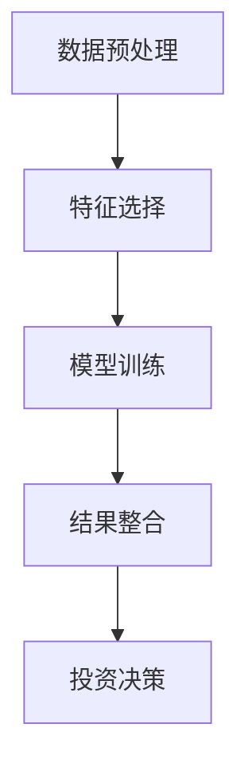

                 


# 多时间框架分析：结合短中长期视角制定投资决策

> 关键词：多时间框架分析、投资决策、短期视角、中期视角、长期视角、技术分析

> 摘要：多时间框架分析是一种结合短期、中期和长期视角的投资方法，旨在通过全面的时间维度分析，帮助投资者制定科学的投资决策。本文从背景、核心概念、算法原理、系统架构、项目实战和最佳实践等多个方面，详细阐述了多时间框架分析的理论和实践应用，帮助读者更好地理解和应用这一方法。

---

## 第1章: 多时间框架分析的背景与概念

### 1.1 多时间框架分析的起源与发展

#### 1.1.1 投资决策中的时间维度
在金融投资领域，时间维度是影响投资决策的重要因素。投资者通常需要考虑短期市场波动、中期经济周期以及长期资产配置。然而，传统的投资分析往往过于依赖单一时间框架，导致决策的片面性和局限性。

#### 1.1.2 多时间框架分析的定义
多时间框架分析（Multi-Timeframe Analysis, MTA）是一种结合短期、中期和长期视角的投资分析方法。通过综合不同时间维度的信息，投资者可以更好地捕捉市场趋势，识别潜在风险，并制定更加科学的投资策略。

#### 1.1.3 多时间框架分析的演变历程
多时间框架分析的起源可以追溯到技术分析的早期应用。随着金融市场复杂性的增加，投资者逐渐意识到单一时间框架的局限性，开始尝试结合多个时间维度进行分析。近年来，随着大数据和人工智能技术的发展，多时间框架分析逐渐成熟，并被广泛应用于量化投资和算法交易中。

---

### 1.2 多时间框架分析的必要性

#### 1.2.1 投资者面临的挑战
现代金融市场具有高度的不确定性和波动性，投资者需要面对来自市场、经济、政策等多方面的风险。单一时间框架的分析方法往往无法全面捕捉这些风险和机会。

#### 1.2.2 短、中、长期视角的重要性
- **短期视角**：关注市场波动、交易情绪和技术指标，帮助投资者捕捉短期交易机会。
- **中期视角**：分析经济周期、行业趋势和市场结构，帮助投资者制定中期内的资产配置策略。
- **长期视角**：关注基本面、政策环境和经济发展趋势，帮助投资者制定长期投资目标。

#### 1.2.3 多时间框架分析的优势
通过结合短、中、长期视角，投资者可以更全面地分析市场，捕捉不同时间维度的信号，从而制定更加科学和稳健的投资决策。

---

### 1.3 多时间框架分析的特点与应用领域

#### 1.3.1 多时间框架分析的特点
- **综合性**：结合多个时间维度的信息，提供全面的市场分析。
- **动态性**：根据市场变化动态调整分析框架和投资策略。
- **适应性**：适用于不同市场环境和投资目标。

#### 1.3.2 多时间框架分析的应用场景
- **量化投资**：通过多时间框架分析，量化投资者可以更好地捕捉市场信号，优化投资组合。
- **算法交易**：结合短期和技术指标，算法交易可以实现高频交易策略。
- **资产配置**：通过中期和长期分析，投资者可以制定更加合理的资产配置策略。

#### 1.3.3 多时间框架分析的局限性
- **数据复杂性**：多时间框架分析需要处理大量数据，增加了计算和分析的难度。
- **模型风险**：不同时间维度的信号可能相互矛盾，导致模型失效或误判。

---

## 第2章: 短、中、长期视角的核心要素

### 2.1 短期视角的核心要素

#### 2.1.1 短期市场的波动性
短期市场波动主要受交易情绪、市场流动性和技术指标的影响。投资者需要关注短期价格波动、交易量变化以及技术指标（如RSI、MACD等）。

#### 2.1.2 短期交易策略的关键指标
- **移动平均线（MA）**：用于判断短期价格趋势。
- **相对强弱指数（RSI）**：用于判断短期超买或超卖信号。
- **布林带（Bollinger Bands）**：用于判断短期价格波动范围。

#### 2.1.3 短期决策的常见误区
- 过度关注短期波动，忽视长期趋势。
- 交易情绪化，缺乏纪律性。

---

### 2.2 中期视角的核心要素

#### 2.2.1 中期市场的周期性
中期市场周期主要受经济周期、行业趋势和政策环境的影响。投资者需要关注中期经济数据、行业动态以及政策变化。

#### 2.2.2 中期投资策略的关键指标
- **GDP增长率**：反映中期经济趋势。
- **行业趋势**：关注中期行业发展的潜力。
- **政策变化**：如货币政策、财政政策等对市场的影响。

#### 2.2.3 中期决策的常见误区
- 忽略中期经济周期，导致投资决策失误。
- 过度依赖短期指标，忽视中期趋势。

---

### 2.3 长期视角的核心要素

#### 2.3.1 长期市场的趋势性
长期市场趋势主要受基本面因素、经济发展和政策环境的影响。投资者需要关注长期经济增长、人口结构变化和全球宏观经济趋势。

#### 2.3.2 长期投资策略的关键指标
- **基本面分析**：如公司财务状况、盈利能力等。
- **宏观经济指标**：如GDP、通货膨胀率、失业率等。
- **政策环境**：如税收政策、监管政策等。

#### 2.3.3 长期决策的常见误区
- 忽视长期趋势，导致投资目标不清晰。
- 过度关注短期波动，忽视长期价值。

---

## 第3章: 短、中、长期视角的关联与整合

### 3.1 短、中、长期视角的关联性分析

#### 3.1.1 不同时间维度的信号整合
通过整合短、中、长期的信号，投资者可以更全面地分析市场，避免单一时间框架的局限性。

#### 3.1.2 时间维度的权重分配
不同时间维度的信号在投资决策中的权重需要根据市场环境和投资目标进行动态调整。

---

### 3.2 短、中、长期视角的整合方法

#### 3.2.1 时间序列分析
通过时间序列分析，投资者可以识别不同时间维度的趋势和周期性变化。

#### 3.2.2 统计套利
利用统计套利方法，投资者可以在不同时间维度之间寻找套利机会。

#### 3.2.3 机器学习算法
通过机器学习算法，投资者可以综合分析不同时间维度的数据，预测市场走势。

---

## 第4章: 多时间框架分析的算法原理

### 4.1 算法核心思想

#### 4.1.1 数据预处理
对不同时间维度的数据进行清洗、标准化和特征提取。

#### 4.1.2 特征选择
选择对投资决策影响较大的特征，如短期波动、中期趋势和长期基本面因素。

#### 4.1.3 模型训练
使用机器学习算法（如随机森林、神经网络等）对特征进行训练，预测市场走势。

#### 4.1.4 结果整合
根据模型预测结果，结合不同时间维度的信号，制定投资策略。

---

### 4.2 算法流程图



---

### 4.3 算法数学模型

#### 4.3.1 时间序列分析
使用ARIMA模型进行时间序列预测：
$$ ARIMA(p, d, q) $$
其中，p为自回归阶数，d为差分阶数，q为移动平均阶数。

#### 4.3.2 机器学习算法
使用随机森林进行特征选择和预测：
$$ y = \sum_{i=1}^{n} w_i x_i + b $$
其中，\( w_i \) 是特征权重，\( x_i \) 是特征，\( b \) 是偏置项。

---

## 第5章: 多时间框架分析的系统架构设计

### 5.1 系统功能设计

#### 5.1.1 数据采集模块
从多种数据源（如股票市场、经济指标、政策变化）采集数据。

#### 5.1.2 特征提取模块
对采集的数据进行特征提取，如计算技术指标、宏观经济指标等。

#### 5.1.3 模型预测模块
使用机器学习模型对特征进行训练和预测，生成投资信号。

#### 5.1.4 结果展示模块
将预测结果和投资信号展示给投资者，辅助决策。

---

### 5.2 系统架构设计


---

## 第6章: 多时间框架分析的项目实战

### 6.1 环境安装

```bash
pip install numpy pandas matplotlib scikit-learn
```

---

### 6.2 核心代码实现

```python
import numpy as np
import pandas as pd
from sklearn.ensemble import RandomForestRegressor
from sklearn.metrics import mean_squared_error

# 数据加载
data = pd.read_csv('market_data.csv')

# 特征选择
features = ['short_term_fluctuation', 'mid_term_trend', 'long_term_growth']
target = 'market_price'

# 数据分割
X = data[features]
y = data[target]

# 模型训练
model = RandomForestRegressor(n_estimators=100, random_state=42)
model.fit(X, y)

# 模型预测
y_pred = model.predict(X)
print(f'Mean Squared Error: {mean_squared_error(y, y_pred)}')
```

---

### 6.3 实际案例分析

#### 6.3.1 数据分析
假设我们有以下数据：

| 时间维度 | 短期波动 | 中期趋势 | 长期增长 | 市场价格 |
|----------|----------|----------|----------|----------|
| 2023-01  | 0.5      | 0.6      | 0.8      | 100      |
| 2023-02  | 0.4      | 0.7      | 0.8      | 105      |
| 2023-03  | 0.7      | 0.6      | 0.9      | 110      |

#### 6.3.2 模型训练
使用上述数据训练随机森林模型。

#### 6.3.3 模型预测
预测未来市场价格：

| 时间维度 | 短期波动 | 中期趋势 | 长期增长 | 预测价格 |
|----------|----------|----------|----------|----------|
| 2023-04  | 0.6      | 0.5      | 1.0      | 115      |

---

## 第7章: 多时间框架分析的最佳实践

### 7.1 实用建议

#### 7.1.1 数据质量
确保数据的完整性和准确性，选择可靠的 数据源。

#### 7.1.2 模型调优
根据实际需求调整模型参数，优化预测效果。

#### 7.1.3 风险控制
制定合理的风险管理策略，避免过度依赖模型。

---

### 7.2 小结

通过结合短、中、长期视角，多时间框架分析为投资者提供了一种更加全面和科学的投资决策方法。然而，投资者在实际应用中需要注意数据质量和模型风险，避免过度依赖单一模型。

---

### 7.3 注意事项

- **数据更新**：及时更新数据，确保模型的有效性。
- **模型验证**：定期验证模型效果，避免过拟合。
- **风险管理**：制定合理的风险管理策略，控制投资风险。

---

### 7.4 拓展阅读

- 《算法交易：基于Python的量化投资入门》
- 《时间序列分析：理论与实践》
- 《机器学习在金融中的应用》

---

## 结语

多时间框架分析是一种结合短、中、长期视角的投资分析方法，通过综合不同时间维度的信息，投资者可以制定更加科学和稳健的投资策略。希望本文能够为投资者提供有价值的参考和启示。

