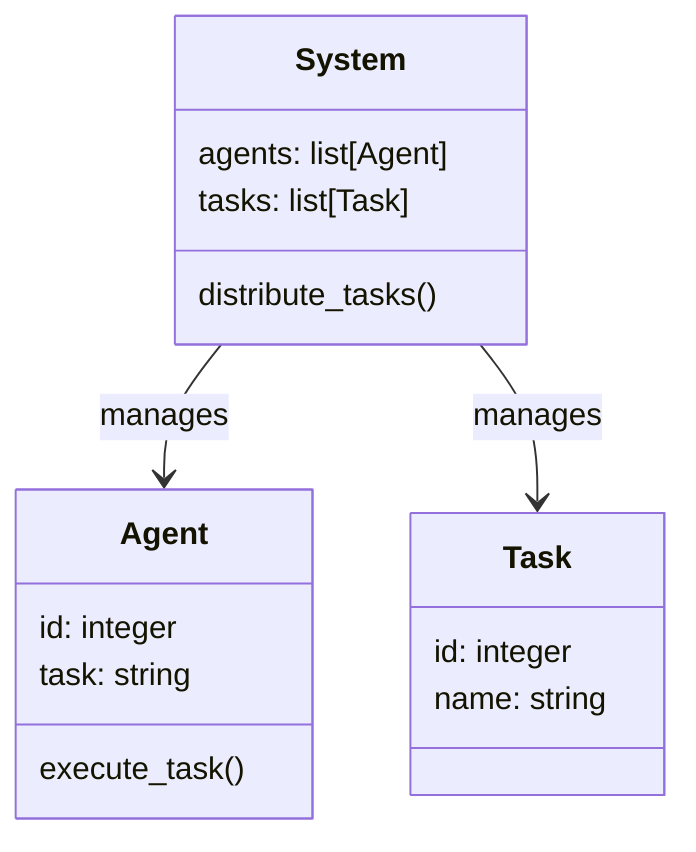
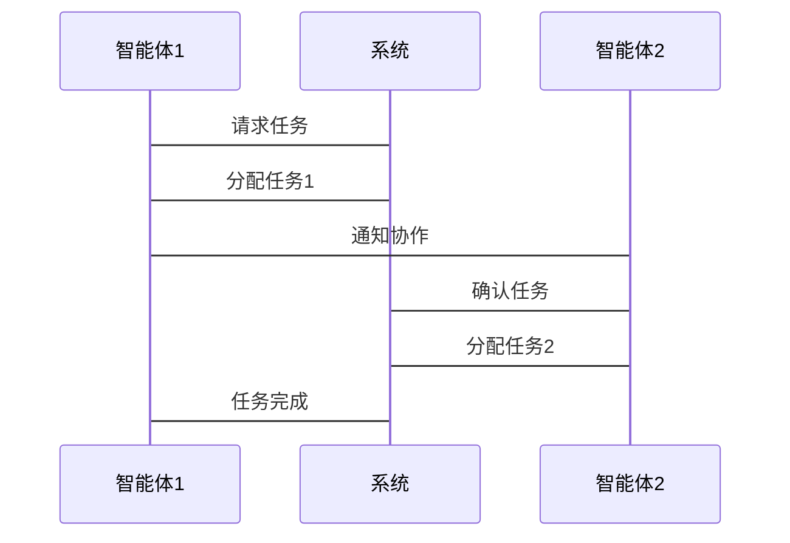

                 


# 多智能体AI如何优化公司核心竞争力分析

> 关键词：多智能体AI, 企业核心竞争力, 智能化转型, 协作优化, 技术架构

> 摘要：多智能体AI是一种通过多个智能体协作完成复杂任务的技术，能够显著优化企业的核心竞争力。本文将从背景介绍、核心概念、算法原理、系统架构、项目实战和最佳实践等方面，深入分析多智能体AI如何在企业中实现协作优化，提升效率和竞争力。

---

# 第一部分: 多智能体AI与企业核心竞争力概述

# 第1章: 多智能体AI的基本概念与背景

## 1.1 多智能体AI的定义与特点

### 1.1.1 多智能体系统的定义

多智能体系统（Multi-Agent System, MAS）是由多个智能体（Agent）组成的分布式系统，每个智能体都是一个能够感知环境、自主决策并执行任务的实体。这些智能体可以是软件程序、机器人或其他智能设备，它们通过协作完成复杂的任务。

**特点：**
- **分布式性**：智能体独立运行，不依赖中心化控制。
- **自主性**：每个智能体都能自主决策。
- **协作性**：智能体之间通过通信和协作完成共同目标。
- **反应性**：能够实时感知环境变化并做出反应。

### 1.1.2 多智能体AI的核心特点

多智能体AI的核心在于智能体之间的协作与优化。与传统AI相比，多智能体AI更注重多个智能体的协同工作，能够处理动态复杂的环境。

### 1.1.3 多智能体AI与传统AI的区别

| **方面**       | **传统AI**                     | **多智能体AI**                |
|----------------|--------------------------------|-----------------------------|
| 结构           | 单一或集中化                  | 分布式，多个智能体协作        |
| 决策方式       | 中央决策或单点控制            | 分布式决策，去中心化          |
| 任务处理       | 单一任务或简单问题            | 多任务协作，复杂问题解决      |
| 智能体数量     | 通常为单个或少数几个          | 多个智能体协同工作            |

### 1.1.4 多智能体AI的优势

- **任务分解**：将复杂任务分解为多个子任务，由不同智能体完成。
- **容错性**：单个智能体故障不影响整体任务完成。
- **灵活性**：智能体可以根据环境变化动态调整策略。

## 1.2 多智能体AI的应用背景

### 1.2.1 企业核心竞争力的定义

企业核心竞争力是指企业在市场中胜过竞争对手的关键能力，通常体现在技术创新、效率提升、成本控制等方面。

### 1.2.2 多智能体AI在企业中的应用场景

- **智能制造**：优化生产流程，提高效率。
- **供应链管理**：智能体协同完成库存管理和物流调度。
- **客户服务**：多智能体协作提供个性化的客户支持。
- **金融领域**：智能体协同进行风险评估和投资决策。

### 1.2.3 多智能体AI对企业核心竞争力的潜在影响

通过多智能体AI，企业可以实现更高效的资源利用、更快的决策速度和更灵活的应变能力，从而显著提升核心竞争力。

## 1.3 本章小结

本章介绍了多智能体AI的基本概念、特点及与传统AI的区别，并分析了其在企业中的应用场景及对核心竞争力的潜在影响。

---

# 第二部分: 多智能体AI的核心概念与系统架构

# 第2章: 多智能体系统的核心原理

## 2.1 多智能体系统的组成与结构

### 2.1.1 智能体的基本组成

智能体由以下部分组成：
- **感知器**：感知环境信息。
- **推理器**：处理信息，做出决策。
- **执行器**：执行决策动作。
- **知识库**：存储智能体的知识和经验。

### 2.1.2 多智能体系统的层次结构

多智能体系统的层次结构包括：
- **智能体层**：具体执行任务的智能体。
- **协作层**：协调智能体之间的协作。
- **环境层**：智能体所处的外部环境。

### 2.1.3 智能体之间的通信机制

智能体之间的通信机制包括：
- **直接通信**：智能体之间直接交换信息。
- **间接通信**：通过共享数据库或中间件进行信息交换。

## 2.2 多智能体系统的协作机制

### 2.2.1 分布式计算与任务分配

分布式计算通过任务分解和并行处理提高效率。任务分配算法包括：
- **负载均衡算法**：确保任务在智能体之间均衡分配。
- **贪心算法**：根据当前情况选择最优任务分配方式。

### 2.2.2 共识机制与决策过程

共识机制确保多个智能体达成一致。常用共识机制包括：
- **拜占庭共识**：在不可信网络中达成一致。
- **Raft共识**：用于分布式系统中的领导选举。

### 2.2.3 智能体间的冲突解决

冲突解决方法包括：
- **协商机制**：智能体通过协商解决冲突。
- **仲裁机制**：由仲裁者介入解决冲突。

## 2.3 多智能体系统的知识共享机制

### 2.3.1 知识表示与推理

知识表示可以采用：
- **谓词逻辑**：通过谓词和逻辑规则表示知识。
- **描述逻辑**：通过概念和属性描述知识。

### 2.3.2 知识共享的实现方式

知识共享可以通过：
- **共享数据库**：所有智能体共享同一数据库。
- **消息传递**：通过消息传递共享知识。

### 2.3.3 知识更新与维护

知识更新包括：
- **增量更新**：仅更新变化的部分。
- **全量更新**：重新构建整个知识库。

## 2.4 本章小结

本章详细介绍了多智能体系统的核心原理，包括组成结构、协作机制和知识共享机制，为后续章节的分析奠定了基础。

---

# 第三部分: 多智能体AI的算法原理与数学模型

# 第3章: 多智能体AI的算法原理与数学模型

## 3.1 多智能体协同算法概述

### 3.1.1 分布式算法的基本概念

分布式算法是指在分布式系统中运行的算法，通过协调各节点的行为完成任务。

### 3.1.2 多智能体协同算法的分类

多智能体协同算法包括：
- **任务分配算法**：将任务分配给最适合的智能体。
- **协作规划算法**：制定智能体之间的协作计划。
- **分布式决策算法**：在分布式环境中做出决策。

### 3.1.3 多智能体协同算法的核心思想

核心思想是通过智能体之间的协作与信息共享，实现全局最优或局部最优。

## 3.2 多智能体协作算法的数学模型

### 3.2.1 任务分配的数学模型

任务分配问题可以表示为：
$$
\text{minimize } \sum_{i=1}^{n} c_i x_i \\
\text{subject to } \sum_{i=1}^{n} x_i = 1
$$
其中，\( c_i \) 是任务 \( i \) 的成本，\( x_i \) 是任务 \( i \) 是否分配给某智能体的变量。

### 3.2.2 分布式决策的数学模型

分布式决策问题可以表示为：
$$
\text{maximize } \sum_{i=1}^{m} v_i y_i \\
\text{subject to } \sum_{i=1}^{m} y_i \leq 1
$$
其中，\( v_i \) 是决策 \( i \) 的价值，\( y_i \) 是决策 \( i \) 是否被采用的变量。

## 3.3 多智能体协作算法的实现

### 3.3.1 算法实现步骤

1. **初始化**：设定初始参数和智能体。
2. **任务分配**：根据算法分配任务。
3. **协作规划**：制定协作计划。
4. **执行任务**：智能体执行分配的任务。
5. **反馈与优化**：根据反馈优化算法。

### 3.3.2 代码示例

```python
class Agent:
    def __init__(self, id):
        self.id = id
        self.task = None

    def assign_task(self, task):
        self.task = task

    def execute_task(self):
        print(f"Agent {self.id} executing task {self.task}")

def distribute_tasks(agents, tasks):
    import random
    for task in tasks:
        agent = random.choice(agents)
        agent.assign_task(task)

agents = [Agent(i) for i in range(4)]
tasks = ["task1", "task2", "task3", "task4"]
distribute_tasks(agents, tasks)
for agent in agents:
    agent.execute_task()
```

## 3.4 本章小结

本章通过数学模型和代码示例，详细讲解了多智能体协作算法的核心思想和实现方法。

---

# 第四部分: 多智能体AI的系统分析与架构设计

# 第4章: 系统分析与架构设计方案

## 4.1 问题场景介绍

我们以智能制造为例，分析多智能体AI的应用场景。

## 4.2 项目介绍

本项目旨在通过多智能体AI优化生产流程。

## 4.3 系统功能设计

### 4.3.1 领域模型设计



### 4.3.2 系统架构设计


### 4.3.3 系统接口设计

系统接口包括：
- **任务分配接口**：分配任务给智能体。
- **通信接口**：智能体之间的通信。

### 4.3.4 系统交互设计



## 4.4 本章小结

本章通过系统分析和架构设计，展示了多智能体AI在智能制造中的具体应用。

---

# 第五部分: 多智能体AI的项目实战

# 第5章: 项目实战

## 5.1 环境安装

安装必要的库：
```bash
pip install numpy matplotlib
```

## 5.2 系统核心实现

### 5.2.1 代码实现

```python
import numpy as np

class Agent:
    def __init__(self, id):
        self.id = id
        self.position = np.random.rand(2)

    def move(self, target):
        dx = target[0] - self.position[0]
        dy = target[1] - self.position[1]
        self.position = self.position + np.array([dx, dy]) * 0.1

agents = [Agent(i) for i in range(4)]
target_positions = np.random.rand(2, 4)
for i, pos in enumerate(target_positions.T):
    agents[i].move(pos)
for agent in agents:
    print(f"Agent {agent.id} at {agent.position}")
```

### 5.2.2 代码应用解读

上述代码实现了多个智能体在二维空间中移动到目标位置的协作。

## 5.3 实际案例分析

以智能制造为例，分析多智能体AI在优化生产流程中的应用。

## 5.4 本章小结

本章通过项目实战，展示了多智能体AI的具体实现和应用效果。

---

# 第六部分: 多智能体AI的最佳实践与小结

# 第6章: 最佳实践与小结

## 6.1 最佳实践

### 6.1.1 系统设计建议

- **模块化设计**：便于维护和扩展。
- **容错设计**：确保单个故障不影响整体运行。

### 6.1.2 知识共享策略

- **动态更新**：及时更新知识库。
- **权限管理**：确保知识共享的安全性。

## 6.2 小结

多智能体AI通过协作优化，显著提升了企业的核心竞争力。在实际应用中，需要注重系统设计和知识管理，确保系统的高效运行。

## 6.3 注意事项

- **安全性**：防止智能体之间的通信被恶意攻击。
- **可扩展性**：系统应支持智能体数量的动态变化。

## 6.4 拓展阅读

推荐阅读相关书籍和论文，深入了解多智能体系统的最新研究和应用。

---

# 结语

多智能体AI通过协作优化，为企业提供了显著的竞争优势。未来，随着技术的不断发展，多智能体AI将在更多领域发挥重要作用。

