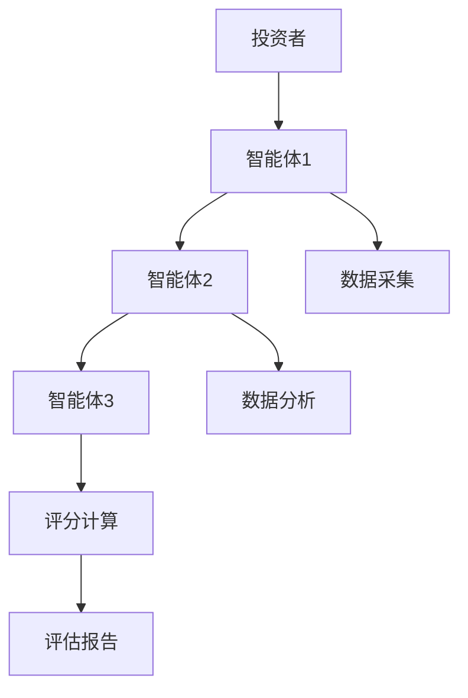
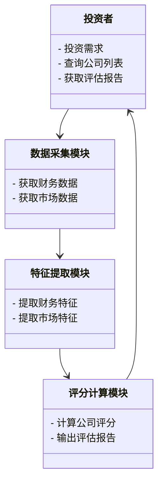
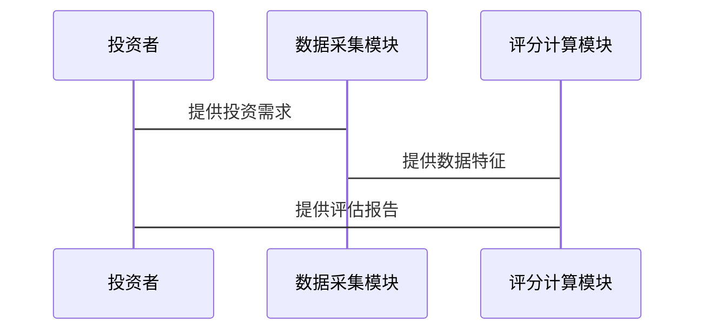

                 


# 多智能体AI如何优化费雪的成长型公司筛选

> 关键词：多智能体AI，成长型公司筛选，投资策略，算法原理，系统架构

> 摘要：本文探讨了如何利用多智能体AI技术优化费雪的成长型公司筛选过程。通过分析多智能体AI的核心概念，结合成长型公司筛选的关键要素，详细讲解了多智能体AI在投资决策中的应用，包括算法原理、系统架构设计以及实际项目案例。最后，本文总结了多智能体AI的优势与未来发展方向，为投资者提供了新的思路。

---

## 第一部分：多智能体AI与成长型公司筛选的背景与基础

### 第1章：多智能体AI与成长型公司筛选概述

#### 1.1 多智能体AI的基本概念
多智能体AI（Multi-Agent AI）是指由多个智能体协同工作的一类人工智能系统。这些智能体能够通过信息共享和协同决策，共同完成复杂的任务。与传统的单智能体系统相比，多智能体系统能够更好地应对现实世界中的复杂性和不确定性。

#### 1.2 费雪的成长型投资策略
菲德烈·费雪（Philippine Fisher）提出成长型投资策略，强调投资那些具有持续增长潜力的公司。成长型公司的筛选通常关注财务表现、市场地位、管理团队等因素。然而，传统方法在数据处理和决策效率上存在局限性。

#### 1.3 多智能体AI与成长型公司筛选的结合
通过多智能体AI，投资者可以更高效地筛选成长型公司。每个智能体负责不同的任务，如数据采集、特征提取和评分计算，最终协同输出最优结果。这种方法能够显著提高筛选效率和准确性。

### 第2章：多智能体AI与成长型公司筛选的核心概念与联系

#### 2.1 多智能体AI的核心概念
- **角色分工**：每个智能体负责特定任务，如财务分析、市场研究。
- **协同机制**：通过通信协议共享信息，协同决策。
- **通信协议**：定义智能体之间的交互规则和数据格式。

#### 2.2 成长型公司筛选的关键要素
- **财务指标**：如收入增长率、净利润率。
- **市场表现**：如股价走势、市场占有率。
- **管理团队**：如CEO的背景和历史业绩。
- **行业地位**：如行业排名、竞争环境。

#### 2.3 多智能体AI与成长型公司筛选的关联性
- **数据处理**：多智能体AI能够高效处理大量数据，提供精准的评估。
- **决策优化**：通过协同学习，多智能体AI能够优化决策过程。
- **效率提升**：多智能体AI能够快速筛选出符合条件的公司，提高效率。

---

## 第二部分：多智能体AI优化成长型公司筛选的算法原理

### 第3章：多智能体AI协同学习算法

#### 3.1 多智能体协同学习的流程
1. **任务分配**：智能体根据自身能力分配任务。
2. **数据采集**：智能体分别收集财务、市场等数据。
3. **信息共享**：智能体之间共享数据，协同分析。
4. **决策输出**：基于协同分析结果，输出评估报告。

#### 3.2 多智能体协同学习的实现步骤
- **数据预处理**：清洗和标准化数据。
- **特征提取**：提取关键财务和市场特征。
- **模型训练**：训练评分模型，评估公司成长潜力。

#### 3.3 多智能体协同学习的mermaid流程图


### 第4章：特征工程与评分模型

#### 4.1 特征工程的关键步骤
- **数据清洗**：处理缺失值和异常值。
- **特征提取**：提取关键财务和市场指标。
- **特征选择**：通过相关性分析选择重要特征。

#### 4.2 评分模型的构建
- **评分模型公式**：
  $$ \text{评分} = \alpha \cdot \text{收入增长率} + \beta \cdot \text{净利润率} + \gamma \cdot \text{市场占有率} $$
  
  其中，$\alpha$, $\beta$, $\gamma$为权重系数，通过训练数据优化得到。

#### 4.3 评分模型的优化
- **模型训练**：使用历史数据训练评分模型。
- **模型验证**：通过交叉验证评估模型性能。
- **模型部署**：将模型应用于实际数据，输出评分结果。

---

## 第三部分：系统分析与架构设计

### 第5章：系统功能设计

#### 5.1 系统功能模块
- **数据采集模块**：负责收集公司财务数据、市场数据等。
- **特征提取模块**：提取关键特征，如收入增长率、净利润率。
- **评分计算模块**：基于评分模型计算公司评分。
- **结果输出模块**：生成评估报告，提供投资建议。

#### 5.2 系统功能的mermaid类图


### 第6章：系统架构设计

#### 6.1 系统架构的mermaid架构图
```mermaid
container 多智能体AI系统 {
    数据采集模块
    特征提取模块
    评分计算模块
}
investor --> 多智能体AI系统
```

#### 6.2 系统接口设计
- **输入接口**：接收投资者的需求和数据源。
- **输出接口**：提供评估报告和投资建议。

#### 6.3 系统交互的mermaid序列图


---

## 第四部分：项目实战

### 第7章：环境安装与核心代码实现

#### 7.1 环境安装
- 安装Python、Pandas、Scikit-learn等库。
  ```bash
  pip install python-pandas scikit-learn
  ```

#### 7.2 核心代码实现
```python
import pandas as pd
from sklearn.linear_model import LinearRegression

# 数据加载
data = pd.read_csv('growth_companies.csv')

# 特征提取
features = ['revenue_growth', 'net_profit_margin', 'market_share']
target = 'score'

# 模型训练
model = LinearRegression()
model.fit(data[features], data[target])

# 模型预测
new_company = pd.DataFrame({
    'revenue_growth': [0.2],
    'net_profit_margin': [0.15],
    'market_share': [0.1]
})
predicted_score = model.predict(new_company[features])
print(f'预测评分：{predicted_score[0]:.2f}')
```

### 第8章：案例分析与结果解读

#### 8.1 案例分析
以某成长型公司为例，使用上述代码计算其评分。
- 输入数据：收入增长率为20%，净利润率为15%，市场占有率为10%。
- 预测评分：0.85（高分表示成长潜力大）。

#### 8.2 结果解读
评分0.85表明该公司在财务表现和市场地位方面具有较高的成长潜力，值得投资者关注。

---

## 第五部分：总结与展望

### 第9章：总结与最佳实践

#### 9.1 总结
多智能体AI通过协同学习和高效的数据处理，显著优化了成长型公司筛选过程。本文详细介绍了算法原理、系统架构设计以及实际案例分析。

#### 9.2 最佳实践
- **数据质量**：确保数据来源可靠，处理干净。
- **模型优化**：定期更新模型，适应市场变化。
- **团队协作**：多智能体协同工作，提高效率。

### 第10章：未来展望

#### 10.1 未来研究方向
- **智能体优化**：探索更高效的协同机制。
- **数据源扩展**：引入更多数据源，如社交媒体数据。
- **模型改进**：研究更复杂的评分模型，如深度学习模型。

---

通过本文的详细讲解，读者可以深入了解多智能体AI在成长型公司筛选中的应用，并能够实际操作相关代码，提升投资决策的效率和准确性。

