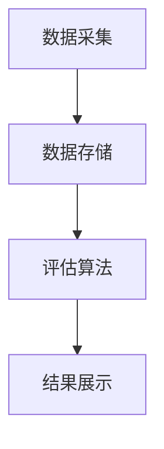

                 


好的，我将按照您的要求撰写关于《多智能体AI如何实现动态竞争格局评估》的技术博客文章。首先，让我们从基础概念开始，逐步分析和实现这一主题。以下是详细的目录和内容：

---

# 多智能体AI如何实现动态竞争格局评估

> **关键词**: 多智能体AI, 动态竞争格局, 竞争格局评估, 博弈论, 多智能体系统

> **摘要**: 本文将详细探讨多智能体AI在动态竞争格局评估中的应用。通过分析多智能体系统的协作与竞争机制，结合博弈论的理论基础，提出一种基于动态博弈模型的竞争格局评估算法。文章还将介绍系统的架构设计和实现方法，并通过实际案例展示算法的应用效果。

---

## 第一部分: 多智能体AI与动态竞争格局评估基础

### 第1章: 多智能体AI概述

#### 1.1 多智能体系统的基本概念

- **定义**: 多智能体系统（Multi-Agent System, MAS）由多个独立但协作的智能体组成，这些智能体能够感知环境、自主决策并采取行动。
  
- **特征**: 
  - 分布式：智能体独立决策。
  - 协作性：智能体之间可以通过通信协作完成共同目标。
  - 竞争性：智能体之间可能存在竞争关系。
  - 动态性：环境和智能体的目标可能随时间变化。

- **与单智能体AI的区别**:
  - 单智能体AI集中决策，多智能体AI分布式决策。
  - 单智能体AI目标单一，多智能体AI目标多样。

#### 1.2 动态竞争格局的定义与特点

- **定义**: 动态竞争格局指在多智能体系统中，随着时间推移，智能体之间的关系和影响力不断变化的态势。
  
- **特点**:
  - 动态性：竞争关系随时间变化。
  - 不确定性：智能体的行为难以完全预测。
  - 复杂性：多个智能体的互动导致复杂性。

#### 1.3 多智能体AI在竞争格局评估中的作用

- **优势**:
  - 能够实时分析多智能体的互动。
  - 可以预测未来竞争态势。
  
- **应用**:
  - 市场竞争分析。
  - 战略决策支持。
  
- **挑战**:
  - 如何处理复杂的互动关系。
  - 如何确保评估的准确性。

---

## 第二部分: 多智能体AI的竞争格局评估理论

### 第2章: 博弈论与竞争格局分析

#### 2.1 博弈论基础

- **基本概念**:
  - 玩家：参与竞争的智能体。
  - 策略：玩家在某一阶段的决策。
  - 结果：玩家选择策略后的最终收益或损失。

- **博弈分类**:
  - 合作博弈：玩家目标一致。
  - 竞争博弈：玩家目标冲突。

- **博弈论在AI中的应用**:
  - 智能体决策模型。
  - 多智能体协作机制。

#### 2.2 竞争格局的博弈模型构建

- **博弈树模型**:
  - 通过树状结构展示所有可能的决策路径。
  
- **纳什均衡分析**:
  - 纳什均衡：在博弈中，没有玩家可以通过单方面改变策略而获益的状态。
  
- **动态博弈模型**:
  - 竞争格局随时间变化，需要动态调整策略。

#### 2.3 多智能体博弈中的策略评估

- **策略评估方法**:
  - 基于收益矩阵的评估。
  - 基于纳什均衡的策略优化。
  
- **挑战与解决方案**:
  - 策略的复杂性：简化模型，聚焦关键因素。
  - 不确定性：引入概率模型。

---

## 第三部分: 多智能体AI的竞争格局评估算法

### 第3章: 基于博弈论的动态评估算法

#### 3.1 动态竞争格局评估的基本原理

- **核心思想**:
  - 实时分析多智能体的互动，更新竞争格局评估结果。
  
- **数学模型**:
  - $$ V(s) = \max_{a} \min_{b} V(s', a, b) $$
  
  其中，$s$是当前状态，$s'$是下一步状态，$a$和$b$分别是玩家A和玩家B的策略。

#### 3.2 基于博弈论的策略评估算法

- **算法步骤**:
  1. 初始化：定义智能体、策略空间和收益矩阵。
  2. 计算纳什均衡：确定无占优策略均衡点。
  3. 动态更新：根据环境变化调整策略。

- **案例分析**:
  - 某公司市场份额竞争分析。

#### 3.3 多智能体协作与竞争的平衡算法

- **平衡点分析**:
  - 确保协作与竞争的适度，避免一方占据绝对优势。
  
- **算法实现**:
  - 使用收益矩阵和纳什均衡确定平衡点。

---

## 第四部分: 系统架构与实现

### 第4章: 竞争格局评估系统的架构设计

#### 4.1 系统功能需求分析

- **目标**:
  - 实时监控多智能体互动。
  - 提供竞争格局评估结果。
  
- **功能模块**:
  - 数据采集模块：收集各智能体的行为数据。
  - 评估算法模块：计算竞争格局。
  - 结果展示模块：可视化评估结果。

#### 4.2 系统架构设计

- **分层架构**:
  - 数据层：存储智能体数据。
  - 逻辑层：执行评估算法。
  - 展示层：呈现评估结果。
  
- **模块化设计**:
  - 独立模块，便于维护和扩展。

#### 4.3 系统架构图（Mermaid）



---

## 第五部分: 项目实战

### 第5章: 动态竞争格局评估的实现

#### 5.1 环境安装

- **工具选择**:
  - Python编程语言。
  - NumPy、Pandas、Matplotlib库。
  - Mermaid图生成工具。

#### 5.2 核心代码实现

- **评估算法实现**:

```python
def calculate_nash_equilibrium(players, strategies):
    # 简单实现，实际需要根据具体问题优化
    nash_equilibrium = []
    for player in players:
        max_min = -float('inf')
        best_strategy = None
        for strategy in strategies[player]:
            min_value = min([calculate_value(player, strategy, other_strategy) for other_strategy in strategies[other_players]])
            if min_value > max_min:
                max_min = min_value
                best_strategy = strategy
        nash_equilibrium.append(best_strategy)
    return nash_equilibrium
```

- **收益矩阵展示**:

```python
import matplotlib.pyplot as plt

# 创建收益矩阵
strategies = ['A', 'B', 'C']
values = [
    [1, 2, 3],
    [4, 5, 6],
    [7, 8, 9]
]

# 可视化收益矩阵
plt.imshow(values, cmap='hot')
plt.colorbar()
plt.show()
```

#### 5.3 案例分析

- **背景**:
  - 某行业内的三家公司竞争市场份额。
  
- **算法应用**:
  - 使用上述算法评估各公司的竞争策略。
  
- **结果展示**:
  - 确定各公司的纳什均衡点，预测未来市场份额变化。

---

## 第六部分: 最佳实践与未来展望

### 6.1 最佳实践 tips

- **选择合适的算法**:
  - 根据具体问题选择适合的博弈模型。
  
- **优化系统架构**:
  - 确保系统的可扩展性和可维护性。

### 6.2 未来展望

- **算法优化**:
  - 引入机器学习，提升评估的准确性。
  
- **应用场景扩展**:
  - 将多智能体AI应用于更多领域，如金融、医疗等。

---

## 总结

通过本文的分析与实现，我们了解了多智能体AI在动态竞争格局评估中的重要性。从基础理论到算法实现，再到系统设计，每一步都紧密相连，为实际应用提供了坚实的基础。未来，随着技术的不断发展，多智能体AI将在更多领域发挥重要作用。

---

希望这篇文章能够帮助您深入了解多智能体AI在动态竞争格局评估中的应用。如果需要进一步讨论或优化，请随时告知！

