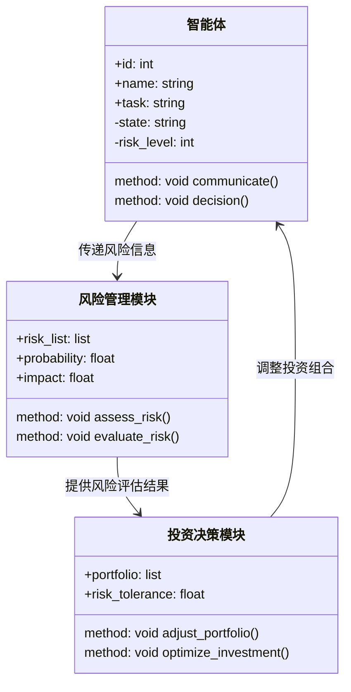
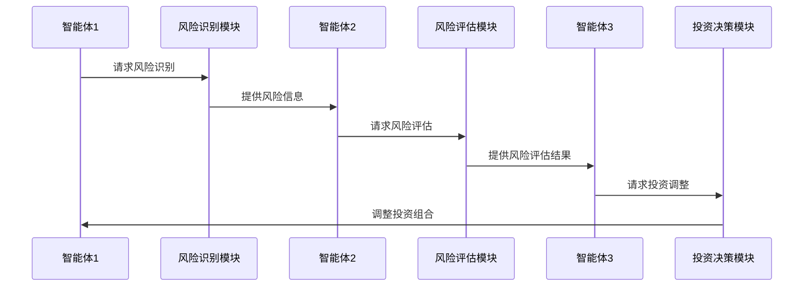

                 


# 多智能体AI系统在价值投资中的风险管理应用

> 关键词：多智能体AI系统、风险管理、价值投资、算法、数学模型

> 摘要：本文探讨了多智能体AI系统在价值投资中的风险管理应用，分析了多智能体系统的基本概念、核心原理，以及其在风险识别、评估和管理中的具体应用。通过详细讲解算法原理、数学模型和系统架构设计，本文为读者提供了从理论到实践的全面指导。

---

## 目录

1. [背景介绍](#背景介绍)
2. [多智能体AI系统的核心概念](#多智能体AI系统的核心概念)
3. [多智能体AI系统的算法原理](#多智能体AI系统的算法原理)
4. [风险管理的数学模型](#风险管理的数学模型)
5. [系统架构设计](#系统架构设计)
6. [项目实战](#项目实战)
7. [最佳实践](#最佳实践)
8. [总结](#总结)

---

## 背景介绍

### 1.1 多智能体AI系统的基本概念

#### 1.1.1 多智能体系统的定义

多智能体系统（Multi-Agent System, 简称MAS）是由多个智能体（Agent）组成的分布式系统。每个智能体都是一个能够感知环境、做出决策并采取行动的实体。智能体之间通过通信和协作完成复杂的任务。

#### 1.1.2 多智能体系统的特征

- **分布式性**：多个智能体独立运行，协同完成任务。
- **协作性**：智能体之间通过通信和协作实现目标。
- **自主性**：每个智能体都具有自主决策的能力。
- **动态性**：环境和任务可能动态变化，系统需要具备适应性。

#### 1.1.3 多智能体系统的分类

- **基于任务的分类**：根据任务类型（如监控、预测等）进行分类。
- **基于结构的分类**：根据系统架构（如松散耦合、紧耦合）进行分类。
- **基于智能体类型的分类**：根据智能体的智能水平（如反应式、基于模型的智能体）进行分类。

### 1.2 风险管理的基本概念

#### 1.2.1 风险管理的定义

风险管理是指通过识别、评估和应对各种风险，以最小化风险对目标的影响的过程。

#### 1.2.2 风险管理的核心目标

- **风险识别**：识别可能影响目标的潜在风险。
- **风险评估**：评估风险的概率和影响程度。
- **风险应对**：制定应对策略，降低风险发生的可能性或影响。

#### 1.2.3 风险管理的常用方法

- **定性分析**：通过描述性分析评估风险。
- **定量分析**：通过数据和模型量化风险。
- **情景分析**：模拟不同情景下的风险表现。

---

## 多智能体AI系统的核心概念

### 2.1 多智能体系统在风险管理中的优势

#### 2.1.1 分布式决策的优势

多智能体系统通过分布式决策，能够快速响应环境变化，提高决策的实时性和准确性。

#### 2.1.2 多智能体协作的效率提升

通过协作，多个智能体可以共同完成复杂的任务，提高整体效率。

#### 2.1.3 多智能体系统的可扩展性

多智能体系统可以根据任务需求灵活扩展，适应不同的应用场景。

### 2.2 价值投资中的风险管理需求

#### 2.2.1 价值投资的基本原理

价值投资是一种基于对公司内在价值的评估，寻找市场价格低于内在价值的投资方式。

#### 2.2.2 价值投资中的主要风险

- **市场风险**：市场波动可能导致投资价值下降。
- **流动性风险**：投资资产难以快速变现的风险。
- **信用风险**：投资对象的信用状况变化带来的风险。

#### 2.2.3 风险管理在价值投资中的重要性

有效的风险管理可以降低投资损失，提高投资收益的稳定性。

---

## 多智能体AI系统的算法原理

### 3.1 多智能体系统的算法原理

#### 3.1.1 分布式算法的基本原理

分布式算法通过将任务分解到多个智能体，利用智能体之间的通信和协作完成全局任务。

#### 3.1.2 多智能体协作算法的实现步骤

1. **任务分解**：将整体任务分解为多个子任务。
2. **智能体分配**：将子任务分配给不同的智能体。
3. **通信与协作**：智能体之间通过通信完成信息共享和协作。
4. **决策与行动**：智能体根据共享信息做出决策并采取行动。

#### 3.1.3 算法的收敛性分析

收敛性分析是评估算法性能的重要指标，通过分析算法的收敛速度和稳定性，优化算法的性能。

### 3.2 多智能体系统的优化算法

#### 3.2.1 常见的优化算法概述

- **遗传算法**：模拟生物进化过程的优化算法。
- **粒子群优化算法**：通过模拟鸟群觅食行为进行优化。
- **模拟退火算法**：通过模拟热力学过程寻找全局最优解。

#### 3.2.2 基于多智能体的优化算法

- **多智能体遗传算法**：将遗传算法应用于多智能体系统中。
- **多智能体粒子群优化算法**：结合粒子群优化算法和多智能体系统的特点。

#### 3.2.3 算法的性能评估

- **计算效率**：算法完成任务的时间复杂度。
- **解的质量**：算法找到的最优解的质量。
- **鲁棒性**：算法在不同环境下的适应能力。

---

## 风险管理的数学模型

### 4.1 风险评估的数学模型

#### 4.1.1 风险评估的基本公式

风险值 \( R \) 可以通过以下公式计算：

$$ R = P \times I $$

其中，\( P \) 是风险发生的概率，\( I \) 是风险的影响程度。

#### 4.1.2 风险评估模型的构建

风险评估模型可以基于历史数据和统计分析方法进行构建。例如，使用回归分析预测风险。

#### 4.1.3 模型的参数设置与优化

通过实验验证和参数调优，优化模型的性能，提高风险评估的准确性。

### 4.2 基于多智能体的风险管理模型

#### 4.2.1 风险管理模型的基本结构

风险管理模型由多个智能体组成，每个智能体负责不同的风险评估和应对任务。

#### 4.2.2 多智能体系统在模型中的角色

智能体通过协作完成风险信息的共享和处理，提高风险管理的效率。

#### 4.2.3 模型的实现与优化

通过优化算法和系统架构设计，提高模型的性能和适应性。

---

## 系统架构设计

### 5.1 问题场景介绍

在价值投资中，风险管理的核心目标是降低投资风险，提高投资收益。多智能体AI系统可以通过协作和分布式决策，提高风险管理的效率和准确性。

### 5.2 系统功能设计

#### 5.2.1 系统功能模块

- **风险识别模块**：识别潜在风险。
- **风险评估模块**：评估风险的概率和影响程度。
- **风险应对模块**：制定应对策略。

#### 5.2.2 领域模型（Mermaid 类图）



### 5.3 系统架构设计（Mermaid 架构图）


### 5.4 系统交互（Mermaid 序列图）



---

## 项目实战

### 6.1 环境安装

#### 6.1.1 安装Python

```bash
# 安装Python
sudo apt-get install python3 python3-dev
```

#### 6.1.2 安装依赖库

```bash
# 安装必要的Python库
pip install numpy pandas matplotlib
```

### 6.2 系统核心实现源代码

#### 6.2.1 风险识别模块

```python
import numpy as np
import pandas as pd

class RiskIdentifier:
    def __init__(self):
        self.sensors = []
    
    def add_sensor(self, sensor):
        self.sensors.append(sensor)
    
    def identify_risks(self):
        risks = []
        for sensor in self.sensors:
            risks.extend(sensor.get_risk_signals())
        return risks
```

#### 6.2.2 风险评估模块

```python
class RiskEvaluator:
    def __init__(self):
        self.risk_signals = []
    
    def evaluate_risk(self, signal):
        probability = self.calculate_probability(signal)
        impact = self.calculate_impact(signal)
        return probability * impact
    
    def calculate_probability(self, signal):
        # 示例：简单概率计算
        return sum(signal) / len(signal)
    
    def calculate_impact(self, signal):
        # 示例：简单影响计算
        return max(signal) if len(signal) > 0 else 0
```

#### 6.2.3 风险应对模块

```python
class RiskManager:
    def __init__(self):
        self.risk_level = 0
        self.strategy = None
    
    def update_strategy(self, new_strategy):
        self.strategy = new_strategy
    
    def manage_risk(self, risk_level):
        if risk_level > self.risk_level:
            self.apply_strategy()
    
    def apply_strategy(self):
        # 示例：调整投资组合
        print("Applying risk mitigation strategy...")
```

### 6.3 案例分析与详细解读

#### 6.3.1 案例背景

假设我们有一个价值投资组合，包含多只股票和债券。我们需要通过多智能体系统实时监控和管理投资组合的风险。

#### 6.3.2 系统实现步骤

1. **安装环境**：安装Python和必要的库。
2. **定义智能体**：定义风险识别、评估和应对模块。
3. **实现交互逻辑**：通过通信模块实现智能体之间的协作。
4. **运行系统**：输入投资组合数据，运行系统进行风险评估和应对。

#### 6.3.3 代码实现与分析

```python
# 示例代码：多智能体协作实现风险管理
from risk_identifier import RiskIdentifier
from risk_evaluator import RiskEvaluator
from risk_manager import RiskManager

# 初始化智能体
identifier = RiskIdentifier()
identifier.add_sensor([1, 0, 1, 0, 1])  # 示例风险信号

evaluator = RiskEvaluator()
evaluator.evaluate_risk(identifier.identify_risks())

manager = RiskManager()
manager.update_strategy(lambda: print("Diversify investment."))
manager.manage_risk(evaluator.evaluate_risk([1, 0, 1, 0, 1]))
```

---

## 最佳实践

### 7.1 最佳实践 Tips

- **数据质量**：确保输入数据的准确性和完整性。
- **算法优化**：根据实际需求优化算法的性能。
- **系统维护**：定期更新系统和模型，适应市场变化。

### 7.2 小结

多智能体AI系统通过协作和分布式决策，显著提高了风险管理的效率和准确性。在价值投资中，多智能体系统的应用为投资者提供了更强大的工具，帮助他们更好地应对市场风险。

### 7.3 注意事项

- **系统稳定性**：确保系统的稳定运行，避免因系统故障导致决策失误。
- **数据隐私**：保护投资数据的隐私和安全。
- **模型更新**：定期更新模型，适应市场变化。

### 7.4 拓展阅读

- **推荐书籍**：《多智能体系统：原理与应用》
- **推荐论文**：《Multi-Agent Systems for Risk Management in Financial Markets》
- **推荐工具**：Python的多智能体模拟框架（如 mesa）

---

## 总结

通过本文的详细讲解，我们了解了多智能体AI系统在价值投资中的风险管理应用。从基本概念到算法原理，从数学模型到系统架构设计，再到项目实战，我们全面探讨了多智能体系统在风险管理中的潜力和实际应用。希望本文能够为读者提供有价值的参考，帮助他们在实际投资中更好地应用多智能体AI技术进行风险管理。

--- 

感谢您的阅读！希望本文对您有所帮助！

