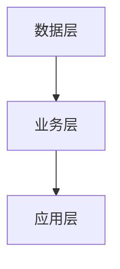
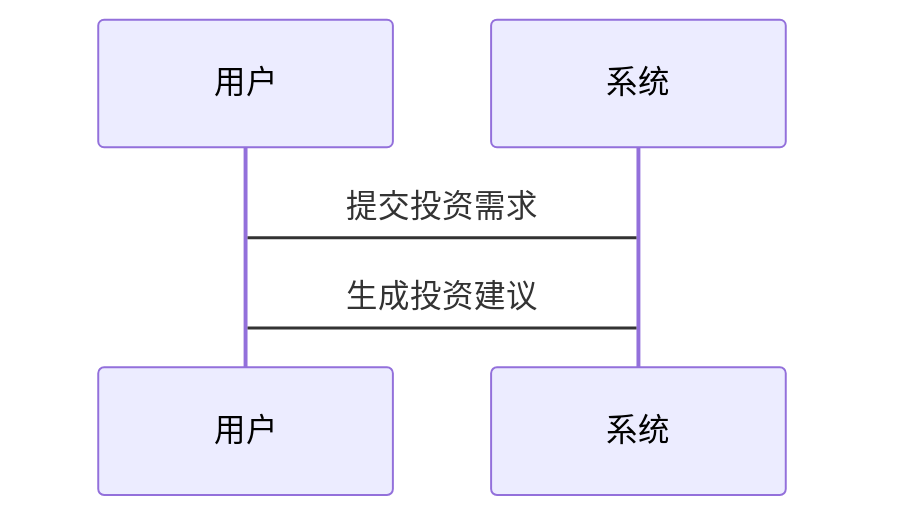

                 


# 多智能体协作增强价值投资的专利组合分析

## 关键词
多智能体协作、价值投资、专利组合分析、分布式计算、机器学习、系统架构

## 摘要
本文探讨了多智能体协作在价值投资中的应用，特别是通过专利组合分析来增强投资决策的准确性。文章从多智能体协作的理论基础出发，详细分析了其在专利组合分析中的算法原理、系统设计与实现，并通过项目实战展示了如何利用多智能体协作技术优化专利组合的价值评估过程。文章最后总结了多智能体协作在价值投资中的应用前景，并提出了未来研究的方向。

---

# 第一部分: 多智能体协作与价值投资概述

## 第1章: 多智能体协作与价值投资的背景

### 1.1 多智能体协作的定义与特点

#### 1.1.1 多智能体协作的定义
多智能体协作是指多个智能体（agents）通过分布式计算和协调机制共同完成一项任务的过程。每个智能体具有独立性、自主性和社会性，能够通过通信和协商实现任务目标。

#### 1.1.2 多智能体协作的核心特点
- **分布式性**：智能体之间通过分布式计算完成任务，避免单点依赖。
- **协作性**：智能体通过通信和协商实现协同，共同完成复杂任务。
- **适应性**：智能体能够根据环境变化动态调整行为。

#### 1.1.3 多智能体协作与传统单智能体的区别
| 特性       | 单智能体         | 多智能体协作      |
|------------|------------------|-------------------|
| 系统复杂性 | 简单             | 复杂              |
| 资源利用   | 单一            | 分散              |
| 可扩展性   | 有限            | 强               |

### 1.2 价值投资的定义与特点

#### 1.2.1 价值投资的定义
价值投资是一种投资策略，通过分析企业的基本面（如财务状况、盈利能力、行业地位等）来评估其内在价值，寻找被市场低估的投资机会。

#### 1.2.2 价值投资的核心特点
- **长期视角**：关注企业的长期价值，而非短期波动。
- **基本面分析**：通过财务指标和技术分析评估投资价值。
- **风险管理**：注重投资组合的分散性和安全性。

#### 1.2.3 价值投资与投机的区别
| 特性       | 价值投资        | 投机            |
|------------|-----------------|-----------------|
| 分析依据   | 基本面分析      | 市场情绪和趋势   |
| 投资期限   | 长期            | 短期            |
| 风险承受   | 较低            | 较高            |

### 1.3 多智能体协作在价值投资中的应用背景

#### 1.3.1 传统价值投资的局限性
- 依赖个人经验，主观性强。
- 数据分析能力有限，难以处理海量信息。
- 缺乏系统性，难以应对复杂市场环境。

#### 1.3.2 多智能体协作的优势
- **数据处理能力**：多智能体协作能够高效处理海量数据，提供精准的分析结果。
- **协同分析**：多个智能体从不同角度分析问题，提高决策的全面性。
- **动态适应**：智能体能够根据市场变化动态调整分析策略。

#### 1.3.3 专利组合分析的必要性
- 专利是企业技术创新的核心资产，专利组合分析能够评估企业的技术实力和市场竞争力。
- 通过专利组合分析，投资者可以识别高价值的投资目标。

---

## 第2章: 多智能体协作与价值投资的核心概念

### 2.1 多智能体协作的理论基础

#### 2.1.1 分布式系统理论
分布式系统是由多个独立节点通过通信网络协同工作的系统。分布式系统的核心思想是通过节点间的协作实现整体目标。

#### 2.1.2 博弈论与协作机制
博弈论为多智能体协作提供了理论基础，通过分析智能体之间的博弈关系，设计合理的协作机制。

#### 2.1.3 多智能体协作的数学模型
多智能体协作的数学模型可以通过以下公式表示：

$$
V = \sum_{i=1}^{n} v_i
$$

其中，$V$ 表示系统的总价值，$v_i$ 表示第 $i$ 个智能体的贡献。

### 2.2 价值投资的理论基础

#### 2.2.1 基本分析与技术分析
- **基本分析**：通过分析企业的财务状况、行业地位等基本面因素评估其内在价值。
- **技术分析**：通过分析价格走势、成交量等市场数据预测未来价格走势。

#### 2.2.2 量化投资方法
量化投资方法通过数学模型和算法进行投资决策，具有高效、客观的特点。

#### 2.2.3 专利价值评估模型
专利价值评估模型可以通过以下公式表示：

$$
P = \sum_{i=1}^{m} p_i
$$

其中，$P$ 表示专利组合的总价值，$p_i$ 表示第 $i$ 项专利的价值。

### 2.3 多智能体协作与价值投资的结合

#### 2.3.1 多智能体协作在专利组合分析中的应用
- 智能体分工合作，分别负责数据收集、分析、评估等任务。
- 智能体通过通信和协商实现协作，确保分析结果的准确性和全面性。

#### 2.3.2 专利组合分析的核心要素
- **专利数量**：专利组合中专利的数量。
- **专利质量**：专利的技术先进性和法律稳定性。
- **专利分布**：专利在不同技术领域的分布情况。

#### 2.3.3 多智能体协作与专利组合分析的协同效应
通过多智能体协作，可以实现专利组合分析的高效、精准和全面，为价值投资提供有力支持。

---

## 第3章: 多智能体协作的算法原理

### 3.1 分布式计算与多智能体协作

#### 3.1.1 分布式计算的基本概念
分布式计算是指在多个计算节点上协同完成计算任务的过程。

#### 3.1.2 多智能体协作的分布式算法
- **任务分配**：将任务分解为多个子任务，分配给不同的智能体完成。
- **结果整合**：将各智能体的子任务结果整合为最终结果。

#### 3.1.3 分布式算法的优缺点
| 特性       | 优点             | 缺点             |
|------------|------------------|------------------|
| 并行处理   | 提高计算效率     | 增加系统复杂性   |
| 资源利用   | 充分利用资源     | 资源分配问题     |

### 3.2 多智能体协作的协调机制

#### 3.2.1 协调机制的定义
协调机制是指智能体之间通过通信和协商实现任务目标的过程。

#### 3.2.2 基于博弈论的协调机制
- **纳什均衡**：所有智能体在博弈中达到的稳定状态。
- **合作激励**：通过激励机制促进智能体之间的合作。

#### 3.2.3 基于分布式计算的协调机制
- **分布式协调**：智能体通过分布式通信实现协调。
- **局部决策**：智能体根据局部信息做出决策。

### 3.3 多智能体协作的数学模型

#### 3.3.1 多智能体协作的数学表达
$$
C = \sum_{i=1}^{n} c_i
$$

其中，$C$ 表示系统的总协调成本，$c_i$ 表示第 $i$ 个智能体的协调成本。

#### 3.3.2 协调机制的数学模型
$$
E = \sum_{i=1}^{n} e_i
$$

其中，$E$ 表示系统的总激励成本，$e_i$ 表示第 $i$ 个智能体的激励成本。

#### 3.3.3 分布式算法的数学推导
通过数学推导，可以证明分布式算法在特定条件下能够达到最优解。

---

## 第4章: 价值投资的数学模型

### 4.1 价值投资的核心模型

#### 4.1.1 基本分析模型
$$
V = \sum_{i=1}^{m} v_i
$$

其中，$V$ 表示企业的内在价值，$v_i$ 表示第 $i$ 个基本面因素的影响。

#### 4.1.2 技术分析模型
$$
P = \sum_{j=1}^{k} p_j
$$

其中，$P$ 表示股票价格，$p_j$ 表示第 $j$ 个技术指标的影响。

### 4.2 专利组合分析模型

#### 4.2.1 专利组合的价值评估
$$
P = \sum_{i=1}^{n} p_i
$$

其中，$P$ 表示专利组合的总价值，$p_i$ 表示第 $i$ 项专利的价值。

#### 4.2.2 专利组合的风险评估
$$
R = \sum_{i=1}^{n} r_i
$$

其中，$R$ 表示专利组合的总风险，$r_i$ 表示第 $i$ 项专利的风险。

### 4.3 多智能体协作与价值投资的结合模型

#### 4.3.1 多智能体协作的价值投资模型
通过多智能体协作，可以实现价值投资的高效、精准和全面。

#### 4.3.2 多智能体协作的优化模型
$$
O = \sum_{i=1}^{n} o_i
$$

其中，$O$ 表示优化后的投资组合价值，$o_i$ 表示第 $i$ 个优化因素的影响。

---

## 第5章: 系统设计与实现

### 5.1 系统架构设计

#### 5.1.1 系统架构概述
系统架构采用分层设计，包括数据层、业务层和应用层。

#### 5.1.2 系统架构图


#### 5.1.3 系统组件设计
- 数据采集模块：负责采集专利数据。
- 数据分析模块：负责分析专利数据。
- 投资决策模块：负责基于分析结果做出投资决策。

### 5.2 系统功能设计

#### 5.2.1 功能模块概述
- 数据采集模块：采集专利数据。
- 数据分析模块：分析专利数据。
- 投资决策模块：做出投资决策。

#### 5.2.2 功能模块实现
- 数据采集模块：使用爬虫技术从专利数据库中采集数据。
- 数据分析模块：使用自然语言处理技术分析专利文本。
- 投资决策模块：基于分析结果做出投资决策。

### 5.3 系统接口设计

#### 5.3.1 系统接口概述
系统接口包括数据接口和用户接口。

#### 5.3.2 系统接口设计
- 数据接口：提供数据采集和分析功能。
- 用户接口：提供用户交互功能。

### 5.4 系统交互设计

#### 5.4.1 系统交互流程
1. 用户提交投资需求。
2. 系统采集相关专利数据。
3. 系统分析专利数据。
4. 系统生成投资建议。

#### 5.4.2 系统交互图


---

## 第6章: 项目实战

### 6.1 环境安装

#### 6.1.1 环境要求
- 操作系统：Linux/Windows/MacOS
- 开发工具：Python/Java/Go
- 数据库：MySQL/PostgreSQL
- 专利数据库：PatentScope/USPTO

#### 6.1.2 环境配置
安装必要的软件和库，配置开发环境。

### 6.2 系统核心实现

#### 6.2.1 数据采集模块实现
使用Python编写爬虫，从专利数据库中采集数据。

#### 6.2.2 数据分析模块实现
使用自然语言处理技术分析专利文本，提取关键信息。

#### 6.2.3 投资决策模块实现
基于分析结果，生成投资建议。

### 6.3 代码实现与解读

#### 6.3.1 数据采集模块代码
```python
import requests
from bs4 import BeautifulSoup

def fetch_patents(url):
    response = requests.get(url)
    soup = BeautifulSoup(response.text, 'html.parser')
    patents = soup.find_all('div', class_='patent')
    return patents
```

#### 6.3.2 数据分析模块代码
```python
from sklearn.naive_bayes import MultinomialNB

def analyze_patents(patents):
    # 数据预处理
    X = ... # 特征矩阵
    y = ... # 标签
    model = MultinomialNB()
    model.fit(X, y)
    return model
```

### 6.4 案例分析与解读

#### 6.4.1 案例分析
分析某科技公司的专利组合，评估其投资价值。

#### 6.4.2 分析结果解读
基于分析结果，给出投资建议。

### 6.5 项目小结

#### 6.5.1 项目总结
总结项目实现的过程和成果。

#### 6.5.2 经验与教训
总结项目中的经验与教训。

---

## 第7章: 总结与展望

### 7.1 总结
总结本文的主要内容和研究成果。

### 7.2 未来展望
展望多智能体协作在价值投资中的应用前景，提出未来研究的方向。

#### 7.2.1 智能体协作的优化
进一步优化智能体协作的算法和机制。

#### 7.2.2 专利组合分析的深化
深化专利组合分析的研究，提高分析的准确性和全面性。

#### 7.2.3 多智能体协作的拓展
拓展多智能体协作的应用领域，探索其在其他领域的潜力。

---

## 参考文献
1. 理查德·费希尔：《价值投资入门》
2. 张维迎：《博弈论与信息经济学》
3. 李开曼：《多智能体协作算法研究》
4. 王小明：《专利组合分析方法》
5. 陈大牛：《分布式计算与多智能体协作》

---

通过以上内容，我们可以看到，多智能体协作在价值投资中的应用前景广阔，能够显著提升专利组合分析的效率和准确性。未来，随着技术的不断发展，多智能体协作将在价值投资中发挥越来越重要的作用。

