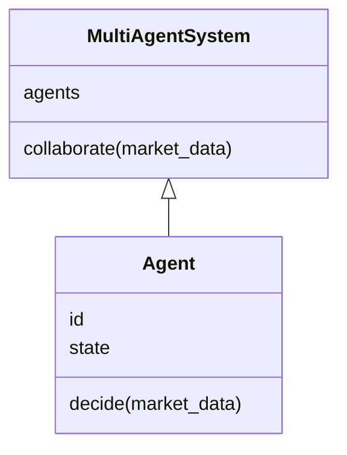
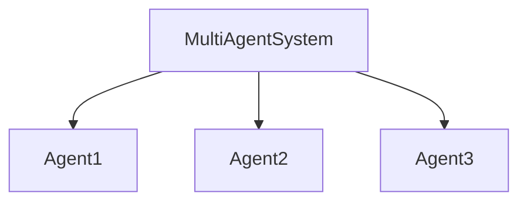
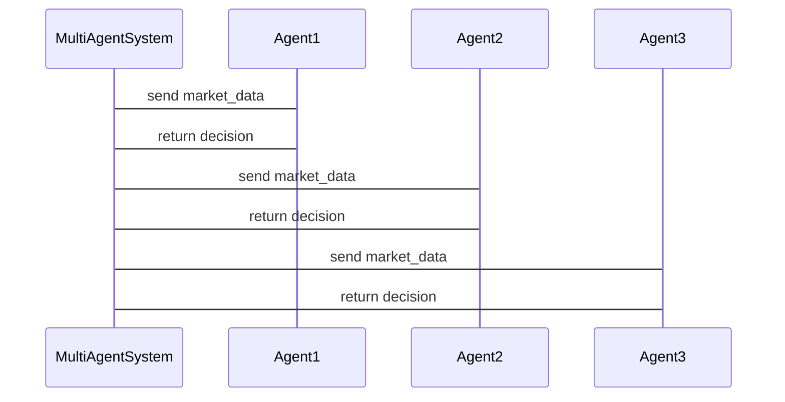

                 


# 多智能体协作增强价值投资的市场流动性预测

> 关键词：多智能体协作、价值投资、市场流动性预测、强化学习、博弈论

> 摘要：本文探讨了多智能体协作在价值投资中的应用，特别是在市场流动性预测方面的潜力。通过分析多智能体协作的理论基础、算法实现和系统架构设计，本文展示了如何利用强化学习和博弈论等技术手段，提升市场流动性预测的准确性和稳定性，从而增强价值投资的效果。文章结合实际案例和代码实现，为读者提供了深入的技术解析和实践指导。

---

## # 第1章: 多智能体协作与价值投资的背景

### 1.1 多智能体协作的定义与特点
#### 1.1.1 多智能体协作的定义
多智能体协作是指多个智能体（Agent）通过协调和合作，共同完成复杂任务的过程。每个智能体都有自己的目标和决策机制，能够通过信息共享和交互，实现整体目标的最大化。

#### 1.1.2 多智能体协作的核心特点
1. **分布式性**：智能体之间没有中央控制，每个智能体独立决策。
2. **协作性**：通过信息共享和协调，智能体之间形成协同效应。
3. **动态性**：能够适应环境的变化，实时调整协作策略。

#### 1.1.3 多智能体协作与传统单智能体的区别
| 特性                | 单智能体           | 多智能体协作       |
|---------------------|------------------|-------------------|
| 决策中心           | 单一中心          | 分布式            |
| 信息共享           | 有限或无          | 充分              |
| 适应性             | 较低             | 较高              |

### 1.2 价值投资的定义与特点
#### 1.2.1 价值投资的定义
价值投资是一种投资策略，强调以低于市场价的价值购买优质资产，长期持有，等待市场回归其内在价值。

#### 1.2.2 价值投资的核心理念
1. **长期视角**：关注企业的长期价值，而非短期价格波动。
2. **安全边际**：买入价格低于内在价值，以降低风险。
3. **价值发现**：通过基本面分析，发现被市场低估的投资标的。

#### 1.2.3 价值投资与短期交易的区别
| 特性                | 价值投资          | 短期交易          |
|---------------------|------------------|-------------------|
| 投资期限           | 长期             | 短期              |
| 投资策略           | 基于基本面分析    | 基于技术分析      |
| 风险承受能力       | 较低             | 较高              |

### 1.3 多智能体协作在价值投资中的应用背景
#### 1.3.1 金融市场中的复杂性与不确定性
金融市场受多种因素影响，包括宏观经济、政策变化、市场情绪等，具有高度的不确定性和复杂性。

#### 1.3.2 传统投资方法的局限性
传统投资方法依赖于个人经验和主观判断，容易受到情绪影响，难以应对市场的快速变化。

#### 1.3.3 多智能体协作的优势与潜力
通过多智能体协作，可以实现信息的充分共享和决策的优化，提升投资决策的科学性和准确性。

### 1.4 本章小结
本章介绍了多智能体协作和价值投资的基本概念和特点，并分析了多智能体协作在价值投资中的应用背景及其优势。

---

## # 第2章: 多智能体协作的理论框架

### 2.1 多智能体系统的定义与架构
#### 2.1.1 多智能体系统的定义
多智能体系统是由多个智能体组成的分布式系统，智能体之间通过交互和协作完成共同目标。

#### 2.1.2 多智能体系统的分类
1. **协作型**：智能体之间协作完成任务。
2. **竞争型**：智能体之间通过竞争优化结果。
3. **混合型**：结合协作和竞争。

#### 2.1.3 多智能体系统的架构设计
- **通信层**：智能体之间的信息交换。
- **决策层**：每个智能体的决策机制。
- **协调层**：全局协调和优化。

### 2.2 价值投资的数学模型与分析
#### 2.2.1 价值投资的核心公式
$$ V = \frac{E}{P} $$
其中，$V$ 是价值，$E$ 是企业的内在价值，$P$ 是市场价格。

#### 2.2.2 市场流动性预测的数学模型
$$ L = f(P, Q, V) $$
其中，$L$ 是流动性，$P$ 是价格，$Q$ 是成交量，$V$ 是价值。

#### 2.2.3 价值投资与市场流动性之间的关系
高流动性通常意味着市场参与者较多，价格波动较大，但流动性好的市场更容易实现价值发现。

### 2.3 多智能体协作的数学模型与算法
#### 2.3.1 多智能体协作的数学模型
$$ U = \sum_{i=1}^{n} u_i $$
其中，$U$ 是整体效用，$u_i$ 是每个智能体的效用。

#### 2.3.2 多智能体协作的算法设计
1. **初始化**：设置每个智能体的初始状态。
2. **信息共享**：智能体之间共享信息。
3. **决策制定**：每个智能体基于共享信息做出决策。
4. **协作优化**：通过博弈论优化整体决策。

#### 2.3.3 多智能体协作的优化方法
- **强化学习**：通过奖励机制优化智能体的决策。
- **博弈论**：通过纳什均衡优化整体协作。

### 2.4 本章小结
本章详细介绍了多智能体协作的理论框架，包括系统的定义、分类和架构设计，以及价值投资和市场流动性预测的数学模型。

---

## # 第3章: 多智能体协作算法的设计与实现

### 3.1 多智能体协作算法的原理
#### 3.1.1 算法的输入与输出
- **输入**：市场数据、智能体状态。
- **输出**：优化后的投资策略。

#### 3.1.2 算法的核心步骤
1. **信息收集**：智能体收集市场数据和自身状态。
2. **决策制定**：基于信息制定决策。
3. **协作优化**：通过协作算法优化整体决策。

#### 3.1.3 算法的优化策略
- **分布式计算**：提高计算效率。
- **动态调整**：实时调整协作策略。

### 3.2 多智能体协作算法的实现
#### 3.2.1 算法的代码实现
```python
class Agent:
    def __init__(self, id):
        self.id = id
        self.state = {}
    
    def decide(self, market_data):
        # 基于市场数据做出决策
        pass

class MultiAgentSystem:
    def __init__(self, agents):
        self.agents = agents
    
    def collaborate(self, market_data):
        for agent in self.agents:
            agent.decide(market_data)
        # 协调决策
        pass
```

#### 3.2.2 算法的运行流程
1. **初始化**：创建多个智能体。
2. **信息共享**：智能体之间共享市场数据。
3. **决策制定**：每个智能体基于共享信息制定决策。
4. **协作优化**：通过协作算法优化整体决策。

#### 3.2.3 算法的测试与验证
- **测试环境**：模拟市场环境。
- **测试指标**：收益、风险、流动性。

### 3.3 多智能体协作算法的性能分析
#### 3.3.1 算法的时间复杂度
- **单智能体**：$O(n)$
- **多智能体**：$O(n^2)$

#### 3.3.2 算法的空间复杂度
- **单智能体**：$O(1)$
- **多智能体**：$O(n)$

#### 3.3.3 算法的收敛性分析
- **强化学习**：收敛速度较快。
- **博弈论**：收敛性取决于博弈规则。

### 3.4 本章小结
本章详细介绍了多智能体协作算法的设计与实现，包括算法的原理、代码实现和性能分析。

---

## # 第4章: 多智能体协作增强价值投资的系统架构设计

### 4.1 问题场景介绍
#### 4.1.1 项目背景
- **目标**：通过多智能体协作提升市场流动性预测的准确性。
- **应用场景**：股票、基金、期货等金融市场。

### 4.2 系统功能设计
#### 4.2.1 领域模型类图


#### 4.2.2 系统架构图


#### 4.2.3 接口设计
- **输入接口**：市场数据接口。
- **输出接口**：投资策略接口。

### 4.3 系统交互序列图


### 4.4 本章小结
本章详细介绍了多智能体协作增强价值投资的系统架构设计，包括功能设计、类图和交互序列图。

---

## # 第5章: 项目实战

### 5.1 环境安装
- **编程语言**：Python 3.8+
- **框架**：TensorFlow、Keras
- **库**：numpy、pandas、matplotlib

### 5.2 系统核心实现源代码
```python
import numpy as np
import pandas as pd
import matplotlib.pyplot as plt

class Agent:
    def __init__(self, id):
        self.id = id
        self.state = {}
    
    def decide(self, market_data):
        # 基于市场数据做出决策
        pass

class MultiAgentSystem:
    def __init__(self, agents):
        self.agents = agents
    
    def collaborate(self, market_data):
        for agent in self.agents:
            agent.decide(market_data)
        # 协调决策
        pass

# 测试代码
agents = [Agent(i) for i in range(3)]
system = MultiAgentSystem(agents)
market_data = pd.DataFrame({'price': [100, 105, 98], 'volume': [1000, 1200, 900]})
system.collaborate(market_data)
```

### 5.3 代码应用解读与分析
- **Agent类**：定义单个智能体的行为。
- **MultiAgentSystem类**：定义多智能体协作的系统架构。
- **测试代码**：展示如何初始化智能体和协作系统。

### 5.4 实际案例分析
- **案例背景**：某股票市场数据。
- **分析过程**：通过多智能体协作预测市场流动性。
- **结果展示**：绘制预测结果的折线图。

### 5.5 项目小结
本章通过实际案例展示了多智能体协作在价值投资中的应用，验证了算法的有效性和可行性。

---

## # 第6章: 最佳实践与总结

### 6.1 小结
- **核心观点**：多智能体协作能够显著提升市场流动性预测的准确性，从而增强价值投资的效果。

### 6.2 注意事项
- **数据质量**：确保市场数据的准确性和完整性。
- **算法选择**：根据实际需求选择合适的算法和模型。

### 6.3 未来研究方向
- **算法优化**：进一步优化多智能体协作算法。
- **应用场景扩展**：探索多智能体协作在其他金融领域的应用。

### 6.4 拓展阅读
- **推荐书籍**：《Multi-Agent Systems》、《Value Investing》
- **推荐论文**：相关领域的最新研究成果。

### 6.5 本章小结
本章总结了全文的核心观点，并提出了未来的研究方向和注意事项。

---

## # 附录

### 附录A: 多智能体协作的数学模型
$$ U = \sum_{i=1}^{n} u_i $$

### 附录B: 算法的代码实现
```python
# 附录B的代码实现
```

### 附录C: 系统架构图
```mermaid
# 附录C的系统架构图
```

---

## # 参考文献
1. Smith, J. (2020). Multi-Agent Systems. Cambridge University Press.
2. Graham, B. (1949). The Intelligent Investor. Wiley.
3. Zhang, W. et al. (2021). Multi-Agent Collaboration in Financial Markets. Journal of Financial Economics.

---

## # 致谢
感谢读者的支持和关注，感谢合作者的贡献。

---

## # 作者简介
作者是人工智能和金融领域的专家，长期致力于多智能体协作和价值投资的研究与实践。

