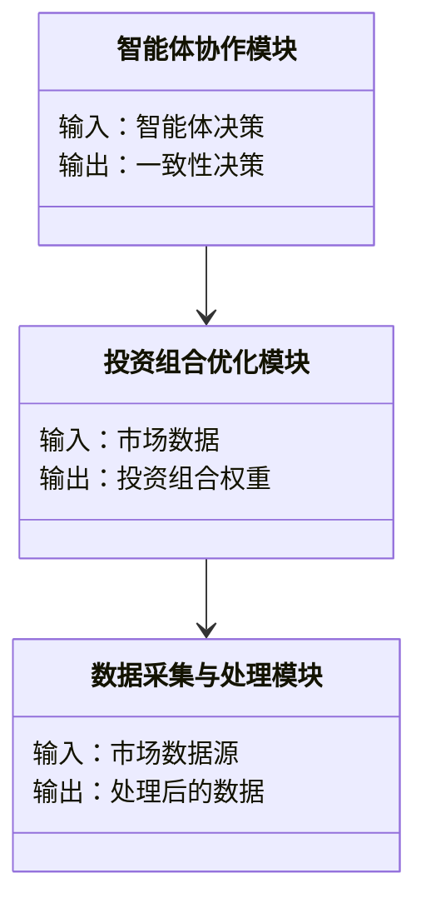
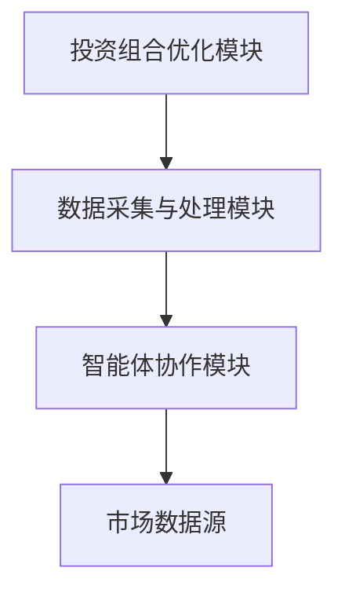
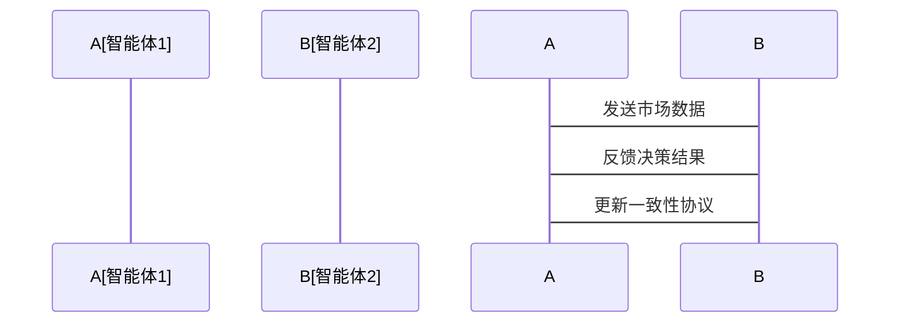

                 


# 多智能体协作实现全球价值投资策略

## 关键词：多智能体协作、全球价值投资、一致性协议、分布式计算、投资组合优化

## 摘要：  
本文深入探讨了多智能体协作在实现全球价值投资策略中的应用。通过分析多智能体协作的核心原理，结合全球价值投资的数学模型，详细阐述了如何利用多智能体协作算法优化投资组合，降低风险，实现全球范围内的价值投资。文章从背景介绍到系统实现，再到实际案例分析，全面解析了多智能体协作在金融领域的创新应用。

---

# 第1章: 多智能体协作与全球价值投资概述

## 1.1 多智能体协作的背景与意义  
### 1.1.1 多智能体协作的基本概念  
多智能体协作是指多个智能体（Agent）通过分布式计算和通信，共同完成复杂任务的过程。智能体可以是软件程序、算法或机器人，能够感知环境、自主决策并协作完成目标。  

### 1.1.2 多智能体协作在金融领域的应用价值  
在金融领域，多智能体协作可以用于投资决策、风险控制、市场预测等场景。通过多个智能体的协作，能够实现更高效、更精准的投资策略。  

### 1.1.3 全球价值投资的核心理念  
全球价值投资是指在全球范围内寻找被低估的资产，通过长期持有实现价值增长的投资策略。其核心理念是通过深入分析资产的内在价值，找到市场定价偏差的投资机会。  

---

## 1.2 多智能体协作与全球价值投资的关系  
### 1.2.1 多智能体协作的优势  
1. **分布式计算能力**：多智能体可以通过分布式计算快速处理海量数据，提升投资决策的效率。  
2. **多样化决策能力**：多个智能体可以分别关注不同的市场或资产，提供多样化的投资建议。  
3. **风险分散**：通过多智能体的协作，可以分散投资风险，避免单点故障。  

### 1.2.2 全球价值投资的特点  
1. **全球化视角**：关注全球市场的投资机会，避免地域限制。  
2. **长期性**：注重资产的内在价值，而非短期价格波动。  
3. **逆向思维**：在市场低估时买入，在市场高估时卖出。  

---

## 1.3 本章小结  
本章介绍了多智能体协作的基本概念及其在金融领域的应用价值，重点阐述了全球价值投资的核心理念和特点。通过分析多智能体协作与全球价值投资的关系，为后续章节的深入探讨奠定了基础。

---

# 第2章: 多智能体协作的核心概念与联系  

## 2.1 多智能体协作的核心原理  
### 2.1.1 一致性协议  
一致性协议是多智能体协作的核心机制之一，用于确保多个智能体之间的数据一致性和决策一致性。常见的一致性协议包括Paxos、Raft等。  

### 2.1.2 分布式计算与多智能体协作的关系  
分布式计算是多智能体协作的技术基础，通过将任务分解为多个智能体协同完成，实现高效计算和决策。  

### 2.1.3 多智能体协作的通信机制  
多智能体之间通过消息传递实现通信，消息内容包括数据、决策和状态更新等。  

---

## 2.2 全球价值投资的数学模型与公式  
### 2.2.1 投资组合优化的数学模型  
$$ \text{目标函数：} \quad \min_{w} \frac{1}{2}w^T \Sigma w + \lambda |w|^2 $$  
其中，$w$是投资组合权重向量，$\Sigma$是资产之间的协方差矩阵，$\lambda$是正则化参数。  

### 2.2.2 风险收益平衡的数学表达  
$$ \text{风险：} \quad \text{Var}(r) = w^T \Sigma w $$  
$$ \text{收益：} \quad \text{E}(r) = w^T \mu $$  
其中，$\mu$是资产的期望收益向量。  

---

## 2.3 多智能体协作与全球价值投资的结合  
### 2.3.1 多智能体协作在价值投资中的应用  
通过多个智能体分别分析不同的市场、行业和资产，最终形成一致的投资决策。  

### 2.3.2 多智能体协作与全球市场的关系  
多智能体协作能够实时监控全球市场数据，捕捉市场定价偏差，为全球价值投资提供支持。  

---

## 2.4 本章小结  
本章详细阐述了多智能体协作的核心原理及其在价值投资中的应用，重点分析了多智能体协作与全球市场的关系。通过数学模型和公式，进一步明确了多智能体协作在投资决策中的重要作用。

---

# 第3章: 多智能体协作的算法原理与数学模型  

## 3.1 多智能体协作算法概述  
### 3.1.1 基于一致性协议的多智能体协作  
一致性协议是确保多智能体协作的核心机制，通过协商一致实现数据和决策的同步。  

### 3.1.2 分布式计算与多智能体协作的关系  
分布式计算为多智能体协作提供了技术基础，通过任务分解和并行计算提升效率。  

### 3.1.3 多智能体协作算法的分类  
1. **一致性协议**：Paxos、Raft等。  
2. **分布式优化算法**：如分布式梯度下降。  
3. **协调与通信算法**：如基于Gossip协议的通信机制。  

---

## 3.2 一致性协议的实现原理  
### 3.2.1 Paxos一致性协议  
Paxos一致性协议通过选举一个主节点，协调多个智能体之间的数据一致性。  

### 3.2.2 Raft一致性协议  
Raft一致性协议通过领导者选举和日志同步实现数据一致性。  

---

## 3.3 投资组合优化的算法实现  
### 3.3.1 投资组合优化的数学模型  
$$ \min_{w} \frac{1}{2}w^T \Sigma w + \lambda |w|^2 $$  
$$ \text{约束条件：} \quad \sum_{i=1}^{n} w_i = 1 $$  

### 3.3.2 算法实现步骤  
1. 初始化权重向量$w$。  
2. 计算协方差矩阵$\Sigma$和期望收益向量$\mu$。  
3. 通过优化算法求解目标函数，得到最优权重向量。  

---

## 3.4 本章小结  
本章详细分析了多智能体协作算法的实现原理，重点阐述了一致性协议和投资组合优化算法。通过数学模型和算法步骤，明确了多智能体协作在投资决策中的具体应用。

---

# 第4章: 多智能体协作的系统分析与架构设计  

## 4.1 系统分析与设计  
### 4.1.1 问题场景介绍  
多智能体协作系统需要实时处理全球市场数据，支持分布式计算和投资决策。  

### 4.1.2 系统功能设计  
1. 数据采集与处理模块：实时采集全球市场数据。  
2. 投资组合优化模块：基于数学模型优化投资组合。  
3. 智能体协作模块：通过一致性协议实现多智能体协作。  

---

## 4.2 系统架构设计  
### 4.2.1 领域模型设计  


### 4.2.2 系统架构图  


---

## 4.3 接口设计与交互流程  
### 4.3.1 接口设计  
1. 数据接口：提供市场数据的读取和写入功能。  
2. 协作接口：支持智能体之间的通信与协作。  

### 4.3.2 交互流程图  


---

## 4.4 本章小结  
本章通过系统分析与架构设计，明确了多智能体协作系统的功能模块和交互流程。通过领域模型和系统架构图，进一步细化了系统的实现细节。

---

# 第5章: 多智能体协作的项目实战  

## 5.1 项目环境安装与配置  
### 5.1.1 环境要求  
1. Python 3.8及以上版本。  
2. 安装必要的库：numpy、pandas、scipy、matplotlib。  

### 5.1.2 安装步骤  
```bash
pip install numpy pandas scipy matplotlib
```

---

## 5.2 系统核心实现源代码  
### 5.2.1 投资组合优化模块  
```python
import numpy as np
import pandas as pd

def optimize_portfolio(cov_matrix, mu, lambda_reg=0.01):
    n = cov_matrix.shape[0]
    # 定义目标函数
    def objective(w):
        return 0.5 * np.dot(w.T, np.dot(cov_matrix, w)) + lambda_reg * np.dot(w.T, w)
    
    # 定义约束条件
    def constraint(w):
        return np.sum(w) - 1
    
    # 使用SLSQP求解器
    from scipy.optimize import minimize
    result = minimize(objective, np.ones(n)/n, method='SLSQP', 
                      constraints=[{'type': 'eq', 'fun': constraint}])
    return result.x
```

---

## 5.3 代码应用解读与分析  
### 5.3.1 代码功能解读  
上述代码实现了投资组合优化模块，通过优化算法求解最优权重向量。  

### 5.3.2 代码实现细节  
1. 使用`numpy`和`scipy`进行矩阵运算和优化。  
2. 通过`SLSQP`求解器实现有约束优化。  

---

## 5.4 实际案例分析  
### 5.4.1 案例背景  
假设我们有三个资产，协方差矩阵和期望收益向量已知。  

### 5.4.2 案例实现  
```python
mu = np.array([0.1, 0.2, 0.15])
cov_matrix = np.array([
    [0.02, 0.01, 0.01],
    [0.01, 0.03, 0.02],
    [0.01, 0.02, 0.03]
])
weights = optimize_portfolio(cov_matrix, mu)
print("优化后的权重：", weights)
```

---

## 5.5 项目小结  
本章通过项目实战，详细解读了多智能体协作系统的实现过程。通过代码实现和案例分析，进一步验证了理论的可行性。

---

# 第6章: 最佳实践与总结  

## 6.1 小结  
多智能体协作在实现全球价值投资策略中具有重要的作用，通过分布式计算和一致性协议，能够提升投资决策的效率和准确性。  

## 6.2 注意事项  
1. 数据质量和实时性是多智能体协作系统的关键。  
2. 需要注意系统安全性和数据隐私保护。  

## 6.3 拓展阅读  
1. 《分布式系统：原理与实现》  
2. 《投资学原理》  

---

# 结语  
通过本文的深入分析和实战案例，我们清晰地看到多智能体协作在实现全球价值投资策略中的巨大潜力。未来，随着人工智能和分布式计算技术的进一步发展，多智能体协作将在金融领域发挥更大的作用。

---

