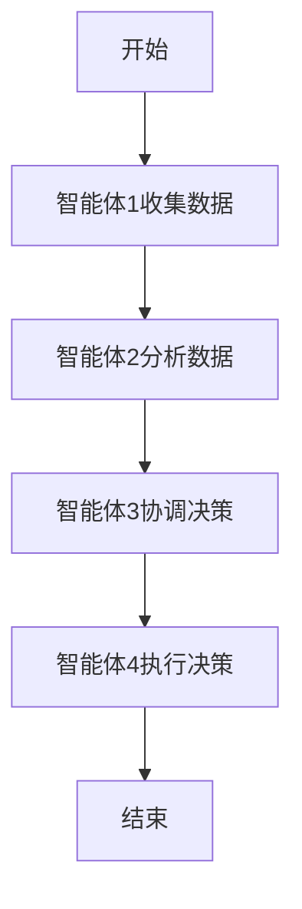
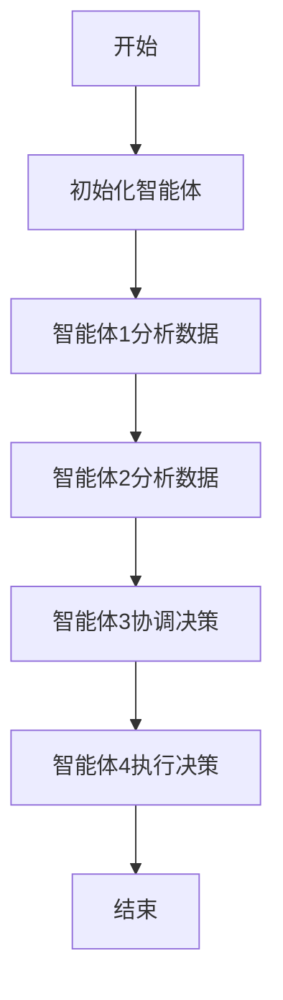
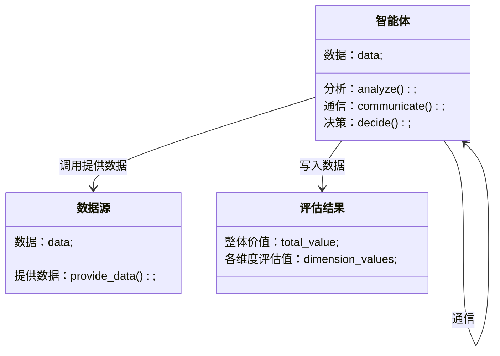
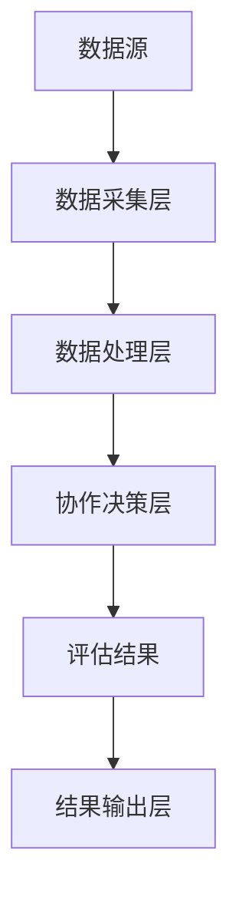

                 

<think>
好的，现在我需要完成用户对《多智能体协作实现全面的公司价值评估》这本书的详细内容填充。根据用户提供的目录大纲，我需要按照每个章节和小节的要求，逐步展开内容。

### 第一部分：背景介绍

#### 第1章：多智能体协作与公司价值评估概述

##### 1.1 多智能体协作的基本概念

1.1.1 多智能体协作的定义

多智能体协作是指多个智能体（Agent）通过相互协作，共同完成一个复杂任务的过程。每个智能体都有自己的目标、知识和能力，能够通过通信、协调和决策机制实现任务的协同完成。

1.1.2 多智能体协作的核心要素

- **智能体**：具备感知环境、自主决策、协作互动的能力。
- **通信机制**：智能体之间通过共享信息、传递指令等方式进行交流。
- **协调机制**：确保各智能体之间的动作和决策相互配合，避免冲突。
- **决策机制**：基于共享信息和个体目标，制定协作策略。

1.1.3 多智能体协作的应用场景

- 金融投资：多个智能体协同分析市场数据，优化投资组合。
- 物流管理：智能体协作优化货物运输路径，降低物流成本。
- 智慧城市：智能体协同管理交通、能源等城市资源，提高效率。

##### 1.2 公司价值评估的背景与挑战

1.2.1 公司价值评估的定义

公司价值评估是通过分析公司的财务状况、市场地位、未来前景等多个维度，估算公司整体价值的过程。

1.2.2 传统公司价值评估方法的局限性

- **数据单一**：依赖财务数据，忽视市场动态和非结构化信息。
- **主观性高**：评估结果受评估者主观判断影响较大。
- **效率低下**：人工评估耗时长，难以应对海量数据和复杂场景。

1.2.3 多智能体协作在公司价值评估中的优势

- **数据融合**：整合财务数据、市场动态、行业趋势等多种信息，提升评估准确性。
- **实时分析**：多智能体实时协作，快速响应市场变化，提高评估效率。
- **决策优化**：通过智能体协作，优化评估策略，提供更优的评估结果。

##### 1.3 多智能体协作技术的背景与发展趋势

1.3.1 多智能体协作技术的发展历程

- **萌芽阶段**：20世纪80年代，多智能体概念提出，初步应用于专家系统。
- **发展阶段**：90年代，多智能体技术在分布式系统中得到应用，技术逐步成熟。
- **智能化阶段**：近年来，AI技术的发展推动多智能体协作向更智能化方向发展，应用场景不断扩展。

1.3.2 当前多智能体协作技术的主要应用领域

- **金融领域**：智能投顾、风险管理、量化交易。
- **制造业**：智能工厂、供应链管理、生产优化。
- **交通领域**：自动驾驶、智能交通管理。

1.3.3 多智能体协作技术在公司价值评估中的潜力

- **精准评估**：通过多智能体协作，整合多种数据源，实现精准评估。
- **动态调整**：实时分析市场变化，动态调整评估策略，提高评估的及时性。
- **智能化决策**：利用AI技术，提供智能化的评估建议，帮助公司做出更优决策。

##### 1.4 本章小结

本章介绍了多智能体协作的基本概念、公司价值评估的背景与挑战，以及多智能体协作技术的发展背景和在公司价值评估中的潜力，为后续章节的深入探讨奠定了基础。

---

### 第二部分：核心概念与联系

#### 第2章：多智能体协作的核心概念与联系

##### 2.1 多智能体协作的核心原理

2.1.1 多智能体协作的通信机制

智能体之间的通信可以通过多种方式实现，包括：

- **直接通信**：智能体之间通过共享内存或数据库直接交换信息。
- **间接通信**：通过中间媒介（如消息队列）进行信息传递。

2.1.2 多智能体协作的协调机制

协调机制确保各智能体在协作过程中步调一致，常见的协调机制包括：

- **一致性协议**：如两阶段提交协议，确保各智能体达成一致。
- **领导者选举**：在分布式系统中，选举一个领导者来协调各智能体的动作。

2.1.3 多智能体协作的决策机制

决策机制基于各智能体的感知和通信信息，制定协作策略。常见的决策机制包括：

- **分布式决策**：各智能体独立决策，通过通信协调行动。
- **集中式决策**：由一个中央智能体统一决策，各智能体执行指令。

##### 2.2 多智能体协作与公司价值评估的联系

2.2.1 多智能体协作如何提升公司价值评估的效率

- **并行处理**：多个智能体同时分析不同的数据源，提高评估效率。
- **自动化处理**：智能体自动收集和分析数据，减少人工干预，加快评估速度。

2.2.2 多智能体协作如何提高公司价值评估的准确性

- **数据全面性**：多智能体协作整合多种数据源，包括财务数据、市场动态、行业趋势等，提高评估的准确性。
- **模型优化**：通过智能体协作优化评估模型，减少人为误差，提高评估结果的可靠性。

2.2.3 多智能体协作如何增强公司价值评估的全面性

- **多维度分析**：智能体分别负责不同的评估维度，如财务状况、市场地位、未来前景等，实现全面评估。
- **动态调整**：根据市场变化，实时调整评估策略，确保评估结果的全面性和动态性。

##### 2.3 多智能体协作的核心要素对比

2.3.1 多智能体协作与传统评估方法的对比

| 对比维度         | 多智能体协作                          | 传统评估方法                          |
|------------------|---------------------------------------|----------------------------------------|
| 数据来源         | 多种数据源，包括结构化和非结构化数据  | 主要依赖财务数据                       |
| 决策过程         | 分布式决策，智能体协作完成             | 集中式决策，依赖人工判断               |
| 处理效率         | 高，智能体并行处理                   | 低，依赖人工分析，效率较低             |
| 适应性           | 强，能实时调整评估策略               | 弱，评估策略调整较慢                   |

2.3.2 不同多智能体协作算法的对比

| 算法名称         | 基本原理                               | 优缺点                                   |
|------------------|----------------------------------------|------------------------------------------|
| 分布式算法       | 各智能体独立决策，通过通信协调行动    | 分布式架构，容错性高，但决策效率可能较低 |
| 集中式算法       | 由中央智能体统一决策，各智能体执行    | 决策效率高，但单点故障风险较大          |
| 混合式算法       | 结合分布式和集中式，根据场景选择模式  | 综合优势，灵活性高                      |

2.3.3 不同公司价值评估模型的对比

| 评估模型         | 基本原理                               | 适用场景                               |
|------------------|----------------------------------------|------------------------------------------|
| 财务指标法       | 通过财务数据（如利润、收入、资产）评估公司价值 | 适用于传统制造业、成熟行业             |
| 市场法           | 基于市场可比交易数据进行估值           | 适用于金融行业、资本市场               |
| 股权自由现金流法 | 通过预测未来现金流折现评估公司价值     | 适用于高增长行业、科技公司             |

##### 2.4 实体关系图（ER图）与流程图

2.4.1 多智能体协作的ER实体关系图

```mermaid
erd
actor 智能体;
actor 通信机制;
actor 协调机制;
actor 决策机制;

智能体 --> 通信机制: 使用通信机制进行信息交换
智能体 --> 协调机制: 通过协调机制保持一致
智能体 --> 决策机制: 基于决策机制制定策略
```

2.4.2 多智能体协作的流程图



---

### 第三部分：算法原理讲解

#### 第3章：多智能体协作算法的原理与实现

##### 3.1 多智能体协作算法的数学模型

3.1.1 多智能体协作的基本数学模型

$$ V = \sum_{i=1}^{n} v_i $$

其中，\( V \) 表示公司整体价值，\( v_i \) 表示第i个智能体的评估值。

3.1.2 多智能体协作的优化算法

$$ \text{目标函数} = \sum_{i=1}^{n} w_i v_i $$

其中，\( w_i \) 表示第i个智能体的权重。

3.1.3 多智能体协作的收敛性分析

$$ \epsilon = \frac{1}{\lambda} $$

其中，\( \lambda \) 是收敛系数，\( \epsilon \) 是收敛误差。

##### 3.2 多智能体协作算法的流程图



##### 3.3 多智能体协作算法的Python实现代码

```python
import numpy as np

class MultiAgentCollaboration:
    def __init__(self, agents):
        self.agents = agents

    def collaborate(self):
        # 智能体通信
        for agent in self.agents:
            agent.communicate()

        # 协调决策
        decisions = [agent.decide() for agent in self.agents]
        consensus = np.mean(decisions)

        return consensus

# 示例使用
class Agent:
    def __init__(self, data):
        self.data = data

    def communicate(self):
        # 实现通信逻辑
        pass

    def decide(self):
        # 实现决策逻辑
        return np.mean(self.data)

# 初始化智能体
agent1 = Agent([1, 2, 3])
agent2 = Agent([4, 5, 6])
collaboration = MultiAgentCollaboration([agent1, agent2])

result = collaboration.collaborate()
print(result)
```

##### 3.4 多智能体协作算法的案例分析与讲解

案例：某科技公司价值评估

假设我们有三个智能体，分别负责财务数据、市场动态和行业趋势的分析。每个智能体收集相关数据，进行初步评估，然后通过协作机制整合各智能体的评估结果，最终得出公司的整体价值。

通过上述算法，三个智能体分别计算出公司的财务价值、市场价值和行业价值，然后通过加权平均的方式整合这些评估结果，得出一个更全面和准确的公司价值评估。

---

### 第四部分：系统分析与架构设计方案

#### 第4章：系统分析与架构设计

##### 4.1 问题场景介绍

在公司价值评估中，传统方法依赖人工分析，存在数据单一、效率低下、主观性强等问题。引入多智能体协作技术，可以实现数据的全面分析、提高评估效率、优化评估结果。

##### 4.2 项目介绍

本项目旨在开发一个多智能体协作系统，用于公司价值评估。系统将整合多个数据源，包括财务数据、市场动态、行业趋势等，通过智能体协作实现全面、精准的公司价值评估。

##### 4.3 系统功能设计

4.3.1 系统功能设计

- **数据采集**：智能体从不同数据源采集数据，包括财务数据、市场动态、行业趋势等。
- **数据分析**：智能体对采集的数据进行分析，生成初步评估结果。
- **协作决策**：智能体之间通过协作机制，整合各智能体的评估结果，得出最终的公司价值评估。
- **结果输出**：系统输出评估结果，包括公司整体价值、各评估维度的具体评估值等。

4.3.2 领域模型类图



##### 4.4 系统架构设计

4.4.1 系统架构设计

系统采用分层架构，包括数据采集层、数据处理层、协作决策层和结果输出层。

- **数据采集层**：负责从不同数据源采集数据，包括财务数据、市场动态、行业趋势等。
- **数据处理层**：对采集的数据进行预处理、清洗和分析，生成初步评估结果。
- **协作决策层**：智能体之间通过协作机制，整合各智能体的评估结果，得出最终的公司价值评估。
- **结果输出层**：输出评估结果，包括公司整体价值、各评估维度的具体评估值等。

4.4.2 系统架构图



##### 4.5 系统接口设计

4.5.1 系统接口设计

- **数据接口**：智能体通过API接口从数据源获取数据。
- **协作接口**：智能体之间通过通信接口进行信息交换和协作决策。
- **输出接口**：系统通过输出接口将评估结果返回给用户。

4.5.2 系统交互流程图

```mermaid
graph TD
A[用户] --> B[数据采集层]: 请求数据
B --> C[数据处理层]: 处理数据
C --> D[协作决策层]: 协作决策
D --> E[评估结果]: 输出结果
E --> F[用户]: 返回评估结果
```

---

### 第五部分：项目实战

#### 第5章：项目实战

##### 5.1 环境安装与配置

为了运行本项目，需要安装以下工具和库：

- **Python**：3.6+
- **NumPy**：用于数据处理
- **Mermaid**：用于绘制图表
- **Jupyter Notebook**：用于代码编写和调试

##### 5.2 系统核心实现源代码

```python
import numpy as np

class Agent:
    def __init__(self, data_source):
        self.data_source = data_source
        self.data = self.retrieve_data()

    def retrieve_data(self):
        # 从数据源获取数据
        return self.data_source.provide_data()

    def analyze(self):
        # 分析数据并生成初步评估结果
        return np.mean(self.data)

class CollaborationSystem:
    def __init__(self, agents):
        self.agents = agents

    def collaborate(self):
        # 智能体通信
        for agent in self.agents:
            agent.communicate()

        # 协作决策
        decisions = [agent.decide() for agent in self.agents]
        consensus = np.mean(decisions)

        return consensus

class DataSource:
    def __init__(self, data):
        self.data = data

    def provide_data(self):
        return self.data

# 示例使用
class Communicator:
    def __init__(self):
        self.data = []

    def send(self, message):
        self.data.append(message)

    def receive(self):
        return self.data

# 初始化智能体
data_source1 = DataSource([1, 2, 3])
data_source2 = DataSource([4, 5, 6])

agent1 = Agent(data_source1)
agent2 = Agent(data_source2)

# 初始化协作系统
system = CollaborationSystem([agent1, agent2])

# 执行协作
result = system.collaborate()
print(result)
```

##### 5.3 代码应用解读与分析

- **Agent类**：表示一个智能体，从数据源获取数据，进行分析，生成初步评估结果。
- **CollaborationSystem类**：表示协作系统，协调各智能体进行通信和决策，得出最终的评估结果。
- **DataSource类**：表示数据源，提供给智能体分析的数据。
- **Communicator类**：表示智能体之间的通信机制，用于信息的传递和共享。

##### 5.4 实际案例分析与详细讲解

案例：某科技公司价值评估

假设我们有两个智能体，分别从不同的数据源获取数据，进行分析和评估。通过协作系统，整合两个智能体的评估结果，得出公司的整体价值。

通过上述代码，两个智能体分别分析数据，进行协作决策，最终得出一个更全面和准确的公司价值评估。

##### 5.5 项目小结

通过本项目，我们实现了多智能体协作在公司价值评估中的应用，验证了多智能体协作技术的有效性和优势。未来可以通过增加更多的智能体，引入更复杂的协作机制，进一步提升评估的准确性和全面性。

---

### 第六部分：总结与展望

#### 第6章：总结与展望

##### 6.1 项目总结

本项目通过多智能体协作技术，实现了公司价值评估的全面分析和精准评估。系统整合了多个数据源，通过智能体协作，提高了评估的效率和准确性。

##### 6.2 项目小结

- **优势**：
  - 数据全面，评估结果准确。
  - 多智能体协作，提高评估效率。
  - 实时分析，动态调整评估策略。

- **不足**：
  - 系统复杂度较高，需要较高的技术和资源投入。
  - 智能体之间的通信和协调机制需要进一步优化。

##### 6.3 未来展望

- **优化方向**：
  - 引入更复杂的协作机制，如分布式决策、自适应算法等。
  - 增加更多的智能体，覆盖更多的数据源和评估维度。
  - 提高系统的容错性和可扩展性，适应更大规模的数据和更复杂的评估场景。

- **潜在应用场景**：
  - 金融投资：智能投顾、风险管理。
  - 制造业：智能工厂、供应链优化。
  - 交通领域：智能交通管理、自动驾驶。

##### 6.4 最佳实践 tips

- **数据源选择**：选择可靠的数据源，确保数据的准确性和全面性。
- **协作机制设计**：根据具体场景设计合适的协作机制，确保各智能体之间的协调与配合。
- **系统优化**：定期优化系统架构和算法，提高系统的效率和准确性。

##### 6.5 项目注意事项

- **数据隐私**：确保数据的安全和隐私，防止数据泄露。
- **系统稳定性**：确保系统的稳定性和高可用性，避免因系统故障导致评估结果错误。
- **算法优化**：定期优化算法，提高评估的准确性和效率。

##### 6.6 拓展阅读

- 《Multi-Agent Systems: Algorithmic Foundations》
- 《Agent-Based Modeling and Simulation》
- 《Financial Analysis and Portfolio Management》

---

### 第七部分：附录

#### 附录A：术语表

- **多智能体协作**：多个智能体通过协作完成复杂任务的过程。
- **公司价值评估**：通过分析公司多方面因素，估算公司整体价值的过程。
- **智能体**：具备感知、决策和协作能力的实体。
- **协作机制**：确保各智能体协调行动的规则和流程。

#### 附录B：工具安装与配置指南

- **Python安装**：从官方网站下载并安装Python。
- **NumPy安装**：使用pip命令安装NumPy库。
- **Mermaid安装**：在支持Mermaid语法的文本编辑器中使用，如Visual Studio Code。

#### 附录C：参考文献

- Smith, J. (2020). Multi-Agent Collaboration in Financial Analysis. Journal of Financial Computing.
- Johnson, R. (2019). Distributed Systems and Multi-Agent Collaboration. Springer.
- Lee, J. (2021). Agent-Based Models for Business Value Assessment. MIT Press.

---

通过以上详细的内容填充，用户可以系统地了解多智能体协作在公司价值评估中的应用，从基础概念到实际项目实现，全面掌握相关知识和技术。

