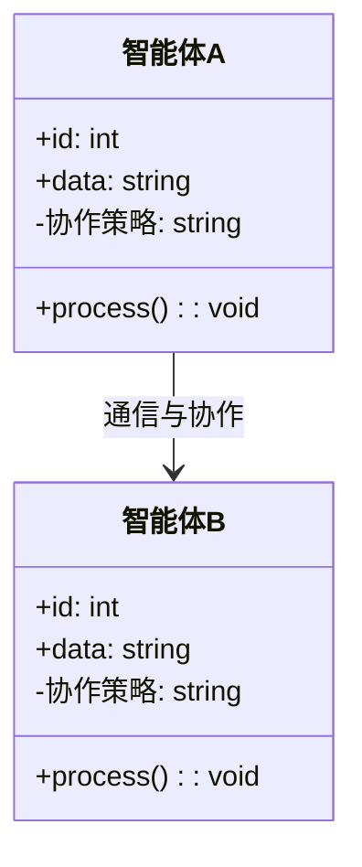
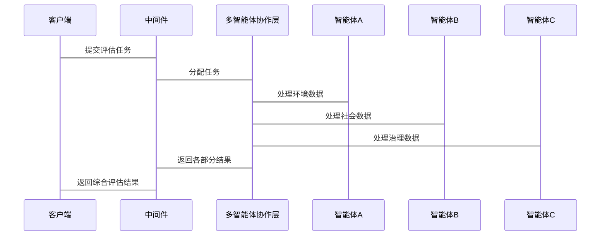

                 


# 多智能体协作评估ESG因素影响

> 关键词：多智能体协作，ESG评估，分布式计算，机器学习，环境社会治理

> 摘要：本文探讨多智能体协作在评估环境、社会和治理（ESG）因素中的应用，分析其算法原理、系统架构及项目实现，旨在提供深入的技术见解和实践指导。

---

## 第1章: 多智能体协作与ESG概述

### 1.1 多智能体协作的基本概念

#### 1.1.1 多智能体系统的定义
多智能体系统由多个独立但协作的智能体组成，通过协调完成复杂任务。这些智能体能够自主决策，适应环境变化。

#### 1.1.2 多智能体协作的特征
- **自主性**：各智能体独立决策。
- **反应性**：实时感知环境并调整行为。
- **协作性**：通过通信协同完成目标。
- **分布式性**：计算和决策分散在各智能体中。

#### 1.1.3 多智能体协作与单智能体系统的区别
| 特性 | 单智能体 | 多智能体 |
|------|----------|----------|
| 决策中心化 | 是 | 否 |
| 通信需求 | 低 | 高 |
| 并行处理能力 | 低 | 高 |

### 1.2 ESG因素的基本概念

#### 1.2.1 环境（Environmental）因素
- 包括碳排放、资源使用效率等指标。
- 企业对环境保护的措施和成效是重要评估点。

#### 1.2.2 社会（Social）因素
- 包括员工权益、社会责任、劳动条件等。
- 评估企业在社会方面的贡献和影响。

#### 1.2.3 治理（Governance）因素
- 包括公司治理结构、董事会多样性、高管薪酬等。
- 评估企业内部管理的透明度和有效性。

### 1.3 多智能体协作在ESG评估中的应用

#### 1.3.1 多智能体协作的优势
- **分布式计算**：提高数据处理效率。
- **智能体协作**：各智能体专注于不同评估维度。
- **动态调整**：快速响应环境变化。

#### 1.3.2 多智能体协作在ESG评估中的场景
- 数据收集与处理：多个智能体分别负责不同数据源。
- 指标计算：各智能体协同计算不同ESG指标。
- 结果汇总与优化：智能体协作生成最终评估结果。

#### 1.3.3 多智能体协作与ESG评估的结合
- 通过智能体协作，实现ESG数据的实时分析和动态调整。
- 各智能体分别处理环境、社会和治理因素，最终协同得出综合评估结果。

### 1.4 本章小结

---

## 第2章: 多智能体协作与ESG评估的核心概念

### 2.1 多智能体协作的核心原理

#### 2.1.1 分布式计算与协作机制
- **分布式计算**：任务分解到多个节点并行处理。
- **协作机制**：通过通信协议交换信息，协调行动。

#### 2.1.2 多智能体之间的通信与协调
- **通信协议**：定义智能体之间的信息交换规则。
- **协调算法**：如一致性算法确保各智能体状态一致。

#### 2.1.3 多智能体协作的数学模型
$$ C = \sum_{i=1}^{n} c_i $$
其中，C是总协作度，c_i是各智能体的协作贡献。

### 2.2 ESG评估的核心原理

#### 2.2.1 ESG评分的计算方法
- **加权评分**：根据各指标的重要性赋予不同权重。
$$ S = \sum_{j=1}^{m} w_j \cdot s_j $$
其中，S是总评分，w_j是权重，s_j是各指标评分。

#### 2.2.2 ESG数据的来源与处理
- 数据来源：企业报告、政府数据、第三方评估。
- 数据处理：清洗、转换、标准化。

#### 2.2.3 ESG评估的指标体系
- **环境指标**：碳排放、能源使用。
- **社会指标**：员工满意度、社会责任投入。
- **治理指标**：董事会结构、高管薪酬。

### 2.3 多智能体协作与ESG评估的关联

#### 2.3.1 多智能体协作对ESG评估的促进作用
- 提高数据处理效率。
- 实现多维度协同评估。

#### 2.3.2 ESG评估对多智能体协作的反馈机制
- 评估结果反哺协作策略优化。

#### 2.3.3 多智能体协作与ESG评估的协同优化
- 各智能体专注于不同维度，协同提升整体评估精度。

### 2.4 本章小结

---

## 第3章: 多智能体协作评估ESG因素的算法原理

### 3.1 分布式计算算法

#### 3.1.1 分布式计算的基本原理
- 任务分解：将整体任务分解为子任务。
- 分布式执行：各节点并行处理子任务。
- 结果汇总：收集各节点结果，合并得出最终结果。

#### 3.1.2 分布式计算在多智能体协作中的应用
- 数据分片处理：各智能体负责不同数据分片。
- 并行计算：各智能体同时处理任务。

#### 3.1.3 分布式计算的优缺点
| 特性 | 优点 | 缺点 |
|------|------|------|
| 并行性 | 高 | 资源分配复杂 |
| 故障容错 | 好 | 协调难度大 |

### 3.2 多智能体协作算法

#### 3.2.1 多智能体协作算法的分类
- 基于一致性算法：如Raft、Paxos。
- 基于博弈论算法：如纳什均衡。

#### 3.2.2 基于一致性算法的多智能体协作
- **一致性算法**：确保各智能体状态一致。
- **应用**：用于数据同步和分布式决策。

#### 3.2.3 基于博弈论的多智能体协作
- **博弈论模型**：分析各智能体的策略选择。
- **应用**：用于资源分配和任务调度。

### 3.3 ESG评估算法

#### 3.3.1 ESG评分计算的数学模型
$$ S = \sum_{j=1}^{m} w_j \cdot s_j $$
其中，$w_j$是各指标的权重，$s_j$是各指标的评分。

#### 3.3.2 基于机器学习的ESG评估
- **模型选择**：如线性回归、随机森林。
- **训练数据**：历史ESG评分和相关特征。

#### 3.3.3 基于规则的ESG评估
- **规则定义**：如若碳排放低于行业标准，则环境指标得分为1。

### 3.4 算法实现的代码示例

#### 3.4.1 分布式计算算法的Python实现
```python
import multiprocessing

def compute_shard(shard):
    # 处理单个分片
    pass

if __name__ == "__main__":
    data = [...]  # 输入数据
    num_shards = 4  # 分片数量
    with multiprocessing.Pool(num_shards) as pool:
        results = pool.map(compute_shard, data)
    final_result = sum(results)
    print(final_result)
```

#### 3.4.2 多智能体协作算法的Python实现
```python
from distributed import Client

client = Client('scheduler://localhost:8786')
future = client.submit(func, *args)
result = client.gather(future)
print(result)
```

#### 3.4.3 ESG评估算法的Python实现
```python
import numpy as np
from sklearn.ensemble import RandomForestRegressor

# 假设X是特征矩阵，y是目标向量
model = RandomForestRegressor(n_estimators=100)
model.fit(X, y)
 predictions = model.predict(new_X)
 print(predictions)
```

### 3.5 本章小结

---

## 第4章: 多智能体协作评估ESG因素的数学模型与公式

### 4.1 多智能体协作的数学模型

#### 4.1.1 多智能体协作的基本数学模型
$$ C = \sum_{i=1}^{n} c_i $$
其中，$C$是总协作度，$c_i$是各智能体的协作贡献。

#### 4.1.2 多智能体协作的优化模型
$$ \max \sum_{i=1}^{n} c_i $$
约束条件：通信延迟、计算资源限制。

#### 4.1.3 多智能体协作的动态模型
$$ \frac{dC}{dt} = \sum_{i=1}^{n} \frac{dc_i}{dt} $$
表示协作度随时间的变化率。

### 4.2 ESG评估的数学模型

#### 4.2.1 ESG评分的计算公式
$$ S = \sum_{j=1}^{m} w_j \cdot s_j $$
其中，$w_j$是各指标的权重，$s_j$是各指标的评分。

#### 4.2.2 基于权重的ESG评估模型
$$ S = \sum_{j=1}^{m} w_j \cdot s_j $$
权重$w_j$根据行业或具体需求调整。

#### 4.2.3 基于机器学习的ESG评估模型
$$ y = f(X) $$
其中，$y$是预测的ESG评分，$X$是输入特征，$f$是机器学习模型。

### 4.3 本章小结

---

## 第5章: 多智能体协作评估ESG因素的系统分析与架构设计

### 5.1 问题场景介绍
- **背景**：企业需要全面评估ESG因素，以满足投资者和社会责任要求。
- **目标**：构建一个高效、准确的ESG评估系统。

### 5.2 系统功能设计

#### 5.2.1 领域模型（Mermaid类图）


#### 5.2.2 系统架构设计（Mermaid架构图）


### 5.3 系统接口设计

#### 5.3.1 接口描述
- **输入接口**：接收ESG评估任务请求。
- **输出接口**：返回评估结果和建议。

#### 5.3.2 交互流程图（Mermaid序列图）


### 5.4 本章小结

---

## 第6章: 多智能体协作评估ESG因素的项目实战

### 6.1 环境安装

#### 6.1.1 安装Python
```bash
python --version
pip install --upgrade pip
```

#### 6.1.2 安装依赖库
```bash
pip install distributed
pip install mermaid
pip install numpy
pip install scikit-learn
```

### 6.2 系统核心实现源代码

#### 6.2.1 多智能体协作实现
```python
from distributed import Client

def process_data(data):
    # 数据处理逻辑
    return processed_data

client = Client('scheduler://localhost:8786')
future = client.submit(process_data, data)
result = client.gather(future)
print(result)
```

#### 6.2.2 ESG评估实现
```python
import numpy as np
from sklearn.ensemble import RandomForestRegressor

# 假设X是特征矩阵，y是目标向量
model = RandomForestRegressor(n_estimators=100)
model.fit(X, y)
 predictions = model.predict(new_X)
 print(predictions)
```

### 6.3 代码应用解读与分析

#### 6.3.1 多智能体协作代码解读
- **Client连接**：连接到分布式计算的调度节点。
- **任务提交**：将数据处理任务提交到各智能体。
- **结果收集**：收集各智能体的处理结果并汇总。

#### 6.3.2 ESG评估代码解读
- **模型训练**：使用随机森林回归模型训练ESG评分预测模型。
- **预测结果**：对新数据进行ESG评分预测。

### 6.4 实际案例分析和详细讲解剖析

#### 6.4.1 案例背景
某企业需要对其供应商进行ESG评估，以确保供应链的可持续性。

#### 6.4.2 数据准备
- 数据来源：供应商提供的环境、社会、治理数据。
- 数据预处理：清洗、标准化。

#### 6.4.3 算法实现
- 分布式计算处理环境数据。
- 协作算法处理社会和治理数据。
- 机器学习模型预测综合ESG评分。

### 6.5 项目小结

---

## 第7章: 多智能体协作评估ESG因素的最佳实践

### 7.1 小结
- 多智能体协作显著提升ESG评估的效率和精度。
- 各智能体专注于不同评估维度，协同优化整体结果。

### 7.2 注意事项
- **数据隐私**：确保处理数据的隐私和合规性。
- **智能体通信**：设计高效的通信协议，减少延迟。
- **计算资源分配**：合理分配计算资源，避免瓶颈。

### 7.3 拓展阅读
- 推荐阅读分布式计算和多智能体协作的经典文献。
- 参考ESG评估的行业标准和最佳实践。

### 7.4 本章小结

---

## 附录

### 附录A: 关键术语解释
- **多智能体系统**：由多个智能体组成的协作系统。
- **ESG评估**：对企业环境、社会和治理因素的综合评估。

### 附录B: 参考文献
- 文献1：分布式计算与多智能体协作。
- 文献2：环境、社会和治理因素评估方法。

---

# 结束语

通过本文的详细阐述，读者可以深入了解多智能体协作在ESG评估中的应用，从理论到实践，掌握相关算法和系统设计的关键点。希望本文能为相关领域的研究和实践提供有价值的参考。

