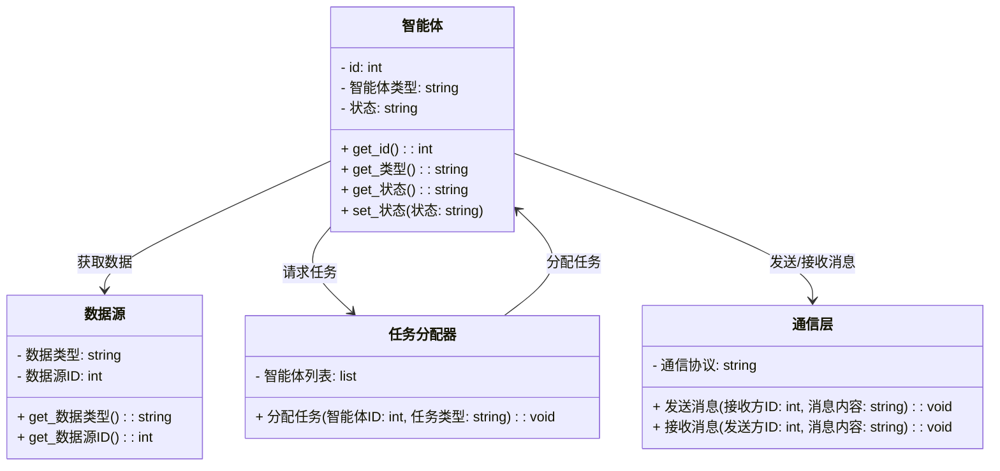
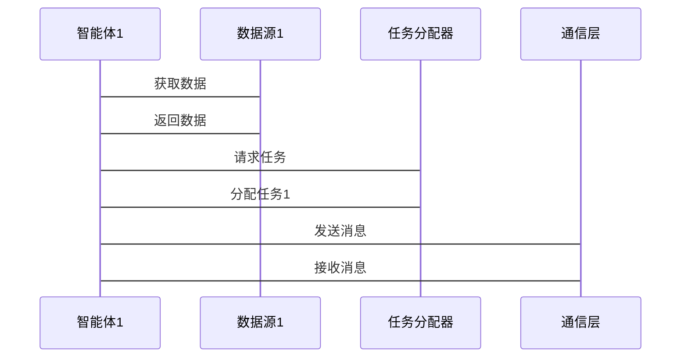

                 


# 多智能体协作评估全球宏观风险

## 关键词
多智能体协作、宏观风险评估、系统架构、算法原理、项目实战

## 摘要
本文深入探讨了多智能体协作在全球宏观风险评估中的应用。通过系统分析和实际案例，详细讲解了多智能体协作的核心概念、算法原理、系统架构设计以及项目实战。文章从背景介绍、核心概念与联系、算法实现、系统分析与设计、项目实战等多方面展开，结合数学公式、Mermaid图和Python代码，全面剖析了多智能体协作在宏观风险评估中的优势和应用。通过本文的阐述，读者可以全面理解如何利用多智能体协作技术来优化全球宏观风险评估过程。

---

# 多智能体协作评估全球宏观风险

## 第1章 多智能体协作与全球宏观风险评估背景

### 1.1 多智能体协作的基本概念

#### 1.1.1 多智能体协作的定义
多智能体协作是指多个智能体（Agent）通过通信和协调，共同完成复杂任务的过程。智能体是具有感知、决策和执行能力的实体，可以是软件程序、机器人或其他智能系统。多智能体协作的核心在于智能体之间的协同，通过信息共享和任务分配，实现整体目标的优化。

#### 1.1.2 多智能体协作的核心特征
- **自主性**：每个智能体具有独立决策能力。
- **反应性**：能够感知环境并实时调整行为。
- **协作性**：通过通信和协调共同完成任务。
- **分布式性**：智能体分布在网络中，任务分散执行。

#### 1.1.3 多智能体协作与单智能体的区别
| 特性         | 单智能体          | 多智能体协作        |
|--------------|-------------------|---------------------|
| 决策中心化    | 单一决策中心      | 分布式决策          |
| 信息共享     | 内部信息           | 高度信息共享         |
| 系统复杂性    | 较低               | 较高                |
| 故障容忍性    | 单点故障           | 分布式故障容忍       |

### 1.2 全球宏观风险评估的定义与挑战

#### 1.2.1 宏观风险的定义
宏观风险是指影响整个经济系统、国家或全球范围的潜在风险，例如经济衰退、通货膨胀、地缘政治冲突等。这些风险通常涉及多个因素的交互作用，具有高度复杂性和不确定性。

#### 1.2.2 宏观风险评估的复杂性
- **多因素交互**：经济、政治、社会等多因素相互作用。
- **数据异构性**：数据来源多样，格式和结构差异大。
- **实时性要求**：风险评估需要实时更新，以应对快速变化的环境。
- **不确定性**：部分数据缺失或不可预测。

#### 1.2.3 多智能体协作在宏观风险评估中的作用
多智能体协作能够有效应对宏观风险评估的复杂性：
- **分布式计算**：通过多个智能体分布计算，提高处理效率。
- **信息共享**：智能体之间共享数据，增强整体分析能力。
- **协同决策**：通过协作，实现更优的决策方案。

### 1.3 多智能体协作与宏观风险评估的结合

#### 1.3.1 多智能体协作在宏观风险评估中的优势
- **并行处理**：多个智能体同时处理不同数据源，提高计算速度。
- **知识互补**：每个智能体专注于特定领域，形成知识互补。
- **鲁棒性**：通过分布式协作，减少单点故障风险。

#### 1.3.2 宏观风险评估中的多智能体协作场景
- **数据采集**：智能体从不同来源采集经济数据。
- **特征提取**：智能体分析数据，提取风险特征。
- **风险评估**：智能体协同计算，得出综合风险评估结果。
- **实时更新**：智能体持续更新数据，保持评估的实时性。

#### 1.3.3 多智能体协作与宏观风险评估的未来趋势
- **智能化**：智能体具备更强的学习和自适应能力。
- **分布式计算**：利用分布式计算技术，提高处理能力。
- **实时协作**：智能体之间实现更高效的实时通信与协作。

## 第2章 多智能体协作的核心概念与原理

### 2.1 多智能体协作的核心概念与原理

#### 2.1.1 智能体的定义与分类
智能体可以分为：
- **简单反射型智能体**：基于当前感知做出反应。
- **基于模型的智能体**：利用内部模型进行决策。
- **目标驱动型智能体**：基于目标进行行动规划。

#### 2.1.2 多智能体协作的基本原理
多智能体协作通过以下步骤实现：
1. **感知环境**：智能体感知外部环境信息。
2. **信息共享**：智能体之间共享感知到的信息。
3. **任务分配**：根据智能体的能力和当前任务，分配任务。
4. **协同执行**：智能体协同执行分配的任务。
5. **反馈与调整**：根据执行结果，调整后续行动。

#### 2.1.3 多智能体协作中的通信与协调机制
- **直接通信**：智能体之间直接交换信息。
- **间接通信**：通过中间媒介进行信息传递。
- **协商机制**：智能体之间通过协商确定任务分配。

### 2.2 宏观风险评估的核心要素

#### 2.2.1 宏观风险的构成要素
宏观风险通常由以下要素构成：
- **经济指标**：GDP增长率、失业率、通货膨胀率等。
- **政治因素**：政策变化、政府债务、地缘政治冲突等。
- **社会因素**：社会稳定、人口结构、文化变迁等。
- **技术因素**：技术进步、数字化转型等。

#### 2.2.2 宏观风险评估的关键指标
- **风险概率**：风险发生的可能性。
- **风险影响**：风险发生后的潜在影响。
- **风险来源**：风险的根源和触发因素。

#### 2.2.3 宏观风险评估的数学模型
常用的宏观风险评估模型包括：
1. **线性回归模型**：用于预测风险的影响程度。
2. **贝叶斯网络**：用于分析风险之间的依赖关系。
3. **层次分析法（AHP）**：用于评估多个风险因素的权重。

### 2.3 多智能体协作与宏观风险评估的关联

#### 2.3.1 多智能体协作在宏观风险评估中的应用
- **数据采集与处理**：智能体从不同数据源采集经济数据，并进行初步处理。
- **特征提取与分析**：智能体分析数据，提取关键风险特征。
- **风险评估与预测**：智能体协同计算，得出综合风险评估结果。

#### 2.3.2 多智能体协作与宏观风险评估的相互作用
- **数据共享**：智能体之间共享数据，提高分析准确性。
- **任务分配**：根据智能体的能力，分配不同的分析任务。
- **协同决策**：通过协作，实现更优的风险评估方案。

## 第3章 多智能体协作评估全球宏观风险的算法原理

### 3.1 多智能体协作评估算法的基本原理

#### 3.1.1 算法的基本思想
多智能体协作评估算法通过以下步骤实现：
1. **数据采集**：智能体从不同数据源采集数据。
2. **数据预处理**：对采集的数据进行清洗和标准化处理。
3. **特征提取**：提取与宏观风险相关的特征。
4. **风险评估**：基于提取的特征，计算风险概率和影响。
5. **结果汇总**：将各智能体的评估结果汇总，得出最终评估结果。

#### 3.1.2 算法的数学模型
常用的数学模型包括：
1. **线性回归模型**：用于预测风险的影响程度。
2. **贝叶斯网络**：用于分析风险之间的依赖关系。
3. **集成学习**：通过集成多个模型的结果，提高评估准确性。

#### 3.1.3 算法的实现步骤
1. 初始化：智能体初始化参数和数据源。
2. 数据采集：智能体从不同数据源采集数据。
3. 数据预处理：对采集的数据进行清洗和标准化处理。
4. 特征提取：提取与宏观风险相关的特征。
5. 风险评估：基于提取的特征，计算风险概率和影响。
6. 结果汇总：将各智能体的评估结果汇总，得出最终评估结果。

### 3.2 多智能体协作评估算法的实现细节

#### 3.2.1 智能体通信与协作机制
- **直接通信**：智能体之间直接交换信息。
- **间接通信**：通过中间媒介进行信息传递。
- **协商机制**：智能体之间通过协商确定任务分配。

#### 3.2.2 数据预处理与特征提取
- **数据清洗**：去除噪声数据，确保数据质量。
- **数据标准化**：将数据转换到同一尺度，便于后续分析。
- **特征提取**：使用主成分分析（PCA）等方法提取关键特征。

#### 3.2.3 算法的数学模型
1. **线性回归模型**：用于预测风险的影响程度。
   - 模型公式：$y = \beta_0 + \beta_1x_1 + \beta_2x_2 + ... + \beta_nx_n + \epsilon$
2. **贝叶斯网络**：用于分析风险之间的依赖关系。
   - 模型结构：通过概率图表示变量之间的依赖关系。

### 3.3 算法的实现与优化

#### 3.3.1 算法实现步骤
1. 初始化：智能体初始化参数和数据源。
2. 数据采集：智能体从不同数据源采集数据。
3. 数据预处理：对采集的数据进行清洗和标准化处理。
4. 特征提取：提取与宏观风险相关的特征。
5. 风险评估：基于提取的特征，计算风险概率和影响。
6. 结果汇总：将各智能体的评估结果汇总，得出最终评估结果。

#### 3.3.2 算法优化策略
- **分布式计算**：利用分布式计算技术，提高处理能力。
- **负载均衡**：通过负载均衡技术，优化智能体之间的任务分配。
- **自适应调整**：根据实时数据，动态调整智能体的行为策略。

## 第4章 多智能体协作评估全球宏观风险的系统分析与架构设计

### 4.1 系统分析与设计

#### 4.1.1 问题场景介绍
- **数据来源**：包括经济指标、政治因素、社会因素等多方面的数据。
- **目标**：通过多智能体协作，实现对全球宏观风险的实时评估和预警。

#### 4.1.2 系统功能设计
- **数据采集模块**：负责从不同数据源采集数据。
- **数据处理模块**：对采集的数据进行清洗和标准化处理。
- **特征提取模块**：提取与宏观风险相关的特征。
- **风险评估模块**：基于提取的特征，计算风险概率和影响。
- **结果汇总模块**：将各智能体的评估结果汇总，得出最终评估结果。

#### 4.1.3 系统架构设计
- **智能体层**：包括多个智能体，每个智能体负责不同的任务。
- **通信层**：负责智能体之间的通信和数据交换。
- **控制层**：负责智能体的任务分配和协同控制。

### 4.2 系统架构设计方案

#### 4.2.1 领域模型类图


#### 4.2.2 系统架构图


#### 4.2.3 系统交互序列图


## 第5章 多智能体协作评估全球宏观风险的项目实战

### 5.1 环境安装与配置

#### 5.1.1 环境要求
- 操作系统：Linux/Windows/MacOS
- Python版本：3.6及以上
- 依赖库：numpy、pandas、scikit-learn、mermaid、matplotlib

#### 5.1.2 安装步骤
```bash
pip install numpy
pip install pandas
pip install scikit-learn
pip install mermaid
pip install matplotlib
```

### 5.2 系统核心实现源代码

#### 5.2.1 数据采集模块
```python
import requests

class 数据源:
    def __init__(self, url):
        self.url = url
        self.data = None

    def 获取数据(self):
        response = requests.get(self.url)
        if response.status_code == 200:
            self.data = response.json()
            return self.data
        else:
            return None

# 示例数据源
数据源1 = 数据源("https://api.example.com/economic-indicators")
数据源2 = 数据源("https://api.example.com/political-factors")
```

#### 5.2.2 数据处理模块
```python
import pandas as pd

class 数据处理:
    def __init__(self):
        self.data = None

    def 数据清洗(self, 数据):
        df = pd.DataFrame(数据)
        # 去除缺失值
        df = df.dropna()
        # 标准化处理
        from sklearn.preprocessing import StandardScaler
        scaler = StandardScaler()
        df_std = scaler.fit_transform(df)
        return df_std

# 使用数据处理模块
处理器 = 数据处理()
清洗后的数据 = 处理器.数据清洗([数据源1.获取数据(), 数据源2.获取数据()])
```

#### 5.2.3 风险评估模块
```python
from sklearn.linear_model import LinearRegression

class 风险评估:
    def __init__(self):
        self.model = LinearRegression()

    def 评估风险(self, 特征数据):
        self.model.fit(X_train, y_train)
        预测结果 = self.model.predict(X_test)
        return 预测结果

# 示例评估
评估器 = 风险评估()
预测结果 = 评估器.评估风险(特征数据)
```

### 5.3 项目实战小结

#### 5.3.1 实战总结
- **数据采集**：从不同数据源采集经济指标和政治因素数据。
- **数据处理**：对数据进行清洗和标准化处理。
- **风险评估**：基于线性回归模型，评估宏观风险。

#### 5.3.2 实战注意事项
- 数据源的多样性和可靠性直接影响评估结果。
- 模型的选择和参数调优对评估准确性至关重要。
- 系统的实时性和可扩展性需要通过分布式计算和优化算法来实现。

## 第6章 多智能体协作评估全球宏观风险的总结与展望

### 6.1 总结

#### 6.1.1 核心内容回顾
- 多智能体协作的基本概念和核心特征。
- 宏观风险评估的复杂性和挑战。
- 多智能体协作在宏观风险评估中的优势和应用。

#### 6.1.2 最佳实践 tips
- 数据采集与处理：确保数据的多样性和可靠性。
- 算法选择与优化：根据具体需求选择合适的算法，并进行参数调优。
- 系统架构设计：通过合理的系统架构设计，提高系统的实时性和可扩展性。

### 6.2 小结

#### 6.2.1 小结内容
多智能体协作在宏观风险评估中的应用具有重要意义。通过多智能体协作，可以实现数据的高效采集和处理，提高风险评估的准确性和实时性。同时，多智能体协作还可以通过分布式计算和协同决策，优化系统的整体性能。

#### 6.2.2 注意事项
- 数据隐私和安全：在数据采集和处理过程中，需要注意数据的隐私和安全问题。
- 系统的鲁棒性：通过设计鲁棒的系统架构，提高系统的容错性和恢复能力。
- 模型的可解释性：选择可解释性强的模型，便于分析和优化。

### 6.3 拓展阅读

#### 6.3.1 相关技术领域
- 分布式计算：研究多智能体协作的分布式计算技术。
- 人工智能：研究多智能体协作中的机器学习和深度学习技术。
- 大数据分析：研究多智能体协作在大数据分析中的应用。

#### 6.3.2 推荐书籍
- 《分布式系统：概念与设计》
- 《多智能体系统：理论与应用》
- 《宏观经济学原理》

## 结语
多智能体协作在宏观风险评估中的应用是一个复杂的系统工程，需要综合运用多种技术手段和方法。通过本文的详细阐述，读者可以全面理解多智能体协作在宏观风险评估中的应用，并在实际项目中灵活运用这些方法和技术，提高系统的整体性能和评估的准确性。

