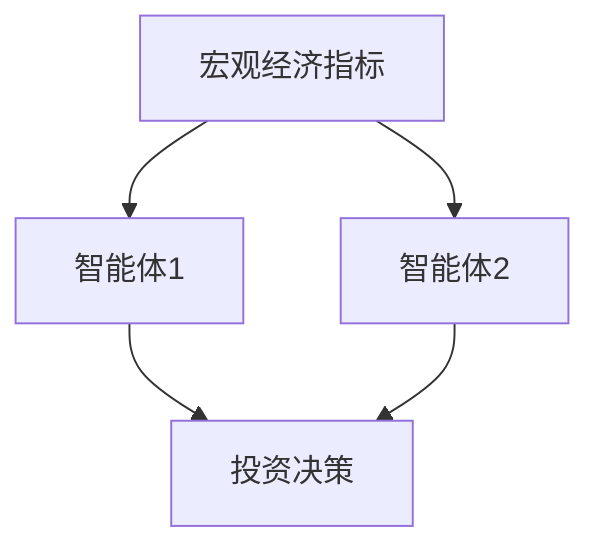
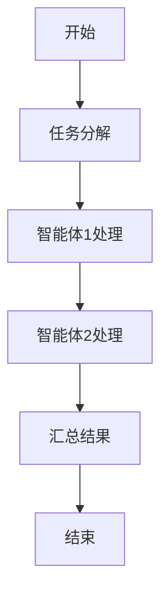
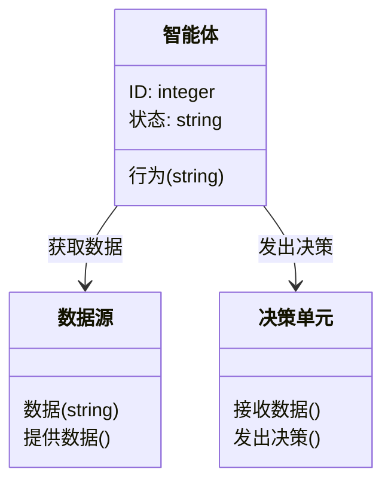
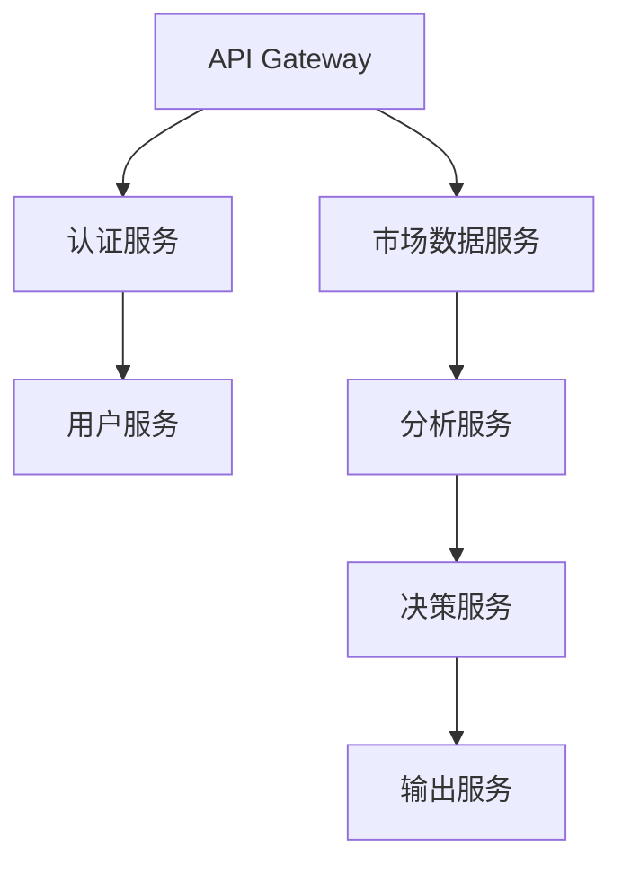

                 


# 多智能体协作进行宏观主题投资

## 关键词：
多智能体协作、宏观主题投资、人工智能、分布式计算、博弈论、收益最大化、风险控制

## 摘要：
本文探讨多智能体协作在宏观主题投资中的应用，分析其算法原理、系统架构及项目实战，通过详细的技术分析和实例，展示如何利用多智能体协作提升投资决策的准确性和效率。

---

## 第1章：多智能体协作与宏观主题投资概述

### 1.1 多智能体协作的定义与特点

多智能体协作是指多个智能体通过分布式计算和博弈论等方法，协同完成复杂任务的过程。与传统单智能体相比，多智能体协作具有以下特点：

- **分布式计算**：任务分解到多个智能体，提高效率和容错性。
- **博弈论机制**：通过策略选择和收益分配，确保协作的公平性。
- **动态适应**：能实时响应市场变化，增强适应性。

### 1.2 宏观主题投资的定义与特点

宏观主题投资关注宏观经济因素，如GDP增长、利率变动等，以投资于相关资产类别。其特点包括：

- **复杂性高**：涉及众多宏观经济指标和市场因素。
- **风险分散**：通过多元化投资降低风险。
- **周期性明显**：受经济周期影响较大。

### 1.3 多智能体协作在宏观主题投资中的应用背景

随着市场复杂性增加，单智能体难以应对多变的宏观经济环境。多智能体协作通过分布式计算和博弈论，提供更高效的决策支持。当前，技术进步使得多智能体协作在宏观主题投资中的应用成为可能，未来将有更广泛的应用前景。

---

## 第2章：多智能体协作的核心概念与联系

### 2.1 多智能体协作的核心概念

- **智能体**：具有感知环境和自主决策能力的实体。
- **协作机制**：智能体之间通过通信和协商完成任务的机制。
- **分布式计算**：任务分解到多个节点，协同完成。

### 2.2 多智能体协作与宏观主题投资的关系

通过对比分析，多智能体协作在宏观主题投资中具有明显优势。以下是对核心概念的对比：

| 概念 | 宏观主题投资 | 多智能体协作 |
|------|--------------|--------------|
| 目标 | 获取超额收益 | 协同完成任务 |
| 工具 | 市场分析、选股 | 分布式计算、博弈论 |
| 输出 | 投资策略 | 协作决策 |

此外，通过Mermaid图展示实体关系：



---

## 第3章：多智能体协作的算法原理

### 3.1 分布式计算与多智能体协作

分布式计算是多智能体协作的基础。通过任务分解和节点协同，实现高效计算。例如，在宏观主题投资中，多个智能体分别分析不同的经济指标，最终汇总形成综合决策。

#### 分布式计算流程图



#### 分布式计算代码示例

```python
import threading

def task_function(node_id, data):
    # 处理任务
    result = data[node_id]
    return result

def main():
    # 初始化数据
    data = {i: i*2 for i in range(4)}
    # 创建多个线程
    threads = []
    for i in range(4):
        t = threading.Thread(target=task_function, args=(i, data))
        threads.append(t)
    # 启动线程
    for t in threads:
        t.start()
    # 等待线程完成
    for t in threads:
        t.join()
    print("所有任务完成")

if __name__ == "__main__":
    main()
```

### 3.2 共识机制与多智能体协作

共识机制确保智能体之间达成一致。常用机制包括PoW和PoS，各有优缺点。

#### 共识机制优缺点对比

| 共识机制 | 优点 | 缺点 |
|----------|------|------|
| PoW | 安全性高 | 资源消耗大 |
| PoS | 资源消耗低 | 安全性较低 |

### 3.3 博弈论与多智能体协作

博弈论用于分析智能体之间的策略选择。例如，在投资决策中，智能体通过纳什均衡确定最优策略。

#### 博弈论案例

假设两个智能体分别分析GDP和利率，收益矩阵如下：

| 策略 | 智能体1选GDP | 智能体1选利率 |
|------|--------------|--------------|
| 智能体2选GDP | 3,3          | 0,5          |
| 智能体2选利率 | 5,0          | 1,1          |

纳什均衡为（GDP, 利率），收益为（5,0）。

---

## 第4章：数学模型与公式

多智能体协作的收益可以通过以下公式计算：

$$
\text{收益} = \sum_{i=1}^{n} \text{智能体}_i \text{的贡献}
$$

其中，$n$为智能体数量。假设每个智能体的贡献服从正态分布：

$$
X_i \sim N(\mu, \sigma^2)
$$

总收益为各智能体贡献的总和：

$$
\text{总收益} = \sum_{i=1}^{n} X_i
$$

---

## 第5章：系统分析与架构设计

### 5.1 系统功能设计

系统功能包括数据采集、分析、决策生成和反馈优化。

#### 领域模型类图



### 5.2 系统架构设计

采用微服务架构，各服务协同工作。

#### 系统架构图



---

## 第6章：项目实战

### 6.1 环境安装

需安装Python、TensorFlow、Keras等工具。

### 6.2 核心代码实现

```python
import numpy as np
from tensorflow.keras import models

def train_model(data):
    # 训练模型
    model = models.Sequential()
    model.add(layers.Dense(64, activation='relu', input_dim=data.shape[1]))
    model.add(layers.Dense(1, activation='sigmoid'))
    model.compile(optimizer='adam', loss='binary_crossentropy')
    model.fit(data, labels, epochs=10, batch_size=32)
    return model

if __name__ == "__main__":
    data = np.random.rand(100, 5)
    labels = np.random.randint(2, size=100)
    model = train_model(data)
    print("模型训练完成")
```

---

## 第7章：最佳实践与总结

### 7.1 最佳实践

- 定期更新模型参数。
- 优化通信机制，减少延迟。
- 加强数据安全，防止信息泄露。

### 7.2 小结

多智能体协作在宏观主题投资中具有显著优势，通过分布式计算和博弈论提升决策效率和准确性。

### 7.3 注意事项

- 数据质量影响结果，需确保数据准确。
- 安全问题需重视，防止攻击。
- 代码维护需规范，确保可扩展性。

### 7.4 拓展阅读

建议阅读分布式系统和博弈论的相关书籍，深入了解多智能体协作的理论基础。

---

## 结束语

通过本文的详细讲解，读者可以全面了解多智能体协作在宏观主题投资中的应用，掌握其算法原理和系统设计方法，并通过项目实战提升技术能力。未来，随着技术进步，多智能体协作将在投资领域发挥更大作用。

--- 

感谢您的阅读，希望本文对您有所帮助！

