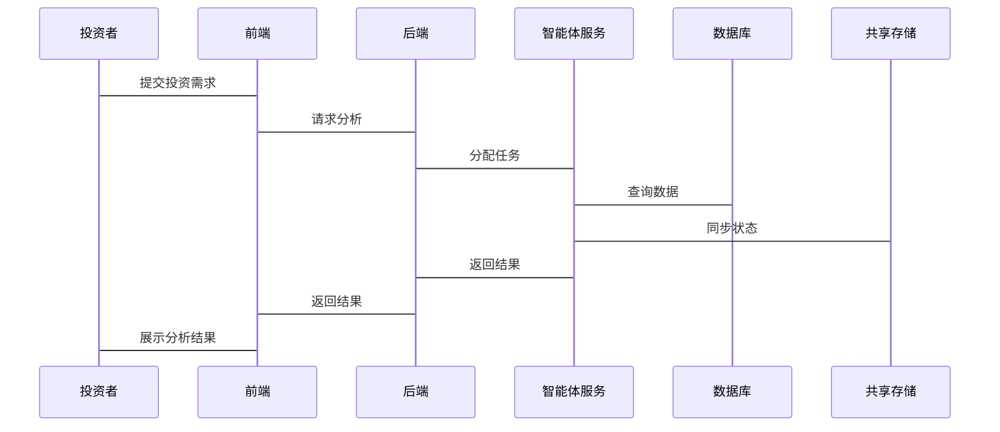

                 


# 《多智能体协作进行跨境投资分析》

---

## 关键词：
多智能体协作，跨境投资分析，分布式算法，风险评估，机器学习，自然语言处理

---

## 摘要：
本文探讨了多智能体协作在跨境投资分析中的应用，详细阐述了多智能体协作的核心概念、算法原理、系统架构及实际应用场景。通过分析跨境投资分析中的关键问题，结合多智能体协作的优势，提出了基于分布式算法和机器学习的协作框架，并通过实际案例展示了其在风险评估和投资决策中的潜力。文章还讨论了系统设计的关键要素，包括领域模型、系统架构和接口设计，并通过代码实现和流程图展示了协作机制的实现过程。

---

# 第四章: 多智能体协作的算法原理与数学模型

## 4.1 多智能体协作的算法原理
### 4.1.1 分布式协作算法
- 分布式协作的基本概念
- 多智能体之间的通信与协调机制
- 分布式算法的优势与挑战

### 4.1.2 协作目标的优化方法
- 分布式优化算法（如分布式梯度下降）
- 协作目标的分解与分配
- 协作过程中的动态调整

### 4.1.3 智能体之间的通信与协调
- 通信协议的设计
- 协作任务的分配与反馈机制
- 智能体状态的同步与一致性

## 4.2 跨境投资分析中的算法实现
### 4.2.1 数据处理与特征提取
- 数据清洗与预处理
- 特征选择与降维
- 时间序列数据的处理

### 4.2.2 风险评估与预测算法
- 风险评估模型的构建
- 机器学习算法（如随机森林、XGBoost）的应用
- 时间序列预测模型（如ARIMA、LSTM）的实现

### 4.2.3 投资决策优化算法
- 多目标优化问题的建模
- 基于强化学习的投资决策模型
- 分布式算法在投资组合优化中的应用

## 4.3 算法的数学模型与公式
### 4.3.1 分布式优化模型
$$ \min_{x_i \in X_i} \sum_{i=1}^n f_i(x_i, x_{-i}) $$
其中，$x_i$ 表示第 $i$ 个智能体的决策变量，$f_i$ 是第 $i$ 个智能体的目标函数。

### 4.3.2 风险评估模型
$$ R = \sum_{i=1}^n w_i \cdot r_i $$
其中，$w_i$ 是风险因子的权重，$r_i$ 是风险因子的值。

### 4.3.3 投资组合优化模型
$$ \max_{w} \mu^T w - \lambda w^T \Sigma w $$
其中，$w$ 是权重向量，$\mu$ 是收益向量，$\Sigma$ 是协方差矩阵，$\lambda$ 是风险厌恶系数。

## 4.4 算法实现的代码示例
### 4.4.1 数据预处理
```python
import pandas as pd
import numpy as np

# 加载数据
data = pd.read_csv('investment_data.csv')

# 数据清洗
data.dropna(inplace=True)
data = pd.get_dummies(data)
```

### 4.4.2 风险评估模型
```python
from sklearn.ensemble import RandomForestRegressor
from sklearn.metrics import mean_squared_error

# 训练风险评估模型
model = RandomForestRegressor(n_estimators=100, random_state=42)
model.fit(X_train, y_train)

# 预测风险值
y_pred = model.predict(X_test)
print('MSE:', mean_squared_error(y_test, y_pred))
```

### 4.4.3 投资决策优化
```python
import gym
from stable_baselines3 import A2C

# 定义投资决策环境
env = gym.make('StockTradingEnv')

# 使用强化学习算法训练投资决策模型
model = A2C('MlpPolicy', env, learning_rate=0.0001, n_steps=2048)
model.learn(total_timesteps=100000)
```

## 4.5 本章小结
- 介绍了多智能体协作的核心算法原理
- 展示了在跨境投资分析中的具体实现方法
- 提供了算法的数学模型和代码实现示例

---

# 第五章: 系统分析与架构设计方案

## 5.1 项目场景介绍
### 5.1.1 项目背景
- 跨境投资分析的复杂性
- 多智能体协作的优势

### 5.1.2 项目目标
- 实现多智能体协作的投资分析系统
- 提供实时风险评估和投资决策支持

## 5.2 系统功能设计
### 5.2.1 领域模型


### 5.2.2 系统架构设计


### 5.2.3 接口设计
- API定义
- 接口调用流程

### 5.2.4 交互流程图


## 5.3 系统实现
### 5.3.1 环境安装
- 安装Python、框架和依赖库
- 安装机器学习库（如TensorFlow、Scikit-learn）

### 5.3.2 核心代码实现
```python
# 初始化智能体服务
from distributed import Client

client = Client('scheduler:port')

# 提交任务到分布式计算集群
client.submit(func, *args)
```

### 5.3.3 代码解读
- 分布式任务提交
- 智能体之间的通信与协调
- 数据处理与模型训练

## 5.4 本章小结
- 介绍了系统设计的关键要素
- 展示了系统架构图和交互流程图
- 提供了核心代码实现示例

---

# 第六章: 项目实战与案例分析

## 6.1 环境安装
- 安装必要的Python库
- 配置分布式计算环境

## 6.2 核心代码实现
### 6.2.1 数据处理
```python
import pandas as pd
import numpy as np

# 加载数据
data = pd.read_csv('market_data.csv')

# 数据清洗
data = data.dropna()
data = pd.get_dummies(data)
```

### 6.2.2 模型训练
```python
from sklearn.ensemble import RandomForestClassifier
from sklearn.metrics import accuracy_score

# 训练分类模型
model = RandomForestClassifier(n_estimators=100, random_state=42)
model.fit(X_train, y_train)

# 预测并评估
y_pred = model.predict(X_test)
print('Accuracy:', accuracy_score(y_test, y_pred))
```

### 6.2.3 系统集成
```python
# 初始化多智能体协作系统
from multi_agent_system import Agent

agents = [Agent() for _ in range(5)]
for agent in agents:
    agent.start()
```

## 6.3 案例分析
### 6.3.1 数据分析结果
- 风险评估结果
- 投资决策建议

### 6.3.2 案例解读
- 案例背景
- 系统输出
- 分析结果与实际投资决策的对比

## 6.4 项目小结
- 总结项目实现的关键步骤
- 提出改进建议
- 展望未来的研究方向

---

# 第七章: 总结与展望

## 7.1 最佳实践 Tips
- 数据处理的关键性
- 模型选择的策略
- 系统设计的注意事项

## 7.2 小结
- 本文的核心内容回顾
- 多智能体协作在跨境投资分析中的价值

## 7.3 注意事项
- 数据隐私与安全
- 系统的可扩展性
- 模型的鲁棒性与适应性

## 7.4 拓展阅读
- 多智能体协作的最新研究
- 机器学习在金融领域的应用
- 自然语言处理在投资分析中的潜力

---

# 《多智能体协作进行跨境投资分析》

---

**摘要：**  
本文通过详细分析多智能体协作在跨境投资分析中的应用，展示了其在数据处理、风险评估和投资决策中的巨大潜力。通过理论与实践相结合，提出了一个基于分布式算法和机器学习的协作框架，并通过实际案例验证了其可行性和有效性。未来的研究可以进一步探索多智能体协作在金融领域的其他应用场景，如实时市场监控和动态投资组合优化。

---

**关键词：**  
多智能体协作，跨境投资分析，分布式算法，风险评估，机器学习，自然语言处理

