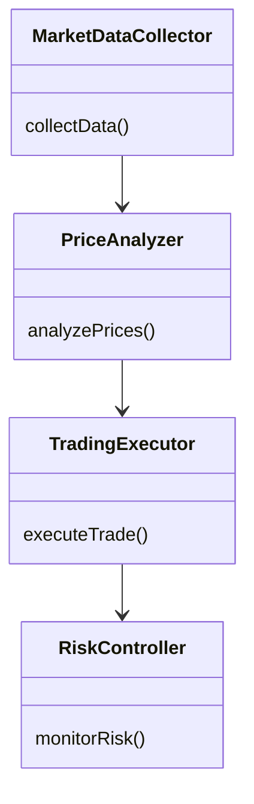
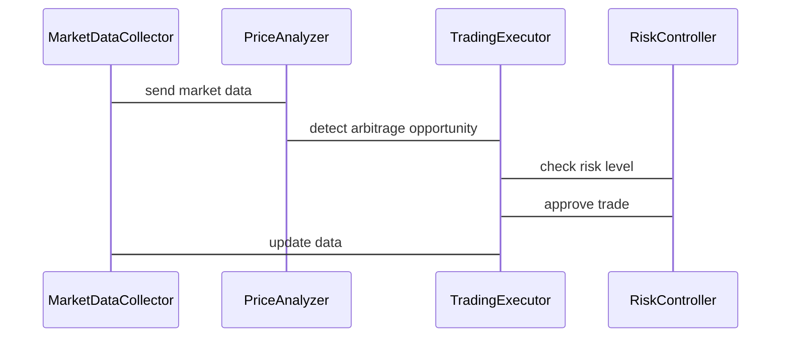

                 


# 多智能体协作进行跨市场套利

> 关键词：多智能体协作，跨市场套利，算法原理，系统架构，项目实战

> 摘要：本文深入探讨了多智能体协作在跨市场套利中的应用，分析了其核心概念、算法原理、系统架构，并通过实际案例展示了如何实现这一复杂任务。文章内容涵盖背景介绍、概念解析、算法设计、系统实现以及项目实战，旨在为读者提供全面的技术指导。

---

# 第一部分: 多智能体协作与跨市场套利背景介绍

## 第1章: 多智能体协作与跨市场套利背景介绍

### 1.1 多智能体协作的定义与特点
多智能体协作（Multi-Agent Collaboration）是指多个智能体（Agent）通过协同工作，共同完成某个复杂任务的过程。每个智能体都是一个独立的实体，能够感知环境、做出决策并采取行动。

#### 1.1.1 多智能体协作的定义
多智能体协作是一种分布式智能系统，多个智能体通过通信、协调和合作，共同完成单一智能体无法完成的任务。这种协作通常涉及信息共享、任务分配和决策优化。

#### 1.1.2 多智能体协作的核心特点
- **分布式性**：每个智能体独立运作，通过通信协作完成任务。
- **主动性**：智能体能够主动感知环境并采取行动。
- **协调性**：智能体之间需要协调行动，避免冲突。
- **适应性**：能够根据环境变化动态调整策略。

#### 1.1.3 多智能体协作与传统单智能体的区别
- **单智能体**：独立完成任务，不依赖其他实体。
- **多智能体协作**：多个智能体协同工作，利用各自优势提高效率。

### 1.2 跨市场套利的定义与特点
跨市场套利是指在不同市场之间利用价格差异进行无风险或低风险套利交易。其核心在于发现和利用价格差异。

#### 1.2.1 跨市场套利的定义
跨市场套利是指在不同市场之间同时买入和卖出同一种资产，利用价格差异赚取利润。

#### 1.2.2 跨市场套利的核心特点
- **价格差异**：不同市场之间的价格差异是套利的基础。
- **无风险性**：套利通常在短时间内完成，风险较低。
- **机会性**：依赖市场间的价格差异，机会短暂。

#### 1.2.3 跨市场套利与单市场套利的区别
- **单市场套利**：在同一市场内进行套利，依赖市场内部的价格差异。
- **跨市场套利**：在不同市场之间进行套利，利用市场间的价格差异。

### 1.3 多智能体协作在跨市场套利中的应用背景
随着全球市场的互联互通，跨市场套利的机会越来越多，但套利窗口的短暂性和复杂性使得单凭人工或单智能体难以高效完成。

#### 1.3.1 跨市场套利的挑战与难点
- **信息延迟**：市场数据的实时性要求高。
- **价格波动**：价格波动快，套利机会短暂。
- **多市场协调**：需要在多个市场之间协调行动。

#### 1.3.2 多智能体协作的优势与潜力
- **高效性**：多个智能体同时监控多个市场，快速发现套利机会。
- **协作性**：智能体之间可以分工合作，提高效率。
- **适应性**：能够快速适应市场变化。

#### 1.3.3 当前跨市场套利的技术发展趋势
随着人工智能和分布式计算技术的发展，多智能体协作在跨市场套利中的应用越来越广泛。智能体能够通过机器学习优化套利策略，提高收益。

### 1.4 本章小结
本章介绍了多智能体协作和跨市场套利的基本概念、特点及应用背景，为后续章节奠定了基础。

---

## 第2章: 多智能体协作与跨市场套利的核心概念与联系

### 2.1 多智能体协作的原理
多智能体协作的核心在于智能体之间的通信、协调和合作。

#### 2.1.1 多智能体协作的基本原理
智能体通过共享信息、分配任务和协同决策，共同完成复杂任务。

#### 2.1.2 多智能体协作的核心要素
- **通信机制**：智能体之间通过通信共享信息。
- **任务分配**：根据智能体的能力分配任务。
- **决策机制**：基于共享信息做出最优决策。

#### 2.1.3 多智能体协作的数学模型
多智能体协作的数学模型通常涉及博弈论和分布式计算。

### 2.2 跨市场套利的数学模型
跨市场套利的数学模型主要用于计算价格差异和套利收益。

#### 2.2.1 跨市场套利的基本模型
假设在两个市场中，资产价格分别为$P_1$和$P_2$，套利收益为$P_2 - P_1$。

#### 2.2.2 跨市场套利的核心公式
套利收益公式：$$ \text{收益} = \min(P_2, P_1) - \max(P_2, P_1) $$

#### 2.2.3 跨市场套利的优化模型
通过优化算法，最大化套利收益，最小化交易成本。

### 2.3 多智能体协作与跨市场套利的联系
多智能体协作能够提高跨市场套利的效率和成功率。

#### 2.3.1 多智能体协作在跨市场套利中的作用
- **信息共享**：智能体之间共享市场数据，快速发现套利机会。
- **任务分配**：智能体分工合作，分别监控不同市场。
- **协同决策**：基于共享信息做出最优套利决策。

#### 2.3.2 多智能体协作与跨市场套利的协同机制
- **通信机制**：智能体之间通过消息传递共享市场数据。
- **任务分配**：根据市场波动性和套利机会分配任务。
- **决策机制**：基于共享信息和市场预测做出决策。

#### 2.3.3 多智能体协作对跨市场套利的优化效果
通过多智能体协作，能够快速发现套利机会，提高交易效率和收益。

### 2.4 本章小结
本章深入分析了多智能体协作与跨市场套利的核心概念及其联系，为后续章节的算法设计奠定了基础。

---

## 第3章: 多智能体协作进行跨市场套利的算法原理

### 3.1 多智能体协作算法概述
多智能体协作算法是实现跨市场套利的核心技术。

#### 3.1.1 基于强化学习的多智能体协作算法
强化学习是一种通过试错优化策略的方法。

#### 3.1.2 基于博弈论的多智能体协作算法
博弈论用于分析智能体之间的策略互动。

#### 3.1.3 基于分布式计算的多智能体协作算法
分布式计算通过并行处理提高效率。

### 3.2 跨市场套利算法的数学模型
数学模型是算法设计的基础。

#### 3.2.1 跨市场套利的数学公式
套利收益公式：$$ \text{收益} = \sum_{i=1}^{n} (P_i - P_j) $$

#### 3.2.2 跨市场套利的优化目标
最大化套利收益，最小化交易成本。

#### 3.2.3 跨市场套利的约束条件
市场开放时间、交易成本、市场深度等。

### 3.3 多智能体协作进行跨市场套利的算法实现
通过算法步骤和代码实现，展示如何利用多智能体协作进行跨市场套利。

#### 3.3.1 算法步骤与流程
1. 初始化多个智能体，分配任务。
2. 智能体实时监控市场数据。
3. 通过通信共享信息。
4. 基于共享信息做出决策。
5. 执行交易并更新策略。

#### 3.3.2 算法的代码实现
以下是基于强化学习的多智能体协作算法的Python代码示例：

```python
import numpy as np
import random

class Agent:
    def __init__(self, id):
        self.id = id
        self.strategy = random.choice(['buy', 'sell', 'hold'])

    def update_strategy(self, market_data):
        # 根据市场数据更新策略
        pass

# 初始化多个智能体
agents = [Agent(i) for i in range(5)]

# 监控市场数据
market_data = {'price': [100, 98, 99, 101, 102], 'volume': [100, 200, 150, 80, 120]}

# 智能体之间通信
for agent in agents:
    agent.update_strategy(market_data)

# 执行交易
for agent in agents:
    if agent.strategy == 'buy':
        print(f"Agent {agent.id} buys at {market_data['price'][agent.id]}")
    elif agent.strategy == 'sell':
        print(f"Agent {agent.id} sells at {market_data['price'][agent.id]}")
```

#### 3.3.3 算法的数学推导
通过数学推导，优化算法的性能。

### 3.4 本章小结
本章详细讲解了多智能体协作进行跨市场套利的算法原理，并通过代码示例展示了实现过程。

---

## 第4章: 系统分析与架构设计

### 4.1 系统分析
分析系统需求和功能。

#### 4.1.1 系统场景介绍
跨市场套利系统需要实时监控多个市场数据。

#### 4.1.2 系统功能设计
- 数据采集：实时采集多个市场的价格数据。
- 数据分析：分析价格差异，识别套利机会。
- 交易执行：根据套利策略执行交易。
- 风险控制：监控交易风险，及时止损。

#### 4.1.3 系统架构设计
使用Mermaid类图展示系统架构。



### 4.2 系统设计
详细设计系统架构和接口。

#### 4.2.1 系统架构设计
使用Mermaid架构图展示系统架构。

```mermaid
idp
  graph LR
    A[Market Data Collector] --> B[Price Analyzer]
    B --> C[Trading Executor]
    C --> D[Risk Controller]
    C --> E[Database]
```

#### 4.2.2 系统接口设计
定义系统接口，如数据接口、交易接口等。

#### 4.2.3 系统交互设计
使用Mermaid序列图展示系统交互。



### 4.3 本章小结
本章分析了跨市场套利系统的架构设计，并通过图表展示了系统结构和交互流程。

---

## 第5章: 项目实战

### 5.1 环境安装与配置
安装必要的软件和库。

#### 5.1.1 安装Python环境
使用Anaconda安装Python 3.8及以上版本。

#### 5.1.2 安装必要的库
安装numpy、pandas、matplotlib、scikit-learn等库。

### 5.2 系统核心实现
实现多智能体协作进行跨市场套利的核心功能。

#### 5.2.1 数据采集模块
使用API采集多个市场的价格数据。

#### 5.2.2 数据分析模块
分析价格差异，识别套利机会。

#### 5.2.3 交易执行模块
根据套利策略执行交易。

#### 5.2.4 风险控制模块
监控交易风险，及时止损。

### 5.3 代码实现与解读
提供完整的代码实现，并进行详细解读。

#### 5.3.1 数据采集代码
```python
import requests

def get_market_data(market_id):
    url = f"https://api.market{market_id}.com/data"
    response = requests.get(url)
    return response.json()
```

#### 5.3.2 数据分析代码
```python
import numpy as np

def analyze_prices(data):
    prices = [market['price'] for market in data]
    return np.mean(prices), np.std(prices)
```

#### 5.3.3 交易执行代码
```python
def execute_trade(action, price):
    if action == 'buy':
        print(f"Buying at {price}")
    elif action == 'sell':
        print(f"Selling at {price}")
```

#### 5.3.4 风险控制代码
```python
def monitorRisk(trade):
    if trade['loss'] > 5%:
        print("Stop loss triggered")
        return True
    return False
```

### 5.4 实际案例分析
通过具体案例展示系统运行过程。

#### 5.4.1 案例背景
假设在两个市场中，资产价格分别为100和98。

#### 5.4.2 系统运行
系统发现价格差异，智能体协作进行套利交易。

#### 5.4.3 结果分析
套利成功，收益为2。

### 5.5 本章小结
本章通过实际案例展示了多智能体协作进行跨市场套利的实现过程。

---

## 第6章: 最佳实践与总结

### 6.1 最佳实践 tips
- 定期更新市场数据，确保实时性。
- 设定合理的交易策略，避免过度套利。
- 建立有效的风险控制机制，防止重大损失。

### 6.2 小结
本文详细讲解了多智能体协作进行跨市场套利的核心概念、算法原理、系统架构和项目实现，为读者提供了全面的技术指导。

### 6.3 注意事项
- 注意市场数据的实时性和准确性。
- 确保交易系统的安全性和稳定性。
- 遵守相关法律法规，合法进行套利交易。

### 6.4 拓展阅读
建议读者进一步阅读相关领域的书籍和论文，深入学习多智能体协作和跨市场套利的技术细节。

---

# 结语

本文通过详细的分析和实例，展示了多智能体协作在跨市场套利中的应用。希望读者能够通过本文的学习，掌握多智能体协作的核心技术，并将其应用于实际项目中。

