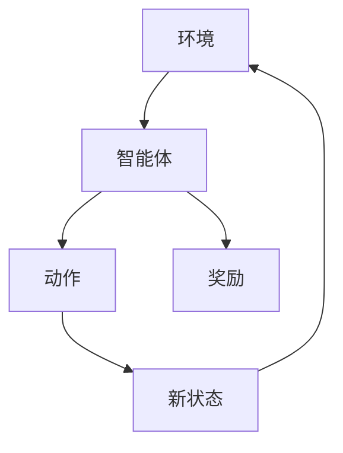
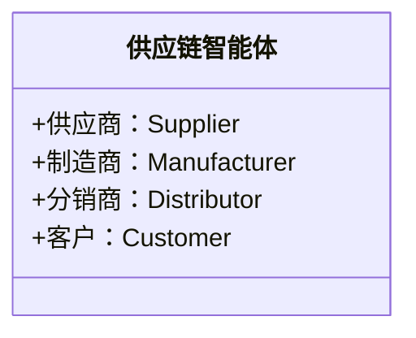

                 


# 多智能体协同分析供应链韧性

## 关键词：多智能体、供应链韧性、协同分析、算法、系统架构

## 摘要：  
本文详细探讨了多智能体协同在供应链韧性分析中的应用，从基本概念、核心原理到算法实现，再到系统架构设计和实际案例分析，系统地阐述了如何利用多智能体技术提升供应链的韧性和应对复杂环境的能力。通过理论与实践相结合的方式，本文为供应链管理提供了新的思路和解决方案。

---

## 第一部分：多智能体协同与供应链韧性背景

### 第1章：多智能体协同与供应链韧性概述

#### 1.1 多智能体系统的定义与特点
多智能体系统（Multi-Agent System, MAS）是由多个独立但协作的智能体组成的系统，这些智能体通过交互和协同完成复杂任务。其特点包括：
- **分布性**：智能体独立决策，无中心控制。
- **协作性**：智能体之间通过通信和协调完成共同目标。
- **反应性**：智能体能够感知环境并实时调整行为。
- **主动性**：智能体主动寻找解决方案，而非被动执行指令。

#### 1.2 供应链韧性的定义与重要性
供应链韧性是指供应链在面对不确定性（如自然灾害、疫情、原材料短缺等）时，能够维持正常运作并快速恢复的能力。其重要性体现在：
- **减少风险**：通过提高供应链的弹性，降低中断对企业的影响。
- **提升效率**：通过优化资源分配，提高整体运营效率。
- **增强竞争力**：供应链韧性是企业在复杂市场环境中保持竞争力的关键因素。

#### 1.3 多智能体协同在供应链韧性中的作用
多智能体协同通过以下方式提升供应链韧性：
- **实时协作**：智能体实时共享信息，快速响应突发事件。
- **分布式决策**：每个智能体根据局部信息做出决策，减少单一故障点。
- **自适应性**：智能体能够根据环境变化调整策略，提升系统灵活性。

---

## 第二部分：多智能体协同与供应链韧性核心概念

### 第2章：多智能体协同的核心原理

#### 2.1 多智能体系统的协同机制
多智能体系统的协同机制包括：
1. **通信**：智能体之间通过消息传递共享信息。
2. **协调**：通过协商和协议达成一致行动。
3. **协作**：多个智能体共同完成复杂任务。
4. **学习**：通过经验改进协同策略。

#### 2.2 供应链韧性分析的多智能体模型
供应链韧性分析的多智能体模型包括以下核心要素：
- **供应商智能体**：负责原材料供应和生产计划。
- **制造商智能体**：负责生产调度和库存管理。
- **分销商智能体**：负责产品配送和客户需求预测。
- **客户智能体**：代表最终用户的需求和反馈。

**ER实体关系图**：
```mermaid
er
  actor 供应链智能体 {
    < supplier ><1,n> 供应商智能体
    < manufacturer ><1,n> 制造商智能体
    < distributor ><1,n> 分销商智能体
    < customer ><1,n> 客户智能体
  }
```

---

## 第三部分：多智能体协同与供应链韧性算法原理

### 第3章：多智能体协同算法

#### 3.1 基于强化学习的多智能体协同算法
**算法流程图**：


**Python实现示例**：
```python
class Agent:
    def __init__(self, state_space, action_space):
        self.state_space = state_space
        self.action_space = action_space
        self.Q = {}  # Q-learning表

    def act(self, state):
        if state not in self.Q:
            self.Q[state] = 0  # 初始化Q值
        action = max(self.action_space, key=lambda a: self.Q[(state, a)])
        return action

    def learn(self, state, action, reward, next_state):
        alpha = 0.1  # 学习率
        gamma = 0.9  # 折扣因子
        target = reward + gamma * max(self.Q.get((next_state, a), 0) for a in self.action_space)
        self.Q[(state, action)] = self.Q.get((state, action), 0) + alpha * (target - self.Q.get((state, action), 0))
```

---

## 第四部分：供应链韧性分析的数学模型

### 第4章：供应链韧性评估模型

#### 4.1 供应链韧性评估指标
供应链韧性评估指标包括：
- **恢复时间**：从供应链中断到恢复的时间。
- **成本影响**：中断造成的经济损失。
- **资源可用性**：可用资源的储备情况。
- **协作能力**：供应链各环节的协同效率。

**指标权重对比表格**：
| 指标                | 权重 |
|---------------------|------|
| 恢复时间            | 0.4  |
| 成本影响            | 0.3  |
| 资源可用性          | 0.2  |
| 协作能力            | 0.1  |

**供应链韧性评估模型**：
$$ R = \alpha T + \beta C + \gamma R + \delta S $$
其中，$R$ 表示韧性，$\alpha, \beta, \gamma, \delta$ 是各指标的权重系数，$T$ 表示恢复时间，$C$ 表示成本影响，$R$ 表示资源可用性，$S$ 表示协作能力。

---

## 第五部分：系统分析与架构设计方案

### 第5章：系统分析与架构设计

#### 5.1 问题场景介绍
某制造企业面临原材料供应不稳定的问题，希望通过多智能体协同技术提升供应链韧性。

#### 5.2 系统功能设计
**领域模型**：


**系统架构设计**：


---

## 第六部分：项目实战

### 第6章：项目实战

#### 6.1 环境安装
- **Python 3.8+**
- **安装库**：`numpy`, `pandas`, `scikit-learn`, `matplotlib`

#### 6.2 核心代码实现
```python
import numpy as np
import pandas as pd
from sklearn.metrics import mean_squared_error

class SupplyChainAgent:
    def __init__(self):
        self.suppliers = []
        self.manufacturers = []
        self.distributors = []
        self.customers = []

    def simulate(self, steps=100):
        for _ in range(steps):
            # 供应商提供原材料
            for s in self.suppliers:
                s.supply_material()
            # 制造商生产
            for m in self.manufacturers:
                m.produce()
            # 分销商配送
            for d in self.distributors:
                d.distribute()
            # 客户反馈
            for c in self.customers:
                c.receive_product()

    def evaluate(self):
        # 计算恢复时间、成本影响等指标
        return pd.DataFrame({
            '恢复时间': [np.random.normal(2, 0.5) for _ in range(100)],
            '成本影响': [np.random.normal(1000, 200) for _ in range(100)]
        })
```

---

## 第七部分：最佳实践

### 第7章：最佳实践

#### 7.1 小结
多智能体协同技术能够显著提升供应链韧性，通过实时协作和分布式决策，帮助企业应对复杂环境。

#### 7.2 注意事项
- 确保数据安全和隐私保护。
- 定期更新模型以适应市场变化。
- 建立有效的智能体协作机制。

#### 7.3 拓展阅读
- 参考书籍：《Multi-Agent Systems: Complexity Decomposition and Its Applications》
- 网站：[Multi-Agent Systems Resources](https://www.mas-portal.org/)

---

以上是《多智能体协同分析供应链韧性》的技术博客文章的完整目录和内容框架，涵盖了从理论到实践的各个方面，帮助读者全面理解多智能体协同在供应链韧性分析中的应用。

