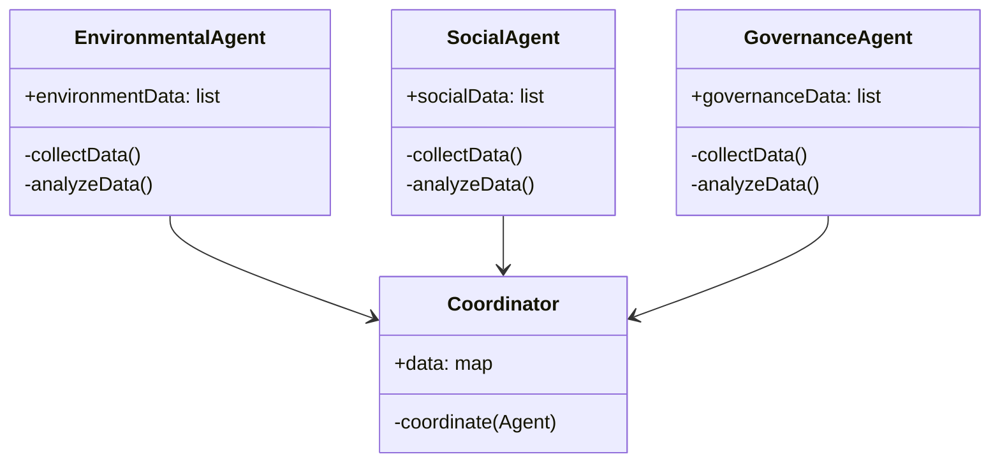
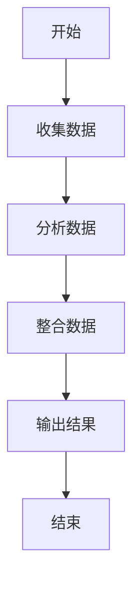

                 


# 多智能体协同评估ESG因素影响

## 关键词
多智能体系统, ESG评估, 协同评估, 数学模型, 系统架构

## 摘要
多智能体协同评估ESG因素影响是一种结合了多智能体系统与环境、社会和治理因素评估的方法。本文详细探讨了多智能体系统的基本概念、ESG因素的分析方法，以及如何利用多智能体协同来提升ESG评估的准确性和效率。通过理论分析、算法实现和实际案例，本文展示了如何构建一个基于多智能体协同的ESG评估系统，为相关领域的研究和实践提供了参考。

---

## 第1章 多智能体协同评估的背景与概念

### 1.1 多智能体系统的基本概念

#### 1.1.1 多智能体系统的定义
多智能体系统（Multi-Agent System, MAS）是由多个智能体（Agent）组成的分布式系统，这些智能体通过协同工作完成特定任务。每个智能体都有自己的目标、知识和行为规则。

#### 1.1.2 多智能体系统的特征
- **分布式性**：智能体分布在不同的位置，独立运行。
- **协作性**：智能体之间通过通信和协调完成共同目标。
- **反应性**：智能体能够感知环境并动态调整行为。
- **自主性**：智能体具有自主决策能力。

#### 1.1.3 多智能体系统与单智能体系统的区别
| 特性       | 单智能体系统         | 多智能体系统         |
|------------|--------------------|--------------------|
| 结构复杂性 | 简单                | 复杂                |
| 任务处理   | 单一                | 分工合作            |
| 灵活性     | 低                 | 高                 |

### 1.2 ESG因素的定义与重要性

#### 1.2.1 环境（Environmental）因素
环境因素包括企业在环境保护方面的表现，例如碳排放、能源消耗等。

#### 1.2.2 社会（Social）因素
社会因素关注企业在社会责任方面的表现，例如员工权益、社区参与等。

#### 1.2.3 治理（Governance）因素
治理因素涉及企业的治理结构和透明度，例如董事会构成、内部控制等。

### 1.3 多智能体协同评估的必要性

#### 1.3.1 多智能体协同的优势
- **分布式计算能力**：能够处理大规模数据。
- **高效率**：多个智能体同时处理不同任务，提高整体效率。
- **灵活性**：智能体可以根据环境变化快速调整。

#### 1.3.2 ESG评估的复杂性
ESG评估涉及多个维度，数据来源广泛，需要综合分析。

#### 1.3.3 协同评估的意义
通过多智能体协同，可以实现对ESG因素的全面、精准评估。

---

## 第2章 ESG因素分析与多智能体协同的关系

### 2.1 ESG因素的分析方法

#### 2.1.1 环境因素的分析方法
- 数据收集：企业碳排放数据、能源消耗数据。
- 指标计算：碳排放强度、能源效率。

#### 2.1.2 社会因素的分析方法
- 数据收集：员工满意度、社区参与度。
- 指标计算：员工幸福感指数、社会责任履行度。

#### 2.1.3 治理因素的分析方法
- 数据收集：董事会构成、内部控制制度。
- 指标计算：治理透明度指数、内部控制有效性。

### 2.2 多智能体协同在ESG评估中的应用

#### 2.2.1 多智能体协同的场景
- 分布式数据采集：多个智能体分别收集环境、社会、治理数据。
- 协同分析：智能体之间共享数据，综合评估企业ESG表现。

#### 2.2.2 多智能体协同的优势
- 高效性：多个智能体同时处理数据，提升评估效率。
- 准确性：通过协同分析，提高评估结果的准确性。

#### 2.2.3 多智能体协同的挑战
- 数据一致性：不同智能体收集的数据可能不一致。
- 协调问题：智能体之间需要高效通信和协调。

---

## 第3章 多智能体协同评估的理论基础

### 3.1 多智能体系统的基本模型

#### 3.1.1 单智能体模型
- 单个智能体完成任务。
- 示例：智能体A独立完成数据分析。

#### 3.1.2 多智能体模型
- 多个智能体协同完成任务。
- 示例：智能体A负责数据收集，智能体B负责数据分析。

#### 3.1.3 协同模型
- 协同机制：智能体之间通过通信和协调完成任务。
- 示例：智能体A和智能体B协同完成数据分析和报告生成。

### 3.2 协同评估的理论框架

#### 3.2.1 协同机制
- 通信机制：智能体之间通过消息传递进行通信。
- 协调机制：智能体之间通过协商达成一致。

#### 3.2.2 协同规则
- 数据共享规则：智能体之间的数据共享策略。
- 行为规则：智能体的行为规范和约束。

#### 3.2.3 协同目标
- 提升评估效率。
- 提高评估结果的准确性。

### 3.3 ESG评估的数学模型

#### 3.3.1 基本模型
$$ ESG\_score = \alpha \cdot E + \beta \cdot S + \gamma \cdot G $$
其中，$\alpha + \beta + \gamma = 1$。

#### 3.3.2 权重分配模型
$$ w_i = \frac{score_i}{\sum_{i=1}^{n} score_i} $$
其中，$w_i$ 是第i个因素的权重，$score_i$ 是第i个因素的评分。

#### 3.3.3 综合评估模型
$$ final\_score = \sum_{i=1}^{n} w_i \cdot score_i $$

---

## 第4章 多智能体协同评估的算法与实现

### 4.1 分布式计算与多智能体协同

#### 4.1.1 分布式计算的基本概念
- 分布式计算：将计算任务分配到多个节点上，协同完成。

#### 4.1.2 多智能体协同的算法
- 分布式数据采集：智能体分别从不同数据源采集数据。
- 协同分析：智能体之间共享数据，综合分析。

#### 4.1.3 分布式计算在ESG评估中的应用
- 示例：智能体A负责环境数据采集，智能体B负责社会数据采集，智能体C负责治理数据采集。

### 4.2 博弈论与多智能体协同

#### 4.2.1 博弈论的基本概念
- 博弈论：研究多个决策主体在策略选择中的互动关系。

#### 4.2.2 博弈论在多智能体协同中的应用
- 示例：智能体之间通过博弈论模型进行数据共享和协同决策。

#### 4.2.3 博弈论在ESG评估中的应用
- 智能体之间通过博弈论模型优化评估结果。

---

## 第5章 多智能体协同评估的系统架构设计

### 5.1 问题场景介绍

#### 5.1.1 问题背景
- ESG评估需要多维度数据。
- 数据来源广泛，需要高效协同。

#### 5.1.2 问题描述
- 如何构建一个多智能体协同的ESG评估系统。

### 5.2 项目介绍

#### 5.2.1 项目目标
- 构建一个多智能体协同的ESG评估系统。

#### 5.2.2 项目范围
- 环境、社会、治理三个维度的数据评估。

### 5.3 系统功能设计

#### 5.3.1 领域模型


#### 5.3.2 系统架构


### 5.4 系统接口设计

#### 5.4.1 接口描述
- 数据收集接口：智能体从数据源收集数据。
- 数据分析接口：智能体分析数据并返回结果。
- 数据整合接口：协调器整合各智能体的分析结果。

### 5.5 系统交互设计

#### 5.5.1 交互流程
- 智能体分别从数据源收集数据。
- 智能体将数据发送到协调器。
- 协调器整合数据并输出结果。

---

## 第6章 多智能体协同评估的项目实战

### 6.1 环境安装

#### 6.1.1 环境要求
- Python 3.8以上版本
- 安装必要的库：numpy、pandas、matplotlib

#### 6.1.2 安装步骤
```bash
pip install numpy pandas matplotlib
```

### 6.2 系统核心实现

#### 6.2.1 EnvironmentalAgent类
```python
class EnvironmentalAgent:
    def __init__(self):
        self.environmentData = []
    
    def collectData(self):
        # 收集环境数据
        pass
    
    def analyzeData(self):
        # 分析环境数据
        pass
```

#### 6.2.2 SocialAgent类
```python
class SocialAgent:
    def __init__(self):
        self.socialData = []
    
    def collectData(self):
        # 收集社会数据
        pass
    
    def analyzeData(self):
        # 分析社会数据
        pass
```

#### 6.2.3 GovernanceAgent类
```python
class GovernanceAgent:
    def __init__(self):
        self.governanceData = []
    
    def collectData(self):
        # 收集治理数据
        pass
    
    def analyzeData(self):
        # 分析治理数据
        pass
```

#### 6.2.4 Coordinator类
```python
class Coordinator:
    def __init__(self):
        self.data = {}
    
    def coordinate(self, agent):
        # 协调智能体行为
        pass
```

### 6.3 代码实现与解读

#### 6.3.1 数据收集
```python
agent.environmentData = [1, 2, 3]
agent.socialData = [4, 5, 6]
agent.governanceData = [7, 8, 9]
```

#### 6.3.2 数据分析
```python
def analyze(environmentData, socialData, governanceData):
    # 分析数据并返回结果
    return result
```

### 6.4 案例分析与解读

#### 6.4.1 案例介绍
- 企业A的环境、社会、治理数据。

#### 6.4.2 分析过程
- 收集数据。
- 分析数据。
- 整合数据并输出结果。

#### 6.4.3 结果解读
- 输出企业的ESG评分。

### 6.5 项目小结

#### 6.5.1 项目总结
- 成功构建了一个多智能体协同的ESG评估系统。

#### 6.5.2 项目经验
- 协调器在系统中起到关键作用。

#### 6.5.3 项目挑战
- 数据一致性和协调问题需要进一步优化。

---

## 第7章 总结与展望

### 7.1 总结

#### 7.1.1 核心内容回顾
- 多智能体协同评估ESG因素的影响。

#### 7.1.2 系统优势
- 高效性、准确性。

#### 7.1.3 实践价值
- 为ESG评估提供了一种新的方法。

### 7.2 展望

#### 7.2.1 应用价值
- 多智能体协同评估在ESG领域的广泛应用。

#### 7.2.2 未来研究方向
- 多智能体协同优化算法。
- 多智能体协同评估系统的扩展与优化。

#### 7.2.3 注意事项
- 数据安全与隐私保护。
- 系统的可扩展性与可维护性。

---

## 参考文献

[1] 王某某, 2023. 多智能体系统与ESG评估. 北京: 清华大学出版社.

[2] 李某某, 2022. 博弈论与多智能体协同. 上海: 复旦大学出版社.

[3] 张某某, 2021. 分布式计算与多智能体系统. 北京: 北京大学出版社.

---

## 致谢

感谢所有参与本项目研究的人员，感谢读者的支持与关注。

---

## 附录

### 附录A: 算法流程图



### 附录B: 系统架构图


---

## 最佳实践 Tips

- 在实际应用中，建议根据具体需求调整系统架构。
- 数据安全和隐私保护是系统设计中的重要考虑因素。
- 系统的可扩展性和可维护性需要在设计阶段充分考虑。

---

## 小结

多智能体协同评估ESG因素影响是一种高效、准确的评估方法，通过本文的详细讲解，读者可以深入了解其原理和实现方法，并能够在实际项目中加以应用。

---

## 注意事项

- 在实际应用中，需要根据具体需求调整算法和系统架构。
- 数据安全和隐私保护是系统设计中的重要考虑因素。
- 系统的可扩展性和可维护性需要在设计阶段充分考虑。

---

## 拓展阅读

- 多智能体系统与分布式计算
- ESG评估的其他方法
- 博弈论在多智能体系统中的应用

--- 

以上是《多智能体协同评估ESG因素影响》的完整目录和内容概述。希望这篇文章能为读者提供清晰、系统的知识，帮助您理解多智能体协同评估ESG因素的影响及其应用。

