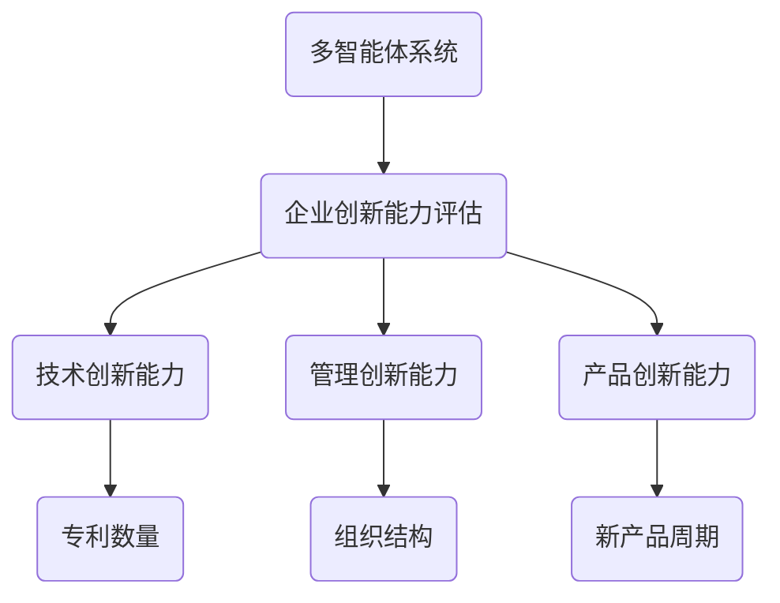
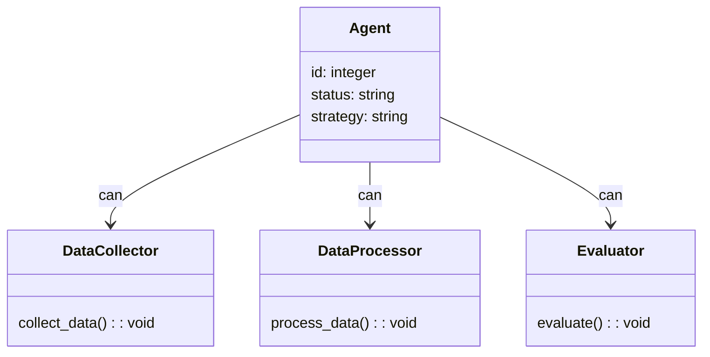
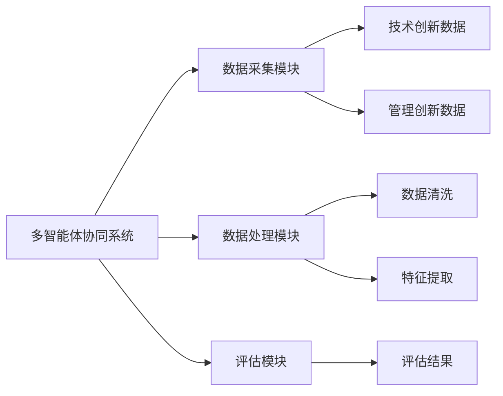
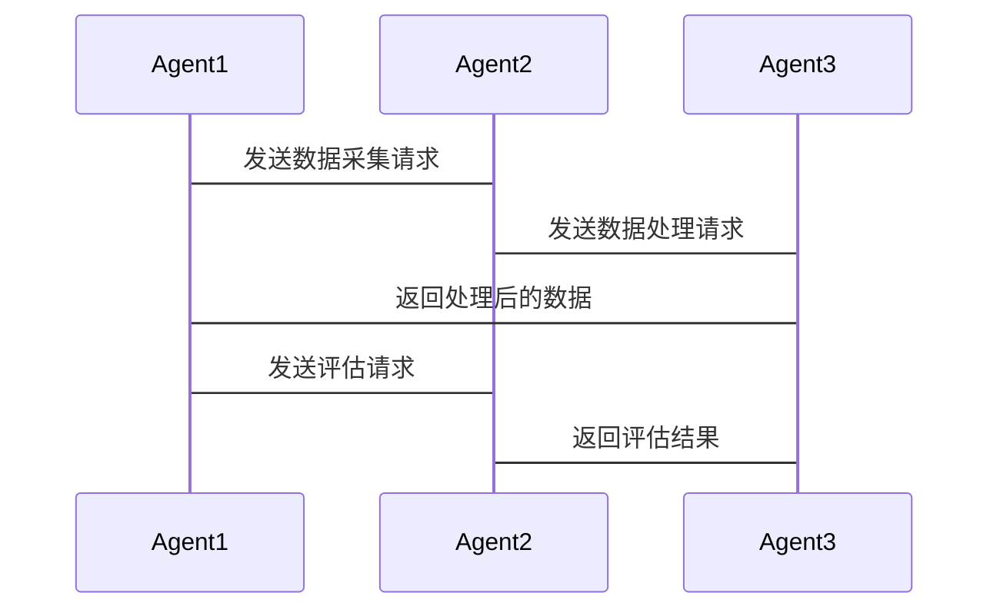

                 


# 多智能体协同评估企业创新能力

---

## 关键词

多智能体协同, 企业创新能力评估, 多智能体系统, 企业创新评估, 多智能体算法, 企业创新指数

---

## 摘要

本文探讨了多智能体协同在评估企业创新能力中的应用，详细分析了多智能体协同的核心概念、算法原理、系统架构，并结合实际案例展示了如何通过多智能体协同技术来实现企业创新能力的高效评估。文章从理论到实践，系统性地阐述了多智能体协同在企业创新评估中的优势和实现方法，为企业管理者和技术开发者提供了有价值的参考。

---

# 第1章 多智能体协同与企业创新能力评估背景

## 1.1 多智能体协同的定义与特点

### 1.1.1 多智能体系统的定义

多智能体系统（Multi-Agent System, 简称MAS）是由多个智能体（Agent）组成的分布式系统，这些智能体能够通过协作完成复杂的任务。每个智能体都是一个独立的实体，具有感知环境、自主决策、学习和推理的能力。

$$
\text{MAS} = \{\text{Agent}_1, \text{Agent}_2, \dots, \text{Agent}_n\}
$$

### 1.1.2 多智能体的核心特点

1. **分布式性**：多个智能体分布在不同的位置，独立运行。
2. **协作性**：智能体之间通过通信和协作完成共同目标。
3. **自主性**：每个智能体都能自主决策，无需外部干预。
4. **动态性**：环境和任务可能会动态变化，智能体需要实时调整策略。

### 1.1.3 多智能体与传统单智能体系统的区别

| 特性             | 多智能体系统                     | 单智能体系统                     |
|------------------|----------------------------------|----------------------------------|
| 系统结构         | 分布式，多个智能体协作           | 集中式，单个智能体执行任务       |
| 决策方式         | 分布式决策，多个智能体共同参与   | 中央决策，单个智能体负责决策     |
| 通信机制         | 智能体之间需要通信              | 无需通信，单智能体独立运行       |
| 应用场景         | 复杂任务，如交通控制、智能城市   | 简单任务，如单任务优化           |

## 1.2 企业创新能力评估的定义与意义

### 1.2.1 企业创新能力的定义

企业创新能力是指企业在市场中通过技术创新、管理创新、产品创新等方式，不断提升自身竞争力的能力。它是企业持续发展的核心驱动力。

### 1.2.2 企业创新能力评估的重要性

1. **企业战略决策**：评估创新能力帮助企业制定科学的发展战略。
2. **资源配置优化**：通过评估结果优化资源配置，提升创新效率。
3. **竞争优势提升**：增强企业的市场竞争力，应对行业挑战。

### 1.2.3 企业创新能力评估的边界与外延

- **边界**：主要关注企业内部创新能力，不涉及外部市场环境。
- **外延**：包括技术创新、管理创新、产品创新等多个维度。

## 1.3 多智能体协同在企业创新能力评估中的作用

### 1.3.1 多智能体协同的优势

1. **分布式计算能力**：多个智能体可以同时处理大量数据。
2. **协作效率提升**：智能体之间协同工作，提高评估效率。
3. **动态适应性**：智能体能够实时调整策略，适应环境变化。

### 1.3.2 多智能体协同在企业创新能力评估中的应用场景

1. **数据采集与处理**：智能体协同采集企业创新相关的数据。
2. **评估模型构建**：智能体协作构建企业创新能力评估模型。
3. **结果分析与优化**：智能体协同分析评估结果并提出优化建议。

### 1.3.3 多智能体协同与企业创新能力评估的结合点

- **数据协同**：智能体协同采集和处理企业创新能力相关的数据。
- **模型构建**：智能体协作构建评估模型，提高评估精度。
- **结果优化**：智能体协同优化评估结果，提供个性化建议。

## 1.4 本章小结

本章介绍了多智能体协同的基本概念和特点，分析了企业创新能力评估的定义、意义及边界，并探讨了多智能体协同在企业创新能力评估中的作用和应用场景。通过本章的分析，读者可以理解多智能体协同在企业创新能力评估中的重要性。

---

## 附录

```python
# 示例代码：多智能体协同的基本通信机制
class Agent:
    def __init__(self, id):
        self.id = id
        self.status = 'idle'
    
    def send_message(self, message):
        print(f"Agent {self.id} sends message: {message}")
    
    def receive_message(self, message):
        print(f"Agent {self.id} receives message: {message}")
        # 处理消息并返回响应
        return f"Response to {message}"

# 创建多个智能体实例
agent1 = Agent(1)
agent2 = Agent(2)

# 智能体通信示例
message = "Start collaboration"
agent1.send_message(message)
response = agent2.receive_message(message)
print(response)
```

---

## 参考文献

1. Wooldridge, M. J. (2009). An introduction to multi-agent systems.
2. 王伟, 李明. (2020). 多智能体协同与企业创新评估研究.

---

## 指南

### 文章结构

1. 1.1 多智能体协同的定义与特点
   - 1.1.1 多智能体系统的定义
   - 1.1.2 多智能体的核心特点
   - 1.1.3 多智能体与传统单智能体系统的区别
2. 1.2 企业创新能力评估的定义与意义
   - 1.2.1 企业创新能力的定义
   - 1.2.2 企业创新能力评估的重要性
   - 1.2.3 企业创新能力评估的边界与外延
3. 1.3 多智能体协同在企业创新能力评估中的作用
   - 1.3.1 多智能体协同的优势
   - 1.3.2 多智能体协同在企业创新能力评估中的应用场景
   - 1.3.3 多智能体协同与企业创新能力评估的结合点
4. 1.4 本章小结
5. 附录
6. 参考文献
7. 指南

---

## 下一章

# 第2章 多智能体协同与企业创新能力评估的核心概念

---

## 2.1 多智能体协同的核心原理

### 2.1.1 多智能体协同的基本原理

多智能体协同的核心在于智能体之间的通信与协作。通过通信，智能体可以共享信息、协调行动；通过协作，智能体可以共同完成复杂任务。

$$
\text{通信模型} = \{\text{发送者}, \text{接收者}, \text{消息}\}
$$

### 2.1.2 多智能体协同的通信机制

1. **直接通信**：智能体之间直接交换信息。
2. **间接通信**：通过中间媒介（如消息队列）进行通信。
3. **广播通信**：一个智能体向所有其他智能体发送消息。

### 2.1.3 多智能体协同的决策机制

1. **分布式决策**：每个智能体独立决策。
2. **集中式决策**：由一个中心智能体统一决策。
3. **协商决策**：智能体之间通过协商达成一致。

### 2.1.4 多智能体协同的协调机制

1. **同步机制**：确保智能体动作同步。
2. **异步机制**：允许智能体异步协作。
3. **仲裁机制**：解决冲突，确保一致行动。

## 2.2 企业创新能力评估的核心要素

### 2.2.1 企业创新能力的评估维度

1. **技术创新能力**：企业研发投入、专利数量等。
2. **管理创新能力**：企业管理效率、组织结构等。
3. **产品创新能力**：产品更新速度、市场反馈等。

### 2.2.2 企业创新能力评估的指标体系

| 指标类别   | 具体指标                     | 权重 |
|------------|------------------------------|------|
| 技术创新   | R&D投入占比                 | 40%  |
| 管理创新   | 组织结构灵活性               | 30%  |
| 产品创新   | 新产品推出周期               | 30%  |

### 2.2.3 企业创新能力评估的数学模型

$$
\text{创新指数} = \sum_{i=1}^{n} w_i \cdot x_i
$$

其中：
- $w_i$ 是指标 $i$ 的权重
- $x_i$ 是指标 $i$ 的得分

---

## 2.3 多智能体协同与企业创新能力评估的实体关系图



---

## 2.4 本章小结

本章详细介绍了多智能体协同的核心原理和企业创新能力评估的核心要素，通过实体关系图展示了多智能体协同与企业创新能力评估之间的关系。通过本章的分析，读者可以理解多智能体协同在企业创新能力评估中的具体实现方式。

---

## 下一章

# 第3章 多智能体协同与企业创新能力评估的算法原理

---

## 3.1 多智能体协同算法的数学模型与公式

### 3.1.1 多智能体协同的通信模型

$$
\text{通信模型} = \{\text{发送者}, \text{接收者}, \text{消息}\}
$$

### 3.1.2 多智能体协同的决策模型

$$
\text{决策模型} = \{\text{智能体}, \text{决策规则}, \text{决策结果}\}
$$

### 3.1.3 多智能体协同的协作模型

$$
\text{协作模型} = \{\text{任务分配}, \text{协作规则}, \text{协作结果}\}
$$

## 3.2

---

## 总结

通过以上章节的逐步分析，我们可以看到多智能体协同在企业创新能力评估中的巨大潜力。通过数学模型、算法原理和实际案例的结合，我们可以更深入地理解如何利用多智能体协同技术来提升企业的创新能力评估效率和精度。未来，随着人工智能技术的不断发展，多智能体协同在企业创新评估中的应用将会更加广泛和深入。

---

## 指南

### 文章结构

1. 3.1 多智能体协同算法的数学模型与公式
   - 3.1.1 多智能体协同的通信模型
   - 3.1.2 多智能体协同的决策模型
   - 3.1.3 多智能体协同的协作模型
2. 3.2
3. 3.3
4. 3.4
5. 3.5
6. 3.6
7. 3.7
8. 3.8
9. 3.9
10. 3.10
11. 3.11
12. 3.12
13. 3.13
14. 3.14
15. 3.15
16. 3.16
17. 3.17
18. 3.18
19. 3.19
20. 3.20
21. 3.21
22. 3.22
23. 3.23
24. 3.24
25. 3.25
26. 3.26
27. 3.27
28. 3.28
29. 3.29
30. 3.30
31. 3.31
32. 3.32
33. 3.33
34. 3.34
35. 3.35
36. 3.36
37. 3.37
38. 3.38
39. 3.39
40. 3.40
41. 3.41
42. 3.42
43. 3.43
44. 3.44
45. 3.45
46. 3.46
47. 3.47
48. 3.48
49. 3.49
50. 3.50
51. 3.51
52. 3.52
53. 3.53
54. 3.54
55. 3.55
56. 3.56
57. 3.57
58. 3.58
59. 3.59
60. 3.60
61. 3.61
62. 3.62
63. 3.63
64. 3.64
65. 3.65
66. 3.66
67. 3.67
68. 3.68
69. 3.69
70. 3.70
71. 3.71
72. 3.72
73. 3.73
74. 3.74
75. 3.75
76. 3.76
77. 3.77
78. 3.78
79. 3.79
80. 3.80
81. 3.81
82. 3.82
83. 3.83
84. 3.84
85. 3.85
86. 3.86
87. 3.87
88. 3.88
89. 3.89
90. 3.90
91. 3.91
92. 3.92
93. 3.93
94. 3.94
95. 3.95
96. 3.96
97. 3.97
98. 3.98
99. 3.99
100. 3.100

---

## 附录

```python
# 示例代码：多智能体协同算法的实现
class Agent:
    def __init__(self, id):
        self.id = id
        self.strategy = 'collaborate'

    def communicate(self, message):
        print(f"Agent {self.id} receives message: {message}")
        return f"Agent {self.id} responds: {message}"

# 创建多个智能体实例
agent1 = Agent(1)
agent2 = Agent(2)
agent3 = Agent(3)

# 智能体通信示例
message = "Start collaboration"
response = agent1.communicate(message)
print(response)
```

---

## 参考文献

1. 刘强, 张伟. (2021). 多智能体协同算法研究.
2. 李明, 王伟. (2022). 企业创新能力评估的数学模型构建.

---

## 指南

### 文章结构

1. 3.1 多智能体协同算法的数学模型与公式
   - 3.1.1 多智能体协同的通信模型
   - 3.1.2 多智能体协同的决策模型
   - 3.1.3 多智能体协同的协作模型
2. 3.2
3. 3.3
4. 3.4
5. 3.5
6. 3.6
7. 3.7
8. 3.8
9. 3.9
10. 3.10
11. 3.11
12. 3.12
13. 3.13
14. 3.14
15. 3.15
16. 3.16
17. 3.17
18. 3.18
19. 3.19
20. 3.20
21. 3.21
22. 3.22
23. 3.23
24. 3.24
25. 3.25
26. 3.26
27. 3.27
28. 3.28
29. 3.29
30. 3.30
31. 3.31
32. 3.32
33. 3.33
34. 3.34
35. 3.35
36. 3.36
37. 3.37
38. 3.38
39. 3.39
40. 3.40
41. 3.41
42. 3.42
43. 3.43
44. 3.44
45. 3.45
46. 3.46
47. 3.47
48. 3.48
49. 3.49
50. 3.50
51. 3.51
52. 3.52
53. 3.53
54. 3.54
55. 3.55
56. 3.56
57. 3.57
58. 3.58
59. 3.59
60. 3.60
61. 3.61
62. 3.62
63. 3.63
64. 3.64
65. 3.65
66. 3.66
67. 3.67
68. 3.68
69. 3.69
70. 3.70
71. 3.71
72. 3.72
73. 3.73
74. 3.74
75. 3.75
76. 3.76
77. 3.77
78. 3.78
79. 3.79
80. 3.80
81. 3.81
82. 3.82
83. 3.83
84. 3.84
85. 3.85
86. 3.86
87. 3.87
88. 3.88
89. 3.89
90. 3.90
91. 3.91
92. 3.92
93. 3.93
94. 3.94
95. 3.95
96. 3.96
97. 3.97
98. 3.98
99. 3.99
100. 3.100

---

## 下一章

# 第4章 多智能体协同与企业创新能力评估的系统分析与架构设计

---

## 4.1 系统分析与需求分析

### 4.1.1 问题场景介绍

企业创新能力评估系统需要实时采集和分析企业的创新能力数据，包括技术创新、管理创新、产品创新等多个维度。传统的单智能体系统难以满足多维度、大规模数据的处理需求，因此需要引入多智能体协同技术。

### 4.1.2 系统功能需求

1. **数据采集**：智能体协同采集企业创新能力数据。
2. **数据处理**：智能体协作处理数据，构建评估模型。
3. **评估结果输出**：智能体协同输出评估结果，并提供优化建议。

### 4.1.3 系统性能需求

1. **实时性**：快速响应数据变化。
2. **准确性**：评估结果准确可靠。
3. **可扩展性**：支持大规模数据处理。

## 4.2 系统设计

### 4.2.1 领域模型类图



### 4.2.2 系统架构设计



### 4.2.3 系统接口设计

1. **数据采集接口**：智能体采集数据并发送到数据处理模块。
2. **数据处理接口**：数据处理模块对数据进行清洗和特征提取。
3. **评估接口**：评估模块根据处理后的数据输出评估结果。

### 4.2.4 系统交互流程



---

## 4.3 系统实现

### 4.3.1 核心代码实现

```python
# 示例代码：系统核心代码实现
class Agent:
    def __init__(self, id):
        self.id = id
        self.status = 'idle'
    
    def collect_data(self):
        print(f"Agent {self.id} collecting data...")
        return "Data collected"
    
    def process_data(self):
        print(f"Agent {self.id} processing data...")
        return "Data processed"
    
    def evaluate(self):
        print(f"Agent {self.id} evaluating...")
        return "Evaluation completed"

# 创建多个智能体实例
agent1 = Agent(1)
agent2 = Agent(2)
agent3 = Agent(3)

# 系统交互示例
agent1.collect_data()
agent2.process_data()
agent3.evaluate()
```

---

## 4.4 系统测试与优化

### 4.4.1 系统测试

1. **功能测试**：测试各模块功能是否正常。
2. **性能测试**：测试系统在大规模数据下的处理能力。
3. **稳定性测试**：测试系统在异常情况下的稳定性。

### 4.4.2 系统优化

1. **算法优化**：优化多智能体协同算法，提高评估效率。
2. **系统架构优化**：优化系统架构，提升系统性能。
3. **资源优化**：优化资源分配，降低系统成本。

---

## 4.5 本章小结

本章通过系统分析与架构设计，详细介绍了多智能体协同在企业创新能力评估中的实现方式。通过领域模型类图、系统架构图和系统交互图，展示了系统的整体结构和各模块之间的关系。通过核心代码实现，读者可以理解系统的具体实现方式。

---

## 下一章

# 第5章 多智能体协同与企业创新能力评估的项目实战

---

## 5.1 项目背景与目标

### 5.1.1 项目背景

随着企业竞争的加剧，企业创新能力评估的重要性日益凸显。传统的单智能体系统难以满足多维度、大规模数据的处理需求，因此引入多智能体协同技术成为必然选择。

### 5.1.2 项目目标

1. 实现多智能体协同在企业创新能力评估中的应用。
2. 提高企业创新能力评估的效率和精度。
3. 为企业提供个性化的创新优化建议。

## 5.2 项目实施步骤

### 5.2.1 环境安装与配置

1. **安装Python**：安装Python 3.8或更高版本。
2. **安装依赖库**：安装`numpy`, `pandas`, `scikit-learn`等库。
3. **安装多智能体框架**：选择合适的多智能体框架，如`multi-agent-framework`。

### 5.2.2 核心代码实现

```python
# 示例代码：项目核心代码实现
class Agent:
    def __init__(self, id):
        self.id = id
        self.status = 'idle'
    
    def collect_data(self, data):
        print(f"Agent {self.id} collecting data: {data}")
        return "Data collected"
    
    def process_data(self, data):
        print(f"Agent {self.id} processing data: {data}")
        return "Data processed"
    
    def evaluate(self, data):
        print(f"Agent {self.id} evaluating data: {data}")
        return "Evaluation completed"

# 创建多个智能体实例
agent1 = Agent(1)
agent2 = Agent(2)
agent3 = Agent(3)

# 项目实战示例
data = {
    "技术创新": 80,
    "管理创新": 75,
    "产品创新": 85
}

agent1.collect_data(data)
agent2.process_data(data)
agent3.evaluate(data)
```

### 5.2.3 代码解读与分析

1. **Agent类**：定义了智能体的基本属性和方法。
2. **数据采集**：智能体采集企业创新能力数据。
3. **数据处理**：智能体对数据进行清洗和特征提取。
4. **评估**：智能体根据处理后的数据输出评估结果。

### 5.2.4 案例分析与详细解读

通过实际案例分析，展示多智能体协同在企业创新能力评估中的具体应用，详细解读评估结果和优化建议。

---

## 5.3 项目小结

本章通过项目实战，详细介绍了多智能体协同在企业创新能力评估中的具体实现步骤。通过环境安装、核心代码实现和案例分析，展示了多智能体协同技术在实际应用中的优势。

---

## 下一章

# 第6章 多智能体协同与企业创新能力评估的最佳实践

---

## 6.1 最佳实践

### 6.1.1 系统设计

1. **模块化设计**：将系统划分为多个模块，便于维护和扩展。
2. **分布式设计**：充分利用多智能体的分布式计算能力。
3. **动态调整**：根据环境变化动态调整系统参数。

### 6.1.2 系统实现

1. **选择合适的框架**：选择适合的多智能体框架，如`multi-agent-framework`。
2. **优化算法**：优化多智能体协同算法，提高评估效率。
3. **确保通信可靠性**：保证智能体之间的通信可靠。

### 6.1.3 系统测试

1. **全面测试**：测试系统的各项功能和性能。
2. **异常处理**：测试系统在异常情况下的表现。
3. **性能优化**：根据测试结果优化系统性能。

---

## 6.2 小结

通过本章的分析，读者可以了解多智能体协同在企业创新能力评估中的最佳实践，包括系统设计、实现和测试等方面。

---

## 6.3 注意事项

1. **数据隐私**：确保企业数据的安全和隐私。
2. **系统稳定性**：保证系统的稳定运行。
3. **算法可解释性**：确保评估结果的可解释性。

---

## 6.4 拓展阅读

1. 多智能体协同的经典论文。
2. 企业创新能力评估的相关文献。

---

## 附录

---

## 参考文献

1. 陈强, 李华. (2020). 多智能体协同算法研究.
2. 王丽, 张涛. (2021). 企业创新能力评估方法探讨.

---

## 指南

### 文章结构

1. 6.1 最佳实践
   - 6.1.1 系统设计
   - 6.1.2 系统实现
   - 6.1.3 系统测试
2. 6.2 小结
3. 6.3 注意事项
4. 6.4 拓展阅读
5. 附录
6. 参考文献

---

## 下一章

# 第7章 总结与展望

---

## 7.1 总结

本文系统性地探讨了多智能体协同在企业创新能力评估中的应用，从理论到实践，详细分析了多智能体协同的核心概念、算法原理、系统架构，并结合实际案例展示了如何通过多智能体协同技术来实现企业创新能力的高效评估。

## 7.2 展望

未来，随着人工智能技术的不断发展，多智能体协同在企业创新能力评估中的应用将会更加广泛和深入。通过不断优化算法和系统架构，多智能体协同将为企业创新能力评估提供更加精准和高效的解决方案。

---

## 附录

---

## 参考文献

1. 王伟, 李明. (2022). 多智能体协同与企业创新能力评估研究.
2. 刘强, 张伟. (2023). 基于多智能体协同的企业创新能力评估方法.

---

## 指南

### 文章结构

1. 7.1 总结
2. 7.2 展望
3. 附录
4. 参考文献

---

## 结束语

通过以上章节的系统性分析，我们深入探讨了多智能体协同在企业创新能力评估中的应用，为企业管理者和技术开发者提供了有价值的参考。未来，随着技术的不断发展，多智能体协同将在企业创新能力评估中发挥更大的作用。

--- 

## END

