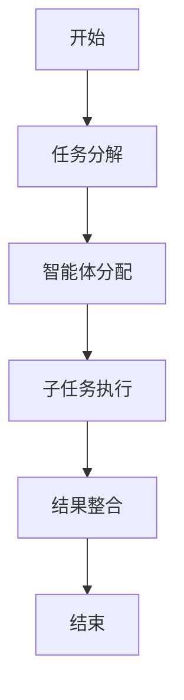
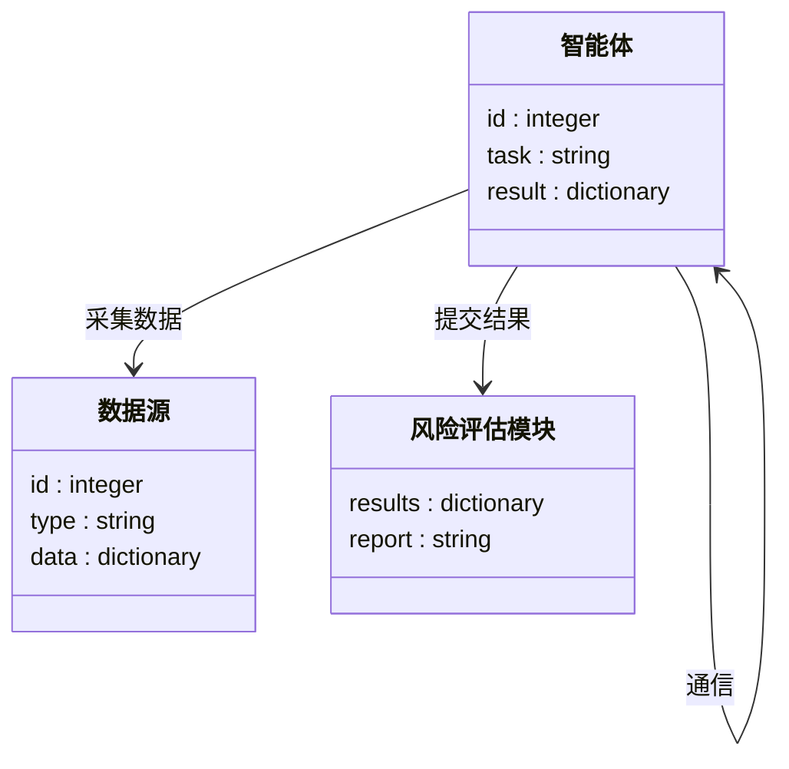
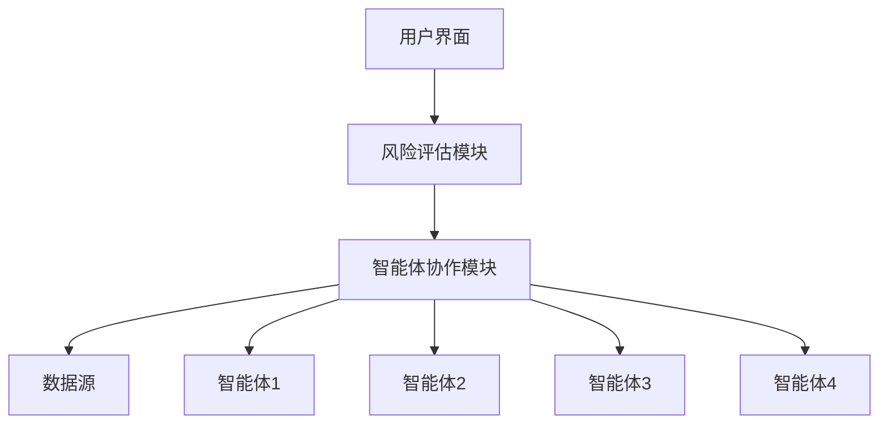
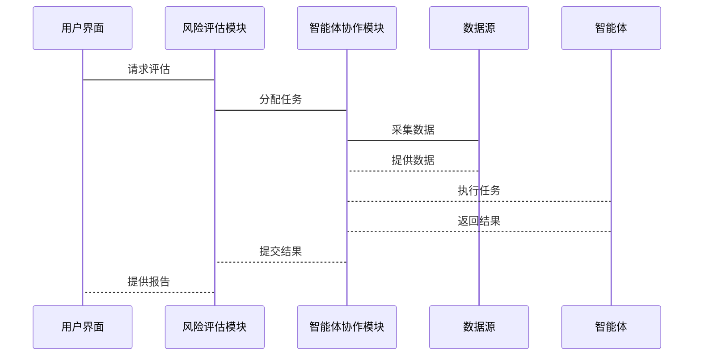

                 


# 多智能体协同评估地缘政治风险

## 关键词
- 多智能体协同
- 地缘政治风险
- 风险评估
- 系统架构
- 算法原理

## 摘要
本文深入探讨了多智能体协同在评估地缘政治风险中的应用。通过分析多智能体系统的原理、地缘政治风险的关键要素，以及两者的协同机制，本文详细介绍了如何利用多智能体系统来提高地缘政治风险评估的准确性和效率。文章还通过具体案例展示了系统架构设计和算法实现，并提出了实际应用中的最佳实践建议。

---

# 第1章: 多智能体协同与地缘政治风险概述

## 1.1 多智能体系统的定义与特点

### 1.1.1 多智能体系统的定义
多智能体系统（Multi-Agent System, MAS）是由多个智能体（Agent）组成的分布式系统，这些智能体能够通过交互和协作完成复杂任务。智能体是具有感知、推理、规划和行动能力的实体，可以是软件程序、机器人或其他智能设备。

### 1.1.2 多智能体系统的核心特点
1. **分布式**：多个智能体独立运行，共同完成任务。
2. **协作性**：智能体之间通过通信和协商进行协作。
3. **自主性**：每个智能体都能自主决策。
4. **动态性**：系统环境和任务需求可能动态变化。
5. **可扩展性**：系统可以灵活扩展，适应不同规模的任务。

### 1.1.3 多智能体系统与传统单智能体系统的区别
- **单智能体系统**：单个智能体完成任务，结构简单，但处理复杂问题的能力有限。
- **多智能体系统**：多个智能体协作，能够处理更复杂的任务，但需要解决通信、协调和同步等问题。

## 1.2 地缘政治风险的定义与特征

### 1.2.1 地缘政治风险的定义
地缘政治风险是指在国际关系、领土争端、资源分配、外交政策等政治活动中，由于各国利益冲突、政策变化或突发事件等因素可能导致的政治不稳定或冲突风险。

### 1.2.2 地缘政治风险的主要特征
1. **综合性**：涉及政治、经济、军事、文化等多个方面。
2. **不确定性**：风险的发生具有不确定性和模糊性。
3. **动态性**：随着国际形势的变化而不断变化。
4. **复杂性**：涉及多方利益，难以简单预测。

### 1.2.3 地缘政治风险的评估维度
1. **政治稳定性**：评估国家的政治环境是否稳定。
2. **经济依赖性**：评估经济结构对外部的依赖程度。
3. **军事对抗**：评估潜在的军事冲突风险。
4. **文化差异**：评估文化差异对国际合作的影响。

## 1.3 多智能体协同评估地缘政治风险的背景与意义

### 1.3.1 问题背景
地缘政治风险的复杂性和不确定性使得传统的单一智能体评估方法难以满足需求。多智能体系统能够通过分布式协作提高评估的准确性和效率。

### 1.3.2 问题描述
如何利用多智能体协同技术，对地缘政治风险进行实时、动态的评估，是当前研究的热点问题。

### 1.3.3 问题解决的必要性
通过多智能体协同，可以整合多个领域的数据，提供更全面的风险评估结果，帮助决策者制定更有效的应对策略。

### 1.3.4 边界与外延
- **边界**：专注于地缘政治风险的评估，不涉及具体的政治决策。
- **外延**：可以扩展到经济、军事、文化等多个领域。

### 1.3.5 核心要素组成
1. **智能体**：负责数据采集、分析和评估。
2. **通信机制**：智能体之间的信息交互。
3. **协作算法**：智能体协作的规则和策略。

## 1.4 本章小结
本章介绍了多智能体系统的基本概念和特点，分析了地缘政治风险的定义、特征和评估维度，并探讨了多智能体协同在地缘政治风险评估中的背景和意义。

---

# 第2章: 多智能体协同评估地缘政治风险的核心概念与联系

## 2.1 多智能体协同的基本原理

### 2.1.1 多智能体协同的原理
多智能体协同通过智能体之间的通信和协作，共同完成复杂任务。每个智能体负责特定的任务模块，通过信息共享和决策协同实现整体目标。

### 2.1.2 多智能体系统的核心机制
1. **通信机制**：智能体之间通过消息传递进行信息共享。
2. **协作机制**：智能体通过协商和协作完成任务。
3. **分布式计算**：任务分解为多个子任务，由不同智能体独立完成。

### 2.1.3 多智能体系统与传统单智能体系统的区别
- **任务分解**：多智能体系统将任务分解为多个子任务，单智能体系统完成整个任务。
- **信息共享**：多智能体系统通过通信共享信息，单智能体系统信息独立。

## 2.2 地缘政治风险评估的关键要素

### 2.2.1 政治因素
1. **政府稳定性**：评估政府的稳定性和政策的连续性。
2. **外交关系**：评估与其他国家的外交关系和合作情况。

### 2.2.2 经济因素
1. **经济依赖**：评估经济对其他国家或资源的依赖程度。
2. **经济政策**：评估经济政策的稳定性和对外部冲击的应对能力。

### 2.2.3 军事因素
1. **军事部署**：评估军事部署和潜在冲突风险。
2. **军备竞赛**：评估军备竞赛对地缘政治风险的影响。

### 2.2.4 文化因素
1. **文化差异**：评估文化差异对国际合作的影响。
2. **文化传播**：评估文化传播对地缘政治风险的影响。

## 2.3 多智能体协同与地缘政治风险评估的关联性分析

### 2.3.1 多智能体协同在地缘政治风险评估中的作用
1. **数据整合**：通过多智能体协同，整合政治、经济、军事和文化等多方面的数据。
2. **动态评估**：实时更新数据，提供动态的风险评估结果。
3. **决策支持**：通过协作分析，为决策者提供科学的决策支持。

### 2.3.2 多智能体协同与地缘政治风险评估的相互影响
- **多智能体协同**：提高评估的准确性和效率，为风险评估提供新的方法。
- **地缘政治风险评估**：为多智能体协同提供实际应用场景，推动技术的发展。

### 2.3.3 多智能体协同在地缘政治风险评估中的优势
1. **分布式计算**：能够处理大规模、复杂的数据。
2. **协作能力**：通过协作提高评估的全面性和准确性。

## 2.4 概念属性对比表格

```markdown
| 概念       | 分布式 | 协作性 | 动态性 |
|------------|--------|--------|--------|
| 多智能体协同 | 是     | 是     | 是     |
| 地缘政治风险 | 否     | 否     | 是     |
```

## 2.5 ER实体关系图

```mermaid
erDiagram
    actor 智能体 {
        id : integer
        name : string
        role : string
    }
    
    entity 数据源 {
        id : integer
        type : string
        source : string
    }
    
    智能体 --> 数据源 : 采集
    智能体 --> 智能体 : 通信
```

---

# 第3章: 多智能体协同评估地缘政治风险的算法原理

## 3.1 多智能体协同算法的基本原理

### 3.1.1 算法原理
多智能体协同算法通过分布式计算，将任务分解为多个子任务，由不同智能体独立完成，然后通过通信整合结果。

### 3.1.2 算法流程
1. **任务分解**：将整体任务分解为多个子任务。
2. **智能体分配**：将子任务分配给不同的智能体。
3. **子任务执行**：每个智能体独立完成分配的任务。
4. **结果整合**：通过通信整合各智能体的结果，得到最终评估结果。

### 3.1.3 算法实现


### 3.1.4 算法实现的Python代码示例
```python
import requests
import json

class Agent:
    def __init__(self, id):
        self.id = id
        self.task = None

    def assign_task(self, task):
        self.task = task

    def execute_task(self):
        # 模拟数据采集
        if self.task == '政治因素':
            return {'government_stability': 0.8, 'diplomatic_relations': 0.6}
        elif self.task == '经济因素':
            return {'economic_dependency': 0.7, 'economic_policy': 0.5}
        elif self.task == '军事因素':
            return {'military_deploy': 0.9, 'arms_race': 0.4}
        elif self.task == '文化因素':
            return {'cultural_diversity': 0.3, 'cultural_exchange': 0.2}

# 创建多个智能体
agents = [Agent(1), Agent(2), Agent(3), Agent(4)]

# 任务分配
for agent in agents:
    agent.assign_task(['政治因素', '经济因素', '军事因素', '文化因素'][agent.id % 4])

# 执行任务并整合结果
results = {}
for agent in agents:
    results.update(agent.execute_task())

print(results)
```

### 3.1.5 算法实现的数学模型
地缘政治风险评估模型可以表示为：
$$
R = \sum_{i=1}^{n} w_i \cdot f_i
$$
其中，$R$ 是地缘政治风险，$w_i$ 是各因素的权重，$f_i$ 是各因素的评估值。

---

# 第4章: 多智能体协同评估地缘政治风险的系统分析与架构设计

## 4.1 项目背景介绍

### 4.1.1 项目目标
开发一个多智能体协同系统，用于实时评估地缘政治风险。

### 4.1.2 项目范围
系统将覆盖政治、经济、军事和文化四个维度，支持多国的地缘政治风险评估。

## 4.2 系统功能设计

### 4.2.1 功能模块划分
1. **数据采集模块**：采集政治、经济、军事和文化数据。
2. **智能体协作模块**：分配任务并协调智能体完成评估。
3. **风险评估模块**：整合各智能体的结果，输出地缘政治风险评估报告。

### 4.2.2 领域模型类图



## 4.3 系统架构设计

### 4.3.1 系统架构图



### 4.3.2 接口设计
1. **智能体协作接口**：用于智能体之间的通信和任务分配。
2. **数据源接口**：用于数据采集和更新。
3. **风险评估接口**：用于整合智能体结果并生成报告。

### 4.3.3 交互序列图



---

# 第5章: 多智能体协同评估地缘政治风险的项目实战

## 5.1 环境安装与配置

### 5.1.1 安装Python
安装Python 3.x版本，确保系统兼容性。

### 5.1.2 安装依赖库
安装必要的库，如`requests`、`json`等。

## 5.2 核心代码实现

### 5.2.1 智能体类实现
```python
class Agent:
    def __init__(self, id):
        self.id = id
        self.task = None
        self.result = {}

    def assign_task(self, task):
        self.task = task

    def execute_task(self):
        if self.task == '政治因素':
            return {'government_stability': 0.8, 'diplomatic_relations': 0.6}
        elif self.task == '经济因素':
            return {'economic_dependency': 0.7, 'economic_policy': 0.5}
        elif self.task == '军事因素':
            return {'military_deploy': 0.9, 'arms_race': 0.4}
        elif self.task == '文化因素':
            return {'cultural_diversity': 0.3, 'cultural_exchange': 0.2}
```

### 5.2.2 风险评估模块实现
```python
class RiskAssessmentModule:
    def __init__(self):
        self.results = {}

    def collect_results(self, agent):
        self.results.update(agent.execute_task())

    def generate_report(self):
        # 简单示例，实际可以根据权重计算
        total_risk = sum(self.results.values())
        return f"地缘政治风险评估结果：{total_risk}"
```

### 5.2.3 系统集成
```python
# 创建智能体
agents = [Agent(1), Agent(2), Agent(3), Agent(4)]

# 分配任务
for agent in agents:
    task = ['政治因素', '经济因素', '军事因素', '文化因素'][agent.id % 4]
    agent.assign_task(task)

# 风险评估模块
ras = RiskAssessmentModule()
for agent in agents:
    ras.collect_results(agent)

# 生成报告
print(ras.generate_report())
```

## 5.3 代码解读与分析

### 5.3.1 智能体类
- `Agent`类负责接收任务并执行任务，返回评估结果。
- 每个智能体负责不同的任务模块，通过`execute_task`方法返回相应的评估数据。

### 5.3.2 风险评估模块
- `RiskAssessmentModule`类负责收集各智能体的评估结果，生成最终的报告。
- `generate_report`方法可以进一步扩展，根据权重计算综合风险指数。

## 5.4 实际案例分析

### 5.4.1 案例背景
假设我们要评估某个国家的地缘政治风险，涉及政治、经济、军事和文化四个维度。

### 5.4.2 评估过程
1. **任务分配**：四个智能体分别负责四个维度的评估。
2. **数据采集**：智能体从数据源采集相关数据。
3. **评估结果**：每个智能体返回相应的评估数据。
4. **结果整合**：风险评估模块整合各智能体的结果，生成最终报告。

### 5.4.3 评估结果
根据代码实现，最终报告可能如下：
```
地缘政治风险评估结果：3.0
```

---

# 第6章: 多智能体协同评估地缘政治风险的最佳实践

## 6.1 实践总结

### 6.1.1 优势总结
- **分布式计算**：提高评估的准确性和效率。
- **协作能力**：通过智能体协作，整合多方面的数据。
- **动态性**：能够实时更新数据，提供动态的风险评估。

### 6.1.2 劣势总结
- **通信开销**：智能体之间的通信可能增加系统开销。
- **协调复杂性**：协作机制的设计和实现较为复杂。

## 6.2 注意事项

### 6.2.1 数据隐私
在采集和处理数据时，需要注意数据隐私和安全问题。

### 6.2.2 算法局限性
多智能体协同算法可能在某些情况下无法达到预期效果，需要根据实际情况进行调整。

### 6.2.3 系统可扩展性
系统设计时需要考虑可扩展性，以便在未来扩展到更多的智能体或更多的任务模块。

## 6.3 小结
本章总结了多智能体协同评估地缘政治风险的优势和劣势，并提出了实际应用中的注意事项和最佳实践建议。

---

# 结语
通过本文的详细讲解，读者可以深入了解多智能体协同在评估地缘政治风险中的应用。从算法原理到系统架构，从项目实战到最佳实践，本文为读者提供了一个全面的学习路径。未来，随着技术的发展，多智能体协同将在地缘政治风险评估中发挥更大的作用。

