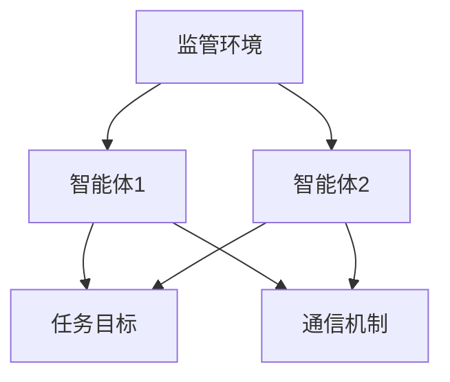
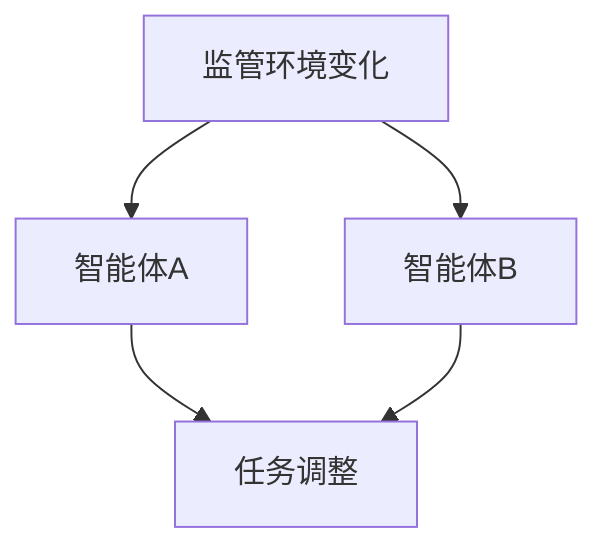
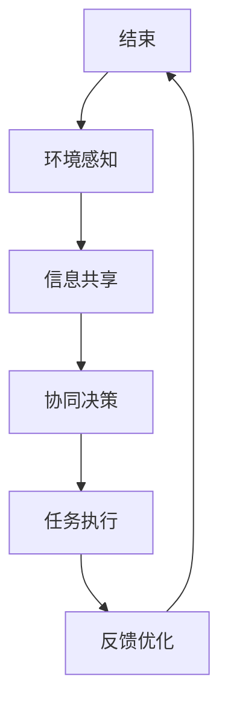
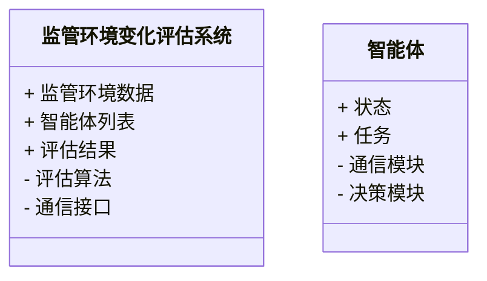
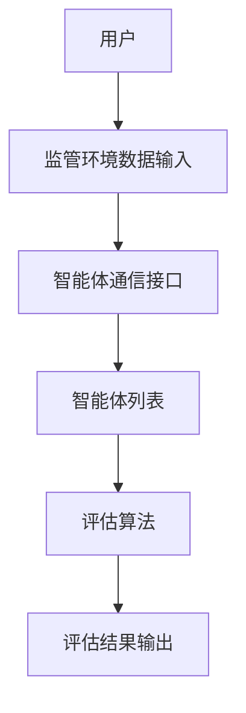
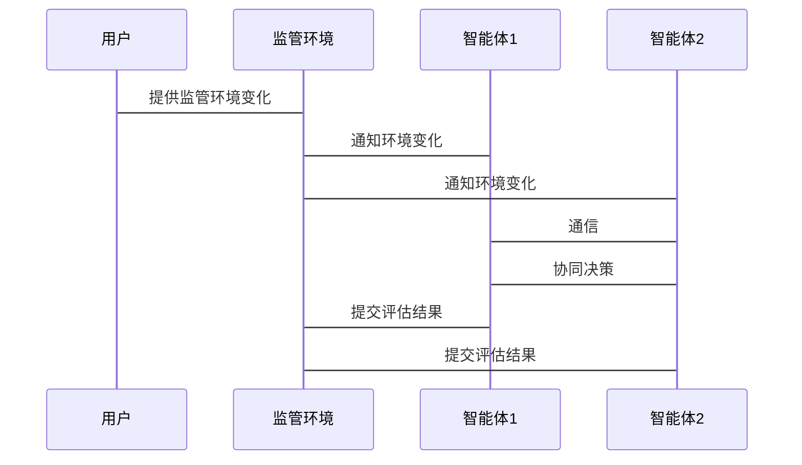

                 


# 多智能体协同评估监管环境变化

> 关键词：多智能体协同，监管环境变化，分布式计算，系统架构，算法原理

> 摘要：本文探讨了多智能体协同在监管环境变化评估中的应用，从背景介绍、核心概念、算法原理、系统架构到项目实战，系统地分析了多智能体协同与监管环境变化之间的关系，结合实际案例，详细讲解了如何通过多智能体协同技术来评估和应对监管环境变化。本文旨在为读者提供一个多维度的技术视角，帮助理解多智能体协同在复杂监管环境中的重要作用。

---

## 第一部分: 多智能体协同与监管环境变化的背景介绍

### 第1章: 多智能体协同的基本概念
#### 1.1 多智能体系统的定义
多智能体系统（Multi-Agent System, 简称MAS）是由多个智能体组成的分布式系统，这些智能体能够自主决策、协同合作，并通过通信机制实现信息共享和任务分配。多智能体系统的核心在于智能体之间的协作，通过协同完成复杂任务，从而实现整体目标。

#### 1.2 监管环境变化的定义
监管环境是指对某个领域或系统进行监督和管理的外部条件和规则。监管环境变化指的是这些条件或规则的动态调整，例如政策法规的更新、市场规则的变化、技术标准的演进等。监管环境的变化可能对系统的运行产生重大影响，因此需要通过多智能体协同来实时评估和应对。

#### 1.3 多智能体协同在监管环境中的作用
- **信息共享**：智能体之间可以通过通信机制共享监管环境的变化信息，从而快速响应。
- **协同决策**：通过分布式计算和协同决策，智能体能够共同制定应对监管环境变化的策略。
- **动态调整**：多智能体协同能够实时感知环境变化，并动态调整系统的运行策略。

### 第2章: 多智能体协同与监管环境变化的关系
#### 2.1 多智能体协同在监管中的作用
- **提高效率**：通过智能体的协同工作，可以快速分析和处理监管环境变化。
- **增强适应性**：多智能体协同能够根据环境变化自动调整系统行为，提高系统的适应性。
- **降低风险**：通过协同决策，可以提前预判监管环境变化带来的风险，并制定应对措施。

#### 2.2 监管环境变化对多智能体协同的影响
- **挑战**：监管环境变化可能对智能体的通信、决策和协调机制提出更高的要求。
- **机遇**：环境变化为多智能体协同提供了优化和创新的机会，可以通过动态调整智能体行为来提升系统的整体性能。

---

## 第二部分: 多智能体协同与监管环境变化的核心概念与联系

### 第3章: 多智能体协同的核心原理
#### 3.1 多智能体协同的基本原理
- **通信机制**：智能体之间通过消息传递进行通信，共享环境信息和任务状态。
- **决策机制**：每个智能体基于自身状态和环境信息，做出局部最优决策。
- **协调机制**：通过协调机制，智能体之间可以达成一致，避免冲突，确保系统整体目标的实现。

#### 3.2 监管环境变化的评估方法
- **定量评估**：通过数学模型和算法，对监管环境变化进行量化分析。
- **定性评估**：通过专家评估和场景分析，对监管环境变化进行定性判断。
- **综合评估**：结合定量和定性方法，对监管环境变化进行全面评估。

### 第4章: 多智能体协同与监管环境变化的实体关系分析
#### 4.1 多智能体协同的实体关系图


#### 4.2 监管环境变化对多智能体协同的影响


---

## 第三部分: 多智能体协同与监管环境变化的算法原理

### 第4章: 算法原理讲解
#### 4.1 多智能体协同的算法流程


#### 4.2 算法的数学模型
$$ V = \sum_{i=1}^{n} v_i $$
其中，$v_i$ 表示第 $i$ 个智能体的贡献值。

#### 4.3 算法的Python实现
```python
class Agent:
    def __init__(self, id):
        self.id = id
        self.state = None

    def感知环境(self, environment):
        self.state = environment感知结果

    def 协同决策(self, 其他agents):
        for agent in 其他agents:
            self.state = self.state + agent.state

    def 执行任务(self):
        根据self.state 执行具体任务

# 示例代码
agent1 = Agent(1)
agent2 = Agent(2)
agent1.感知环境("环境变化")
agent1.协同决策([agent2])
agent1.执行任务()
```

---

## 第四部分: 多智能体协同与监管环境变化的系统架构设计

### 第5章: 系统架构设计
#### 5.1 系统功能设计


#### 5.2 系统架构设计


---

## 第五部分: 项目实战

### 第6章: 项目实战
#### 6.1 环境安装
```bash
pip install python-magent
```

#### 6.2 核心代码实现
```python
from magent import Environment, Agent

class MyAgent(Agent):
    def __init__(self, id):
        super().__init__(id)
        self.state = None

    def perceive(self, environment):
        self.state = environment.get_state()

    def decide(self):
        return self.state

# 创建环境和智能体
env = Environment()
agent1 = MyAgent(1)
agent2 = MyAgent(2)
env.add_agent(agent1)
env.add_agent(agent2)

# 运行环境
env.run()
```

#### 6.3 案例分析


---

## 第六部分: 总结与展望

### 第7章: 总结
#### 7.1 最佳实践
- **明确目标**：在设计多智能体协同系统时，首先要明确系统的目标和需求。
- **优化通信机制**：确保智能体之间的通信高效可靠，减少信息延迟。
- **动态调整**：根据监管环境变化，动态调整智能体的行为和策略。

#### 7.2 小结
多智能体协同在监管环境变化评估中的应用，不仅提高了系统的效率和适应性，还为复杂监管环境的优化提供了新的思路。通过多智能体协同技术，可以更好地应对监管环境变化带来的挑战。

#### 7.3 注意事项
- **系统安全性**：在设计多智能体协同系统时，需要考虑系统安全性，防止信息泄露和恶意攻击。
- **智能体多样性**：智能体的多样性和独立性是系统鲁棒性的关键，需要在设计中充分考虑。

#### 7.4 拓展阅读
- 推荐阅读《Multi-Agent Systems: Complexity, Decentralization, and Adaptation》和《Distributed Computing: Principles and Models》。

---

通过以上章节的内容，我们系统地探讨了多智能体协同在监管环境变化评估中的应用，从理论到实践，逐步深入，为读者提供了一个全面的技术视角。

