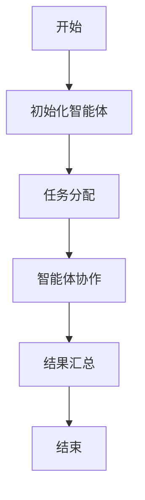
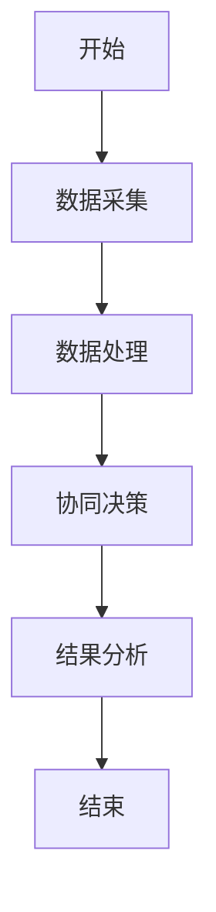
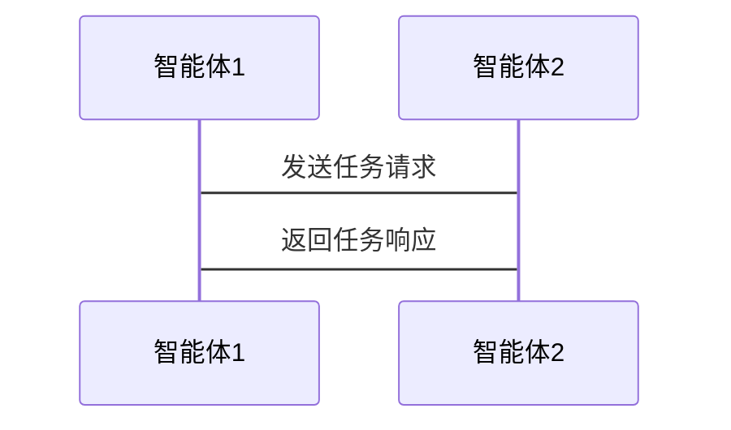
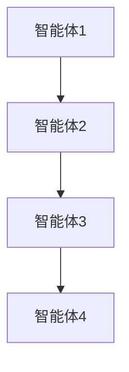

                 


# 多智能体协同评估监管环境影响

## 关键词：多智能体、协同、监管、环境影响、评估

## 摘要：  
多智能体协同是一种通过多个智能体之间的协作来实现复杂任务的技术，其在监管环境影响评估中的应用日益广泛。本文将从多智能体协同的基本概念出发，结合环境影响评估的核心要素，详细探讨多智能体协同在监管环境影响评估中的实现原理、系统架构设计以及实际应用案例。通过本文的分析，读者可以深入了解多智能体协同如何帮助我们更高效、更准确地进行环境影响评估，从而为监管决策提供有力支持。

---

## 第1章 多智能体协同与监管环境影响评估概述

### 1.1 多智能体协同的基本概念

#### 1.1.1 多智能体系统的定义  
多智能体系统（Multi-Agent System, MAS）是由多个智能体（Agent）组成的分布式系统，这些智能体能够通过自主决策和协同合作完成特定任务。每个智能体都有一定的知识表示、推理能力、学习能力和行动能力。

#### 1.1.2 多智能体系统的特征  
- **自主性**：智能体能够自主决策，无需外部干预。  
- **反应性**：智能体能够实时感知环境变化并做出反应。  
- **协作性**：智能体之间通过通信和协作完成共同目标。  
- **分布式性**：智能体分布在不同的物理或逻辑位置，协同完成任务。

#### 1.1.3 多智能体协同的基本原理  
多智能体协同的核心在于智能体之间的通信与协作。通过共享信息、协商任务分配、协调行动，多个智能体能够共同完成复杂任务。

---

### 1.2 监管环境影响评估的背景

#### 1.2.1 监管环境的定义  
监管环境是指需要通过法律法规、政策和技术手段对某些活动进行监督和管理的环境。例如，环境监管、交通监管、能源监管等。

#### 1.2.2 环境影响评估的重要性  
环境影响评估（Environmental Impact Assessment, EIA）是通过科学方法对人类活动对环境的影响进行预测和评估，从而为决策提供依据。随着工业化和城市化的快速发展，环境影响评估的重要性日益凸显。

#### 1.2.3 多智能体协同在环境影响评估中的作用  
多智能体协同能够通过分布式计算、实时数据处理和智能决策，显著提高环境影响评估的效率和准确性。

---

### 1.3 多智能体协同在监管环境影响评估中的应用

#### 1.3.1 多智能体协同的优势  
- **高效性**：通过分布式计算和并行处理，显著提高计算效率。  
- **灵活性**：智能体可以根据环境变化动态调整行为。  
- **鲁棒性**：单个智能体的故障不会导致整个系统崩溃。

#### 1.3.2 监管环境影响评估的复杂性  
环境影响评估涉及多个领域（如生态、经济、社会），需要综合考虑多种因素，且数据来源多样，实时性强。

#### 1.3.3 多智能体协同的应用场景  
- **空气质量监测与预测**：通过多个传感器节点协同工作，实时监测空气质量并预测污染趋势。  
- **交通流量监管**：通过智能交通系统中的多智能体协同优化交通流量。  
- **能源消耗监管**：通过智能电网中的多智能体协同实现能源的高效分配与管理。

---

## 第2章 多智能体协同的核心概念与联系

### 2.1 多智能体系统的组成与结构

#### 2.1.1 多智能体系统的组成要素  
- **智能体**：负责执行具体任务的个体。  
- **通信机制**：智能体之间的信息交互方式。  
- **协同机制**：智能体之间的任务分配与协作方式。  
- **环境**：智能体所处的外部环境。

#### 2.1.2 多智能体系统的层次结构  
多智能体系统通常分为**物理层**、**数据层**、**协同层**和**应用层**。每一层负责不同的功能，如数据采集、信息处理、任务分配和结果应用。

#### 2.1.3 多智能体系统的通信机制  
通信机制包括**点对点通信**和**广播通信**两种方式。智能体之间可以通过消息传递实现信息共享和任务协作。

---

### 2.2 监管环境影响评估的核心要素

#### 2.2.1 环境数据的采集与处理  
环境数据包括空气质量、水质、噪声等，需要通过传感器、数据库等手段进行采集和处理。

#### 2.2.2 监管规则的制定与执行  
监管规则是环境影响评估的依据，通常包括法律法规、行业标准等。

#### 2.2.3 多智能体协同的目标与约束  
多智能体协同的目标是优化环境影响评估的效率和准确性，约束条件包括任务完成时间、资源消耗限制等。

---

### 2.3 多智能体协同与环境影响评估的关系

#### 2.3.1 多智能体协同对环境影响评估的促进作用  
通过多智能体协同，可以实现环境数据的实时采集、快速处理和智能分析，显著提高环境影响评估的效率。

#### 2.3.2 环境影响评估对多智能体协同的反馈机制  
环境影响评估的结果可以为多智能体协同提供优化方向和反馈信息，进一步提升系统的性能。

#### 2.3.3 两者的协同优化  
通过协同优化，可以实现环境影响评估的精准性和多智能体协同的高效性之间的平衡。

---

## 第3章 多智能体协同的算法原理

### 3.1 多智能体协同的基本算法

#### 3.1.1 分布式计算算法  
分布式计算算法通过将任务分解成多个子任务，分别由不同的智能体执行，最后将结果汇总。

#### 3.1.2 通信协议与消息传递  
通信协议是智能体之间信息交互的规则，消息传递是通过预定义的格式进行信息共享。

#### 3.1.3 协同决策算法  
协同决策算法通过智能体之间的协商和协作，共同制定决策方案。

---

### 3.2 环境影响评估的数学模型

#### 3.2.1 环境影响评估的指标体系  
环境影响评估通常包括污染物浓度、生态影响、社会影响等多个指标。

#### 3.2.2 多智能体协同的数学模型  
数学模型描述了智能体之间的协作关系和任务分配逻辑。

#### 3.2.3 约束条件与优化目标  
约束条件包括资源限制、时间限制等，优化目标是最大化环境影响评估的准确性和效率。

---

### 3.3 算法实现的流程图

#### 3.3.1 多智能体协同的流程图  


#### 3.3.2 环境影响评估的流程图  


---

## 第4章 多智能体协同的系统架构设计

### 4.1 系统功能设计

#### 4.1.1 多智能体协同的核心功能  
- 数据采集与处理  
- 任务分配与协作  
- 结果汇总与分析  

#### 4.1.2 环境影响评估的核心功能  
- 数据采集与实时监测  
- 环境影响预测与评估  
- 监管决策支持  

---

### 4.2 系统架构设计

#### 4.2.1 系统架构图  


#### 4.2.2 系统接口设计  
系统接口包括智能体间的通信接口和外部系统的接口。

#### 4.2.3 系统交互图  


---

## 第5章 项目实战：多智能体协同评估监管环境影响

### 5.1 项目背景

#### 5.1.1 项目目标  
通过多智能体协同实现某区域的环境影响评估。

#### 5.1.2 项目需求  
- 实时采集环境数据  
- 分析环境影响  
- 提供监管决策支持  

---

### 5.2 系统实现

#### 5.2.1 环境数据采集  
使用传感器采集空气质量数据。

#### 5.2.2 数据处理与分析  
通过算法对数据进行处理和分析。

#### 5.2.3 协同决策  
智能体之间协作完成任务分配和决策。

---

### 5.3 代码实现

#### 5.3.1 环境数据采集代码  
```python
import serial

ser = serial.Serial('COM1', 9600)
data = ser.readline().decode().strip()
print(data)
```

#### 5.3.2 数据处理与分析代码  
```python
import numpy as np

data = np.array([1, 2, 3, 4, 5])
mean = np.mean(data)
print(mean)
```

---

## 第6章 多智能体协同的扩展应用

### 6.1 交通监管中的应用  
多智能体协同可以用于交通流量预测和优化。

### 6.2 能源监管中的应用  
多智能体协同可以用于智能电网的优化和能源分配。

### 6.3 其他领域的应用  
多智能体协同还可以应用于物流、医疗、教育等领域。

---

## 第7章 总结与展望

### 7.1 总结  
多智能体协同在监管环境影响评估中的应用具有重要意义，通过分布式计算和智能协作，显著提高了环境影响评估的效率和准确性。

### 7.2 展望  
未来，随着人工智能和大数据技术的不断发展，多智能体协同在环境影响评估中的应用将更加广泛和深入。

---

## 第8章 最佳实践与注意事项

### 8.1 最佳实践  
- **模块化设计**：将系统划分为多个模块，便于维护和扩展。  
- **高效通信**：优化智能体之间的通信机制，减少数据传输延迟。  
- **容错设计**：设计容错机制，确保单个智能体故障不影响整个系统。

### 8.2 注意事项  
- **数据安全**：确保环境数据的安全性和隐私性。  
- **系统稳定性**：确保系统的稳定运行，避免因故障导致数据丢失。  
- **算法优化**：不断优化算法，提高系统的计算效率和准确性。

---

## 第9章 拓展阅读

### 9.1 推荐书籍  
- 《Multi-Agent Systems: Algorithmic, Complexity, and Synthesis》  
- 《Environmental Impact Assessment: Theory and Practice》  

### 9.2 推荐论文  
- "Multi-Agent Systems for Environmental Monitoring"  
- "Collaborative Intelligence in Environmental Decision-Making"

---

## 附录

### 附录A 多智能体协同的数学模型  
$$ y = f(x) $$

### 附录B 系统架构设计图  


### 附录C 项目代码实现  
```python
import serial
import numpy as np

# 数据采集
ser = serial.Serial('COM1', 9600)
data = ser.readline().decode().strip()

# 数据处理
data_array = np.array([float(x) for x in data.split(',')])
mean = np.mean(data_array)
print(mean)
```

---

以上是《多智能体协同评估监管环境影响》的技术博客文章的完整内容，涵盖了从基础概念到实际应用的各个方面，结合了理论分析和实践案例，帮助读者全面理解多智能体协同在环境影响评估中的应用与价值。

