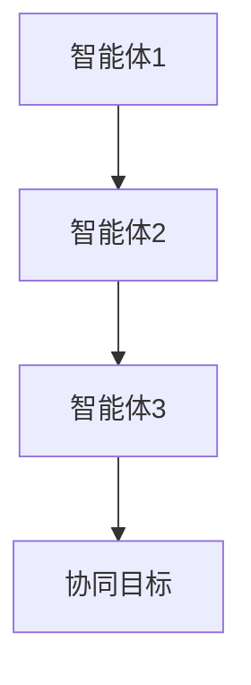
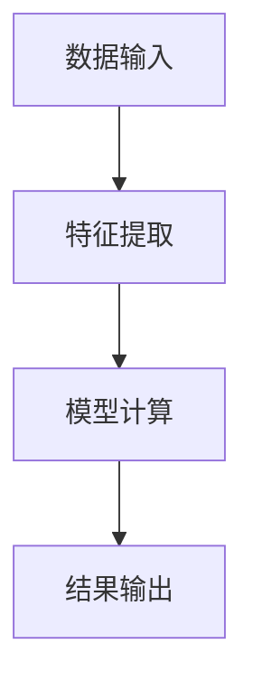
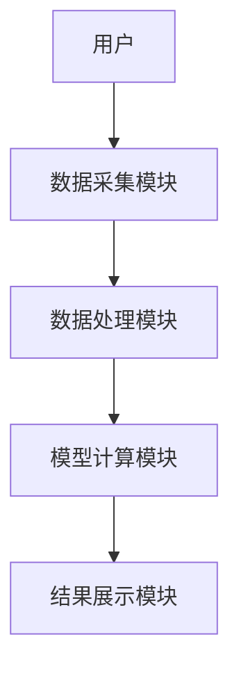
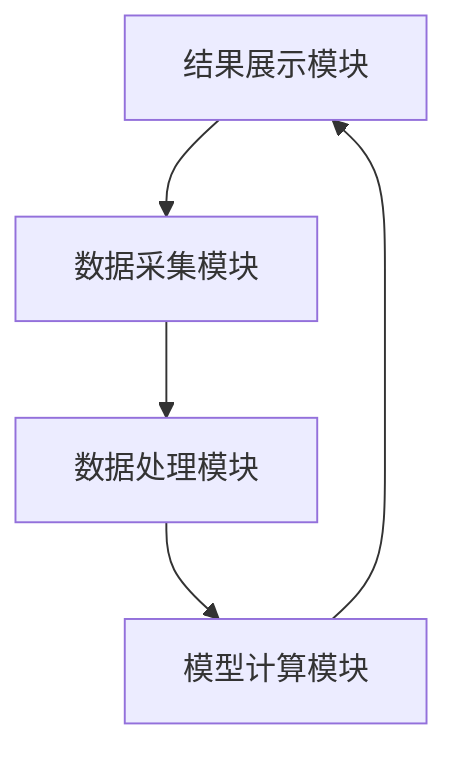

                 


# 多智能体协同进行行业轮动分析

## 关键词：多智能体协同、行业轮动分析、分布式计算、强化学习、系统架构设计、数学模型、项目实战

## 摘要：  
本文详细探讨了多智能体协同在行业轮动分析中的应用，从基础概念到算法实现，再到系统架构设计，全面解析了多智能体协同的优势及其在实际场景中的应用价值。通过数学模型、流程图和代码示例，本文为读者提供了从理论到实践的完整指南。

---

# 第1章: 多智能体协同概述

## 1.1 多智能体协同的基本概念

### 1.1.1 多智能体系统的定义  
多智能体系统（Multi-Agent System, MAS）是由多个智能体（Agent）组成的分布式系统，每个智能体都是一个能够感知环境、自主决策并执行任务的实体。多智能体系统的特点是智能体之间通过通信和协作完成复杂任务。

### 1.1.2 多智能体系统的特点  
1. **自主性**：智能体能够自主决策，无需外部干预。  
2. **反应性**：智能体能够根据环境变化实时调整行为。  
3. **协作性**：多个智能体通过协作完成共同目标。  
4. **分布式性**：智能体分布在不同的节点上，通信通过网络进行。  

### 1.1.3 多智能体协同的核心要素  
1. **通信机制**：智能体之间通过消息传递进行通信。  
2. **任务分配**：智能体根据自身能力和环境需求分配任务。  
3. **协作策略**：智能体通过协作策略实现目标的最优达成。  

## 1.2 行业轮动分析的背景与意义

### 1.2.1 行业轮动的概念  
行业轮动是指在不同行业中，由于市场环境、政策变化、技术进步等因素，某些行业会周期性地出现增长或衰退。通过分析行业轮动，可以为投资决策提供依据。

### 1.2.2 行业轮动分析的必要性  
1. **市场变化快**：行业轮动分析能够捕捉市场变化的信号。  
2. **投资决策支持**：通过分析行业轮动趋势，投资者可以优化资产配置。  
3. **企业战略调整**：企业可以根据行业轮动趋势调整业务方向。  

### 1.2.3 多智能体协同在行业轮动分析中的作用  
1. **数据采集与处理**：智能体可以实时采集行业数据并进行初步处理。  
2. **协同分析**：多个智能体协作完成复杂的数据分析任务。  
3. **结果输出**：智能体协同输出行业轮动分析的结果。  

## 1.3 本章小结  
本章介绍了多智能体协同的基本概念和行业轮动分析的背景与意义，强调了多智能体协同在行业轮动分析中的重要性。

---

# 第2章: 多智能体协同的核心概念与联系

## 2.1 多智能体协同的核心原理

### 2.1.1 通信机制  
智能体之间的通信可以通过多种方式实现，例如通过消息队列（MQ）或 RESTful API。通信机制的设计需要考虑系统的实时性和可靠性。

### 2.1.2 任务分配  
任务分配是多智能体协同的重要环节，可以通过分布式算法（如分布式一致性算法）实现任务的动态分配。  

### 2.1.3 协作策略  
协作策略包括博弈论中的纳什均衡、分布式优化算法等。  

## 2.2 行业轮动分析的数学模型

### 2.2.1 行业轮动的指标体系  
行业轮动分析的指标包括：  
1. 行业增长率（GDP增长率）。  
2. 行业利润率（净利润率）。  
3. 行业景气指数。  

### 2.2.2 多智能体协同的数学表达  
设智能体集合为 $A = \{A_1, A_2, ..., A_n\}$，每个智能体 $A_i$ 的状态为 $s_i$，动作空间为 $a_i$。智能体之间的协作目标是最大化整体收益 $R$，即：  
$$ R = \sum_{i=1}^{n} r_i(a_i, s_i) $$  
其中，$r_i$ 是智能体 $i$ 的收益函数。  

### 2.2.3 模型的验证与优化  
模型的验证可以通过交叉验证和网格搜索实现。  

## 2.3 实体关系图（ER图）与流程图

### 2.3.1 多智能体协同的ER图  


### 2.3.2 行业轮动分析的流程图  


## 2.4 本章小结  
本章详细介绍了多智能体协同的核心原理和行业轮动分析的数学模型，并通过ER图和流程图展示了系统的实体关系和流程步骤。

---

# 第3章: 多智能体协同的算法原理

## 3.1 分布式计算与多智能体协作

### 3.1.1 分布式计算的基本原理  
分布式计算是将计算任务分配到多个计算节点上，通过并行计算提高效率。  

### 3.1.2 多智能体协作的算法框架  
常用的算法框架包括：  
1. **分布式一致性算法**：如Paxos和Raft。  
2. **分布式优化算法**：如分布式梯度下降。  

### 3.1.3 算法的实现步骤  
1. 初始化智能体集合。  
2. 分配任务到各个智能体。  
3. 各智能体并行计算。  
4. 合并计算结果。  

## 3.2 强化学习在多智能体协同中的应用

### 3.2.1 强化学习的基本原理  
强化学习是一种通过试错机制学习策略的方法。  

### 3.2.2 多智能体强化学习的挑战  
1. **动作空间高维性**：多个智能体的动作空间相互影响。  
2. **状态观测的不完全性**：智能体只能观测局部状态。  

### 3.2.3 实际案例分析  
以投资组合优化为例，多个智能体协同决策投资组合，目标是最大化收益并最小化风险。  

## 3.3 算法实现的数学模型

### 3.3.1 状态空间的定义  
状态空间 $S$ 包含所有可能的状态，如 $S = \{s_1, s_2, ..., s_n\}$。  

### 3.3.2 动作空间的定义  
动作空间 $A$ 包含所有可能的动作，如 $A = \{a_1, a_2, ..., a_m\}$。  

### 3.3.3 奖励函数的设计  
奖励函数 $r(s, a)$ 表示在状态 $s$ 下执行动作 $a$ 所获得的奖励。  

## 3.4 本章小结  
本章介绍了分布式计算和强化学习在多智能体协同中的应用，并通过数学模型和实际案例分析了算法的实现细节。

---

# 第4章: 行业轮动分析的系统架构设计

## 4.1 系统功能设计

### 4.1.1 数据采集模块  
负责采集行业数据，如经济指标、政策变化等。  

### 4.1.2 数据处理模块  
对采集到的数据进行清洗、特征提取和预处理。  

### 4.1.3 模型计算模块  
使用多智能体协同算法进行行业轮动分析。  

### 4.1.4 结果展示模块  
将分析结果以可视化形式展示给用户。  

## 4.2 系统架构图



## 4.3 系统接口设计

### 4.3.1 API接口  
1. `/api/data/input`：接收行业数据。  
2. `/api/result/output`：输出分析结果。  

### 4.3.2 接口设计注意事项  
1. 接口设计应遵循RESTful原则。  
2. 接口应支持高并发请求。  

## 4.4 系统交互序列图



## 4.5 本章小结  
本章设计了行业轮动分析系统的功能模块、架构图和接口设计，并通过序列图展示了系统的交互流程。

---

# 第5章: 项目实战

## 5.1 环境安装

### 5.1.1 安装Python
```bash
python --version
```

### 5.1.2 安装依赖库
```bash
pip install numpy pandas scikit-learn
```

## 5.2 系统核心实现

### 5.2.1 数据采集模块实现
```python
import requests

def fetch_data(api_key):
    response = requests.get(f'http://api.example.com/industry_data?api_key={api_key}')
    return response.json()
```

### 5.2.2 数据处理模块实现
```python
import pandas as pd

def preprocess_data(data):
    df = pd.DataFrame(data)
    df.dropna(inplace=True)
    return df
```

### 5.2.3 模型计算模块实现
```python
import numpy as np

def compute_risk_reward(data):
    returns = data['returns'].values
    risk = np.std(returns)
    reward = np.mean(returns)
    return risk, reward
```

## 5.3 代码应用解读与分析

### 5.3.1 数据采集模块解读  
数据采集模块通过API接口获取行业数据，返回JSON格式的数据。  

### 5.3.2 数据处理模块解读  
数据处理模块使用Pandas库对数据进行清洗和特征提取，确保数据质量。  

### 5.3.3 模型计算模块解读  
模型计算模块通过计算收益和风险，评估行业的轮动潜力。  

## 5.4 实际案例分析

### 5.4.1 案例背景  
假设我们分析2023年的行业轮动趋势，重点关注科技、金融和制造业。  

### 5.4.2 数据处理与分析  
1. 采集各行业的增长率和利润率数据。  
2. 使用模型计算各行业的风险和收益。  
3. 输出行业轮动的结论。  

## 5.5 本章小结  
本章通过实际案例分析，展示了多智能体协同在行业轮动分析中的应用，并详细解读了系统的实现过程。

---

# 第6章: 高级主题与优化实践

## 6.1 多智能体协同的优化策略

### 6.1.1 并行计算优化  
通过并行计算提高系统的计算效率。  

### 6.1.2 智能体自适应调整  
智能体能够根据环境变化自适应调整行为。  

## 6.2 行业轮动分析的高级算法

### 6.2.1 时间序列分析  
使用ARIMA模型预测行业轮动趋势。  

### 6.2.2 机器学习算法优化  
通过集成学习提高模型的预测精度。  

## 6.3 最佳实践 tips  
1. 定期更新模型参数，适应市场变化。  
2. 优化系统架构，提高系统的可扩展性。  
3. 加强数据安全，保护用户隐私。  

## 6.4 本章小结  
本章介绍了多智能体协同的优化策略和行业轮动分析的高级算法，并提供了最佳实践的建议。

---

# 第7章: 总结与展望

## 7.1 本章总结  
本文详细探讨了多智能体协同在行业轮动分析中的应用，从理论到实践，全面解析了多智能体协同的优势和技术实现。

## 7.2 未来展望  
1. **技术发展**：多智能体协同将与边缘计算、区块链等技术深度融合。  
2. **应用场景扩展**：行业轮动分析将扩展到更多领域，如智慧城市、智慧医疗等。  
3. **算法优化**：强化学习和分布式计算将在多智能体协同中得到进一步优化。  

## 7.3 本章小结  
本文总结了多智能体协同在行业轮动分析中的应用，并展望了未来的发展方向。

---

# 附录: 参考文献

1. Russell, S., & Norvig, P. (2010). Artificial Intelligence: A Modern Approach.  
2.

