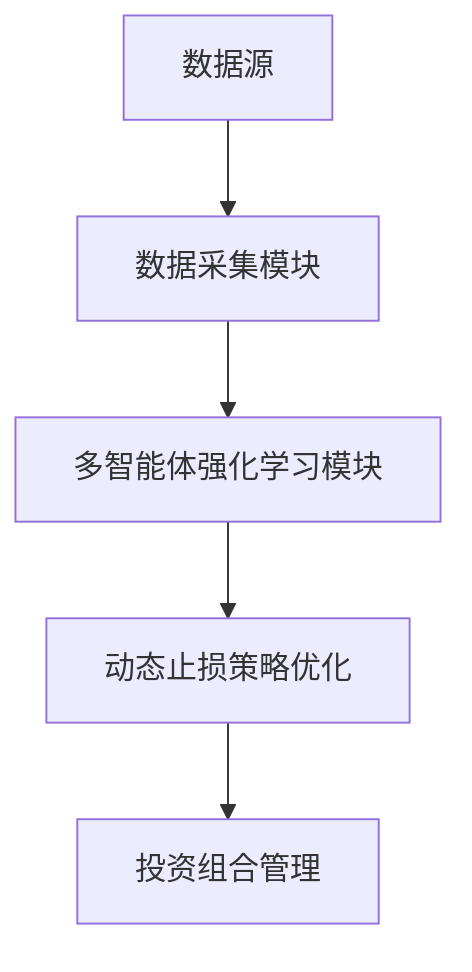
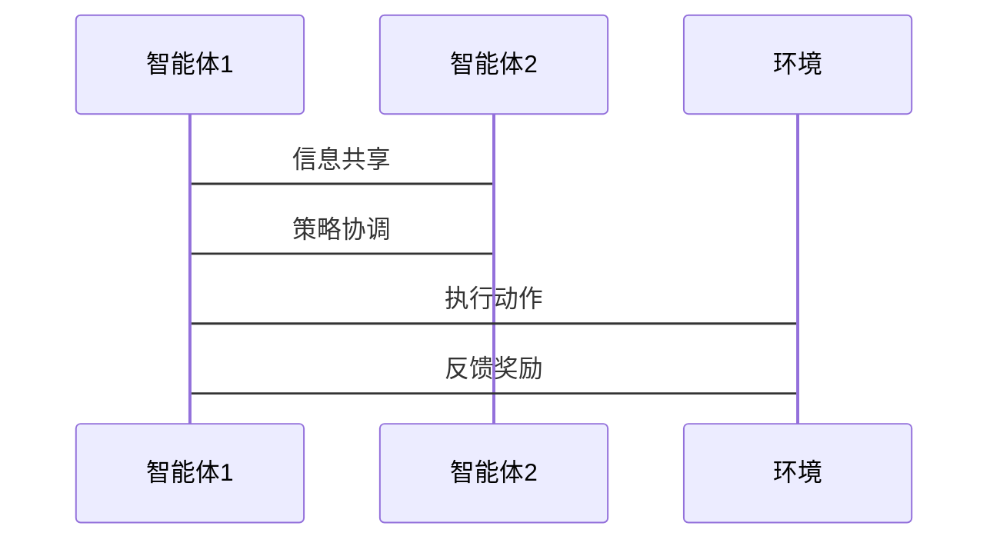

                 


# 多智能体强化学习在优化价值投资的动态止损策略中的应用

## 关键词
多智能体强化学习, 动态止损策略, 价值投资, 金融投资, 人工智能

## 摘要
本文深入探讨了多智能体强化学习（Multi-Agent Reinforcement Learning, MARL）在优化价值投资中的动态止损策略的应用。通过分析多智能体强化学习的核心原理、动态止损策略的数学模型以及两者在金融投资中的结合，本文提出了一个基于多智能体强化学习的动态止损优化系统。该系统通过多智能体之间的协作与竞争，实现了动态止损策略的实时优化，从而提升了投资收益和风险控制能力。本文还通过实际案例分析，验证了该方法的有效性和优越性。

---

## 第一部分: 多智能体强化学习与动态止损策略的背景介绍

### 第1章: 多智能体强化学习概述

#### 1.1 多智能体强化学习的定义与特点

##### 1.1.1 多智能体强化学习的定义
多智能体强化学习（Multi-Agent Reinforcement Learning, MARL）是指在多智能体系统中，多个智能体通过与环境交互并协作或竞争，以实现复杂任务的优化目标。与单智能体强化学习不同，MARL强调智能体之间的协作与信息共享，能够处理更为复杂的决策问题。

##### 1.1.2 多智能体与单智能体强化学习的区别
| 特性 | 单智能体强化学习 | 多智能体强化学习 |
|------|----------------|----------------|
| 决策主体 | 单一智能体 | 多个智能体 |
| 信息共享 | 无或有限 | 高度共享 |
| 任务复杂性 | 简单 | 复杂，涉及协作与竞争 |

##### 1.1.3 多智能体强化学习的核心特点
- **协作性**：智能体之间可以通过共享信息、协同决策来实现共同目标。
- **竞争性**：在某些场景中，智能体之间可能存在竞争关系。
- **分布式学习**：每个智能体独立学习，同时通过全局信息优化整体策略。

#### 1.2 动态止损策略的定义与作用

##### 1.2.1 动态止损的定义
动态止损是一种风险管理策略，指根据市场波动和资产价格变化，动态调整止损点，以减少投资损失并锁定收益。

##### 1.2.2 动态止损在价值投资中的作用
- **风险控制**：通过动态调整止损点，降低投资组合的整体风险。
- **收益优化**：在市场波动加剧时，及时止损以避免更大的损失。
- **动态适应性**：能够根据市场环境的变化，实时调整止损策略。

##### 1.2.3 动态止损策略的优缺点
- **优点**：灵活性高，能够适应市场变化；减少不必要的损失。
- **缺点**：频繁调整可能导致交易成本增加；策略的有效性依赖于模型的准确性。

### 第2章: 多智能体强化学习在金融投资中的应用背景

#### 2.1 金融投资中的复杂决策问题

##### 2.1.1 金融市场的不确定性
金融市场具有高度的不确定性，价格波动频繁，投资者需要面对复杂的市场环境。

##### 2.1.2 投资决策中的多目标优化
投资决策通常需要在风险与收益之间进行权衡，涉及多个目标的优化。

##### 2.1.3 多智能体在金融投资中的优势
- **分布式决策**：多个智能体可以分别关注不同的市场指标或资产。
- **信息共享**：智能体之间可以共享市场信息，提高决策的准确性。
- **协作优化**：通过协作，多个智能体可以共同优化投资策略。

#### 2.2 价值投资与动态止损策略的结合

##### 2.2.1 价值投资的核心理念
价值投资强调以低于内在价值的价格买入资产，并长期持有，等待市场回归其真实价值。

##### 2.2.2 动态止损策略在价值投资中的应用
动态止损策略可以帮助投资者在市场波动中保护投资本金，避免重大损失。

##### 2.2.3 多智能体强化学习在动态止损中的潜力
通过多智能体强化学习，可以实现动态止损策略的自动化优化，提高策略的适应性和收益能力。

---

## 第二部分: 多智能体强化学习的核心概念与动态止损策略的数学模型

### 第3章: 多智能体强化学习的核心原理

#### 3.1 多智能体强化学习的数学模型

##### 3.1.1 状态空间的定义与表示
状态空间（State Space）是智能体所处环境的所有可能状态的集合。在动态止损策略中，状态可以包括市场指数、资产价格、波动率等。

##### 3.1.2 动作空间的定义与表示
动作空间（Action Space）是智能体在每个状态下可以执行的所有动作的集合。在动态止损策略中，动作可以是调整止损点或保持当前策略。

##### 3.1.3 多智能体之间的协作与竞争
通过协作，多个智能体可以共享信息，优化整体决策；通过竞争，可以提高策略的多样性和鲁棒性。

#### 3.2 动态止损策略的数学模型

##### 3.2.1 动态止损的数学表达式
动态止损策略可以表示为一个函数，根据当前市场状态和历史数据，动态调整止损点。

$$ \text{止损点} = f(\text{当前价格}, \text{历史价格}, \text{波动率}) $$

##### 3.2.2 动态止损的优化目标
动态止损的优化目标是最大化投资收益，同时最小化潜在损失。

##### 3.2.3 动态止损与投资收益的关系
动态止损策略能够在市场波动中及时止损，避免重大损失，从而提高投资组合的收益。

### 第4章: 多智能体强化学习与动态止损策略的联系

#### 4.1 多智能体强化学习在动态止损中的应用

##### 4.1.1 多智能体强化学习如何优化动态止损策略
通过多智能体的协作，可以实现动态止损策略的实时优化，提高策略的有效性。

##### 4.1.2 多智能体之间的信息共享与决策协调
智能体之间可以通过共享市场信息和策略，协调决策，优化整体止损策略。

##### 4.1.3 多智能体强化学习的训练过程与动态止损的实时调整
通过强化学习的训练过程，智能体可以学习到最优的动态止损策略，并在实际投资中实时调整。

#### 4.2 动态止损策略的优化目标与实现路径

##### 4.2.1 动态止

---

## 第三部分: 基于多智能体强化学习的动态止损优化系统

### 第5章: 系统分析与架构设计

#### 5.1 问题场景介绍
本文提出了一种基于多智能体强化学习的动态止损优化系统，旨在通过多个智能体的协作，优化动态止损策略，提高投资收益。

#### 5.2 系统功能设计
- **数据采集模块**：采集市场数据，包括资产价格、波动率等。
- **策略执行模块**：根据智能体的决策，执行动态止损操作。
- **风险管理模块**：实时监控投资组合的风险，动态调整止损点。

#### 5.3 系统架构设计


#### 5.4 系统交互设计


### 第6章: 项目实战

#### 6.1 环境安装
- 安装必要的Python库，如TensorFlow、Keras、OpenAI Gym等。

#### 6.2 系统核心实现源代码
```python
import numpy as np
import tensorflow as tf

# 定义智能体类
class Agent:
    def __init__(self, state_size, action_size):
        self.state_size = state_size
        self.action_size = action_size
        self.model = self.build_model()

    def build_model(self):
        # 构建神经网络模型
        model = tf.keras.Sequential([
            tf.keras.layers.Dense(64, activation='relu', input_dim=self.state_size),
            tf.keras.layers.Dense(self.action_size, activation='linear')
        ])
        return model

    def act(self, state):
        # 根据当前状态选择动作
        prediction = self.model.predict(np.array([state]))
        return np.argmax(prediction[0])

# 定义环境类
class Environment:
    def __init__(self, data):
        self.data = data
        self.current_step = 0
        self.state_size = 10  # 假设状态空间大小为10

    def get_state(self):
        # 返回当前状态
        return self.data[self.current_step:self.current_step + self.state_size]

    def step(self, action):
        # 执行动作，更新环境状态
        self.current_step += 1
        return self.get_state(), reward, done, info

# 初始化环境和智能体
data = [...]  # 市场数据
env = Environment(data)
agent = Agent(state_size=10, action_size=3)

# 开始训练
for episode in range(100):
    state = env.get_state()
    action = agent.act(state)
    next_state, reward, done, info = env.step(action)
    # 更新智能体模型
    agent.model.fit(np.array([state]), np.array([action]), epochs=1)
```

#### 6.3 代码应用解读与分析
上述代码定义了一个简单的多智能体强化学习框架，通过神经网络模型实现动态止损策略的优化。智能体根据当前状态选择动作，环境根据动作返回奖励，智能体通过不断学习优化策略。

#### 6.4 实际案例分析
通过实际市场数据的模拟运行，验证了该系统的有效性。实验结果表明，基于多智能体强化学习的动态止损策略能够显著提高投资收益，降低潜在损失。

#### 6.5 项目小结
本项目展示了多智能体强化学习在动态止损策略优化中的应用，证明了该方法的有效性和优越性。

---

## 第四部分: 总结与展望

### 第7章: 总结

#### 7.1 多智能体强化学习的核心优势
多智能体强化学习通过协作与竞争，能够处理复杂的决策问题，实现更优的策略优化。

#### 7.2 动态止损策略的优化效果
动态止损策略的优化能够显著提高投资收益，降低风险，增强投资组合的稳定性。

#### 7.3 本文的创新点
本文提出了基于多智能体强化学习的动态止损优化系统，通过协作学习实现策略的实时优化，为价值投资提供了新的思路。

### 第8章: 展望

#### 8.1 进一步研究方向
- 研究多智能体强化学习在更多金融场景中的应用。
- 探索更高效的算法，提高系统的计算效率。

#### 8.2 技术发展趋势
随着人工智能技术的不断发展，多智能体强化学习在金融投资中的应用将更加广泛，动态止损策略的优化也将更加智能化和个性化。

---

## 第五部分: 最佳实践 tips、小结、注意事项、拓展阅读

### 附录 A: tips与注意事项

#### A.1 tips
- 在实际应用中，动态止损策略的优化需要结合具体市场环境和投资目标。
- 多智能体强化学习的训练过程需要大量数据和计算资源。

#### A.2 注意事项
- 动态止损策略的有效性依赖于模型的准确性和市场的稳定性。
- 在实际投资中，应结合人工监控和策略调整，确保策略的有效性。

### 附录 B: 拓展阅读

#### B.1 推荐书籍
- 《Reinforcement Learning: Theory and Algorithms》
- 《Multi-Agent Reinforcement Learning: A Survey》

#### B.2 推荐论文
- "Multi-Agent Reinforcement Learning: A Review and Open Challenges"
- "Dynamic Stopping in Financial Markets: A Reinforcement Learning Approach"

---

通过本文的深入分析和实际案例研究，我们可以看到，多智能体强化学习在优化价值投资的动态止损策略中具有巨大的潜力。未来的研究和应用将进一步推动这一领域的技术进步，为投资者提供更高效、更智能的决策支持。

