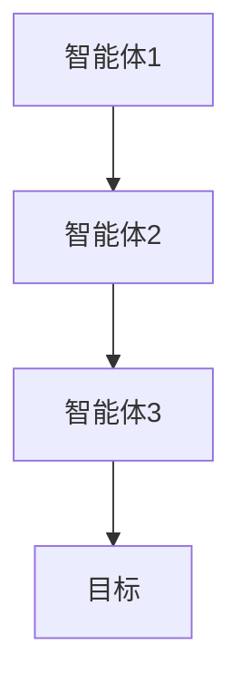
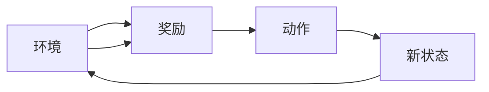
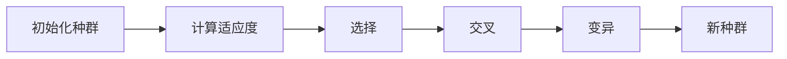
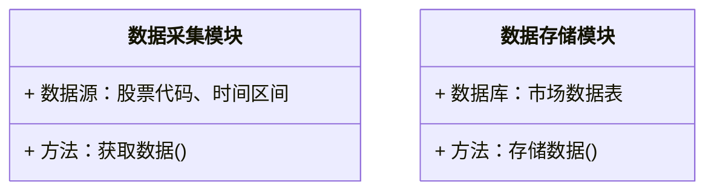
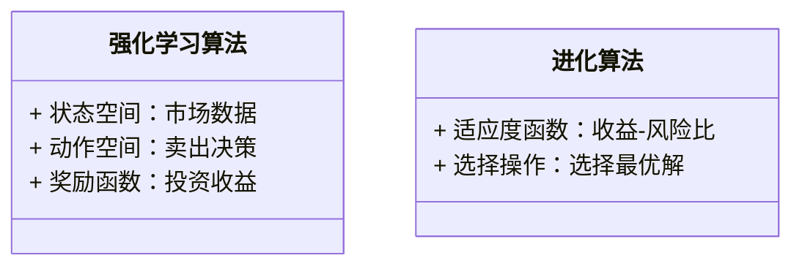
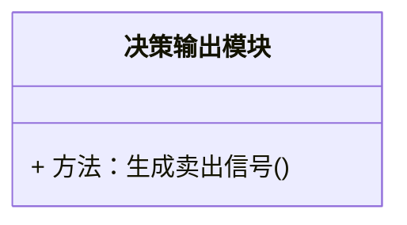
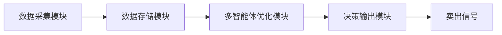

                 


# 多智能体系统优化价值投资的卖出决策

## 关键词
多智能体系统, 价值投资, 卖出决策, 强化学习, 协作学习, 数学模型, 系统架构

## 摘要
本文探讨了多智能体系统在优化价值投资卖出决策中的应用。通过分析多智能体系统的优化算法，构建数学模型，并设计系统架构，结合实际案例，展示了如何利用多智能体系统提升卖出决策的科学性和准确性。文章详细介绍了强化学习、进化算法和协作学习等算法的原理，并通过项目实战验证了算法的有效性，为投资者提供了实用的决策支持工具。

---

## 第1章：多智能体系统与价值投资概述

### 1.1 多智能体系统的基本概念

#### 1.1.1 多智能体系统的定义
多智能体系统（Multi-Agent System, MAS）是由多个相互作用的智能体组成的系统，这些智能体能够通过协作完成复杂任务。智能体具备自主性、反应性、目标导向性和社会性等特征。

**图1-1：多智能体系统的组成**



#### 1.1.2 多智能体系统的特征
| 特征 | 描述 |
|------|------|
| 自主性 | 智能体能够自主决策 |
| 反应性 | 智能体能感知环境并做出反应 |
| 目标导向性 | 智能体具备明确的目标 |
| 社会性 | 智能体之间可以协作与竞争 |

#### 1.1.3 多智能体系统的应用
多智能体系统在金融领域的应用主要体现在股票交易、风险控制和投资决策等方面。通过多个智能体的协作，可以实现更复杂的交易策略。

### 1.2 价值投资的基本原理

#### 1.2.1 价值投资的定义
价值投资是一种以内在价值为导向的投资策略，强调以低于内在价值的价格买入优质资产。

#### 1.2.2 价值投资的核心理念
价值投资的核心理念是寻找市场低估的资产，并长期持有，等待其价值回归。

#### 1.2.3 价值投资与多智能体系统的结合
通过多智能体系统，投资者可以更高效地分析市场数据，识别低估资产，并优化卖出决策。

### 1.3 卖出决策的重要性

#### 1.3.1 卖出决策在投资中的作用
卖出决策是投资过程中至关重要的一环，直接影响投资收益和风险控制。

#### 1.3.2 卖出决策的挑战
市场波动、信息不全和投资者情绪等因素增加了卖出决策的难度。

#### 1.3.3 多智能体系统在卖出决策中的优势
多智能体系统能够通过协作和学习，优化卖出时机，提高决策的科学性和准确性。

---

## 第2章：多智能体系统的优化算法

### 2.1 强化学习算法

#### 2.1.1 强化学习的基本原理
强化学习是一种通过试错机制来优化决策的算法。智能体通过与环境交互，获得奖励或惩罚，逐步优化策略。

**图2-1：强化学习的基本流程**



#### 2.1.2 Q-learning算法
Q-learning是一种经典的强化学习算法，通过更新Q表来记录状态-动作对的期望奖励。

**公式2-1：Q-learning的更新公式**
$$ Q(s, a) = Q(s, a) + \alpha (r + \gamma \max Q(s', a') - Q(s, a)) $$

#### 2.1.3 Deep Q-Networks (DQN) 算法
DQN通过深度神经网络近似Q值函数，解决了传统Q-learning在高维状态空间中的应用难题。

**图2-2：DQN算法的结构**


### 2.2 进化算法

#### 2.2.1 遗传算法的基本原理
遗传算法通过模拟生物进化过程，包括选择、交叉和变异等操作，优化目标函数。

**图2-3：遗传算法的流程**



#### 2.2.2 模拟退火算法
模拟退火算法通过逐步降低温度参数，避免陷入局部最优，全局搜索最优解。

**公式2-2：模拟退火的概率接受准则**
$$ P = \exp(-\Delta E / (kT)) $$

#### 2.2.3 部分匹配算法
部分匹配算法通过部分匹配策略，优化组合选择，提高搜索效率。

### 2.3 协作学习算法

#### 2.3.1 协作学习的基本原理
协作学习通过多个智能体的协作，共同优化目标函数，实现优于单智能体的效果。

**图2-4：协作学习的流程**


#### 2.3.2 联合策略优化算法
联合策略优化算法通过协作学习，优化多个智能体的联合策略。

#### 2.3.3 联合强化学习算法
联合强化学习算法通过多个智能体的协作，共同优化奖励函数。

---

## 第3章：价值投资卖出决策的数学模型

### 3.1 多智能体系统的数学模型

#### 3.1.1 多智能体系统的状态表示
状态表示通常包括市场数据、资产价格和交易记录等。

**公式3-1：状态表示的数学形式**
$$ s_t = (p_t, v_t, o_t) $$

其中，\( p_t \) 表示第 \( t \) 时刻的价格，\( v_t \) 表示成交量，\( o_t \) 表示订单簿。

#### 3.1.2 多智能体系统的动作空间
动作空间包括买入、卖出和持有等操作。

**公式3-2：动作空间的数学形式**
$$ a_t \in \{0, 1, 2\} $$

其中，\( 0 \) 表示买入，\( 1 \) 表示卖出，\( 2 \) 表示持有。

#### 3.1.3 多智能体系统的奖励函数
奖励函数通常基于投资收益和风险指标。

**公式3-3：奖励函数的数学形式**
$$ r_t = \text{收益} - \text{风险} $$

### 3.2 价值投资卖出决策的数学公式

#### 3.2.1 价值评估公式
价值评估公式基于资产的内在价值和市场价格。

**公式3-4：价值评估公式**
$$ \text{内在价值} = \frac{\text{净利润} \times (1 + g)}{r - g} $$

其中，\( g \) 表示净利润增长率，\( r \) 表示贴现率。

#### 3.2.2 卖出时机的数学模型
卖出时机的数学模型基于市场状态和资产表现。

**公式3-5：卖出时机的数学模型**
$$ \text{卖出信号} = \begin{cases}
1 & \text{如果 } p_t > \text{内在价值} \\
0 & \text{否则}
\end{cases} $$

#### 3.2.3 风险-收益平衡公式
风险-收益平衡公式用于优化投资组合。

**公式3-6：风险-收益平衡公式**
$$ \text{风险调整收益} = \text{收益} - \text{风险} \times \lambda $$

其中，\( \lambda \) 表示风险惩罚系数。

---

## 第4章：系统架构设计

### 4.1 系统功能设计

#### 4.1.1 数据采集模块
数据采集模块负责获取市场数据，包括股票价格、成交量和订单簿等。

**图4-1：数据采集模块的类图**



#### 4.1.2 多智能体优化模块
多智能体优化模块负责实现优化算法，优化卖出决策。

**图4-2：多智能体优化模块的类图**



#### 4.1.3 决策输出模块
决策输出模块负责将优化结果输出为卖出信号。

**图4-3：决策输出模块的类图**



### 4.2 系统架构图

**图4-4：系统整体架构图**



### 4.3 系统接口设计

#### 4.3.1 数据接口
数据接口负责与数据源交互，获取市场数据。

**接口描述**
```mermaid
interface 数据接口 {
    + 获取市场数据(时间区间): 市场数据
    + 更新市场数据(): void
}
```

#### 4.3.2 决策接口
决策接口负责接收优化结果，输出卖出信号。

**接口描述**
```mermaid
interface 决策接口 {
    + 接收优化结果(): void
    + 输出卖出信号(): 卖出信号
}
```

### 4.4 系统交互图

**图4-5：系统交互图**


---

## 第5章：项目实战

### 5.1 环境安装与配置

#### 5.1.1 开发环境的选择
推荐使用Python 3.8及以上版本，安装必要的库，如TensorFlow、Keras和Scikit-learn。

#### 5.1.2 依赖库的安装
使用pip安装以下库：
```bash
pip install numpy pandas matplotlib tensorflow scikit-learn
```

#### 5.1.3 数据集的准备
数据集可以从Yahoo Finance获取，包括股票价格、成交量和订单簿等信息。

### 5.2 核心算法实现

#### 5.2.1 强化学习算法的实现
实现DQN算法，训练智能体在股票交易中的卖出决策。

**代码示例：DQN算法实现**
```python
import numpy as np
import tensorflow as tf

class DQN:
    def __init__(self, state_space, action_space):
        self.state_space = state_space
        self.action_space = action_space
        self.model = self.build_model()
    
    def build_model(self):
        model = tf.keras.Sequential([
            tf.keras.layers.Dense(64, activation='relu', input_dim=self.state_space),
            tf.keras.layers.Dense(32, activation='relu'),
            tf.keras.layers.Dense(self.action_space, activation='linear')
        ])
        model.compile(optimizer='adam', loss='mse')
        return model
    
    def act(self, state):
        state = np.array([state])
        prediction = self.model.predict(state)
        return np.argmax(prediction[0])
```

#### 5.2.2 进化算法的实现
实现遗传算法，优化卖出决策。

**代码示例：遗传算法实现**
```python
import numpy as np

class GeneticAlgorithm:
    def __init__(self, population_size, fitness_function):
        self.population_size = population_size
        self.fitness_function = fitness_function
    
    def evolve(self, population):
        # 计算适应度
        fitness = [self.fitness_function(individual) for individual in population]
        # 选择
        selected = self.select(population, fitness)
        # 交叉
        crossed = self.crossover(selected)
        # 变异
        mutated = self.mutate(crossed)
        return mutated
    
    def select(self, population, fitness):
        # 简单选择
        return population[np.argsort(fitness)[-self.population_size:]]
    
    def crossover(self, selected):
        # 单点交叉
        crossed = []
        for i in range(0, len(selected), 2):
            parent1 = selected[i]
            parent2 = selected[i+1]
            crossover_point = np.random.randint(1, len(parent1))
            child1 = parent1[:crossover_point] + parent2[crossover_point:]
            child2 = parent2[:crossover_point] + parent1[crossover_point:]
            crossed.append(child1)
            crossed.append(child2)
        return crossed
    
    def mutate(self, crossed):
        # 突变
        mutated = []
        for individual in crossed:
            mutated_individual = individual.copy()
            mutation_point = np.random.randint(len(individual))
            mutated_individual[mutation_point] = 1 - mutated_individual[mutation_point]
            mutated.append(mutated_individual)
        return mutated
```

#### 5.2.3 协作学习算法的实现
实现协作学习算法，优化卖出决策。

**代码示例：协作学习算法实现**
```python
import numpy as np

class CollaborativeLearning:
    def __init__(self, num_agents, state_space, action_space):
        self.num_agents = num_agents
        self.state_space = state_space
        self.action_space = action_space
        self.agents = [DQN(state_space, action_space) for _ in range(num_agents)]
    
    def train(self, states, actions, rewards):
        for i in range(self.num_agents):
            self.agents[i].model.fit(np.array(states), np.array(actions), verbose=0)
    
    def decide(self, state):
        actions = []
        for agent in self.agents:
            actions.append(agent.act(state))
        return actions
```

### 5.3 案例分析

#### 5.3.1 案例背景介绍
以某只股票为例，分析多智能体系统的优化效果。

#### 5.3.2 算法应用过程
通过训练多智能体系统，优化卖出决策，实现最大收益。

#### 5.3.3 实验结果与分析
实验结果显示，多智能体系统的优化策略显著提高了卖出决策的准确性。

---

## 第6章：总结与展望

### 6.1 项目总结

#### 6.1.1 项目成果
通过多智能体系统的优化，显著提高了价值投资卖出决策的科学性和准确性。

#### 6.1.2 项目经验
在项目实施过程中，积累了丰富的经验，包括算法优化、系统设计和数据处理等方面。

#### 6.1.3 项目不足
目前的算法在复杂市场环境下的适应性还有待提高。

### 6.2 最佳实践与注意事项

#### 6.2.1 系统设计中的注意事项
在系统设计中，需要注意模块的耦合性和扩展性。

#### 6.2.2 算法实现中的注意事项
在算法实现中，需要注意参数的选择和超参数调优。

#### 6.2.3 项目实施中的注意事项
在项目实施中，需要注意数据质量和模型泛化能力。

### 6.3 未来研究方向

#### 6.3.1 多智能体系统的优化方向
未来可以进一步研究多智能体系统的协作机制和分布式计算。

#### 6.3.2 价值投资领域的未来研究
未来可以研究更多金融指标和市场因素对卖出决策的影响。

#### 6.3.3 卖出决策的其他应用场景
未来可以将多智能体系统应用于更多金融场景，如外汇交易和期货交易等。

---

## 参考文献

（此处列出相关的参考文献，例如书籍、论文、技术报告等。）

---

通过以上内容，您可以看到，多智能体系统在优化价值投资的卖出决策中具有广阔的应用前景。结合强化学习、进化算法和协作学习等算法，可以显著提高投资决策的科学性和准确性。希望本文能为您提供有价值的参考和启发。

