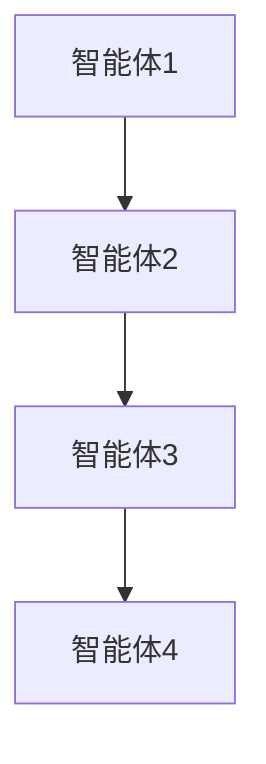
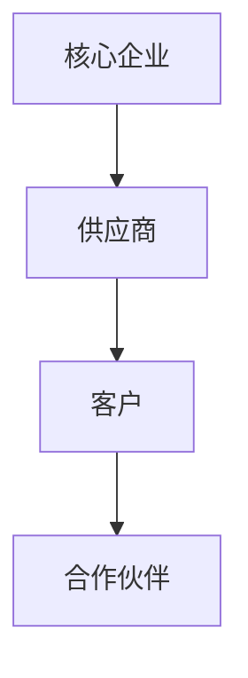
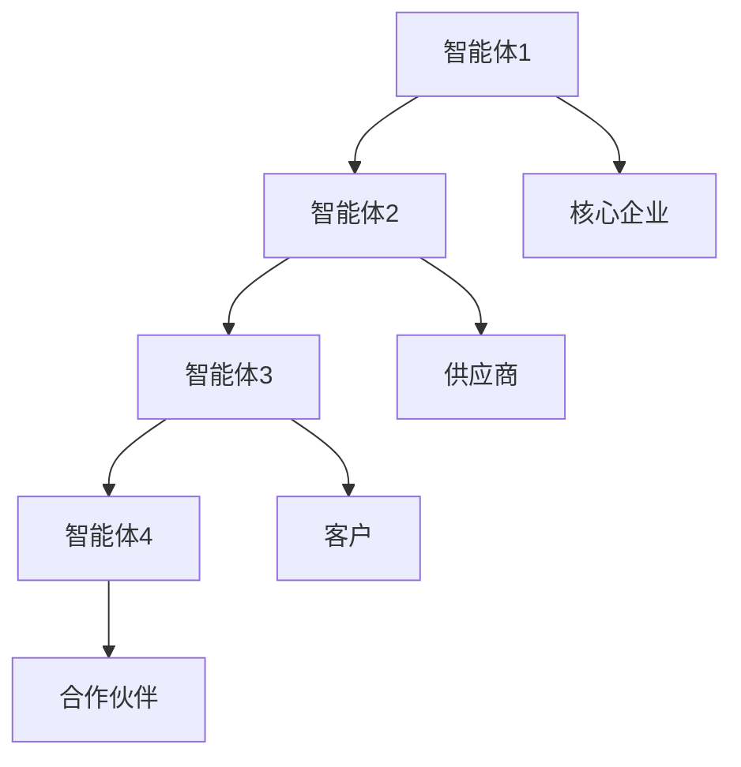

                 

# 《多智能体系统分析产业生态系统》

> 关键词：多智能体系统，产业生态系统，系统分析，协作机制，数学模型，系统架构，项目实战

> 摘要：本文系统地分析了多智能体系统在产业生态系统中的应用与分析方法。通过介绍多智能体系统的基本概念、核心原理、算法实现、数学模型、系统架构设计以及实际项目案例，深入探讨了多智能体系统在产业生态系统中的协同机制和应用价值。文章结合理论与实践，为读者提供了从理论到实践的全面指导，帮助读者更好地理解和应用多智能体系统分析产业生态系统。

---

# 第一部分: 多智能体系统与产业生态系统背景

# 第1章: 多智能体系统与产业生态系统概述

## 1.1 多智能体系统的基本概念

### 1.1.1 多智能体系统的定义
多智能体系统（Multi-Agent System, MAS）是由多个智能体（Agent）组成的系统，这些智能体能够通过自主决策和协作完成复杂任务。智能体是具有感知、决策、推理和执行能力的实体，可以是软件程序、机器人或其他智能设备。

### 1.1.2 多智能体系统的特征
- **自主性**：智能体能够自主决策。
- **反应性**：智能体能够实时感知环境并做出反应。
- **协作性**：多个智能体能够通过协作完成复杂任务。
- **分布性**：智能体分布在网络中，通过通信和协作实现目标。

### 1.1.3 多智能体系统的分类
- **基于任务的多智能体系统**：智能体协作完成特定任务。
- **基于市场的多智能体系统**：智能体通过市场机制进行资源分配和协作。
- **基于规则的多智能体系统**：智能体通过预定义规则进行协作。

## 1.2 产业生态系统的基本概念

### 1.2.1 产业生态系统的定义
产业生态系统是一个由企业、供应商、客户、合作伙伴等多个参与者组成的复杂系统，这些参与者通过协作和竞争共同推动产业的发展。

### 1.2.2 产业生态系统的组成要素
- **核心企业**：产业生态系统的主导企业。
- **供应商**：为生态系统提供资源或服务的企业。
- **客户**：使用生态系统服务的终端用户。
- **合作伙伴**：与核心企业协作的企业。

### 1.2.3 产业生态系统的运行机制
- **资源分配**：通过市场机制分配资源。
- **协作与竞争**：参与者通过协作和竞争推动生态系统发展。
- **价值传递**：通过产业链传递价值。

## 1.3 多智能体系统与产业生态系统的结合

### 1.3.1 多智能体系统在产业生态系统中的作用
- **优化资源分配**：通过多智能体系统的协作，优化产业生态系统的资源分配。
- **提高决策效率**：智能体能够快速感知环境并做出决策，提高系统的反应能力。
- **增强协作能力**：通过智能体之间的协作，实现产业生态系统的高效运行。

### 1.3.2 产业生态系统对多智能体系统的影响
- **提供丰富的应用场景**：产业生态系统为多智能体系统的应用提供了丰富的场景。
- **促进技术发展**：产业生态系统的需求推动了多智能体系统的技术发展。
- **提供复杂环境**：产业生态系统是一个复杂的环境，推动了多智能体系统的复杂性研究。

### 1.3.3 多智能体系统与产业生态系统的协同发展
- **技术协同**：多智能体系统的技术发展推动了产业生态系统的优化。
- **应用协同**：多智能体系统的应用促进了产业生态系统的协作与创新。

## 1.4 本章小结
本章介绍了多智能体系统和产业生态系统的基本概念，分析了它们的特征和分类，并探讨了多智能体系统在产业生态系统中的作用和影响。通过本章的学习，读者可以理解多智能体系统与产业生态系统的结合方式及其潜在价值。

---

# 第2章: 多智能体系统与产业生态系统的核心概念

## 2.1 多智能体系统的核心概念

### 2.1.1 多智能体系统的属性特征
- **自主性**：智能体能够自主决策。
- **反应性**：智能体能够实时感知环境并做出反应。
- **协作性**：多个智能体能够通过协作完成复杂任务。
- **分布性**：智能体分布在网络中，通过通信和协作实现目标。

### 2.1.2 多智能体系统的实体关系
通过Mermaid图展示多智能体系统的实体关系：

### 2.1.3 多智能体系统的协作机制
- **基于规则的协作**：智能体通过预定义的规则进行协作。
- **基于模型的协作**：智能体通过共享模型进行协作。
- **基于机器学习的协作**：智能体通过机器学习模型进行协作。

## 2.2 产业生态系统的核心概念

### 2.2.1 产业生态系统的属性特征
- **多样性**：生态系统中包含多种参与者。
- **动态性**：生态系统的结构和关系不断变化。
- **复杂性**：生态系统是一个复杂的系统。

### 2.2.2 产业生态系统的实体关系
通过Mermaid图展示产业生态系统的实体关系：

### 2.2.3 产业生态系统的协同机制
- **市场机制**：通过市场机制进行资源分配和协作。
- **合作机制**：通过合作机制实现生态系统的协同发展。
- **竞争机制**：通过竞争机制推动生态系统的创新。

## 2.3 多智能体系统与产业生态系统的对比分析

### 2.3.1 多智能体系统与产业生态系统的属性对比
| 属性 | 多智能体系统 | 产业生态系统 |
|------|--------------|--------------|
| 自主性 | 高           | 中           |
| 反应性 | 高           | 中           |
| 分布性 | 高           | 高           |
| 协作性 | 高           | 中           |

### 2.3.2 多智能体系统与产业生态系统的实体关系对比
通过Mermaid图展示多智能体系统与产业生态系统的实体关系对比：

### 2.3.3 多智能体系统与产业生态系统的协作机制对比
- **多智能体系统**：基于规则、模型或机器学习的协作机制。
- **产业生态系统**：基于市场机制、合作机制或竞争机制的协作机制。

## 2.4 本章小结
本章详细分析了多智能体系统和产业生态系统的核心概念，通过对比分析，明确了它们的属性特征和协作机制。通过本章的学习，读者可以理解多智能体系统与产业生态系统之间的联系和区别。

---

# 第3章: 多智能体系统与产业生态系统的核心概念原理

## 3.1 多智能体系统的核心概念原理

### 3.1.1 多智能体系统的协作原理
- **基于规则的协作**：智能体通过预定义的规则进行协作。
- **基于模型的协作**：智能体通过共享模型进行协作。
- **基于机器学习的协作**：智能体通过机器学习模型进行协作。

### 3.1.2 多智能体系统的通信原理
- **直接通信**：智能体之间直接交换信息。
- **间接通信**：智能体通过中间媒介交换信息。
- **基于消息的通信**：智能体通过消息传递信息。

### 3.1.3 多智能体系统的决策原理
- **基于感知的决策**：智能体通过感知环境做出决策。
- **基于推理的决策**：智能体通过推理得出决策。
- **基于机器学习的决策**：智能体通过机器学习模型做出决策。

## 3.2 产业生态系统的核心概念原理

### 3.2.1 产业生态系统的协作原理
- **基于市场的协作**：参与者通过市场机制进行协作。
- **基于合作的协作**：参与者通过合作机制进行协作。
- **基于竞争的协作**：参与者通过竞争机制进行协作。

### 3.2.2 产业生态系统的通信原理
- **市场信息传递**：通过市场信息传递实现协作。
- **企业间信息传递**：通过企业间的信息传递实现协作。
- **客户反馈传递**：通过客户反馈传递实现协作。

### 3.2.3 产业生态系统的决策原理
- **基于市场的决策**：参与者根据市场信息做出决策。
- **基于合作的决策**：参与者根据合作信息做出决策。
- **基于竞争的决策**：参与者根据竞争信息做出决策。

## 3.3 多智能体系统与产业生态系统的核心概念原理对比

### 3.3.1 多智能体系统的核心概念原理
- **协作原理**：基于规则、模型或机器学习的协作。
- **通信原理**：直接通信、间接通信或基于消息的通信。
- **决策原理**：基于感知、推理或机器学习的决策。

### 3.3.2 产业生态系统的核心概念原理
- **协作原理**：基于市场、合作或竞争的协作。
- **通信原理**：市场信息传递、企业间信息传递或客户反馈传递。
- **决策原理**：基于市场、合作或竞争的决策。

## 3.4 本章小结
本章详细分析了多智能体系统和产业生态系统的核心概念原理，通过对比分析，明确了它们的协作、通信和决策机制。通过本章的学习，读者可以理解多智能体系统与产业生态系统之间的内在联系和区别。

---

# 第4章: 多智能体系统与产业生态系统的核心概念实现

## 4.1 多智能体系统的实现原理

### 4.1.1 基于规则的多智能体系统实现
- **规则定义**：定义智能体的行为规则。
- **规则执行**：智能体根据规则执行操作。

### 4.1.2 基于模型的多智能体系统实现
- **模型构建**：构建共享模型。
- **模型更新**：根据环境变化更新模型。

### 4.1.3 基于机器学习的多智能体系统实现
- **模型训练**：通过机器学习算法训练模型。
- **模型应用**：智能体根据训练好的模型进行决策。

## 4.2 产业生态系统的实现原理

### 4.2.1 基于市场的产业生态系统实现
- **市场机制设计**：设计市场机制。
- **市场信息传递**：实现市场信息的传递。

### 4.2.2 基于合作的产业生态系统实现
- **合作机制设计**：设计合作机制。
- **合作信息传递**：实现合作信息的传递。

### 4.2.3 基于竞争的产业生态系统实现
- **竞争机制设计**：设计竞争机制。
- **竞争信息传递**：实现竞争信息的传递。

## 4.3 多智能体系统与产业生态系统的核心概念实现对比

### 4.3.1 多智能体系统的实现原理
- **基于规则的实现**：智能体通过规则进行协作。
- **基于模型的实现**：智能体通过共享模型进行协作。
- **基于机器学习的实现**：智能体通过机器学习模型进行协作。

### 4.3.2 产业生态系统的实现原理
- **基于市场的实现**：参与者通过市场机制进行协作。
- **基于合作的实现**：参与者通过合作机制进行协作。
- **基于竞争的实现**：参与者通过竞争机制进行协作。

## 4.4 本章小结
本章详细分析了多智能体系统和产业生态系统的核心概念实现，通过对比分析，明确了它们的实现方式和实现机制。通过本章的学习，读者可以理解多智能体系统与产业生态系统之间的实现差异和联系。

---

# 第5章: 多智能体系统与产业生态系统的核心概念应用

## 5.1 多智能体系统的应用实例

### 5.1.1 智能制造中的多智能体系统应用
- **应用场景**：智能制造中的资源分配和协作。
- **应用案例**：智能工厂中的设备协作。

### 5.1.2 智慧交通中的多智能体系统应用
- **应用场景**：智慧交通中的车辆调度和路线优化。
- **应用案例**：智能交通系统中的车辆协同。

### 5.1.3 智慧医疗中的多智能体系统应用
- **应用场景**：智慧医疗中的资源分配和协作。
- **应用案例**：医院中的设备协作。

## 5.2 产业生态系统中的应用实例

### 5.2.1 智能制造中的产业生态系统应用
- **应用场景**：智能制造中的产业链协作。
- **应用案例**：智能工厂中的供应商协作。

### 5.2.2 智慧交通中的产业生态系统应用
- **应用场景**：智慧交通中的产业链协作。
- **应用案例**：智能交通系统中的供应商协作。

### 5.2.3 智慧医疗中的产业生态系统应用
- **应用场景**：智慧医疗中的产业链协作。
- **应用案例**：医院中的供应商协作。

## 5.3 多智能体系统与产业生态系统的核心概念应用对比

### 5.3.1 多智能体系统的应用实例
- **智能制造**：设备协作。
- **智慧交通**：车辆调度和路线优化。
- **智慧医疗**：资源分配和协作。

### 5.3.2 产业生态系统的应用实例
- **智能制造**：产业链协作。
- **智慧交通**：产业链协作。
- **智慧医疗**：产业链协作。

## 5.4 本章小结
本章详细分析了多智能体系统和产业生态系统的核心概念应用，通过对比分析，明确了它们的应用场景和应用案例。通过本章的学习，读者可以理解多智能体系统与产业生态系统之间的应用差异和联系。

---

# 第6章: 多智能体系统与产业生态系统的核心概念总结

## 6.1 多智能体系统的核心概念总结
- **自主性**：智能体能够自主决策。
- **反应性**：智能体能够实时感知环境并做出反应。
- **协作性**：多个智能体能够通过协作完成复杂任务。
- **分布性**：智能体分布在网络中，通过通信和协作实现目标。

## 6.2 产业生态系统的核心概念总结
- **多样性**：生态系统中包含多种参与者。
- **动态性**：生态系统的结构和关系不断变化。
- **复杂性**：生态系统是一个复杂的系统。

## 6.3 多智能体系统与产业生态系统的核心概念对比总结
- **属性特征**：多智能体系统具有自主性、反应性、协作性和分布性；产业生态系统具有多样性、动态性和复杂性。
- **协作机制**：多智能体系统的协作机制包括基于规则、模型或机器学习的协作；产业生态系统的协作机制包括基于市场、合作或竞争的协作。
- **通信机制**：多智能体系统的通信机制包括直接通信、间接通信或基于消息的通信；产业生态系统的通信机制包括市场信息传递、企业间信息传递或客户反馈传递。

## 6.4 本章小结
本章总结了多智能体系统和产业生态系统的核心概念，通过对比分析，明确了它们的属性特征和协作机制。通过本章的学习，读者可以全面理解多智能体系统与产业生态系统之间的联系和区别。

---

# 第7章: 多智能体系统与产业生态系统的核心概念未来展望

## 7.1 多智能体系统的核心概念未来发展方向
- **智能化**：进一步提升智能体的智能化水平。
- **协作性**：进一步增强智能体的协作能力。
- **适应性**：进一步提高智能体的适应性。

## 7.2 产业生态系统的核心概念未来发展方向
- **智能化**：进一步提升产业生态系统的智能化水平。
- **协作性**：进一步增强产业生态系统的协作能力。
- **适应性**：进一步提高产业生态系统的适应性。

## 7.3 多智能体系统与产业生态系统的核心概念未来协同发展方向
- **智能化协同**：多智能体系统与产业生态系统的智能化协同。
- **协作性协同**：多智能体系统与产业生态系统的协作性协同。
- **适应性协同**：多智能体系统与产业生态系统的适应性协同。

## 7.4 本章小结
本章展望了多智能体系统和产业生态系统的核心概念未来发展方向，通过分析，明确了它们的智能化、协作性和适应性的未来发展方向。通过本章的学习，读者可以了解多智能体系统与产业生态系统之间的未来协同发展方向。

---

# 结语

通过本文的详细分析，读者可以全面理解多智能体系统与产业生态系统的核心概念及其应用。未来，随着技术的不断发展，多智能体系统与产业生态系统的结合将更加紧密，为产业生态系统的优化和发展提供更多的可能性。

