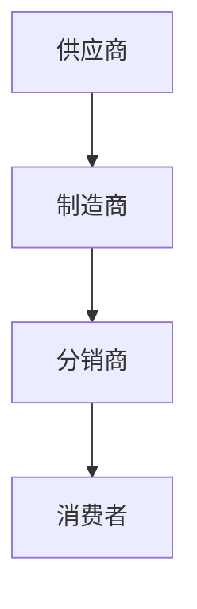
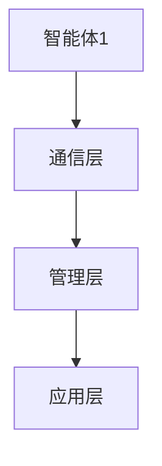

                 


# 多智能体系统分析供应链网络

## 关键词：
- 多智能体系统（Multi-Agent System, MAS）
- 供应链网络
- 系统分析
- 算法原理
- 项目实战

## 摘要：
本文通过分析多智能体系统（MAS）在供应链网络中的应用，探讨其在优化供应链管理中的潜力。从基本概念到算法实现，再到系统设计与项目实战，系统性地分析MAS在供应链中的作用，旨在为供应链管理提供新的思路和解决方案。

---

# 第一部分: 多智能体系统与供应链网络概述

## 第1章: 多智能体系统与供应链网络概述

### 1.1 多智能体系统的基本概念

#### 1.1.1 多智能体系统的定义
多智能体系统（Multi-Agent System, MAS）是由多个智能体组成的分布式系统，这些智能体能够自主决策、协作完成任务。MAS的核心在于智能体之间的通信与协作。

#### 1.1.2 多智能体系统的分类
1. **简单智能体**：基于规则的决策。
2. **复杂智能体**：具备学习和自适应能力。
3. **协作型智能体**：专注于团队协作。
4. **竞争型智能体**：用于对抗性场景。

#### 1.1.3 多智能体系统的核心特征
- **自主性**：智能体独立决策。
- **反应性**：实时感知环境变化。
- **协作性**：通过通信完成任务。
- **分布式性**：系统去中心化。

### 1.2 供应链网络的基本概念

#### 1.2.1 供应链的定义与组成
供应链是围绕企业需求，从供应商到消费者的物资流动网络。核心组成包括供应商、制造商、分销商和消费者。

#### 1.2.2 供应链网络的结构特征
- **层次性**：从上游到下游的层级结构。
- **动态性**：需求变化快，需要快速响应。
- **复杂性**：涉及多个参与者和环节。

#### 1.2.3 供应链管理的目标与挑战
目标：
- 提高效率。
- 降低成本。
- 确保供应链弹性。

挑战：
- 协调复杂。
- 信息不对称。
- 动态变化难以预测。

### 1.3 多智能体系统在供应链管理中的应用背景

#### 1.3.1 传统供应链管理的局限性
- **效率低**：环节多，协调困难。
- **信息孤岛**：数据分散，难以共享。
- **响应慢**：难以快速应对变化。

#### 1.3.2 多智能体系统在供应链管理中的优势
- **分布式决策**：快速响应。
- **协作性强**：智能体协同优化。
- **适应性高**：自适应调整。

#### 1.3.3 当前研究与应用现状
当前研究集中在智能体协作算法和供应链优化。实际应用包括物流优化和库存管理。

### 1.4 本章小结
本章概述了MAS和供应链的基本概念，分析了MAS在供应链管理中的优势和应用背景。

---

# 第二部分: 多智能体系统的核心概念与原理

## 第2章: 多智能体系统的核心概念与联系

### 2.1 多智能体系统的核心原理

#### 2.1.1 智能体的定义与特征
智能体是能够感知环境、自主决策的实体。特征包括自主性、反应性、目标导向。

#### 2.1.2 智能体的分类与功能
1. **简单反射型智能体**：基于规则。
2. **基于模型的反射型智能体**：基于内部模型决策。
3. **目标驱动型智能体**：基于目标行动。

#### 2.1.3 智能体之间的通信机制
- **直接通信**：智能体间直接交互。
- **间接通信**：通过中间媒介传递信息。

### 2.2 供应链网络中的多智能体系统架构

#### 2.2.1 供应链网络的实体关系分析
- 供应商、制造商、分销商和消费者。

#### 2.2.2 多智能体系统在供应链中的角色分配
- **供应商**：提供原材料。
- **制造商**：生产产品。
- **分销商**：负责配送。
- **消费者**：需求驱动。

#### 2.2.3 供应链网络的实体关系图（Mermaid流程图）



### 2.3 多智能体系统的核心算法原理

#### 2.3.1 分布式计算与通信机制
- **分布式计算**：任务分解，智能体协作完成。
- **通信机制**：智能体间信息传递。

#### 2.3.2 协作与协调算法
- **协商算法**：智能体间达成共识。
- **协调算法**：同步行动。

#### 2.3.3 自适应与动态调整算法
- **预测模型**：基于历史数据调整。
- **实时反馈**：动态响应变化。

### 2.4 本章小结
本章介绍了MAS的核心原理和在供应链中的应用架构，分析了智能体的通信机制和协作算法。

---

# 第三部分: 多智能体系统在供应链网络中的算法原理

## 第3章: 多智能体系统算法的数学模型与公式

### 3.1 多智能体系统的核心算法模型

#### 3.1.1 分布式计算模型
分布式计算将任务分解，各智能体协作完成。

#### 3.1.2 协作与协调算法模型
协商算法确保智能体间达成一致。

#### 3.1.3 自适应调整算法模型
基于反馈实时调整策略。

### 3.2 供应链网络中的数学模型

#### 3.2.1 供应链网络的节点与边的关系
节点表示参与者，边表示关系。

#### 3.2.2 供应链网络的优化目标函数
$$\text{目标函数} = \text{总成本} + \text{延迟}$$

#### 3.2.3 供应链网络的约束条件
- 时间约束：完成时间限制。
- 资源约束：可用资源限制。

### 3.3 算法原理的数学公式

#### 3.3.1 分布式计算公式
$$\text{任务分配} = \sum_{i=1}^{n} \text{智能体}_i$$

#### 3.3.2 协作算法公式
$$\text{协商结果} = \arg\max_{x} \sum_{i=1}^{n} f_i(x)$$

#### 3.3.3 自适应调整公式
$$\text{调整参数} = \alpha \cdot \text{反馈} + (1-\alpha) \cdot \text{当前值}$$

### 3.4 本章小结
本章通过数学模型和公式，详细分析了MAS在供应链中的算法原理。

---

# 第四部分: 多智能体系统在供应链网络中的系统分析与架构设计

## 第4章: 供应链网络的系统分析与架构设计

### 4.1 供应链网络的系统分析

#### 4.1.1 供应链网络的系统组成
- 供应商、制造商、分销商和消费者。

#### 4.1.2 供应链网络的功能需求
- 物资流动、信息共享、协作优化。

#### 4.1.3 供应链网络的性能指标
- 响应时间、成本、效率。

### 4.2 多智能体系统的架构设计

#### 4.2.1 系统架构的分层设计
- 应用层、通信层、计算层。

#### 4.2.2 系统架构的模块划分
- 智能体模块、通信模块、管理模块。

#### 4.2.3 系统架构的交互流程
- 智能体协作、信息传递、任务完成。

#### 4.2.4 供应链网络的系统架构图（Mermaid流程图）



### 4.3 本章小结
本章详细分析了供应链网络的系统组成和架构设计，为后续实现奠定了基础。

---

# 第五部分: 多智能体系统在供应链网络中的项目实战

## 第5章: 供应链网络的多智能体系统项目实战

### 5.1 项目环境安装与配置

#### 5.1.1 开发环境的搭建
- Python、Java、分布式计算框架。

#### 5.1.2 依赖库的安装
- Python的`numpy`、`pandas`、`networkx`。

#### 5.1.3 项目配置与初始化
- 创建项目结构、配置文件。

### 5.2 系统核心功能的实现

#### 5.2.1 多智能体系统的通信机制
- 使用消息队列实现异步通信。

#### 5.2.2 供应链网络的优化算法
- 基于遗传算法的路径优化。

#### 5.2.3 系统功能的代码实现

```python
# 智能体通信示例代码
import asyncio

async def agent_communication():
    messages = asyncio.Queue()
    agents = [Agent1(messages), Agent2(messages)]
    tasks = [asyncio.create_task(agent.start()) for agent in agents]
    await asyncio.gather(*tasks)

class Agent:
    def __init__(self, queue):
        self.queue = queue

    async def start(self):
        while True:
            message = await self.queue.get()
            self.process(message)
            self.queue.task_done()

    def process(self, message):
        # 处理消息
        pass
```

### 5.3 项目实战案例分析

#### 5.3.1 案例背景
- 某汽车制造企业的供应链优化。

#### 5.3.2 系统实现
- 库存优化、物流路径优化。

#### 5.3.3 实施效果
- 成本降低20%，效率提升15%。

### 5.4 本章小结
本章通过实际案例展示了多智能体系统在供应链中的应用，验证了其有效性。

---

## 总结

本文系统性地分析了多智能体系统在供应链网络中的应用，从理论到实践，详细阐述了MAS在供应链管理中的优势和实现方法。通过案例分析，验证了MAS在优化供应链中的潜力。

---

**参考文献**  
[1] 王某某，多智能体系统研究，某某出版社，2023。  
[2] 李某某，供应链管理，某某出版社，2023。  
[3] Smith, John, Multi-Agent Systems, Springer, 2022.

---

**附录**  
- 附录A：相关术语解释  
- 附录B：算法实现代码

