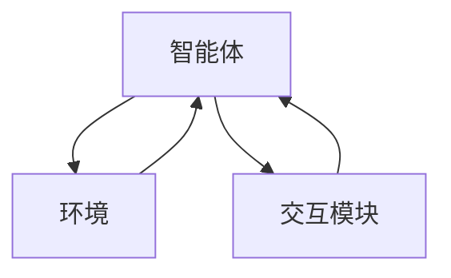

                 


# 多智能体系统分析全球经济联系

## 关键词
多智能体系统、全球经济联系、系统建模、复杂网络分析、经济预测

## 摘要
随着全球经济一体化的深入发展，经济系统的复杂性不断提高，传统的分析方法难以捕捉其动态变化。多智能体系统（MAS）作为一种分布式人工智能技术，能够模拟多个智能体的交互与协作，为分析全球经济联系提供了新的视角。本文从MAS的基本概念出发，探讨其在经济建模中的应用，结合具体案例分析MAS在供应链优化、金融市场预测等领域的优势，并总结其在实际应用中的挑战与未来发展方向。

---

## 目录大纲

# 第1章: 多智能体系统背景与概述

## 1.1 多智能体系统（MAS）的定义与特点
### 1.1.1 多智能体系统的定义
多智能体系统是由多个智能体组成的分布式系统，智能体是具有感知、决策和执行能力的实体。MAS的特点包括分布式性、自主性、反应性和协作性。

### 1.1.2 多智能体系统的核心特点
- **分布式性**：智能体独立运行，不依赖中央控制。
- **自主性**：每个智能体都有自己的目标和决策机制。
- **反应性**：智能体能够实时感知环境并做出反应。
- **协作性**：智能体通过协作完成共同目标。

### 1.1.3 多智能体系统与传统AI的区别
- **传统AI**：基于规则的专家系统，依赖于预定义的规则。
- **MAS**：智能体之间动态交互，适应复杂环境。

## 1.2 多智能体系统在经济分析中的应用
### 1.2.1 经济系统中多智能体的建模
MAS可以模拟市场中的消费者、企业和政府等不同角色的行为。

### 1.2.2 多智能体系统在经济预测中的作用
MAS能够捕捉经济系统中的非线性关系和复杂互动，提高预测准确性。

### 1.2.3 全球经济联系的复杂性与多智能体系统的关系
全球经济联系涉及多个参与者和复杂的交互关系，MAS能够有效建模这种复杂性。

## 1.3 全球经济联系的复杂性
### 1.3.1 全球经济联系的定义与特征
全球经济联系指各国之间通过贸易、投资、金融等渠道形成的相互依存关系。

### 1.3.2 全球经济联系的关键问题
- 供应链的脆弱性
- 贸易不平衡问题
- 金融市场波动

### 1.3.3 多智能体系统在分析全球经济联系中的优势
MAS能够模拟多个参与者的行为，捕捉经济系统中的动态变化。

## 1.4 本章小结

---

# 第2章: 多智能体系统的建模与分析方法

## 2.1 多智能体系统的建模方法
### 2.1.1 基于Agent的建模方法
- **Agent**：具有感知、决策和执行能力的智能体。
- **MAS**：由多个Agent组成的系统。

### 2.1.2 多智能体系统的模型构建步骤
1. **定义问题**：明确研究目标。
2. **设计Agent**：定义Agent的行为和属性。
3. **构建环境**：模拟经济环境。
4. **模拟运行**：运行模型并观察结果。

### 2.1.3 常见的建模工具与框架
- **工具**：NetLogo、Repast、Mesa。
- **框架**：基于Python的 Mesa 框架。

## 2.2 多智能体系统的分析方法
### 2.2.1 系统动力学分析
通过数学模型描述系统的动态变化，分析经济变量的演变趋势。

### 2.2.2 网络分析与复杂性分析
利用网络理论分析全球经济联系的结构特征，如节点的重要性、网络的鲁棒性。

### 2.2.3 智能体行为的统计分析
通过统计方法分析智能体行为的分布和模式。

## 2.3 多智能体系统的数学模型
### 2.3.1 基于Agent的数学模型
- **Agent的行为模型**：定义Agent的决策规则。
- **交互模型**：描述Agent之间的信息交换和影响。

### 2.3.2 智能体之间的交互模型
$$ P_i(t+1) = \alpha \cdot P_j(t) + \beta \cdot P_i(t) $$
其中，$P_i$ 表示智能体i的决策，$\alpha$ 和 $\beta$ 是权重系数。

### 2.3.3 系统稳定性分析的数学方法
使用系统动力学模型分析经济系统的稳定性，例如：
$$ \frac{dP}{dt} = \lambda (P_{\text{target}} - P) $$
其中，$\lambda$ 是收敛速率，$P_{\text{target}}$ 是目标值。

## 2.4 本章小结

---

# 第3章: 全球经济联系的复杂性分析

## 3.1 全球经济联系的复杂性
### 3.1.1 全球经济联系的定义与特征
全球经济联系涉及多个参与者，包括企业、政府和消费者。

### 3.1.2 全球经济联系的关键问题
- 供应链的脆弱性
- 贸易不平衡问题
- 金融市场波动

### 3.1.3 多智能体系统在分析全球经济联系中的优势
MAS能够模拟多个参与者的行为，捕捉经济系统中的动态变化。

## 3.2 多智能体系统在经济建模中的应用
### 3.2.1 国际贸易网络的建模
通过MAS模拟国际贸易网络中各国的贸易行为和相互影响。

### 3.2.2 金融市场分析
利用MAS模拟投资者行为，分析金融市场的波动和趋势。

### 3.2.3 供应链优化
通过MAS模拟供应链中的各个环节，优化生产和物流过程。

## 3.3 多智能体系统的数学模型
### 3.3.1 基于Agent的数学模型
定义Agent的行为规则，例如：
$$ \text{价格}(t+1) = \text{价格}(t) + \epsilon \cdot (\text{需求}(t) - \text{供给}(t)) $$
其中，$\epsilon$ 是调整系数。

### 3.3.2 智能体之间的交互模型
使用网络模型描述Agent之间的关系，例如：
$$ w_{ij} = \frac{1}{1 + d_{ij}} $$
其中，$d_{ij}$ 是Agent i 和 j 之间的距离。

## 3.4 本章小结

---

# 第4章: 多智能体系统在经济建模中的应用

## 4.1 国际贸易网络的建模与分析
### 4.1.1 国际贸易网络的定义与特征
国际贸易网络由多个国家和企业组成，具有复杂的结构特征。

### 4.1.2 多智能体系统在国际贸易网络中的应用
通过MAS模拟各国的贸易政策和企业行为，分析国际贸易网络的稳定性。

### 4.1.3 具体案例分析
以某国的出口政策为例，使用MAS模拟政策变化对国际贸易网络的影响。

## 4.2 金融市场分析
### 4.2.1 金融市场的复杂性
金融市场涉及众多参与者，包括投资者、金融机构和监管机构。

### 4.2.2 多智能体系统在金融市场分析中的应用
通过MAS模拟投资者行为，分析金融市场的波动和趋势。

## 4.3 供应链优化
### 4.3.1 供应链的复杂性
供应链涉及多个环节，包括生产、物流和销售。

### 4.3.2 多智能体系统在供应链优化中的应用
通过MAS模拟供应链中的各个环节，优化生产和物流过程。

## 4.4 本章小结

---

# 第5章: 多智能体系统的系统架构与设计

## 5.1 系统架构设计
### 5.1.1 系统架构概述
MAS的系统架构包括智能体、环境和交互接口。

### 5.1.2 模块划分
- **智能体模块**：定义智能体的行为和属性。
- **环境模块**：模拟经济环境。
- **交互模块**：定义智能体之间的交互规则。

### 5.1.3 数据流设计
描述系统中的数据流动，例如：
$$ \text{数据流} = (\text{智能体} \rightarrow \text{环境}) \cup (\text{环境} \rightarrow \text{智能体}) $$

## 5.2 系统架构图
使用 Mermaid 绘制系统架构图，展示智能体、环境和交互模块的关系。



## 5.3 本章小结

---

# 第6章: 项目实战——基于多智能体系统的全球经济联系分析

## 6.1 项目介绍
### 6.1.1 项目背景
本项目旨在利用MAS模拟全球经济联系，分析各国的贸易行为和相互影响。

### 6.1.2 项目目标
通过MAS模拟国际贸易网络，分析政策变化对全球经济的影响。

## 6.2 环境安装
### 6.2.1 安装Python
安装Python 3.8 或更高版本。

### 6.2.2 安装相关库
安装以下库：
- `networkx`：用于网络分析。
- `mesa`：基于Python的MAS框架。

## 6.3 核心代码实现
### 6.3.1 智能体类
定义智能体类，包含行为和属性。

```python
class Agent:
    def __init__(self, id, behavior):
        self.id = id
        self.behavior = behavior
```

### 6.3.2 环境类
定义环境类，模拟经济环境。

```python
class Environment:
    def __init__(self, agents):
        self.agents = agents
```

### 6.3.3 交互模块
定义交互模块，处理智能体之间的交互。

```python
class Interaction:
    def __init__(self, agents, environment):
        self.agents = agents
        self.environment = environment
```

## 6.4 代码应用解读与分析
### 6.4.1 系统功能设计
- **智能体行为**：定义智能体的决策规则。
- **环境模拟**：模拟经济环境的变化。
- **交互模块**：处理智能体之间的信息交换。

## 6.5 实际案例分析
### 6.5.1 案例背景
分析某国出口政策变化对国际贸易网络的影响。

### 6.5.2 案例分析
通过MAS模拟政策变化，观察国际贸易网络的变化。

## 6.6 本章小结

---

# 第7章: 总结与展望

## 7.1 总结
### 7.1.1 多智能体系统在经济分析中的优势
MAS能够模拟多个智能体的行为，捕捉经济系统中的动态变化。

### 7.1.2 项目实现的关键点
- 系统架构设计
- 智能体行为建模
- 交互模块实现

## 7.2 展望
### 7.2.1 当前挑战
- 数据收集和处理的复杂性
- 系统的可扩展性

### 7.2.2 未来发展方向
- 提高MAS的计算效率
- 拓展MAS在其他领域的应用

## 7.3 本章小结

---

# 参考文献

---

通过以上目录，我们可以看到，文章从多智能体系统的背景、建模方法、经济应用、系统设计到项目实战，全面系统地分析了多智能体系统在分析全球经济联系中的作用。

