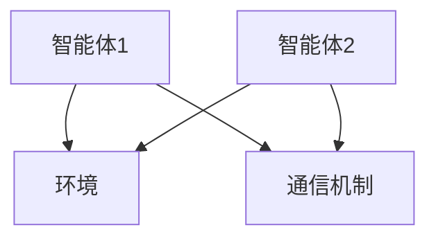

                 


# 多智能体系统分析跨资产相关性

> 关键词：多智能体系统、跨资产相关性、资产组合管理、风险管理、算法设计、系统架构

> 摘要：本文探讨了多智能体系统在分析跨资产相关性中的应用。通过构建多智能体模型，结合数学算法和系统架构设计，详细分析了跨资产相关性的核心概念、算法原理、系统实现及实际案例。文章还提供了最佳实践和注意事项，帮助读者更好地理解和应用多智能体系统进行跨资产相关性分析。

---

## 第1章: 多智能体系统背景与概念

### 1.1 多智能体系统的基本概念

#### 1.1.1 多智能体系统的定义与特点
多智能体系统（Multi-Agent System, MAS）由多个智能体（Agent）组成，每个智能体能够感知环境、自主决策并与其他智能体协作。其特点包括：
- 分布式：智能体独立运行，无中央控制。
- 协作性：智能体通过通信和协作完成共同目标。
- 反应性：智能体能够实时感知环境变化并做出响应。

#### 1.1.2 多智能体系统的核心要素
- **智能体**：具有自主性、反应性、协作性和社会性的实体。
- **通信机制**：智能体之间通过消息传递进行交互。
- **协作机制**：智能体通过协作完成复杂任务。
- **环境模型**：描述智能体所处的环境及其特性。

#### 1.1.3 多智能体系统的主要应用场景
- **金融领域**：用于资产价格预测、风险评估和投资组合优化。
- **交通管理**：用于智能交通系统和自动驾驶。
- **分布式计算**：用于任务分配和资源管理。

### 1.2 跨资产相关性的概念与重要性

#### 1.2.1 资产相关性的定义
资产相关性是指不同资产价格之间的变动关系。相关性高意味着一个资产的价格变化会显著影响另一个资产的价格。

#### 1.2.2 跨资产相关性的重要性
在资产组合管理中，相关性分析是降低风险和优化收益的重要工具。通过分析相关性，投资者可以更好地分散风险。

#### 1.2.3 跨资产相关性分析的挑战
- **数据多样性**：资产类型多样，数据来源复杂。
- **动态变化**：资产相关性随市场变化而变化。
- **计算复杂性**：需要处理大规模数据和复杂算法。

---

## 第2章: 多智能体系统在资产相关性分析中的应用

### 2.1 多智能体系统与资产相关性分析的关系

#### 2.1.1 多智能体系统如何支持资产相关性分析
通过多智能体系统的分布式计算和协作能力，可以高效地处理大规模资产数据，实时分析相关性。

#### 2.1.2 资产相关性分析中的多智能体优势
- **分布式计算**：提高计算效率。
- **实时协作**：快速响应市场变化。
- **模块化设计**：便于扩展和维护。

### 2.2 资产相关性分析的多智能体模型构建

#### 2.2.1 多智能体模型的基本结构
- **智能体角色**：数据采集智能体、计算智能体和决策智能体。
- **通信协议**：定义智能体之间的数据交换规则。

#### 2.2.2 资产相关性分析中的智能体行为建模
- **数据采集智能体**：负责从不同数据源获取资产数据。
- **计算智能体**：计算资产之间的协方差和相关系数。
- **决策智能体**：根据相关性分析结果做出投资决策。

#### 2.2.3 资产相关性分析的多智能体模型实现
- **数据流**：数据采集 → 数据处理 → 相关性计算 → 决策输出。
- **通信机制**：使用消息队列或发布-订阅模式。

---

## 第3章: 多智能体系统的核心概念与联系

### 3.1 多智能体系统的实体关系分析

#### 3.1.1 实体关系图的构建
通过Mermaid流程图展示多智能体系统中的实体关系，包括智能体、环境和通信机制。



#### 3.1.2 多智能体系统中的实体关系分析
智能体通过环境和通信机制进行交互，环境提供数据和约束条件，通信机制确保智能体之间的信息共享。

### 3.2 多智能体系统的核心原理

#### 3.2.1 多智能体系统的通信机制
智能体通过消息传递进行通信，消息格式包括发送者、接收者、内容和时间戳。

#### 3.2.2 多智能体系统的协作机制
基于协商和任务分配，智能体协作完成复杂任务。

#### 3.2.3 多智能体系统的协调机制
通过仲裁和冲突解决算法确保智能体协作一致。

---

## 第4章: 跨资产相关性分析的数学模型与算法

### 4.1 资产相关性分析的数学模型

#### 4.1.1 协方差与相关系数的定义
协方差衡量资产收益的联合变化，相关系数衡量资产收益的相关程度。

$$ \text{协方差}(X, Y) = E[(X - E[X])(Y - E[Y])] $$
$$ \text{相关系数}(X, Y) = \frac{\text{协方差}(X, Y)}{\sigma_X \sigma_Y} $$

### 4.2 资产相关性分析的算法原理

#### 4.2.1 资产相关性分析的算法流程
1. 数据预处理：清洗和标准化数据。
2. 计算协方差矩阵。
3. 计算相关系数矩阵。
4. 可视化相关性热图。

#### 4.2.2 资产相关性分析的算法实现

```python
import numpy as np
import matplotlib.pyplot as plt

def calculate_correlation_matrix(data):
    return np.corrcoef(data)

def visualize_correlation_matrix(matrix):
    plt.imshow(matrix, cmap='hot', interpolation='nearest')
    plt.colorbar()
    plt.show()

# 示例数据
data = np.random.randn(100, 5)
correlation_matrix = calculate_correlation_matrix(data)
visualize_correlation_matrix(correlation_matrix)
```

---

## 第5章: 跨资产相关性分析的系统架构设计

### 5.1 系统功能需求分析

#### 5.1.1 系统功能模块划分
- 数据采集模块：从数据库或API获取资产数据。
- 数据处理模块：清洗和预处理数据。
- 相关性计算模块：计算协方差和相关系数。
- 可视化模块：生成相关性热图。

### 5.2 系统架构设计

#### 5.2.1 系统架构的总体设计
采用分层架构，包括数据层、计算层和展示层。


#### 5.2.2 系统架构的详细设计
- 数据采集模块：负责从多个数据源获取资产数据。
- 数据处理模块：清洗数据并进行标准化处理。
- 相关性计算模块：使用协方差矩阵计算相关系数。
- 可视化模块：生成热图并展示结果。

---

## 第6章: 项目实战

### 6.1 环境安装与配置

```bash
pip install numpy matplotlib pandas
```

### 6.2 核心代码实现

```python
import numpy as np
import matplotlib.pyplot as plt

def calculate_correlation_matrix(data):
    return np.corrcoef(data)

def visualize_correlation_matrix(matrix):
    plt.imshow(matrix, cmap='hot', interpolation='nearest')
    plt.colorbar()
    plt.show()

# 示例数据
data = np.random.randn(100, 5)
correlation_matrix = calculate_correlation_matrix(data)
visualize_correlation_matrix(correlation_matrix)
```

### 6.3 实际案例分析
使用股票数据进行相关性分析，结果可视化为热图，帮助投资者理解资产之间的相关性。

---

## 第7章: 最佳实践与总结

### 7.1 最佳实践 tips
- 数据预处理是关键，确保数据质量和准确性。
- 选择合适的算法和工具，提高计算效率。
- 定期更新模型，适应市场变化。

### 7.2 小结
本文详细介绍了多智能体系统在跨资产相关性分析中的应用，从理论到实践，帮助读者掌握相关知识。

### 7.3 注意事项
- 数据隐私和安全问题需高度重视。
- 算法选择需根据实际需求进行优化。

### 7.4 拓展阅读
- 推荐阅读《Multi-Agent Systems: Complexity and Cognitive Insights》深入理解多智能体系统。

---

通过以上步骤，我们可以系统地构建和应用多智能体系统进行跨资产相关性分析，帮助投资者做出更明智的决策。

