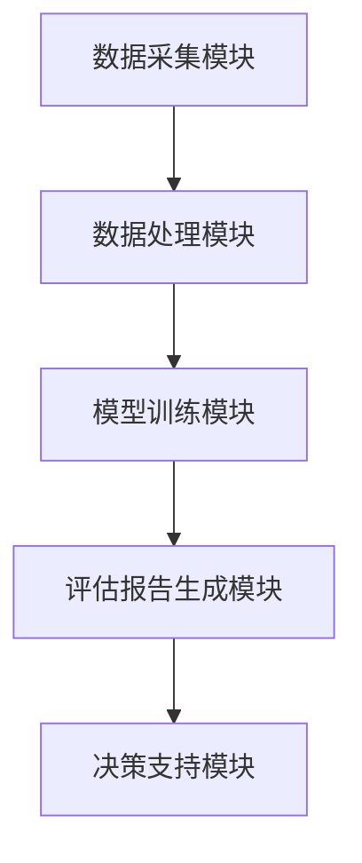
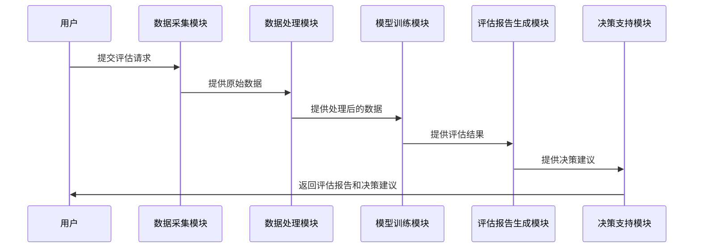

                 

# 多智能体系统在ESG因素评估中的应用

## 关键词：多智能体系统, ESG因素评估, 环境社会治理, 协作学习算法, 系统架构设计

## 摘要：  
随着全球对环境、社会和治理（ESG）因素的关注度不断提高，企业和社会组织需要更加高效和精准的方法来评估和管理这些因素。多智能体系统（Multi-Agent System, MAS）作为一种分布式、协作式的计算范式，能够有效地处理复杂、动态的ESG评估问题。本文将深入探讨多智能体系统在ESG因素评估中的应用，从背景、原理、算法、系统架构到实际案例，全面解析其在提升ESG评估效率和准确性的潜力。

---

# 第一部分: 多智能体系统与ESG因素评估的背景

## 第1章: 多智能体系统与ESG概述

### 1.1 多智能体系统的基本概念

#### 1.1.1 多智能体系统的定义
多智能体系统是由多个智能体（Agent）组成的分布式系统，每个智能体都是能够感知环境、自主决策并执行任务的实体。智能体之间通过通信和协作完成复杂的任务，具有分布式、协作性和自治性的特点。

#### 1.1.2 多智能体系统的特征
- **分布式**：多个智能体独立运行，协同完成任务。
- **协作性**：智能体之间通过通信和协作实现目标。
- **自治性**：每个智能体能够自主决策。
- **动态性**：系统环境和任务需求可能动态变化。

#### 1.1.3 多智能体系统的分类
多智能体系统可以分为基于任务的多智能体系统和基于行为的多智能体系统。基于任务的系统强调任务分解和协作，而基于行为的系统强调智能体之间的实时交互和动态协作。

### 1.2 ESG因素的基本概念

#### 1.2.1 环境（Environmental）因素
环境因素包括企业在环境保护方面的表现，如碳排放、资源利用效率、环保合规性等。评估环境因素需要考虑企业的生产过程对环境的影响。

#### 1.2.2 社会（Social）因素
社会因素涉及企业在社会责任、员工权益、社区关系等方面的表现。例如，企业是否关注员工福利、是否参与公益活动等。

#### 1.2.3 治理（Governance）因素
治理因素关注企业的管理结构、董事会构成、内部控制和风险管理等方面。良好的治理结构能够确保企业长期稳定发展。

### 1.3 多智能体系统在ESG评估中的应用背景

#### 1.3.1 ESG评估的重要性
随着全球可持续发展理念的兴起，企业和社会组织越来越重视ESG因素。ESG评估能够帮助投资者识别企业的长期风险和机会，同时推动企业采取更加可持续的经营策略。

#### 1.3.2 多智能体系统在ESG评估中的优势
多智能体系统能够处理复杂、动态的ESG评估问题，通过分布式协作提高评估效率和准确性。此外，多智能体系统能够整合多个数据源，提供全面的评估结果。

#### 1.3.3 当前ESG评估中的挑战
传统的ESG评估方法通常依赖于人工分析和静态指标，难以应对数据复杂性和动态变化的挑战。多智能体系统能够通过实时数据处理和协作学习，克服这些挑战。

### 1.4 本章小结
本章介绍了多智能体系统的基本概念和ESG因素的核心内容，并分析了多智能体系统在ESG评估中的应用背景及其优势。下一章将深入探讨多智能体系统与ESG评估的核心概念及其关联。

---

## 第2章: 多智能体系统与ESG评估的核心概念与联系

### 2.1 多智能体系统的原理

#### 2.1.1 智能体的定义与结构
智能体是一个能够感知环境、自主决策并执行任务的实体。智能体的结构通常包括感知层、决策层和执行层。

#### 2.1.2 智能体的协作机制
多智能体系统通过通信协议和协作算法实现智能体之间的协作。协作机制包括任务分配、信息共享和冲突解决。

#### 2.1.3 多智能体系统的通信协议
智能体之间的通信需要遵循特定的协议，如基于消息传递的通信协议和基于状态共享的通信协议。

### 2.2 ESG评估的核心要素

#### 2.2.1 ESG指标体系的构建
ESG指标体系包括环境、社会和治理三个维度的指标。例如，环境指标可以包括碳排放强度、资源利用效率等。

#### 2.2.2 数据采集与处理
ESG评估需要收集企业公开数据、行业报告和第三方数据。数据采集后需要进行清洗、标准化和特征提取。

#### 2.2.3 指标权重的确定
指标权重反映了各个指标在评估中的重要性。可以通过专家评分法或层次分析法（AHP）确定指标权重。

### 2.3 多智能体系统与ESG评估的关联

#### 2.3.1 多智能体系统在数据处理中的作用
多智能体系统可以分布式处理ESG数据，提高数据处理效率。例如，每个智能体负责处理特定的指标数据。

#### 2.3.2 多智能体系统在指标评估中的应用
多智能体系统可以通过协作学习算法优化指标权重的计算，提高评估结果的准确性。

#### 2.3.3 多智能体系统在决策支持中的价值
多智能体系统能够提供实时的ESG评估结果和决策建议，帮助企业在动态环境中做出最优决策。

### 2.4 本章小结
本章详细介绍了多智能体系统的原理和ESG评估的核心要素，并探讨了多智能体系统在ESG评估中的应用价值。下一章将从算法角度分析多智能体系统在ESG评估中的具体实现。

---

## 第3章: 多智能体系统在ESG评估中的算法原理

### 3.1 多智能体协同学习算法

#### 3.1.1 合并智能体的定义
合并智能体是通过多个智能体协作完成特定任务的实体。合并智能体可以利用分布式计算和协作学习提高评估效率。

#### 3.1.2 协同学习的流程
协同学习的流程包括数据采集、模型训练、结果整合和反馈优化。每个智能体负责处理特定的数据，并将结果整合到全局模型中。

#### 3.1.3 合并智能体的实现步骤
1. 初始化智能体：每个智能体初始化参数并分配任务。
2. 数据处理：智能体分别处理数据并生成中间结果。
3. 模型训练：智能体通过通信协议共享数据并训练模型。
4. 结果整合：合并智能体将各个智能体的模型结果整合到全局模型中。
5. 反馈优化：根据评估结果优化模型参数。

### 3.2 强化学习在多智能体系统中的应用

#### 3.2.1 强化学习的基本原理
强化学习是一种通过智能体与环境交互来学习策略的算法。智能体通过试错的方式优化策略，以最大化累计奖励。

#### 3.2.2 多智能体强化学习的挑战
多智能体强化学习面临策略协调、通信开销和动态环境等挑战。需要设计高效的通信机制和协作策略。

#### 3.2.3 多智能体强化学习的流程
1. 初始化智能体：每个智能体初始化状态和动作空间。
2. 环境交互：智能体与环境交互并获得奖励。
3. 通信与协作：智能体通过通信协议共享信息并协调动作。
4. 策略更新：智能体根据经验更新策略。

### 3.3 多智能体系统在ESG评估中的数学模型

#### 3.3.1 环境因素评估模型
环境因素评估模型可以通过回归分析或聚类分析进行建模。例如，使用线性回归模型预测企业的碳排放强度。

#### 3.3.2 社会因素评估模型
社会因素评估模型可以基于文本挖掘和情感分析进行建模。例如，通过分析企业社会责任报告的情感倾向评估企业社会责任表现。

#### 3.3.3 治理因素评估模型
治理因素评估模型可以基于网络分析和复杂网络理论进行建模。例如，通过分析董事会结构的网络关系评估治理效率。

### 3.4 本章小结
本章详细介绍了多智能体系统在ESG评估中的协同学习算法和强化学习算法，并给出了数学模型的实现方法。下一章将探讨多智能体系统的系统架构设计和实际应用案例。

---

## 第4章: 系统架构与实际应用案例

### 4.1 系统架构设计

#### 4.1.1 系统功能设计
ESG评估系统功能包括数据采集、指标计算、评估报告生成和决策支持。每个功能模块由多个智能体协作完成。

#### 4.1.2 系统架构图

#### 4.1.3 系统接口设计
系统接口包括数据接口、模型接口和用户接口。数据接口负责与外部数据源交互，模型接口负责与其他系统模块交互，用户接口负责与最终用户交互。

#### 4.1.4 系统交互流程

### 4.2 项目实战：新能源企业的ESG评估

#### 4.2.1 项目背景
新能源企业在环境、社会和治理方面表现优异，但其ESG评估需要考虑复杂的因素，如碳排放、社会责任和治理结构。

#### 4.2.2 环境因素评估
使用回归分析模型评估企业的碳排放强度。数据来源包括企业公开报告和第三方数据。

#### 4.2.3 社会因素评估
通过文本挖掘和情感分析评估企业社会责任报告的情感倾向，判断企业的社会责任表现。

#### 4.2.4 治理因素评估
基于复杂网络理论分析企业治理结构，评估治理效率和透明度。

#### 4.2.5 系统实现
1. 数据采集：从企业公开报告和第三方平台获取数据。
2. 数据处理：清洗、标准化和特征提取。
3. 模型训练：使用协同学习算法训练ESG评估模型。
4. 评估报告生成：整合各维度评估结果生成报告。
5. 决策支持：提供优化建议和风险预警。

### 4.3 项目小结
本项目通过多智能体系统实现了新能源企业的ESG评估，验证了多智能体系统在复杂评估问题中的应用价值。

### 4.4 本章小结
本章通过系统架构设计和实际案例展示了多智能体系统在ESG评估中的应用。下一章将总结全文并展望未来的发展方向。

---

## 第5章: 总结与展望

### 5.1 全文总结
本文深入探讨了多智能体系统在ESG因素评估中的应用，从背景、原理、算法到系统架构和实际案例进行了全面分析。多智能体系统通过分布式协作和智能优化，能够提高ESG评估的效率和准确性。

### 5.2 未来展望
未来，多智能体系统在ESG评估中的应用将朝着以下几个方向发展：
1. **智能体协作优化**：通过改进通信协议和协作算法，进一步提高智能体协作效率。
2. **动态环境适应**：开发适应动态环境的智能体，提升系统的鲁棒性和自适应性。
3. **多模态数据处理**：结合文本、图像和语音等多种数据源，提高评估的全面性。
4. **实时评估能力**：实现实时数据处理和动态评估，满足企业的实时需求。

### 5.3 最佳实践 Tips
- 在实际应用中，建议根据具体需求选择合适的智能体协作算法。
- 数据处理阶段需要进行严格的清洗和标准化，确保数据质量。
- 系统设计时要考虑可扩展性和可维护性，便于后续优化和升级。

### 5.4 本章小结
本文总结了多智能体系统在ESG评估中的应用，并展望了未来的发展方向。希望本文能够为相关领域的研究和实践提供参考。

---

# 结语

多智能体系统在ESG因素评估中的应用前景广阔，随着技术的不断发展，其在环境、社会和治理方面的潜力将进一步释放。通过本文的分析和探讨，我们相信多智能体系统将成为ESG评估的重要工具，推动企业和社会实现可持续发展。

--- 

# END

