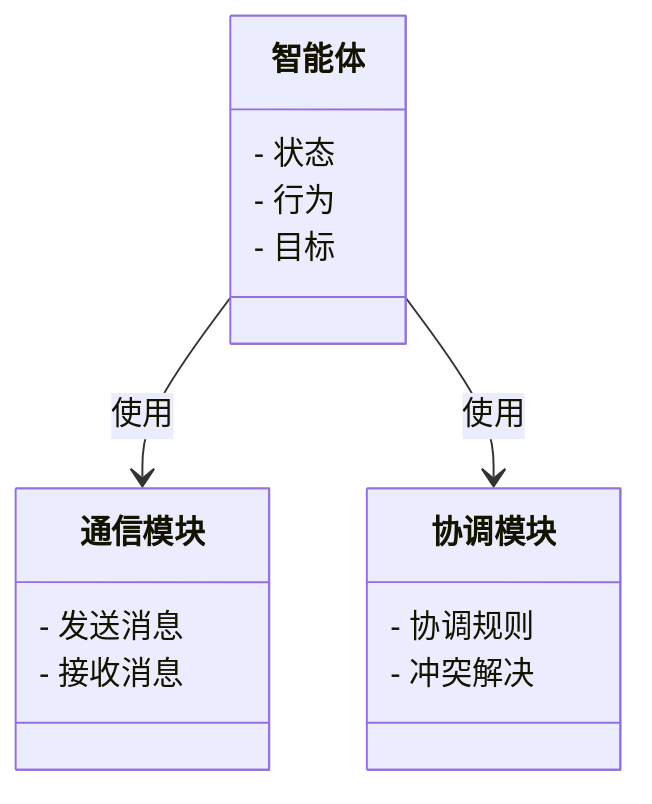
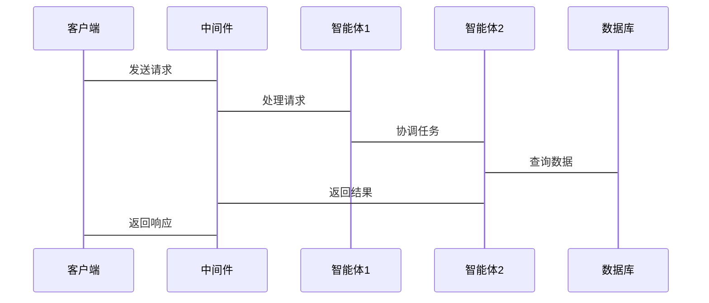

                 


# 多智能体系统在全球供应链优化中的应用：提升运营效率

> **关键词**: 多智能体系统, 供应链优化, 全球供应链, 运营效率, 分布式计算, 博弈论

> **摘要**: 多智能体系统（Multi-Agent Systems, MAS）作为一种新兴的分布式计算范式，在全球供应链优化中展现出巨大的潜力。本文从多智能体系统的定义与特点出发，深入探讨其在供应链优化中的应用前景，分析其核心算法与系统设计，最后通过实际案例展示其在提升全球供应链运营效率中的具体应用。本文旨在为技术专家、供应链管理者和相关研究者提供有价值的参考与启发。

---

## 第1章: 多智能体系统与全球供应链优化概述

### 1.1 多智能体系统（MAS）的定义与特点

#### 1.1.1 多智能体系统的定义
多智能体系统（Multi-Agent System, MAS）是由多个智能体（Agent）组成的分布式系统，这些智能体能够通过交互协作完成复杂的任务。智能体是指具有感知环境、做出决策并采取行动能力的实体。

#### 1.1.2 多智能体系统的核心特点
- **分布式性**：智能体独立运行，不存在集中控制节点。
- **协作性**：智能体通过通信与协作完成共同目标。
- **反应性**：智能体能够实时感知环境变化并做出响应。
- **主动性**：智能体具有自主决策能力。

#### 1.1.3 多智能体系统与传统单智能体系统的主要区别
| 特性 | 多智能体系统（MAS） | 单智能体系统 |
|------|---------------------|--------------|
| 控制方式 | 分布式控制         | 集中式控制   |
| 协作性 | 高度协作            | 单一决策主体 |
| 可扩展性 | 高                 | 低           |
| 容错性 | 高                 | 低           |

---

### 1.2 全球供应链优化的重要性

#### 1.2.1 全球供应链的基本概念
全球供应链是指从原材料采购、生产、物流、分销到最终消费者的整个链条，涉及全球范围内的供应商、制造商、分销商和消费者。

#### 1.2.2 供应链优化的目标与意义
- **目标**：降低运营成本、提高效率、增强灵活性。
- **意义**：通过优化供应链，企业可以更快响应市场需求，提高客户满意度，增强竞争力。

#### 1.2.3 全球供应链面临的挑战与问题
- **复杂性**：涉及多个环节和参与者，协调难度大。
- **不确定性**：市场需求波动、物流延迟等问题。
- **信息孤岛**：各环节信息不共享，导致效率低下。

---

### 1.3 多智能体系统在供应链优化中的应用前景

#### 1.3.1 多智能体系统在供应链优化中的优势
- **分布式计算能力**：能够处理大规模、复杂的问题。
- **协作性**：智能体之间可以高效协作，优化资源分配。
- **灵活性**：能够快速适应环境变化。

#### 1.3.2 全球供应链优化中的典型应用场景
- **库存管理**：智能体实时监控库存水平，优化补货策略。
- **物流优化**：智能体协调运输资源，降低物流成本。
- **需求预测**：智能体分析市场数据，提高预测准确性。

#### 1.3.3 多智能体系统在供应链优化中的未来发展趋势
- **智能化**：结合人工智能技术，提高决策能力。
- **实时性**：实现供应链各环节的实时优化。
- **全球化**：进一步拓展到跨国供应链优化。

---

## 第2章: 多智能体系统的核心概念与原理

### 2.1 多智能体系统的核心概念

#### 2.1.1 智能体的定义与特征
- **定义**：智能体是具有感知、决策和行动能力的实体。
- **特征**：
  - 自主性：无需外部干预。
  - 反应性：能够感知环境变化。
  - 协作性：能够与其他智能体协作。

#### 2.1.2 多智能体系统的组成结构
- **智能体**：系统的执行单元。
- **环境**：智能体所处的外部环境。
- **通信机制**：智能体之间的交互接口。
- **协调机制**：确保智能体协作的规则和协议。

#### 2.1.3 多智能体系统中的通信与协作机制
- **通信**：智能体之间通过消息传递实现信息共享。
- **协作**：智能体通过协作完成共同目标，例如任务分配、资源协调。

---

### 2.2 多智能体系统中的协作与协调

#### 2.2.1 协作的基本概念与实现方式
- **协作**：多个智能体共同完成任务。
- **实现方式**：
  - 分层协作：将任务分解为多个子任务，分层完成。
  - 平等协作：智能体地位平等，共同决策。

#### 2.2.2 协调机制的分类与特点
- **同步协调**：所有智能体同时行动。
- **异步协调**：智能体按顺序行动。
- **基于规则的协调**：通过预定义规则实现协作。

#### 2.2.3 协作与协调中的关键问题
- **冲突解决**：智能体之间出现冲突时的处理方式。
- **资源分配**：如何公平分配资源。

---

### 2.3 多智能体系统的数学模型与算法

#### 2.3.1 多智能体系统中的数学模型
- **状态表示**：用变量表示智能体的状态。
- **动作表示**：用函数表示智能体的行动。
- **目标函数**：优化的目标函数。

#### 2.3.2 常见的多智能体系统算法
- **分布式计算算法**：例如分布式优化算法。
- **协调算法**：例如基于博弈论的协调算法。

#### 2.3.3 多智能体系统算法的优缺点分析
- **优点**：分布式计算能力强。
- **缺点**：需要复杂的通信和协调机制。

---

## 第3章: 多智能体系统在供应链优化中的算法原理

### 3.1 基于多智能体的分布式优化算法

#### 3.1.1 分布式优化的基本概念
- 分布式优化是指多个智能体在不共享全局信息的情况下，通过局部信息优化整体目标。

#### 3.1.2 分布式优化算法的实现原理
- 每个智能体根据局部信息更新自己的优化策略。
- 智能体之间通过通信共享优化结果。

#### 3.1.3 分布式优化算法在供应链优化中的应用
- **库存管理**：智能体实时优化库存水平。
- **物流优化**：智能体协调运输资源。

---

### 3.2 协作与协调算法

#### 3.2.1 协作算法的基本原理
- 智能体通过协作完成共同目标。

#### 3.2.2 协调算法的实现机制
- 通过预定义规则实现协调。

#### 3.2.3 协作与协调算法在供应链优化中的应用
- **需求预测**：智能体协作预测市场需求。
- **资源分配**：智能体协作分配生产资源。

---

### 3.3 基于博弈论的决策算法

#### 3.3.1 博弈论的基本概念
- **纳什均衡**：所有参与方在最优策略下的平衡状态。

#### 3.3.2 博弈论在供应链优化中的应用
- **供应商选择**：通过博弈论模型选择最优供应商。
- **价格制定**：通过博弈论模型制定最优价格。

---

## 第4章: 多智能体系统在供应链优化中的系统分析

### 4.1 问题场景介绍
- **供应链优化问题**：库存积压、物流延迟、资源浪费。

### 4.2 系统功能设计

#### 4.2.1 领域模型（Mermaid 类图）


### 4.3 系统架构设计（Mermaid 架构图）


### 4.4 系统接口设计
- **API 接口**：智能体之间通过 RESTful API 进行通信。

### 4.5 系统交互（Mermaid 序列图）


---

## 第5章: 项目实战

### 5.1 环境安装
- **工具安装**：安装 Python、Docker、Kubernetes。
- **依赖安装**：安装必要的库，例如 `requests`、`numpy`。

### 5.2 系统核心实现源代码

#### 5.2.1 智能体代码（Python）
```python
import requests

class Agent:
    def __init__(self, id):
        self.id = id
        self.state = "idle"

    def send_message(self, message, recipient):
        # 模拟通信模块
        response = requests.post(f"http://localhost:8000/api/{recipient}", json=message)
        return response.json()

    def receive_message(self):
        # 模拟接收消息
        pass

    def update_state(self):
        # 更新状态
        pass
```

#### 5.2.2 协调模块代码（Python）
```python
from flask import Flask, jsonify, request

app = Flask(__name__)

@app.route('/api/<agent_id>', methods=['POST'])
def handle_message(agent_id):
    message = request.json
    # 模拟协调逻辑
    response = {"status": "success", "message": "received"}
    return jsonify(response)

if __name__ == '__main__':
    app.run(port=8000)
```

### 5.3 代码应用解读与分析
- **智能体代码**：实现智能体的基本功能，包括通信和状态更新。
- **协调模块代码**：提供一个简单的 API 接口，用于智能体之间的通信。

### 5.4 实际案例分析
- **案例背景**：某跨国企业希望优化其全球供应链。
- **实施步骤**：
  1. 部署智能体。
  2. 实现通信与协调。
  3. 部署到 Kubernetes 集群。

### 5.5 项目小结
- **实现目标**：成功实现了多智能体系统的供应链优化。
- **经验总结**：通信与协调是关键。

---

## 第6章: 总结与展望

### 6.1 本章总结
- 多智能体系统在供应链优化中的潜力巨大。
- 通过分布式计算和协作机制，能够显著提升运营效率。

### 6.2 未来展望
- **人工智能与大数据结合**：进一步提升决策能力。
- **全球化应用**：拓展到更多领域。

---

## 最佳实践 Tips

- **系统设计**：确保系统具有良好的扩展性和容错性。
- **通信机制**：选择高效的通信方式，减少延迟。
- **协调算法**：根据具体场景选择合适的协调算法。

---

## 参考文献
1. 王某某. 多智能体系统研究. 北京: 清华大学出版社, 2020.
2. 李某某. 供应链优化算法. 北京: 人民邮电出版社, 2021.

---

通过以上内容，您可以逐步构建一个多智能体系统在全球供应链优化中的应用，提升运营效率。希望本文对您有所帮助！

