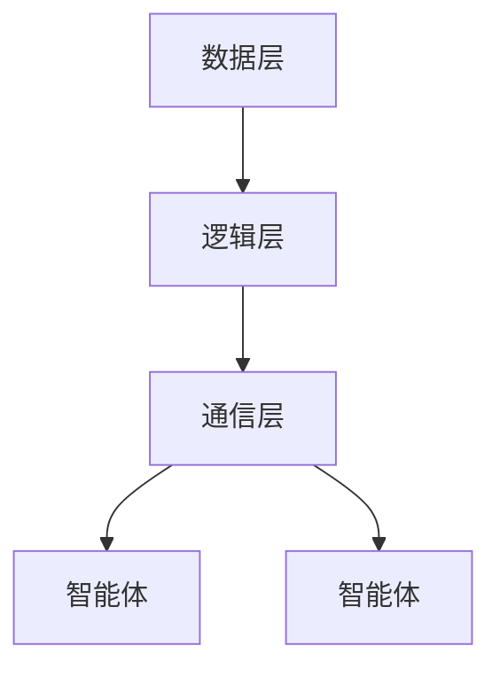

                 


# 多智能体系统在全球地缘政治风险分析中的角色

## 关键词：多智能体系统，地缘政治风险分析，全球安全，博弈论，分布式计算

## 摘要

随着全球化进程的加速和国际关系的复杂化，地缘政治风险分析变得越来越重要。多智能体系统（Multi-Agent Systems, MAS）作为一种新兴的技术手段，正在被广泛应用于全球地缘政治风险分析中。本文将深入探讨多智能体系统在全球地缘政治风险分析中的角色，分析其核心概念、算法原理、系统架构以及实际应用案例，最后总结多智能体系统在该领域的优势与挑战，并展望未来的研究方向。

---

# 第一部分: 多智能体系统与地缘政治风险分析的背景

## 第1章: 多智能体系统与地缘政治风险分析的背景

### 1.1 多智能体系统的基本概念

#### 1.1.1 多智能体系统的定义
多智能体系统（MAS）是由多个智能体（Agent）组成的分布式系统，这些智能体能够通过交互和协作完成复杂的任务。智能体是具有感知、决策、执行和自适应能力的实体，可以是软件程序、机器人或其他智能设备。

#### 1.1.2 多智能体系统的特征
- **自主性**：智能体能够自主决策，无需外部干预。
- **反应性**：智能体能够实时感知环境并做出反应。
- **协作性**：多个智能体能够通过通信和协作完成共同目标。
- **分布性**：智能体之间通过分布式计算实现任务协同。

#### 1.1.3 多智能体系统与单智能体系统的区别
单智能体系统依赖中心化决策，而多智能体系统通过分布式决策实现任务目标。多智能体系统具有更高的灵活性和容错性，但同时也面临通信延迟和协同复杂性的问题。

### 1.2 地缘政治风险分析的背景

#### 1.2.1 地缘政治风险的定义
地缘政治风险是指由于国家间的冲突、经济波动、社会动荡等因素导致的政治风险，可能对全球安全、经济和社会稳定造成影响。

#### 1.2.2 地缘政治风险分析的重要性
地缘政治风险分析是政府、企业和研究机构的重要任务，旨在提前识别潜在风险，制定应对策略，降低损失。

#### 1.2.3 多智能体系统在地缘政治风险分析中的作用
多智能体系统能够通过分布式计算和协作学习，实时分析全球政治动态，预测潜在风险，并提出应对方案。

### 1.3 多智能体系统在全球地缘政治风险分析中的应用前景

#### 1.3.1 多智能体系统的潜在应用场景
- **全球安全预警**：实时监控全球政治动态，预警潜在冲突。
- **经济风险评估**：分析经济政策对全球市场的影响。
- **社会动荡预测**：基于社交媒体数据预测社会动荡。

#### 1.3.2 多智能体系统在地缘政治风险分析中的优势
- **分布式计算**：能够处理海量数据，提高分析效率。
- **协作学习**：通过智能体间的协作，提升预测准确性。
- **动态适应**：能够实时调整分析模型，适应变化的环境。

#### 1.3.3 多智能体系统应用的挑战与机遇
- **挑战**：智能体间的通信延迟、数据隐私问题、模型复杂性。
- **机遇**：通过技术进步解决通信和计算问题，提升系统性能。

### 1.4 本章小结

---

## 第2章: 多智能体系统的核心概念

### 2.1 多智能体系统的组成要素

#### 2.1.1 智能体的定义与特征
智能体是多智能体系统的基本单元，具有自主性、反应性、目标导向性和社会能力。

#### 2.1.2 智能体的分类
- **简单反射型智能体**：基于当前感知做出反应。
- **基于模型的反射型智能体**：利用内部模型进行决策。
- **目标驱动型智能体**：根据目标选择行动。
- **效用驱动型智能体**：基于效用函数进行决策。

#### 2.1.3 智能体之间的交互与协作
智能体之间的交互通过通信协议实现，协作通过分布式算法完成。智能体之间的协作可以提高整体系统的决策能力。

### 2.2 多智能体系统的通信机制

#### 2.2.1 智能体间通信的定义
智能体之间的通信是通过消息传递实现的，通信内容包括状态、意图和行动。

#### 2.2.2 通信协议的选择与设计
通信协议的选择取决于系统的实时性、可靠性和安全性要求。设计通信协议需要考虑数据格式、消息传递机制和安全性保障。

#### 2.2.3 通信中的信息处理与安全性
信息处理需要对数据进行解析和过滤，安全性保障需要通过加密和身份验证实现。

### 2.3 多智能体系统的协调与决策机制

#### 2.3.1 协调机制的定义
协调机制是指智能体之间通过通信和协作实现共同目标的过程。

#### 2.3.2 基于博弈论的决策模型
博弈论模型用于分析智能体之间的策略选择和利益冲突。纳什均衡是博弈论中的一个重要概念，表示一种稳定的策略组合。

#### 2.3.3 分布式决策算法
分布式决策算法通过智能体之间的协作实现全局决策，常见的算法包括分布式一致性算法和分布式优化算法。

### 2.4 本章小结

---

## 第3章: 地缘政治风险分析的核心概念

### 3.1 地缘政治风险的构成要素

#### 3.1.1 地缘政治风险的定义
地缘政治风险是指由于国家间的冲突、经济波动、社会动荡等因素导致的政治风险。

#### 3.1.2 地缘政治风险的分类
- **国家层面风险**：包括主权风险、政治风险等。
- **区域层面风险**：包括地区冲突、经济危机等。
- **全球层面风险**：包括全球性危机、气候变化等。

#### 3.1.3 地缘政治风险的影响因素
- **经济因素**：经济政策、贸易摩擦等。
- **政治因素**：政府更迭、政策变化等。
- **社会因素**：社会动荡、民族矛盾等。

### 3.2 地缘政治风险分析的方法与工具

#### 3.2.1 定性分析方法
定性分析方法包括专家访谈、案例分析等，用于识别潜在风险。

#### 3.2.2 定量分析方法
定量分析方法包括统计分析、回归分析等，用于量化风险的影响。

#### 3.2.3 综合分析方法
综合分析方法结合定性和定量分析，用于全面评估风险。

### 3.3 地缘政治风险分析的挑战

#### 3.3.1 数据获取的困难性
地缘政治风险分析需要多源数据，数据获取可能受到限制。

#### 3.3.2 分析模型的复杂性
地缘政治风险分析涉及多个变量，模型构建复杂。

#### 3.3.3 结果的不确定性
地缘政治风险具有高度不确定性，分析结果可能存在误差。

### 3.4 本章小结

---

## 第4章: 多智能体系统的算法原理

### 4.1 分布式计算与多智能体系统

#### 4.1.1 分布式计算的定义与特点
分布式计算是指通过多台计算机协作完成任务的计算模式，具有高可用性和高扩展性。

#### 4.1.2 分布式计算在多智能体系统中的应用
分布式计算为多智能体系统的通信和协作提供了技术支持。

#### 4.1.3 分布式计算的挑战与解决方案
- **挑战**：网络延迟、数据同步、容错性。
- **解决方案**：通过优化通信协议和分布式算法解决。

### 4.2 博弈论与多智能体系统

#### 4.2.1 博弈论的基本概念
博弈论研究多个参与者的策略选择和利益冲突，常用于分析智能体之间的互动。

#### 4.2.2 纳什均衡的定义与应用
纳什均衡是一种稳定的策略组合，广泛应用于博弈论模型的设计。

#### 4.2.3 博弈论在多智能体系统中的应用
博弈论用于分析智能体之间的策略选择和利益冲突，帮助制定最优决策。

### 4.3 多智能体系统的协作学习算法

#### 4.3.1 协作学习的定义
协作学习是指多个智能体通过协作完成学习任务的过程。

#### 4.3.2 协作学习的算法实现
协作学习算法包括分布式机器学习算法和联邦学习算法。

#### 4.3.3 协作学习的应用
协作学习用于多智能体系统的数据共享和模型优化。

### 4.4 本章小结

---

## 第5章: 多智能体系统的系统架构设计

### 5.1 系统功能设计

#### 5.1.1 系统功能模块
- **数据采集模块**：采集全球政治数据。
- **数据分析模块**：分析数据，识别潜在风险。
- **决策支持模块**：提供决策支持，制定应对策略。

#### 5.1.2 功能模块的交互流程
数据采集模块通过API接口将数据传输到数据分析模块，数据分析模块通过通信协议将分析结果传输到决策支持模块。

### 5.2 系统架构设计

#### 5.2.1 系统架构的组成
- **数据层**：存储全球政治数据。
- **逻辑层**：实现数据分析和决策支持。
- **通信层**：实现智能体之间的通信。

#### 5.2.2 系统架构图


### 5.3 系统接口设计

#### 5.3.1 API接口设计
API接口用于数据采集和分析结果的输出。

#### 5.3.2 接口设计的注意事项
- **安全性**：防止数据泄露。
- **可扩展性**：便于功能扩展。

### 5.4 系统交互设计

#### 5.4.1 交互流程
智能体通过通信层进行交互，完成数据采集、分析和决策。

#### 5.4.2 交互设计的注意事项
- **实时性**：保证交互的实时性。
- **可靠性**：保证交互的可靠性。

### 5.5 本章小结

---

## 第6章: 项目实战

### 6.1 项目环境安装

#### 6.1.1 安装Python
安装Python 3.8及以上版本，确保环境配置正确。

#### 6.1.2 安装依赖库
安装numpy、pandas、networkx等依赖库。

### 6.2 系统核心实现源代码

#### 6.2.1 数据采集模块
```python
import requests

def fetch_data(url):
    response = requests.get(url)
    return response.json()
```

#### 6.2.2 数据分析模块
```python
import numpy as np

def analyze_risk(data):
    # 数据分析逻辑
    pass
```

#### 6.2.3 决策支持模块
```python
def decision_support(risk_level):
    if risk_level >= 0.8:
        return "高风险"
    elif risk_level >= 0.5:
        return "中风险"
    else:
        return "低风险"
```

### 6.3 代码应用解读与分析

#### 6.3.1 代码功能解读
- `fetch_data`函数用于从指定URL获取数据。
- `analyze_risk`函数用于分析数据，识别潜在风险。
- `decision_support`函数根据风险等级返回决策结果。

#### 6.3.2 代码实现的注意事项
- **数据清洗**：确保数据的准确性和完整性。
- **模型优化**：通过优化算法提高分析准确性。

### 6.4 实际案例分析和详细讲解剖析

#### 6.4.1 案例背景
以中美贸易摩擦为例，分析多智能体系统在地缘政治风险分析中的应用。

#### 6.4.2 案例分析过程
1. 数据采集：从互联网获取中美贸易相关的数据。
2. 数据分析：分析数据，识别潜在风险。
3. 决策支持：根据分析结果，制定应对策略。

### 6.5 项目小结

---

## 第7章: 最佳实践、小结与展望

### 7.1 最佳实践

#### 7.1.1 数据隐私保护
在数据采集和分析过程中，需要注意数据隐私保护，防止数据泄露。

#### 7.1.2 系统可扩展性
系统设计应考虑可扩展性，便于功能扩展和性能优化。

#### 7.1.3 人机协作
多智能体系统与人类专家的协作能够提高分析的准确性和决策的合理性。

### 7.2 小结

通过本文的介绍，我们了解了多智能体系统在全球地缘政治风险分析中的角色，探讨了其核心概念、算法原理、系统架构和实际应用案例。多智能体系统通过分布式计算和协作学习，能够有效提高地缘政治风险分析的效率和准确性。

### 7.3 展望

未来的研究方向包括：
- **动态环境适应性**：研究多智能体系统在动态环境下的适应性。
- **数据隐私保护**：探索数据隐私保护的新方法。
- **人机协作优化**：研究如何进一步优化人机协作，提高分析效率。

---

## 第8章: 总结与致谢

通过本文的详细讲解，我们深入探讨了多智能体系统在全球地缘政治风险分析中的角色，分析了其核心概念、算法原理、系统架构和实际应用案例。我们相信，随着技术的进步和研究的深入，多智能体系统将在地缘政治风险分析中发挥越来越重要的作用。

最后，感谢读者的耐心阅读和支持，希望本文能够为相关领域的研究和实践提供有价值的参考。

--- 

（全文完）

