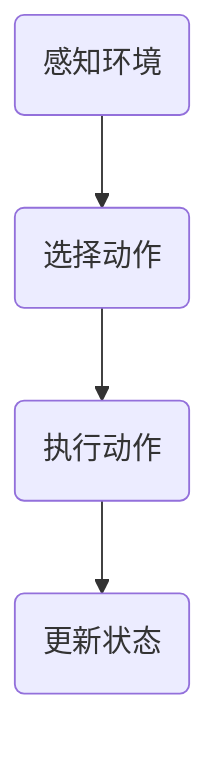
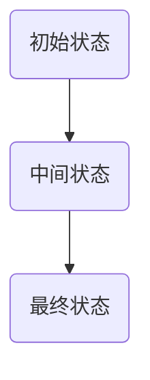
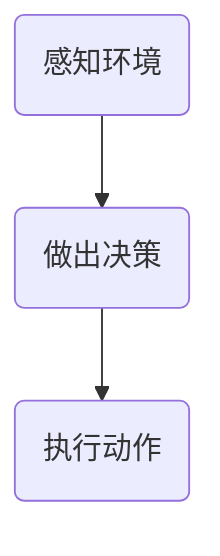
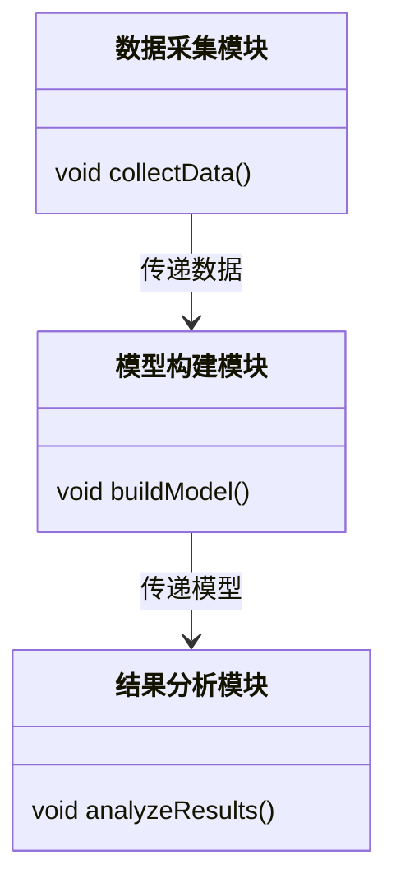
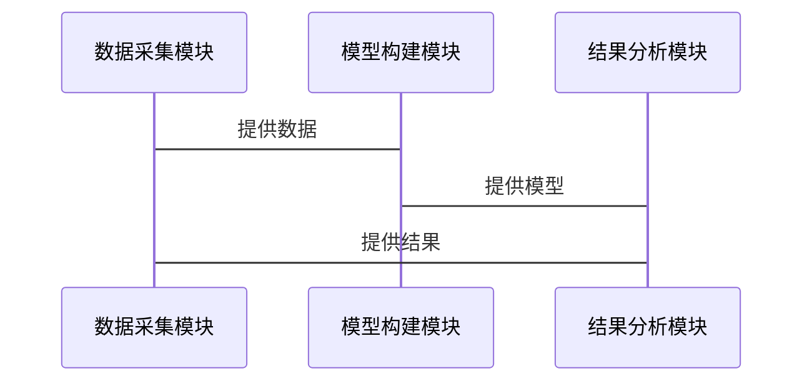

                 


# 多智能体系统在全球宏观经济分析中的角色

## 关键词：多智能体系统、宏观经济分析、算法原理、系统架构、项目实战

## 摘要：  
多智能体系统（Multi-Agent System, MAS）是一种由多个智能体组成的分布式系统，这些智能体能够通过协作和竞争完成复杂的任务。本文将探讨多智能体系统在全球宏观经济分析中的角色，包括其核心概念、算法原理、系统架构设计以及项目实战。通过详细的分析和具体的案例，展示多智能体系统如何在宏观经济预测、政策模拟等领域发挥重要作用。

---

# 第一部分: 多智能体系统与宏观经济分析基础

## 第1章: 多智能体系统概述

### 1.1 多智能体系统的定义与特点
#### 1.1.1 多智能体系统的定义
多智能体系统是由多个智能体（Agent）组成的分布式系统，这些智能体能够感知环境、自主决策并与其他智能体协作或竞争，以实现特定目标。

#### 1.1.2 多智能体系统的特征
- **自主性**：每个智能体都有自己的决策机制，能够独立行动。
- **反应性**：智能体能够实时感知环境并做出反应。
- **协作性**：多个智能体通过协作完成复杂任务。
- **分布性**：智能体之间没有中心化的控制机构，任务分配和协调是分布式的。

#### 1.1.3 多智能体系统与传统单智能体系统的区别
| 特性 | 单智能体系统 | 多智能体系统 |
|------|--------------|--------------|
| 控制方式 | 中央控制 | 分布式控制 |
| 任务处理 | 单一任务 | 多任务协作 |
| 复杂性 | 较低 | 较高 |

### 1.2 多智能体系统的核心概念
#### 1.2.1 智能体的定义与分类
**智能体**是指能够感知环境、做出决策并采取行动的实体。根据智能体的复杂性和任务类型，可以分为以下几类：
- **反应式智能体**：仅基于当前感知做出反应。
- **基于模型的智能体**：利用内部模型和知识进行决策。
- **效用导向智能体**：通过最大化效用来做出决策。

#### 1.2.2 智能体的交互与协作
智能体之间的交互可以通过以下方式进行：
- **直接通信**：智能体之间通过消息传递进行交流。
- **间接协作**：通过共享环境状态或中间媒介进行协作。

#### 1.2.3 多智能体系统的复杂性
多智能体系统的复杂性主要来源于：
- **智能体的异构性**：不同智能体可能有不同的目标和决策机制。
- **动态环境**：环境状态可能随时变化，影响智能体的决策。
- **博弈关系**：智能体之间的协作与竞争关系增加了系统的复杂性。

### 1.3 多智能体系统在宏观经济分析中的作用
#### 1.3.1 宏观经济分析的基本概念
宏观经济分析研究的是整个经济系统的运行机制，包括GDP、失业率、通货膨胀率等宏观指标。

#### 1.3.2 多智能体系统在宏观经济分析中的优势
- **复杂性建模**：能够模拟经济系统中个体行为的多样性。
- **动态性分析**：可以实时跟踪经济系统的动态变化。
- **政策模拟**：通过模拟不同政策的效果，为政策制定者提供参考。

#### 1.3.3 多智能体系统与传统宏观经济模型的对比
| 特性 | 传统宏观经济模型 | 多智能体系统 |
|------|------------------|-------------|
| 模型复杂性 | 较低 | 较高 |
| 个体行为建模 | 简化 | 详细 |
| 动态性 | 静态 | 动态 |

### 1.4 本章小结
本章介绍了多智能体系统的基本概念和特点，并分析了其在宏观经济分析中的作用和优势。

---

## 第2章: 多智能体系统的核心概念与联系

### 2.1 多智能体系统的实体关系分析
#### 2.1.1 实体关系图（ER图）分析
通过ER图可以清晰地展示宏观经济系统中各实体之间的关系，例如企业、消费者、政府等。

#### 2.1.2 多智能体系统中的实体关系
```mermaid
erDiagram
    actor 企业 {
        string 名称
        string 行业
    }
    actor 消费者 {
        string 名称
        string 收入
    }
    actor 政府 {
        string 政策
        string 税率
    }
    企业 --> 政策: 受政策影响
    消费者 --> 企业: 购买产品
```

#### 2.1.3 实体关系图的 Mermaid 流程图
```mermaid
flowchart TD
    A(企业) --> B(消费者): 提供产品
    B --> C(政府): 缴税
    C --> D(政策): 制定政策
    D --> A: 影响企业
```

### 2.2 多智能体系统的算法原理
#### 2.2.1 基于规则的多智能体算法
基于规则的算法通过预定义的规则来指导智能体的行为，适用于任务简单的情况。

#### 2.2.2 基于模型的多智能体算法
基于模型的算法利用内部模型来模拟环境和智能体行为，适用于任务复杂的场景。

#### 2.2.3 多智能体系统算法的 Mermaid 流程图


### 2.3 多智能体系统的数学模型
#### 2.3.1 基于博弈论的数学模型
博弈论模型可以描述智能体之间的竞争与协作关系，例如纳什均衡。

#### 2.3.2 基于动态系统的数学模型
动态系统模型可以描述经济系统的演变过程，例如GDP增长模型。

#### 2.3.3 数学模型的 Mermaid 展示


### 2.4 本章小结
本章详细讲解了多智能体系统的核心概念和算法原理，并通过Mermaid图表展示了系统的复杂性。

---

## 第3章: 多智能体系统的算法原理与实现

### 3.1 多智能体系统的算法原理
#### 3.1.1 基于规则的算法
基于规则的算法通过预定义的规则来指导智能体的行为，适用于任务简单的情况。

#### 3.1.2 基于模型的算法
基于模型的算法利用内部模型来模拟环境和智能体行为，适用于任务复杂的场景。

#### 3.1.3 基于强化学习的算法
强化学习算法通过智能体与环境的交互来学习最优策略，适用于动态环境。

### 3.2 多智能体系统的算法实现
#### 3.2.1 算法实现的步骤
1. 确定智能体的目标和环境。
2. 设计智能体的感知和决策机制。
3. 实现智能体之间的交互和协作。

#### 3.2.2 算法实现的代码示例
```python
class Agent:
    def __init__(self, name):
        self.name = name
        self.state = "idle"

    def perceive(self, environment):
        pass

    def decide(self):
        pass

    def act(self):
        pass

class Consumer(Agent):
    def perceive(self, environment):
        self.environment = environment

    def decide(self):
        if self.environment['price'] < self.budget:
            return 'buy'
        else:
            return 'not buy'

    def act(self):
        decision = self.decide()
        print(f"{self.name} decides to {decision}")
```

#### 3.2.3 算法实现的 Mermaid 流程图


### 3.3 算法的数学模型与公式
#### 3.3.1 基于博弈论的数学公式
纳什均衡的定义为：在策略组合中，没有任何单个智能体可以通过单方面改变策略而获得更好的结果。

#### 3.3.2 基于动态系统的数学公式
$$ G_{t+1} = aG_t + bU_t $$
其中，$G_t$ 表示第 $t$ 时刻的GDP，$U_t$ 表示失业率，$a$ 和 $b$ 是系数。

### 3.4 本章小结
本章详细讲解了多智能体系统的算法原理，并通过Python代码和数学公式展示了算法的实现过程。

---

## 第4章: 多智能体系统的系统分析与架构设计

### 4.1 宏观经济分析的系统场景
#### 4.1.1 宏观经济分析的基本问题
如何预测经济波动？如何模拟政策效果？

#### 4.1.2 多智能体系统在宏观经济分析中的应用
模拟企业、消费者和政府的行为，预测经济趋势。

#### 4.1.3 宏观经济分析的系统需求
- **实时性**：能够快速响应环境变化。
- **准确性**：模型需要准确反映经济系统的运行机制。
- **可扩展性**：能够处理大规模数据。

### 4.2 宏观经济分析的系统架构设计
#### 4.2.1 系统架构的模块划分
- **数据采集模块**：收集经济数据。
- **模型构建模块**：建立经济模型。
- **结果分析模块**：分析模拟结果。

#### 4.2.2 系统架构的 Mermaid 类图


#### 4.2.3 系统架构的 Mermaid 序列图


### 4.3 系统接口设计与实现
#### 4.3.1 系统接口的设计原则
- **简洁性**：接口设计简单明了。
- **可扩展性**：接口能够方便地扩展。

#### 4.3.2 系统接口的实现步骤
1. 确定接口的功能需求。
2. 设计接口的参数和返回值。
3. 实现接口的具体功能。

#### 4.3.3 系统接口的代码示例
```python
class Interface:
    def collect_data(self):
        pass

    def build_model(self):
        pass

    def analyze_results(self):
        pass
```

### 4.4 本章小结
本章详细讲解了宏观经济分析的系统架构设计，并通过Mermaid图表展示了系统的模块划分和交互过程。

---

## 第5章: 多智能体系统的项目实战

### 5.1 项目环境安装与配置
#### 5.1.1 环境安装
需要安装Python、NumPy、Matplotlib等库。

#### 5.1.2 环境配置
设置项目的运行环境，例如虚拟环境。

### 5.2 系统核心实现源代码
#### 5.2.1 核心实现的代码示例
```python
class ConsumerAgent:
    def __init__(self, name, budget):
        self.name = name
        self.budget = budget

    def perceive(self, environment):
        self.environment = environment

    def decide(self):
        if self.environment['price'] < self.budget:
            return 'buy'
        else:
            return 'not buy'

    def act(self):
        decision = self.decide()
        print(f"{self.name} decides to {decision}")
```

#### 5.2.2 代码应用解读与分析
通过代码模拟消费者在不同价格下的购买决策。

### 5.3 项目实战的案例分析
#### 5.3.1 实际案例分析
模拟多个消费者在不同价格下的购买行为，分析整体市场需求。

#### 5.3.2 详细讲解剖析
通过案例分析，展示多智能体系统在宏观经济预测中的应用。

### 5.4 项目小结
本章通过项目实战展示了多智能体系统的实现过程，并分析了其在宏观经济分析中的应用。

---

## 第6章: 总结与展望

### 6.1 本章总结
多智能体系统在宏观经济分析中具有重要作用，能够模拟复杂经济系统的运行机制。

### 6.2 展望
未来，随着人工智能技术的发展，多智能体系统在宏观经济分析中的应用将更加广泛。

### 6.3 最佳实践 tips
- **数据质量**：宏观经济分析需要高质量的数据支持。
- **模型验证**：需要对模型进行充分的验证和测试。
- **团队协作**：宏观经济分析需要多学科团队的协作。

---

# 结语

多智能体系统在全球宏观经济分析中的角色日益重要，通过本文的详细讲解，读者可以全面了解其核心概念、算法原理和实际应用。希望本文能够为相关领域的研究和实践提供有价值的参考。

