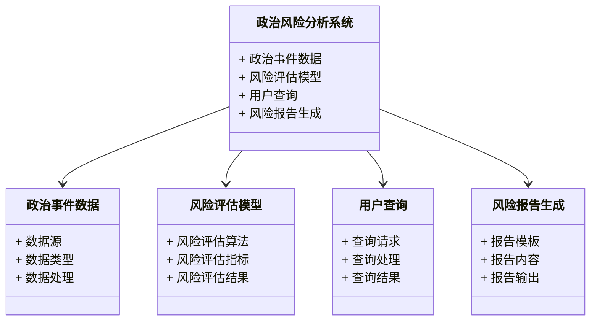

                 


# 多智能体系统在全球政治风险分析中的角色

## 关键词：
- 多智能体系统
- 政治风险分析
- 分布式计算
- 博弈论
- 系统架构
- 风险评估
- 智能体协作

## 摘要：
多智能体系统（Multi-Agent Systems, MAS）作为一种新兴的技术手段，在全球政治风险分析领域展现出巨大的潜力。本文将系统性地探讨MAS在全球政治风险分析中的角色，从背景介绍、核心概念、算法原理、系统架构到项目实战，全面解析MAS在政治风险分析中的应用价值与实现方法。通过深入分析MAS的优势与挑战，本文将为读者提供一个全面的视角，以理解如何利用MAS提升政治风险分析的效率与准确性。

---

## 第一部分: 多智能体系统与全球政治风险分析基础

### 第1章: 多智能体系统概述

#### 1.1 多智能体系统的基本概念
多智能体系统（MAS）是由多个智能体组成的分布式系统，每个智能体都是一个具有独立性、反应性、主动性和协作性的实体。智能体之间的交互和协作能够完成复杂的任务，而这些任务往往超越单个智能体的能力范围。

- **定义与特点**：
  - **定义**：MAS是由多个智能体组成的系统，这些智能体能够通过交互和协作完成特定目标。
  - **特点**：
    - **独立性**：每个智能体具有独立的行为和决策能力。
    - **反应性**：智能体能够感知环境并做出实时反应。
    - **主动性**：智能体能够主动采取行动以实现目标。
    - **协作性**：智能体之间能够通过通信和协调完成复杂任务。

- **MAS与其他系统的主要区别**：
  - **与单智能体系统**：单智能体系统依赖于中心化的决策机制，而MAS强调分布式决策和协作。
  - **与分布式系统**：MAS不仅涉及数据分布，还强调智能体的自主性和智能性。

#### 1.2 全球政治风险分析的背景
全球政治风险分析是评估一个国家或地区政治稳定性、政策变化、社会动荡等风险的过程。随着全球化的发展，政治风险分析的需求日益增加，尤其是在跨国企业和国际组织中。

- **政治风险的定义与类型**：
  - **定义**：政治风险是指由于政治因素导致的投资或运营损失的可能性。
  - **类型**：
    - **政府风险**：包括政策变化、税收调整、外汇管制等。
    - **社会风险**：包括社会动荡、罢工、抗议活动等。
    - **法律风险**：包括法律法规的变更、执法力度的变化等。

- **全球化背景下的政治风险分析**：
  - 全球化使得跨国投资和贸易活动增多，政治风险分析的重要性也随之增加。
  - 政治风险分析需要考虑多方面的因素，包括地缘政治、政策变化、社会舆论等。

- **传统方法与局限性**：
  - **传统方法**：主要依赖专家分析和历史数据分析。
  - **局限性**：
    - 数据获取难度大，信息不全面。
    - 分析过程耗时长，难以应对突发政治事件。
    - 分析结果的主观性较高，缺乏客观性。

---

### 第2章: 多智能体系统在全球政治风险分析中的角色

#### 2.1 多智能体系统在政治风险分析中的应用潜力
MAS在政治风险分析中的应用潜力主要体现在以下几个方面：

- **分布式信息处理**：
  - MAS能够从多个来源获取信息，通过分布式计算实现信息的高效整合和分析。
  - 例如，多个智能体可以分别收集不同国家的政治、经济和社会数据，并通过协作生成综合性的风险评估报告。

- **协作与协调机制**：
  - 智能体之间的协作能够提高信息处理的效率和准确性。
  - 通过协调机制，MAS可以实现多个智能体之间的任务分配和资源优化。

- **动态风险评估**：
  - MAS能够实时感知环境变化，快速调整风险评估模型。
  - 例如，面对突发政治事件，MAS能够迅速分析事件的影响并生成实时风险评估报告。

#### 2.2 多智能体系统在政治风险分析中的核心功能
MAS在政治风险分析中的核心功能包括：

- **分布式信息处理**：
  - 智能体通过分布式计算技术，从多个数据源获取信息，并进行实时处理。
  - 例如，智能体可以从新闻网站、社交媒体、政府公告等多个渠道获取信息，并通过协作生成综合性的风险评估报告。

- **协作与协调机制**：
  - 智能体之间的协作机制能够提高信息处理的效率和准确性。
  - 例如，多个智能体可以分别负责不同的数据分析任务，并通过通信协议实现任务的协同。

- **动态风险评估**：
  - MAS能够实时感知环境变化，快速调整风险评估模型。
  - 例如，面对突发政治事件，MAS能够迅速分析事件的影响并生成实时风险评估报告。

---

### 第3章: 多智能体系统在政治风险分析中的核心概念与联系

#### 3.1 多智能体系统的核心概念
- **智能体的定义与属性**：
  - **定义**：智能体是一种能够感知环境并采取行动以实现目标的实体。
  - **属性**：
    - **自主性**：智能体能够自主决策。
    - **反应性**：智能体能够感知环境并做出实时反应。
    - **主动性**：智能体能够主动采取行动以实现目标。

- **智能体之间的交互与协作**：
  - **通信**：智能体之间通过通信机制交换信息。
  - **协作**：智能体通过协作完成复杂任务。

- **多智能体系统的整体行为**：
  - 多个智能体通过协作完成复杂的任务。
  - 系统的整体行为是由智能体的个体行为组成的。

#### 3.2 多智能体系统与政治风险分析的实体关系图

```mermaid
erDiagram
    actor 政治风险分析系统
    actor 政治事件数据
    actor 风险评估模型
    actor 用户查询
    actor 风险报告生成
    政治风险分析系统 --> 政治事件数据
    政治风险分析系统 --> 风险评估模型
    政治风险分析系统 --> 用户查询
    政治风险分析系统 --> 风险报告生成
```

---

### 第4章: 多智能体系统在政治风险分析中的算法原理

#### 4.1 多智能体系统的核心算法
- **分布式计算算法**：
  - 分布式计算算法用于在MAS中实现信息的分布式处理。
  - 例如，多个智能体分别负责不同的数据处理任务，并通过通信机制实现任务的协同。

- **博弈论算法**：
  - 博弈论算法用于模拟智能体之间的竞争与合作。
  - 例如，智能体可以基于博弈论模型进行决策，以实现最优策略。

- **协调与协作算法**：
  - 协调与协作算法用于实现智能体之间的协作。
  - 例如，智能体可以通过协调算法实现任务的分配和资源的优化。

#### 4.2 多智能体系统的算法实现
- **分布式计算算法的实现**：
  - 通过分布式计算算法，实现信息的高效处理和分析。
  - 例如，智能体可以使用分布式计算技术从多个数据源获取信息，并通过协作生成综合性的风险评估报告。

- **博弈论算法的实现**：
  - 基于博弈论模型，实现智能体之间的竞争与合作。
  - 例如，智能体可以基于博弈论模型进行决策，以实现最优策略。

- **协调与协作算法的实现**：
  - 通过协调与协作算法，实现智能体之间的协作。
  - 例如，智能体可以通过协调算法实现任务的分配和资源的优化。

---

### 第5章: 多智能体系统在政治风险分析中的系统架构

#### 5.1 系统功能设计
- **政治风险分析系统的功能设计**：
  - 收集政治事件数据。
  - 分析政治风险。
  - 生成风险评估报告。
  - 提供实时风险监控。

- **系统架构设计**：
  - 通过领域模型图展示系统的功能模块。
  - 例如，系统可以分为数据采集模块、数据分析模块、风险评估模块和报告生成模块。

#### 5.2 系统架构图



---

### 第6章: 多智能体系统在政治风险分析中的项目实战

#### 6.1 环境安装
- **安装Python环境**：
  - 安装Python 3.8及以上版本。
  - 安装必要的Python库，例如numpy、pandas、matplotlib等。

- **安装MAS相关库**：
  - 安装多智能体系统相关的库，例如 mesa、.Agentframework等。

#### 6.2 系统核心实现
- **核心算法实现**：
  - 实现分布式计算算法。
  - 实现博弈论算法。
  - 实现协调与协作算法。

- **代码示例**：
  ```python
  import numpy as np
  import pandas as pd
  import matplotlib.pyplot as plt

  # 分布式计算算法示例
  def distributed_computation(data):
      # 分割数据
      n = len(data)
      chunks = np.array_split(data, 4)
      # 分布式计算
      results = [np.mean(chunk) for chunk in chunks]
      # 合并结果
      return np.mean(results)

  # 博弈论算法示例
  def game_theory_model(players, payoff_matrix):
      # 博弈论模型实现
      pass

  # 协调与协作算法示例
  def coordination_algorithm(tasks, agents):
      # 协调算法实现
      pass
  ```

#### 6.3 案例分析与结果解读
- **案例分析**：
  - 以某个国家的政治风险分析为例，展示MAS的应用过程。
  - 例如，分析某个国家的政治稳定性、政策变化、社会动荡等风险。

- **结果解读**：
  - 解读风险评估结果。
  - 提供风险应对策略。

---

### 第7章: 多智能体系统在政治风险分析中的总结与展望

#### 7.1 总结
- **MAS在政治风险分析中的优势**：
  - 提高信息处理效率。
  - 实现智能体之间的协作与协调。
  - 提供动态风险评估能力。

- **MAS在政治风险分析中的挑战**：
  - 智能体之间的通信与协作难度较大。
  - 系统的复杂性较高，难以实现高效的管理。

#### 7.2 展望
- **未来发展方向**：
  - 提高MAS的智能化水平。
  - 加强MAS在政治风险分析中的应用研究。
  - 推动MAS与其他技术的融合，例如人工智能、大数据分析等。

#### 7.3 最佳实践 tips
- **MAS在政治风险分析中的最佳实践**：
  - 确保智能体之间的通信与协作机制完善。
  - 提高系统的容错性和鲁棒性。
  - 加强对智能体行为的监控与管理。

#### 7.4 小结
- **小结**：
  - 多智能体系统在政治风险分析中的应用潜力巨大。
  - 通过MAS，可以实现信息的高效处理和智能体的协作与协调。
  - 展望未来，MAS在政治风险分析中的应用将更加广泛和深入。

---

## 结语
多智能体系统在全球政治风险分析中的角色日益重要。通过MAS，我们可以实现信息的高效处理和智能体的协作与协调，从而提高政治风险分析的效率和准确性。尽管MAS的应用面临一定的挑战，但随着技术的不断发展，MAS在政治风险分析中的应用前景将更加广阔。

