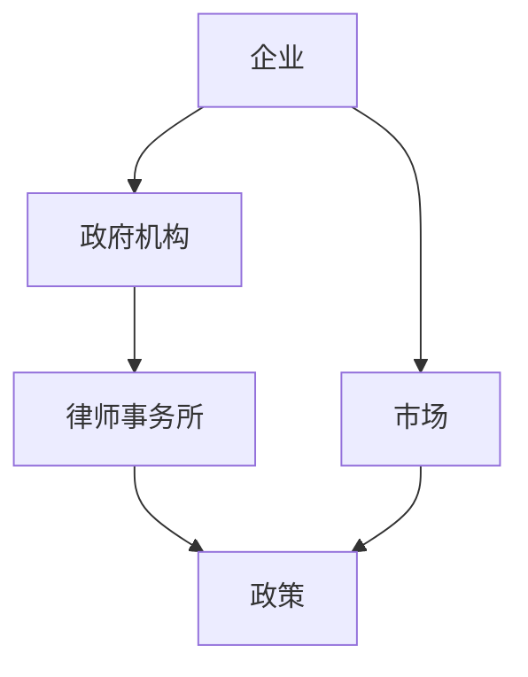
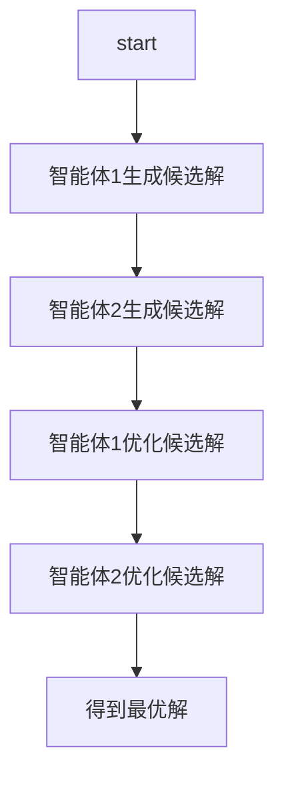
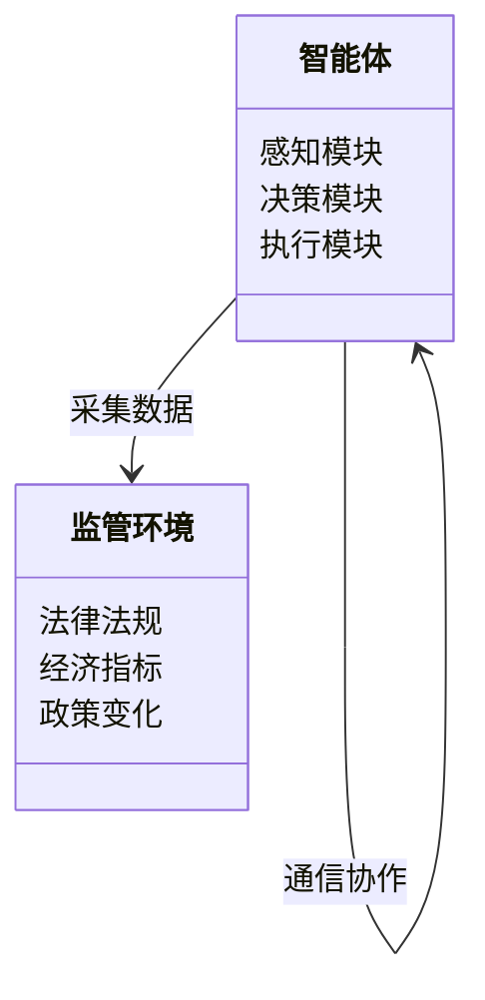
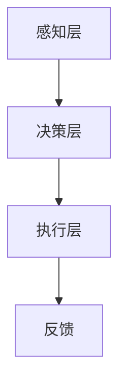
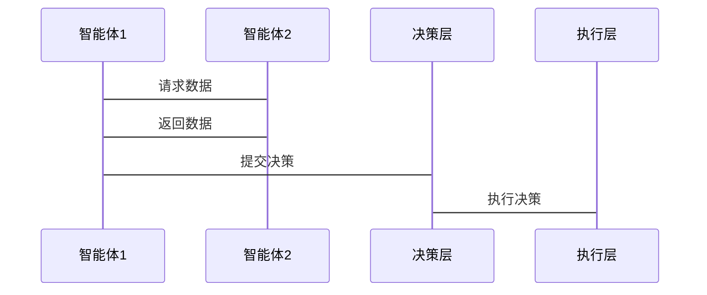

                 


# 多智能体系统在全球监管环境分析中的应用：跨国投资风险评估

## 关键词：多智能体系统、全球监管环境分析、跨国投资、风险评估、人工智能、系统架构

## 摘要：  
本文探讨了多智能体系统在全球监管环境分析中的应用，重点分析了其在跨国投资风险评估中的潜力与挑战。通过系统性地阐述多智能体系统的定义、核心概念、算法原理、系统架构设计以及实际应用案例，本文为读者提供了从理论到实践的全面视角。文章还结合了具体的Python代码实现和数学模型，展示了多智能体系统在复杂监管环境下的协作机制与决策优化能力，为跨国投资风险评估提供了创新的解决方案。

---

## 第1章: 多智能体系统与全球监管环境分析概述

### 1.1 多智能体系统的定义与特点
#### 1.1.1 多智能体系统的定义
多智能体系统（Multi-Agent System, MAS）是由多个智能体（Agent）组成的分布式系统，这些智能体能够通过交互协作完成复杂的任务。智能体是具有感知、决策、推理和行动能力的实体。

#### 1.1.2 多智能体系统的核心特点
- **分布式性**：智能体独立运行，通过通信协作完成目标。
- **自主性**：每个智能体都能自主决策。
- **社会性**：智能体之间通过交互实现协作。
- **动态性**：系统环境和智能体状态动态变化。

#### 1.1.3 多智能体系统与传统单智能体系统的区别
| 特性 | 单智能体系统 | 多智能体系统 |
|------|--------------|--------------|
| 决策 | 单一中心决策 | 分布式决策   |
| 通信 | 无或有限 | 高频通信     |
| 可扩展性 | 低 | 高            |
| 故障容错 | 低 | 高            |

### 1.2 全球监管环境分析的背景与意义
#### 1.2.1 全球化背景下的监管环境特点
- 跨国投资涉及多个国家的法律法规。
- 监管环境复杂多变，涉及税务、合规、反垄断等多个方面。
- 不同国家的监管政策差异显著。

#### 1.2.2 跨国投资风险评估的重要性
- 投资失败可能导致巨大经济损失。
- 理解监管环境是降低投资风险的关键。
- 监管政策的变化可能影响投资回报。

#### 1.2.3 多智能体系统在监管环境分析中的优势
- 能够处理多维度、多层次的监管信息。
- 通过协作实现信息的高效整合与分析。
- 支持动态环境下的实时决策。

### 1.3 多智能体系统在全球监管环境分析中的应用前景
#### 1.3.1 全球监管环境的复杂性与挑战
- 监管信息分散，难以整合。
- 政策变化频繁，需要动态分析。
- 不同国家的法律差异大，分析难度高。

#### 1.3.2 多智能体系统在风险评估中的潜力
- 多智能体系统能够实时监控多个监管维度。
- 支持分布式协作，提高信息处理效率。
- 通过博弈论模型模拟监管政策的变化。

#### 1.3.3 应用案例与未来发展方向
- 案例：跨国企业投资风险评估。
- 发展方向：结合区块链技术，提升数据安全性。
- 挑战：解决智能体之间的通信延迟与计算资源分配问题。

---

## 第2章: 多智能体系统的核心概念与理论基础

### 2.1 多智能体系统的组成与结构
#### 2.1.1 实体与角色的定义
- **实体**：监管环境中的各个主体，如企业、政府机构、律师事务所。
- **角色**：实体在系统中的具体职责，如数据采集智能体、政策分析智能体。

#### 2.1.2 实体之间的关系与交互
- **协作关系**：智能体之间通过通信协作完成任务。
- **竞争关系**：在某些场景下，智能体之间可能存在竞争。
- **依赖关系**：某些智能体的决策依赖于其他智能体的输出。

#### 2.1.3 系统的层次结构
- **物理层**：智能体的物理实现，如计算机、传感器。
- **逻辑层**：智能体的逻辑结构，包括感知、决策、执行模块。
- **通信层**：智能体之间的通信协议与数据交换。

### 2.2 全球监管环境分析的模型与框架
#### 2.2.1 监管环境的多维度分析
- **法律维度**：包括税法、劳动法、反垄断法等。
- **政策维度**：包括政府政策、行业标准等。
- **经济维度**：包括经济指标、市场趋势等。

#### 2.2.2 多智能体系统的建模方法
- **实体关系模型（ER图）**：用于描述监管环境中的实体及其关系。
- **过程模型**：用于描述监管环境中的业务流程。
- **动态模型**：用于描述监管环境中的变化趋势。

#### 2.2.3 实体关系的ER图设计


### 2.3 多智能体系统的协作机制
#### 2.3.1 协作协议与通信机制
- **通信协议**：定义智能体之间的数据交换格式。
- **协作协议**：定义智能体之间的协作规则。

#### 2.3.2 协作策略与决策模型
- **协作策略**：包括任务分配、资源分配等。
- **决策模型**：基于多智能体系统的博弈论模型。

#### 2.3.3 系统的自适应能力
- **自适应性**：系统能够根据环境变化自动调整。
- **容错性**：系统能够在部分智能体故障的情况下继续运行。

---

## 第3章: 多智能体系统在全球监管环境分析中的算法原理

### 3.1 多智能体协作算法
#### 3.1.1 协作式搜索算法
- **算法流程**：
  1. 每个智能体根据自身信息生成候选解。
  2. 智能体之间交换信息，逐步优化候选解。
  3. 最终得到全局最优解。
- **mermaid流程图**：


#### 3.1.2 基于博弈论的决策算法
- **纳什均衡**：所有智能体都采取最优策略，且没有任何智能体有动机单方面改变策略。
- **数学模型**：
  $$ V_i = \max_{s_i} \min_{s_{-i}} V_i(s_i, s_{-i}) $$
  其中，$V_i$ 是智能体i的效用函数，$s_i$ 是智能体i的策略，$s_{-i}$ 是其他智能体的策略组合。

#### 3.1.3 分布式计算与通信优化
- **分布式计算**：智能体在本地进行计算，通过通信模块交换结果。
- **通信优化**：通过压缩和加密技术减少通信开销。

### 3.2 数学模型与公式
#### 3.2.1 协作式搜索算法的数学模型
- **候选解生成**：每个智能体生成一个候选解，表示为$x_i \in X$。
- **优化过程**：智能体之间交换信息，逐步优化候选解。
  $$ x_{i}^{k+1} = \arg\min_{x_i \in X} f(x_i, x_{-i}^k) $$

#### 3.2.2 基于博弈论的决策算法的数学模型
- **效用函数**：
  $$ U_i(s_i, s_{-i}) = \sum_{j=1}^n w_j \cdot x_j(s_i, s_{-i}) $$
  其中，$w_j$ 是权重，$x_j(s_i, s_{-i})$ 是指标的值。

---

## 第4章: 系统分析与架构设计方案

### 4.1 问题场景介绍
跨国投资涉及多个国家的监管环境，需要实时监控和分析多个维度的信息。多智能体系统可以用于分析各国的法律法规、经济指标、政策变化等，为投资者提供风险评估。

### 4.2 系统功能设计
#### 4.2.1 功能模块
- **数据采集模块**：采集各国的监管信息。
- **数据分析模块**：分析监管信息，生成风险评估报告。
- **决策支持模块**：提供投资建议。

#### 4.2.2 领域模型设计


### 4.3 系统架构设计
#### 4.3.1 分层架构
- **感知层**：智能体感知监管环境信息。
- **决策层**：智能体之间协作决策。
- **执行层**：执行决策并反馈结果。

#### 4.3.2 架构图设计


### 4.4 系统接口设计
#### 4.4.1 接口定义
- **输入接口**：接收监管环境数据。
- **输出接口**：输出风险评估报告。
- **通信接口**：智能体之间的通信接口。

#### 4.4.2 交互流程


---

## 第5章: 项目实战

### 5.1 环境安装
#### 5.1.1 安装Python
```bash
# 安装Python
sudo apt-get install python3
```

#### 5.1.2 安装相关库
```bash
# 安装numpy和pandas
pip install numpy pandas
```

### 5.2 系统核心实现源代码
#### 5.2.1 协作式搜索算法实现
```python
def collaborative_search_agents(n_agents, objective_function):
    agents = [i for i in range(n_agents)]
    current = [0] * n_agents
    while True:
        neighbors = [i for i in range(n_agents) if i != current]
        for i in agents:
            best = current[i]
            for neighbor in neighbors:
                if objective_function(neighbor) < objective_function(best):
                    best = neighbor
            current[i] = best
        if convergence(current):
            break
    return current
```

#### 5.2.2 博弈论决策算法实现
```python
def nash_equilibrium(players, strategies):
    for player in players:
        for strategy in strategies[player]:
            if is_best_response(player, strategy, current_strategies):
                update_strategies(player, strategy)
    return current_strategies
```

### 5.3 代码应用解读与分析
#### 5.3.1 协作式搜索算法解读
- 该算法通过智能体之间的协作，逐步优化候选解，最终得到全局最优解。

#### 5.3.2 博弈论决策算法解读
- 通过计算纳什均衡，确定每个智能体的最优策略，实现分布式决策。

### 5.4 实际案例分析
#### 5.4.1 案例：跨国企业投资风险评估
- **输入**：各国的监管信息。
- **输出**：风险评估报告。
- **分析**：通过多智能体系统的协作，评估跨国投资的风险。

#### 5.4.2 案例分析与详细讲解
- **分析步骤**：
  1. 数据采集：采集各国的监管信息。
  2. 数据分析：分析监管信息，生成风险评估报告。
  3. 决策支持：提供投资建议。

### 5.5 项目小结
- **成功经验**：通过多智能体系统的协作，实现高效的监管环境分析。
- **教训**：通信延迟和计算资源分配问题需要进一步优化。

---

## 第6章: 扩展阅读

### 6.1 最佳实践
#### 6.1.1 小结
- 多智能体系统在跨国投资风险评估中的应用前景广阔。
- 需要结合具体场景，优化系统架构和算法。

#### 6.1.2 注意事项
- 确保智能体之间的通信延迟在可接受范围内。
- 注意数据安全和隐私保护。

#### 6.1.3 拓展阅读
- 推荐阅读《Multi-Agent Systems: Algorithm and Applications》。

---

# 附录

## 附录A: 相关术语表
- **多智能体系统（MAS）**：由多个智能体组成的分布式系统。
- **纳什均衡**：博弈论中的一个概念，表示所有智能体都采取最优策略。

## 附录B: 参考文献
- [1] 维基百科：多智能体系统
- [2] 《Multi-Agent Systems: Algorithm and Applications》

