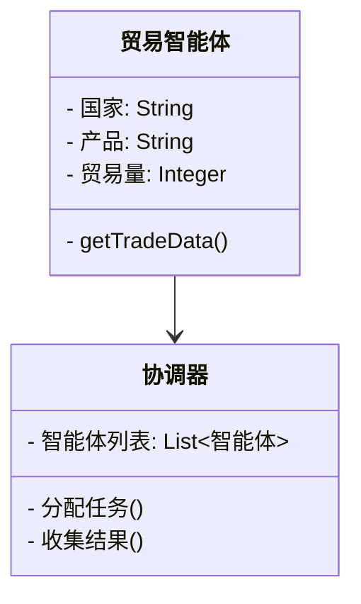
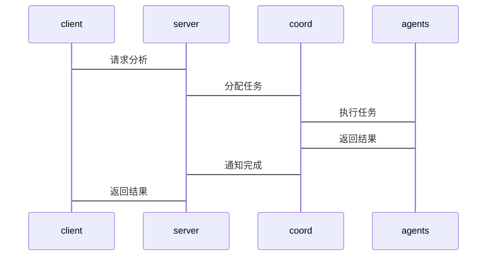

                 


# 多智能体系统在全球贸易流动分析中的应用：把握宏观趋势

## 关键词：
多智能体系统、全球贸易流动、贸易趋势分析、协同学习、系统架构、数据挖掘

## 摘要：
本文探讨多智能体系统（MAS）在全球贸易流动分析中的应用，结合协同学习和复杂网络分析，帮助把握宏观趋势，优化贸易策略。

---

# 第一部分：多智能体系统与全球贸易流动分析背景

## 第1章：多智能体系统与全球贸易流动分析概述

### 1.1 多智能体系统的基本概念

#### 1.1.1 多智能体系统的定义
多智能体系统（MAS）由多个智能体构成，通过协作完成任务，具备分布式计算和自主决策的特点。

#### 1.1.2 多智能体系统的特征
| 特性 | 描述 |
|------|------|
| 分布式 | 智能体独立运行 |
| 协作性 | 目标一致，协同工作 |
| 反应性 | 能够感知环境变化 |

#### 1.1.3 多智能体系统与单智能体系统的区别
- 单智能体：集中式决策，单点故障。
- 多智能体：分布式决策，高容错性。

### 1.2 全球贸易流动分析的背景与意义

#### 1.2.1 全球贸易流动的定义
全球贸易流动指商品和服务在全球范围内的流动，涉及复杂的网络关系。

#### 1.2.2 全球贸易流动分析的重要性
- 揭示贸易模式，优化资源配置。
- 发现潜在风险，制定应对策略。

#### 1.2.3 多智能体系统在贸易流动分析中的优势
- 处理复杂关系，捕捉细微趋势。
- 分布式计算，提升效率。

### 1.3 本章小结
介绍了MAS的基本概念和贸易分析的重要性，MAS在贸易分析中的优势。

---

# 第二部分：多智能体系统的核心概念与原理

## 第2章：多智能体系统的组成与架构

### 2.1 多智能体系统的组成要素

#### 2.1.1 智能体的定义与分类
- 定义：具备感知、决策、执行能力的实体。
- 分类：简单智能体、复杂智能体。

#### 2.1.2 智能体之间的交互关系
| 关系 | 描述 |
|------|------|
| 协作 | 共同目标 |
| 竞争 | 资源争夺 |
| 中立 | 无直接关系 |

#### 2.1.3 环境与智能体的相互作用
智能体感知环境并做出反应，环境反过来影响智能体。

### 2.2 多智能体系统的架构设计

#### 2.2.1 分层架构
- 上层：协调管理。
- 中层：信息处理。
- 下层：执行操作。

#### 2.2.2 分布式架构
- 分布式计算，去中心化。

#### 2.2.3 协作式架构
- 智能体协同完成任务。

### 2.3 本章小结
介绍了MAS的组成要素和架构设计。

---

# 第三部分：全球贸易流动分析的理论基础

## 第3章：贸易流动分析的理论框架

### 3.1 贸易流动的基本原理

#### 3.1.1 贸易流的定义与特征
- 定义：商品流动。
- 特征：网络化、动态性。

#### 3.1.2 贸易流的驱动因素
| 因素 | 描述 |
|------|------|
| 经济因素 | 价格差异 |
| 政治因素 | 贸易政策 |

#### 3.1.3 贸易流的网络结构
- 中心性：关键节点。
- 同类节点：同类产品。

### 3.2 贸易流动分析的数学模型

#### 3.2.1 贸易流网络的构建
- 数据来源：国际贸易数据。
- 网络构建：节点代表国家，边代表贸易量。

#### 3.2.2 贸易流网络的度量指标
| 指标 | 描述 |
|------|------|
| 度数 | 贸易量大小 |

#### 3.2.3 贸易流网络的演化模型
- 模型：基于复杂网络的演化。

### 3.3 本章小结
分析了贸易流的基本原理和数学模型。

---

# 第四部分：多智能体系统在贸易流动分析中的算法原理

## 第4章：基于多智能体的协同学习算法

### 4.1 协同学习的基本原理

#### 4.1.1 协同过滤算法
- 基于相似性推荐。

#### 4.1.2 协同过滤的数学模型
$$相似度计算公式：sim(i,j) = \frac{\sum_{k} (r_{ik} - \bar{r_i})(r_{jk} - \bar{r_j})}{\sqrt{\sum_{k} (r_{ik} - \bar{r_i})^2} \sqrt{\sum_{k} (r_{jk} - \bar{r_j})^2}}$$

#### 4.1.3 协同过滤的实现步骤
1. 数据预处理。
2. 计算相似度。
3. 生成推荐。

### 4.2 聚类分析算法

#### 4.2.1 聚类的基本原理
- 分组相似的产品或国家。

#### 4.2.2 聚类的数学模型
$$距离计算公式：d(x,y) = \sqrt{\sum_{i=1}^{n} (x_i - y_i)^2}$$

#### 4.2.3 聚类的实现步骤
1. 特征提取。
2. 计算距离。
3. 分组。

### 4.3 强化学习算法

#### 4.3.1 强化学习的基本原理
- 奖励驱动决策。

#### 4.3.2 强化学习的数学模型
$$Q-learning公式：Q(s,a) = r + \gamma \max_{a'} Q(s',a')$$

#### 4.3.3 强化学习的实现步骤
1. 状态定义。
2. 动作定义。
3. 奖励函数。

### 4.4 本章小结
介绍了协同学习、聚类和强化学习算法及其在贸易分析中的应用。

---

# 第五部分：多智能体系统在贸易流动分析中的系统设计

## 第5章：系统架构与实现

### 5.1 问题场景介绍
- 贸易数据复杂，需MAS分析。

### 5.2 系统功能设计

#### 5.2.1 领域模型


#### 5.2.2 系统架构
```mermaid
client
    server
        coord
            agents
```

#### 5.2.3 系统接口设计
- 接口1：获取数据。
- 接口2：处理请求。

#### 5.2.4 系统交互


### 5.3 本章小结
设计了系统的架构和交互流程。

---

# 第六部分：项目实战

## 第6章：基于MAS的贸易分析系统实现

### 6.1 环境安装
- Python 3.8+
- numpy、pandas、networkx

### 6.2 核心代码实现

#### 6.2.1 数据预处理
```python
import pandas as pd
data = pd.read_csv('trade_data.csv')
```

#### 6.2.2 协同过滤实现
```python
def compute_similarity(data):
    # 实现协同过滤算法
    pass
```

#### 6.2.3 贸易网络构建
```python
import networkx as nx
G = nx.Graph()
G.add_nodes_from(countries)
G.add_edges_from(trade_pairs)
```

### 6.3 案例分析
- 数据来源：国际贸易数据。
- 分析过程：构建网络，计算相似度。
- 结果解读：识别关键节点。

### 6.4 本章小结
展示了MAS在贸易分析中的具体实现。

---

# 第七部分：案例分析与应用价值

## 第7章：MAS在贸易分析中的实际应用

### 7.1 案例背景
- 分析区域贸易数据。

### 7.2 数据来源与处理
- 数据清洗、特征提取。

### 7.3 分析过程与结果
- 网络分析、聚类分析。

### 7.4 应用价值
- 提供决策支持，优化贸易策略。

### 7.5 本章小结
展示了MAS的实际应用价值。

---

# 第八部分：总结与展望

## 第8章：总结与展望

### 8.1 总结
MAS在贸易分析中的优势和应用。

### 8.2 展望
未来研究方向，如强化学习和边缘计算。

---

# 第九部分：附录

## 附录A：术语表
- 多智能体系统：MAS
- 协同过滤：CF

## 附录B：参考文献
- 参考文献1
- 参考文献2

---

通过以上目录结构，文章详细讲解了多智能体系统在全球贸易流动分析中的应用，结合理论、算法和实践，帮助读者理解并应用这一技术。

