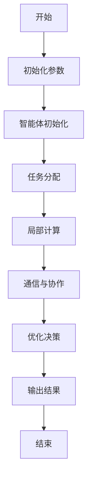

                 


# 多智能体系统在公司人力资本评估中的应用：量化人才价值

## 关键词：多智能体系统、人力资本评估、人才价值量化、人工智能、组织管理

## 摘要：  
在现代企业环境中，量化人才价值对于优化组织管理、提升企业竞争力至关重要。多智能体系统（MAS）通过建模和数据驱动的方法，能够有效评估和优化人力资本，为企业提供科学的决策支持。本文将深入探讨MAS在人力资本评估中的应用，从理论基础到技术实现，再到系统设计和项目实战，全面解析如何利用多智能体系统量化人才价值，为企业管理带来革新。

---

## 第一部分：多智能体系统与人力资本评估的背景

### 第1章：多智能体系统概述

#### 1.1 多智能体系统的基本概念
- **1.1.1 多智能体系统的定义**
  多智能体系统（Multi-Agent Systems, MAS）是由多个智能体（Agent）组成的分布式系统，每个智能体具备自主性、反应性、社会性和协作性。MAS通过智能体之间的协作与竞争，解决复杂问题。

- **1.1.2 多智能体系统的分类与特点**
  - 分类：MAS可分为简单协作型、复杂协作型和自适应协作型。
  - 特点：分布式、动态性、自主性、协作性。

- **1.1.3 多智能体系统的核心概念与优势**
  - 核心概念：自主性、协作性、反应性、社会性。
  - 优势：灵活性、适应性、高效性。

#### 1.2 人力资本评估的重要性
- **1.2.1 人力资本的定义与内涵**
  人力资本指员工的知识、技能和经验对企业价值的贡献。

- **1.2.2 传统人力资本评估的局限性**
  - 主观性高、数据孤岛、动态性不足。

- **1.2.3 多智能体系统在人力资本评估中的潜力**
  - 提供数据驱动的评估方法，优化决策。

#### 1.3 多智能体系统与人力资本评估的结合
- **1.3.1 多智能体系统在组织管理中的应用**
  - 优化资源配置、提升协作效率。

- **1.3.2 人力资本评估的数字化转型需求**
  - 数据驱动、实时评估。

- **1.3.3 多智能体系统如何赋能人力资本评估**
  - 提供动态评估模型、多维度分析。

#### 1.4 本章小结
本章介绍了MAS的基本概念和在人力资本评估中的应用潜力，为后续分析奠定基础。

---

## 第二部分：多智能体系统的理论基础

### 第2章：多智能体系统的理论框架

#### 2.1 多智能体系统的定义与分类
- **2.1.1 智能体的定义与特征**
  - 智能体具备感知环境、自主决策的能力。

- **2.1.2 多智能体系统的分类**
  - 简单协作型：任务简单，协作直接。
  - 复杂协作型：任务复杂，协作机制复杂。
  - 自适应协作型：具备自适应能力。

- **2.1.3 多智能体系统与单智能体系统的区别**
  - 分布式 vs 集中式。
  - 协作性 vs 独立性。

#### 2.2 多智能体系统的核心概念
- **2.2.1 协作与竞争**
  - 协作：共同完成任务。
  - 竞争：资源有限时的冲突解决。

- **2.2.2 通信与协调**
  - 通信：智能体之间的信息交换。
  - 协调：同步行动，避免冲突。

- **2.2.3 任务分配与资源管理**
  - 任务分配：基于智能体的能力分配任务。
  - 资源管理：优化资源分配，提升效率。

#### 2.3 多智能体系统的协作机制
- **2.3.1 协作协议与通信模型**
  - 协作协议：定义协作规则。
  - 通信模型：信息传递方式。

- **2.3.2 分布式问题求解**
  - 分布式计算：任务分解，局部求解。
  - 全局优化：整合局部结果，优化整体。

- **2.3.3 多智能体系统中的冲突解决**
  - 冲突检测：识别冲突。
  - 冲突解决：协商或仲裁。

#### 2.4 本章小结
本章详细讲解了MAS的理论框架，包括协作机制和任务分配，为后续应用奠定基础。

---

## 第三部分：多智能体系统在人力资本评估中的应用

### 第3章：多智能体系统与人力资本评估的结合

#### 3.1 多智能体系统在人力资本评估中的应用模型
- **3.1.1 模型的构建与设计**
  - 数据输入：员工数据、绩效指标。
  - 模型构建：MAS框架下的人才评估模型。

- **3.1.2 人力资本评估的核心要素**
  - 绩效、能力、潜力、贡献。

- **3.1.3 多智能体系统如何赋能人力资本评估**
  - 数据驱动、动态评估、智能协作。

#### 3.2 多智能体系统在人力资本评估中的优势
- **3.2.1 数据驱动的评估方法**
  - 利用大数据分析，提升评估准确性。

- **3.2.2 动态评估与实时反馈**
  - 实时监控员工表现，动态调整评估结果。

- **3.2.3 多维度分析**
  - 综合评估员工的多维度价值。

#### 3.3 多智能体系统的实施步骤
- **3.3.1 确定评估目标**
  - 明确评估的目的和范围。

- **3.3.2 数据收集与处理**
  - 收集员工数据，清洗和预处理。

- **3.3.3 模型构建与优化**
  - 基于MAS构建评估模型，优化参数。

- **3.3.4 结果分析与反馈**
  - 分析评估结果，提供反馈和改进建议。

#### 3.4 本章小结
本章探讨了MAS在人力资本评估中的应用模型和优势，展示了其在实际中的潜力。

---

## 第四部分：多智能体系统的技术实现

### 第4章：多智能体系统的算法原理

#### 4.1 分布式优化算法
- **4.1.1 分布式优化的概念**
  - 分布式计算中的优化问题。

- **4.1.2 分布式优化算法的实现**
  - 分解问题、局部优化、全局整合。

- **4.1.3 分布式优化的数学模型**
  - 使用拉格朗日乘数法进行优化。

#### 4.2 多智能体协作算法
- **4.2.1 协作算法的原理**
  - 智能体之间通过通信协作解决问题。

- **4.2.2 协作算法的实现步骤**
  - 初始化、通信、协作、优化。

- **4.2.3 协作算法的数学模型**
  - 使用博弈论模型描述协作过程。

#### 4.3 算法流程图


#### 4.4 算法实现代码
```python
def multi_agent_algorithm(num_agents, tasks):
    agents = [Agent(i) for i in range(num_agents)]
    for agent in agents:
        agent.local_optimization()
    for agent in agents:
        agent.communication()
    for agent in agents:
        agent(collaborative_data)
    for agent in agents:
        agent.global_optimization()
    return [agent.result for agent in agents]

class Agent:
    def __init__(self, id):
        self.id = id
        self.data = {}
    
    def local_optimization(self):
        # 局部优化算法
        pass
    
    def communication(self):
        # 通信算法
        pass
    
    def collaborative_optimization(self, data):
        # 协作优化算法
        pass
    
    def global_optimization(self):
        # 全局优化算法
        pass
```

#### 4.5 本章小结
本章详细讲解了MAS的核心算法，包括分布式优化和协作算法，并通过代码示例展示了实现过程。

---

## 第五部分：多智能体系统的系统设计

### 第5章：多智能体系统的系统设计

#### 5.1 系统架构设计
- **5.1.1 系统架构图**
  ```mermaid
  architecture
      User Interface
      Agent Manager
      Database
      Communication Layer
  ```

- **5.1.2 系统架构的设计原则**
  - 分层设计、模块化设计、可扩展性。

#### 5.2 系统功能设计
- **5.2.1 功能模块设计**
  - 数据采集模块、评估模块、协作模块、反馈模块。

- **5.2.2 功能模块的交互**
  ```mermaid
  classDiagram
      class DataCollector {
          collect_data()
      }
      class Evaluator {
          evaluate()
      }
      class Collaborator {
          collaborate()
      }
      class FeedbackGenerator {
          generate_feedback()
      }
      DataCollector --> Evaluator
      Evaluator --> Collaborator
      Collaborator --> FeedbackGenerator
  ```

#### 5.3 系统接口设计
- **5.3.1 数据接口**
  - 数据输入接口、数据输出接口。

- **5.3.2 通信接口**
  - 智能体间通信接口、用户交互接口。

#### 5.4 系统交互设计
- **5.4.1 系统交互流程**
  ```mermaid
  sequenceDiagram
      User ->> AgentManager: 请求评估
      AgentManager ->> DataCollector: 收集数据
      DataCollector ->> Evaluator: 传递数据
      Evaluator ->> Collaborator: 协作评估
      Collaborator ->> FeedbackGenerator: 生成反馈
      FeedbackGenerator ->> User: 提供反馈
  ```

#### 5.5 本章小结
本章详细设计了MAS的系统架构和功能模块，为实际应用提供了指导。

---

## 第六部分：项目实战与总结

### 第6章：项目实战与总结

#### 6.1 项目实战
- **6.1.1 环境安装**
  - 安装Python、相关库（如NumPy、Scipy）。

- **6.1.2 数据收集与预处理**
  - 数据来源：公司数据库、员工绩效数据。
  - 数据清洗：处理缺失值、异常值。

- **6.1.3 模型实现**
  - 实现MAS算法，进行人才评估。

- **6.1.4 结果分析与可视化**
  - 使用Matplotlib进行结果可视化。

#### 6.2 项目小结
- 项目成果：成功实现MAS在人力资本评估中的应用。
- 经验总结：MAS的优势和实际应用中的注意事项。

#### 6.3 总结与展望
- 总结：MAS在人力资本评估中的优势和应用价值。
- 展望：未来的研究方向和应用场景。

#### 6.4 最佳实践 Tips
- 数据质量至关重要。
- 系统设计需考虑可扩展性。
- 选择合适的算法和工具。

---

## 结语
通过本文的详细讲解，读者可以全面了解多智能体系统在人力资本评估中的应用，从理论到实践，掌握如何利用MAS量化人才价值，优化组织管理。未来，MAS在人力资本评估中的应用将更加广泛，为企业管理带来更大的革新。

---

## 参考文献
（此处列出相关文献和资料）

---

通过以上结构，文章系统地介绍了多智能体系统在人力资本评估中的应用，结合理论分析和实际案例，帮助读者深入理解并掌握相关知识。

