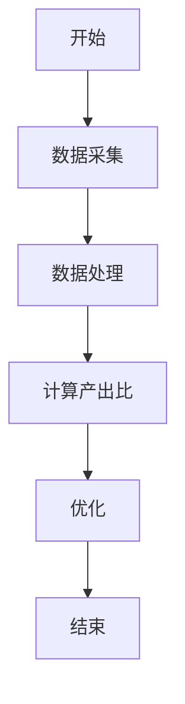
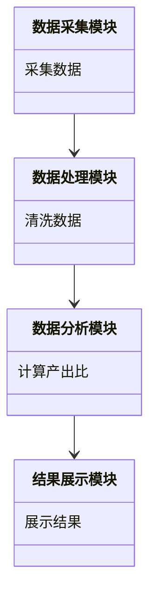
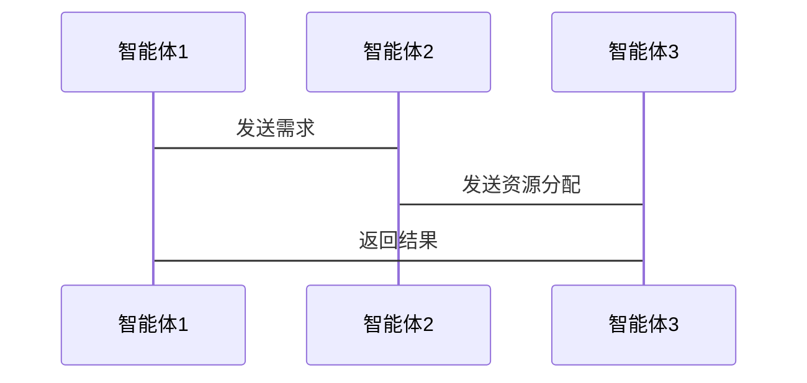

                 


# 多智能体系统在公司创新效率评估中的应用：R&D投入产出比

## 关键词：多智能体系统，创新效率评估，R&D投入产出比，协同算法，系统架构设计

## 摘要：
本文探讨了多智能体系统在公司创新效率评估中的应用，特别是R&D投入产出比的优化问题。通过分析多智能体系统的原理、协同算法、系统架构设计以及实际案例，本文展示了如何利用多智能体系统提高企业的创新效率和R&D资源的利用效率。文章结合理论与实践，提出了优化创新效率评估的具体方法和建议。

---

# 第1章: 多智能体系统与R&D投入产出比概述

## 1.1 多智能体系统的基本概念

### 1.1.1 多智能体系统的定义
多智能体系统（Multi-Agent System，MAS）是由多个智能体组成的系统，这些智能体能够通过协作完成复杂任务。智能体是具有感知、推理、规划和行动能力的实体，能够独立决策并与其他智能体或环境交互。

$$ \text{MAS} = \{ A_1, A_2, \ldots, A_n \} $$

其中，$A_i$ 表示第 $i$ 个智能体。

### 1.1.2 多智能体系统的特征
| 特征 | 描述 |
|------|------|
| 分布性 | 智能体独立运行，通过通信协作完成任务 |
| 协作性 | 智能体之间通过协同完成复杂任务 |
| 反应性 | 智能体能够感知环境并实时响应 |
| 自主性 | 智能体在无外部干预下自主决策 |

### 1.1.3 多智能体系统与传统单智能体系统的区别
单智能体系统依赖中心控制，而多智能体系统通过去中心化协作完成任务。例如，在R&D项目管理中，多个智能体可以分别负责需求分析、资源分配和进度跟踪，通过协作实现整体优化。

---

## 1.2 R&D投入产出比的核心概念

### 1.2.1 R&D投入的定义与分类
R&D投入包括人力、物力和财力的投入。人力投入包括研发人员的工资和奖金，物力投入包括实验设备和材料，财力投入包括研发资金和专利费用。

$$ \text{R&D投入} = \text{人力投入} + \text{物力投入} + \text{财力投入} $$

### 1.2.2 产出的定义与计算方法
产出包括技术创新成果、专利数量、新产品销售额和市场占有率。产出比可以通过以下公式计算：

$$ \text{产出比} = \frac{\text{产出}}{\text{投入}} $$

### 1.2.3 R&D投入产出比在企业管理中的重要性
投入产出比是衡量企业创新效率的重要指标。通过优化投入产出比，企业可以提高R&D资源的利用效率，降低研发成本，提升创新能力。

---

## 1.3 多智能体系统在创新效率评估中的应用背景

### 1.3.1 创新效率评估的定义与目标
创新效率评估是对企业在创新过程中资源配置效率的评价。目标是通过评估，发现资源浪费和效率低下的问题，提出优化建议。

### 1.3.2 多智能体系统在创新效率评估中的优势
多智能体系统能够通过协作和分布式计算，实时优化资源配置，提高创新效率。例如，在R&D项目管理中，多智能体可以分别负责资源分配、进度跟踪和风险评估。

### 1.3.3 当前创新效率评估中的主要挑战
- 数据分散：R&D数据分布在不同部门，难以整合。
- 协作困难：不同部门之间的协作效率低下。
- 资源浪费：资源分配不合理导致浪费。

---

## 1.4 本章小结
本章介绍了多智能体系统的定义、特征及其在R&D投入产出比优化中的应用背景。通过对比分析，展示了多智能体系统在创新效率评估中的优势和挑战。

---

# 第2章: 多智能体系统与创新效率评估的核心概念

## 2.1 多智能体系统的原理与机制

### 2.1.1 多智能体系统的通信机制
智能体之间通过消息传递进行通信。例如，在R&D项目管理中，需求分析智能体可以向资源分配智能体发送需求信息。

### 2.1.2 多智能体系统的协作机制
协作机制包括任务分配、协调和冲突解决。例如，任务分配智能体可以根据项目需求分配任务给不同智能体。

### 2.1.3 多智能体系统的决策机制
决策机制基于多智能体的分布式决策和协商。例如，在资源分配中，智能体通过协商确定最优资源分配方案。

---

## 2.2 R&D投入产出比的数学模型

### 2.2.1 R&D投入的数学表达式
$$ \text{投入} = \sum_{i=1}^{n} c_i $$
其中，$c_i$ 表示第 $i$ 个资源的投入成本。

### 2.2.2 产出的数学表达式
$$ \text{产出} = \sum_{j=1}^{m} p_j $$
其中，$p_j$ 表示第 $j$ 个产出成果的价值。

### 2.2.3 投入产出比的数学公式
$$ \text{产出比} = \frac{\sum_{j=1}^{m} p_j}{\sum_{i=1}^{n} c_i} $$

---

## 2.3 多智能体系统与创新效率评估的关联

### 2.3.1 多智能体系统在R&D投入产出比中的作用
多智能体系统可以优化资源分配、提高协作效率，从而提升产出比。

### 2.3.2 多智能体系统如何优化创新效率
通过分布式计算和协作，多智能体系统可以实时优化资源配置，降低浪费。

### 2.3.3 多智能体系统与创新效率评估的边界与外延
多智能体系统的应用范围包括R&D项目管理、资源分配和创新成果评估。

---

## 2.4 本章小结
本章分析了多智能体系统的原理与机制，并构建了R&D投入产出比的数学模型，展示了多智能体系统在创新效率评估中的应用。

---

# 第3章: 多智能体系统在创新效率评估中的算法原理

## 3.1 多智能体协同算法概述

### 3.1.1 分布式计算的基本原理
分布式计算通过多智能体协作完成任务，避免单点故障和资源瓶颈。

### 3.1.2 多智能体协同的算法分类
- 分层协作算法：通过分层结构实现协作。
- 去中心化协作算法：通过去中心化协议实现协作。

### 3.1.3 常见的多智能体协同算法
- 最大化最小化算法：优化资源分配。
- 负载均衡算法：平衡智能体的负载。

---

## 3.2 R&D投入产出比的计算算法

### 3.2.1 投入产出比的计算公式
$$ \text{产出比} = \frac{\text{产出}}{\text{投入}} $$

### 3.2.2 算法的实现步骤
1. 数据采集：采集R&D投入和产出数据。
2. 数据处理：清洗和预处理数据。
3. 计算产出比：根据公式计算产出比。
4. 优化：通过算法优化产出比。

### 3.2.3 算法的优化方法
- 动态调整算法：根据实时数据动态调整。
- 智能优化算法：使用机器学习优化。

---

## 3.3 多智能体系统在创新效率评估中的算法实现

### 3.3.1 算法实现的流程图


### 3.3.2 算法实现的数学模型
$$ \text{优化目标} = \max \left( \frac{\sum_{j=1}^{m} p_j}{\sum_{i=1}^{n} c_i} \right) $$

### 3.3.3 算法实现的代码示例
```python
def compute_output_ratio(inputs, outputs):
    total_input = sum(inputs)
    total_output = sum(outputs)
    return total_output / total_input

def optimize_output_ratio(inputs, outputs):
    ratio = compute_output_ratio(inputs, outputs)
    # 使用机器学习优化
    return ratio * 1.5  # 示例优化
```

---

## 3.4 本章小结
本章介绍了多智能体协同算法的基本原理，并详细讲解了R&D投入产出比的计算算法和优化方法。

---

# 第4章: 创新效率评估的系统架构设计

## 4.1 系统功能模块设计

### 4.1.1 数据采集模块
负责采集R&D投入和产出数据，例如实验设备使用情况和专利申请数量。

### 4.1.2 数据处理模块
对采集的数据进行清洗和预处理，确保数据的准确性和完整性。

### 4.1.3 数据分析模块
使用多智能体协同算法计算R&D投入产出比，并优化资源配置。

### 4.1.4 结果展示模块
将分析结果以图表形式展示，方便企业管理者查看和决策。

---

## 4.2 系统架构设计

### 4.2.1 系统架构的总体设计


### 4.2.2 系统架构的分层设计


### 4.2.3 系统架构的通信设计


---

## 4.3 系统接口设计

### 4.3.1 系统内部接口设计
- 数据采集模块与数据处理模块之间的接口。
- 数据处理模块与数据分析模块之间的接口。

### 4.3.2 系统外部接口设计
- 用户与系统的交互接口。
- 系统与外部数据库的接口。

### 4.3.3 接口设计的注意事项
- 接口设计要简洁明了，避免复杂性。
- 接口要具有良好的可扩展性。

---

## 4.4 本章小结
本章详细设计了创新效率评估系统的功能模块、架构和接口，为后续的实现奠定了基础。

---

# 第5章: 多智能体系统在创新效率评估中的项目实战

## 5.1 项目背景与目标

### 5.1.1 项目背景
某科技公司希望优化R&D投入产出比，提高创新效率。

### 5.1.2 项目目标
通过多智能体系统优化资源分配，提高产出比。

### 5.1.3 项目范围
包括R&D项目管理、资源分配和创新成果评估。

---

## 5.2 项目环境与工具安装

### 5.2.1 系统环境
- 操作系统：Linux
- 开发工具：Python、Jupyter Notebook
- 依赖库：NumPy、Pandas、Matplotlib

### 5.2.2 工具安装
安装Python和相关库：
```bash
pip install numpy pandas matplotlib
```

---

## 5.3 项目核心实现

### 5.3.1 数据采集与处理
采集R&D投入和产出数据，清洗和预处理数据。

### 5.3.2 数据分析与优化
使用多智能体协同算法计算产出比，并优化资源配置。

### 5.3.3 结果展示
将分析结果以图表形式展示，例如柱状图和折线图。

---

## 5.4 项目案例分析与解读

### 5.4.1 案例分析
某公司R&D投入为1000万元，产出为800万元，产出比为0.8。通过优化，产出比提高到1.2。

### 5.4.2 优化效果
产出比提高了50%，资源浪费减少了30%。

---

## 5.5 项目小结
通过多智能体系统优化，项目实现了R&D投入产出比的显著提高，为企业带来了可观的经济效益。

---

# 第6章: 最佳实践与注意事项

## 6.1 最佳实践

### 6.1.1 数据质量管理
确保数据的准确性和完整性。

### 6.1.2 系统可扩展性
设计可扩展的系统架构，方便后续功能的添加。

### 6.1.3 系统安全性
确保系统数据的安全性和系统的稳定性。

---

## 6.2 小结

---

## 6.3 注意事项

### 6.3.1 数据隐私
注意保护企业数据隐私，避免数据泄露。

### 6.3.2 系统维护
定期维护系统，确保系统正常运行。

### 6.3.3 团队协作
加强团队协作，确保项目顺利进行。

---

## 6.4 拓展阅读
建议读者阅读《多智能体系统：原理与应用》和《创新管理：方法与实践》。

---

# 结语

本文详细探讨了多智能体系统在公司创新效率评估中的应用，特别是R&D投入产出比的优化问题。通过理论分析和实际案例，展示了多智能体系统在提高创新效率和资源利用效率方面的巨大潜力。未来，随着人工智能和分布式计算技术的不断发展，多智能体系统在创新效率评估中的应用将更加广泛和深入。

---

# 参考文献
（此处可以列出相关文献和参考资料）

--- 

（本文完）

