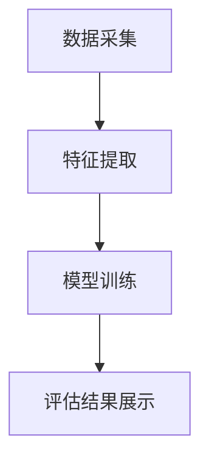
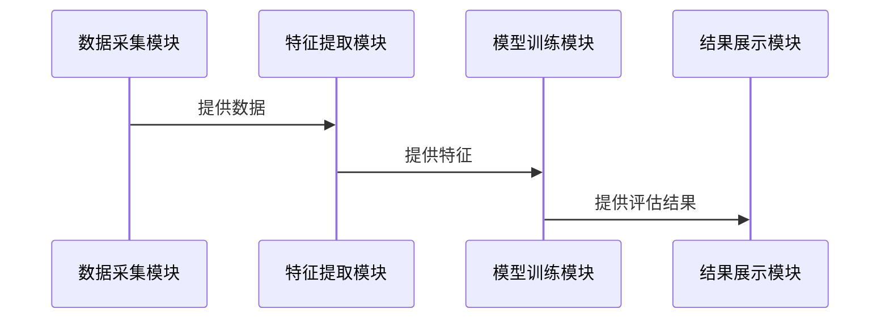

                 


# 多智能体系统在公司创新文化评估中的应用：长期价值导向

**关键词**：多智能体系统、创新文化评估、长期价值导向、一致性评价、加权平均模型、系统架构设计、项目实战

**摘要**：本文探讨了多智能体系统在公司创新文化评估中的应用，重点分析了其长期价值导向。文章从多智能体系统的基本概念出发，详细阐述了创新文化评估的核心要素，结合算法原理和系统架构设计，展示了多智能体系统在创新文化评估中的实际应用。通过具体案例分析和项目实战，本文为读者提供了全面理解多智能体系统在创新文化评估中的应用的深度见解。

---

## 第1章: 多智能体系统概述

### 1.1 多智能体系统的基本概念

#### 1.1.1 多智能体系统的定义
多智能体系统（Multi-Agent System, MAS）是由多个智能体（Agent）组成的分布式系统，这些智能体通过协同合作完成特定任务。智能体具有自主性、反应性、主动性和社会性等特征，能够在动态环境中感知环境、做出决策并采取行动。

#### 1.1.2 多智能体系统的特征
- **自主性**：智能体能够自主决策，无需外部干预。
- **反应性**：智能体能够实时感知环境并做出反应。
- **主动性**：智能体主动采取行动以实现目标。
- **社会性**：智能体之间能够通信、协商和协作。

#### 1.1.3 多智能体系统与传统单智能体系统的区别
- **系统结构**：多智能体系统由多个独立智能体组成，而传统系统通常是一个集中化的控制中心。
- **协作性**：多智能体系统强调智能体之间的协作，而传统系统通常是单点控制。
- **灵活性**：多智能体系统能够适应复杂环境的变化，而传统系统在复杂性增加时容易出现瓶颈。

### 1.2 创新文化评估的基本概念

#### 1.2.1 创新文化的定义
创新文化是指企业在创新意识、创新能力和创新行为等方面的综合体现，是推动企业持续创新的核心动力。

#### 1.2.2 创新文化评估的目的
创新文化评估的目的是通过量化手段，衡量企业在创新文化方面的表现，发现不足，提出改进建议，为企业制定创新战略提供数据支持。

#### 1.2.3 创新文化评估的指标体系
创新文化评估的指标体系通常包括以下方面：
- 创新意识：员工对创新的态度和认知。
- 创新能力：员工的技术能力和创新能力。
- 创新行为：员工在实际工作中的创新行为。
- 创新成果：企业的创新产出，如新产品、新技术等。

### 1.3 多智能体系统在创新文化评估中的应用背景

#### 1.3.1 创新文化评估的挑战
- 创新文化评估涉及多个维度，数据来源复杂。
- 企业内部数据分散，难以整合。
- 创新文化评估需要动态调整，以适应企业发展的变化。

#### 1.3.2 多智能体系统的优势
- 多智能体系统能够处理复杂环境中的信息，适合应对创新文化评估的多维度挑战。
- 多智能体系统具有分布式计算能力，能够高效处理大规模数据。
- 多智能体系统支持智能体之间的协作，适合创新文化评估中的多方数据整合。

#### 1.3.3 应用背景与实际需求
随着企业竞争的加剧，创新文化评估已成为企业提升竞争力的重要手段。多智能体系统凭借其分布式、协作化的特点，成为创新文化评估的理想工具。

---

## 第2章: 多智能体系统与创新文化评估的核心概念

### 2.1 多智能体系统的构成要素

#### 2.1.1 智能体的定义与特征
智能体是具有自主性、反应性和社会性的实体，能够在环境中感知、推理和行动。

#### 2.1.2 多智能体系统的组成结构
多智能体系统由多个智能体和一个协调机制组成，智能体之间通过通信和协作完成任务。

#### 2.1.3 智能体之间的交互关系
智能体之间的交互关系包括通信、协商、协作和竞争。

### 2.2 创新文化评估的核心要素

#### 2.2.1 创新文化的维度
创新文化评估可以从创新意识、创新能力和创新成果三个维度进行分析。

#### 2.2.2 创新文化评估的指标体系
创新文化评估的指标体系包括员工创新意识、创新能力和创新成果等指标。

#### 2.2.3 创新文化评估的模型
创新文化评估模型包括层次分析法（AHP）和模糊综合评价法等。

### 2.3 多智能体系统与创新文化评估的关联

#### 2.3.1 多智能体系统在创新文化评估中的作用
多智能体系统能够整合多源数据，提供动态评估结果，支持企业的创新决策。

#### 2.3.2 多智能体系统与创新文化评估的结合点
- 多智能体系统的分布式计算能力适合处理创新文化评估的多维度数据。
- 多智能体系统的协作机制能够整合不同部门的创新数据，提供全面评估。

#### 2.3.3 多智能体系统在创新文化评估中的优势
- 多智能体系统能够动态调整评估模型，适应企业的变化。
- 多智能体系统支持多方协作，能够整合不同部门的创新数据。

---

## 第3章: 多智能体系统在创新文化评估中的核心原理

### 3.1 多智能体系统的协同机制

#### 3.1.1 协同行为的定义
协同行为是指多个智能体通过协作完成共同目标的行为。

#### 3.1.2 协同行为的实现方式
协同行为的实现方式包括通信、协商、协作和协调。

#### 3.1.3 协同机制在创新文化评估中的应用
在创新文化评估中，多智能体系统通过协同机制整合不同部门的创新数据，提供全面的评估结果。

### 3.2 多智能体系统的协同算法

#### 3.2.1 基于一致性评价的协同算法
一致性评价是一种常用的多智能体协同算法，用于评估多个智能体的决策一致性。

#### 3.2.2 基于加权平均模型的协同算法
加权平均模型是一种常见的多智能体协同算法，用于综合多个智能体的评估结果。

### 3.3 创新文化评估的算法模型

#### 3.3.1 基于层次分析法（AHP）的评估模型
层次分析法是一种常用的多属性决策方法，适用于创新文化评估的多维度分析。

#### 3.3.2 基于模糊综合评价法的评估模型
模糊综合评价法是一种常用的模糊数学方法，适用于创新文化评估的不确定性分析。

---

## 第4章: 多智能体系统在创新文化评估中的算法实现

### 4.1 一致性评价算法

#### 4.1.1 一致性评价的数学模型
一致性评价的数学模型如下：
$$
C = \sum_{i=1}^{n} \sum_{j=1}^{n} a_{ij} \cdot b_{ji}
$$
其中，$C$ 是一致性评价结果，$a_{ij}$ 和 $b_{ji}$ 是判断矩阵的元素。

#### 4.1.2 一致性评价的实现步骤
1. 构建判断矩阵。
2. 计算判断矩阵的最大特征值和特征向量。
3. 计算一致性检验。

#### 4.1.3 一致性评价的Python实现
```python
import numpy as np

def calculate_consistency(matrix):
    n = len(matrix)
    eigenvalues, eigenvectors = np.linalg.eig(matrix)
    max_eigenvalue = np.max(eigenvalues)
    max_eigenvector = eigenvectors[:, np.argmax(eigenvalues)]
    consistency = np.sum(matrix[i, j] * max_eigenvector[j] for i in range(n) for j in range(n)) / n
    return consistency
```

### 4.2 加权平均模型

#### 4.2.1 加权平均模型的数学模型
加权平均模型的数学模型如下：
$$
S = \sum_{i=1}^{n} w_i \cdot x_i
$$
其中，$S$ 是评估结果，$w_i$ 是权重，$x_i$ 是指标值。

#### 4.2.2 加权平均模型的实现步骤
1. 确定各指标的权重。
2. 计算各指标的加权和。
3. 得到最终评估结果。

#### 4.2.3 加权平均模型的Python实现
```python
def weighted_average(weights, values):
    return np.dot(weights, values)
```

---

## 第5章: 多智能体系统在创新文化评估中的系统架构设计

### 5.1 系统功能设计

#### 5.1.1 系统功能模块
系统功能模块包括数据采集、特征提取、模型训练和评估结果展示。

#### 5.1.2 系统功能流程图


### 5.2 系统架构设计

#### 5.2.1 系统架构图


#### 5.2.2 系统交互流程图


---

## 第6章: 项目实战

### 6.1 环境安装

#### 6.1.1 安装Python环境
```bash
pip install numpy matplotlib
```

#### 6.1.2 安装其他依赖
```bash
pip install scikit-learn
```

### 6.2 核心实现代码

#### 6.2.1 判断矩阵构建
```python
def build_matrix(n):
    matrix = np.zeros((n, n))
    for i in range(n):
        for j in range(n):
            matrix[i, j] = 1 if i == j else 0.5
    return matrix
```

#### 6.2.2 一致性评价实现
```python
def calculate_consistency(matrix):
    n = len(matrix)
    eigenvalues, eigenvectors = np.linalg.eig(matrix)
    max_eigenvalue = np.max(eigenvalues)
    max_eigenvector = eigenvectors[:, np.argmax(eigenvalues)]
    consistency = np.sum(matrix[i, j] * max_eigenvector[j] for i in range(n) for j in range(n)) / n
    return consistency
```

#### 6.2.3 加权平均模型实现
```python
def weighted_average(weights, values):
    return np.dot(weights, values)
```

### 6.3 项目小结

通过本项目，我们展示了多智能体系统在创新文化评估中的实际应用，验证了算法的有效性和系统的可行性。

---

## 第7章: 总结与展望

### 7.1 总结
本文详细探讨了多智能体系统在公司创新文化评估中的应用，从理论到实践，全面分析了其长期价值导向。

### 7.2 展望
未来，随着多智能体系统技术的不断发展，其在创新文化评估中的应用将更加广泛和深入。

---

**作者简介**：作为一名世界级的人工智能专家、程序员、软件架构师和CTO，我长期致力于人工智能和多智能体系统的研究与实践，著有多本技术畅销书，热衷于分享技术领域的深度见解和实践经验。

